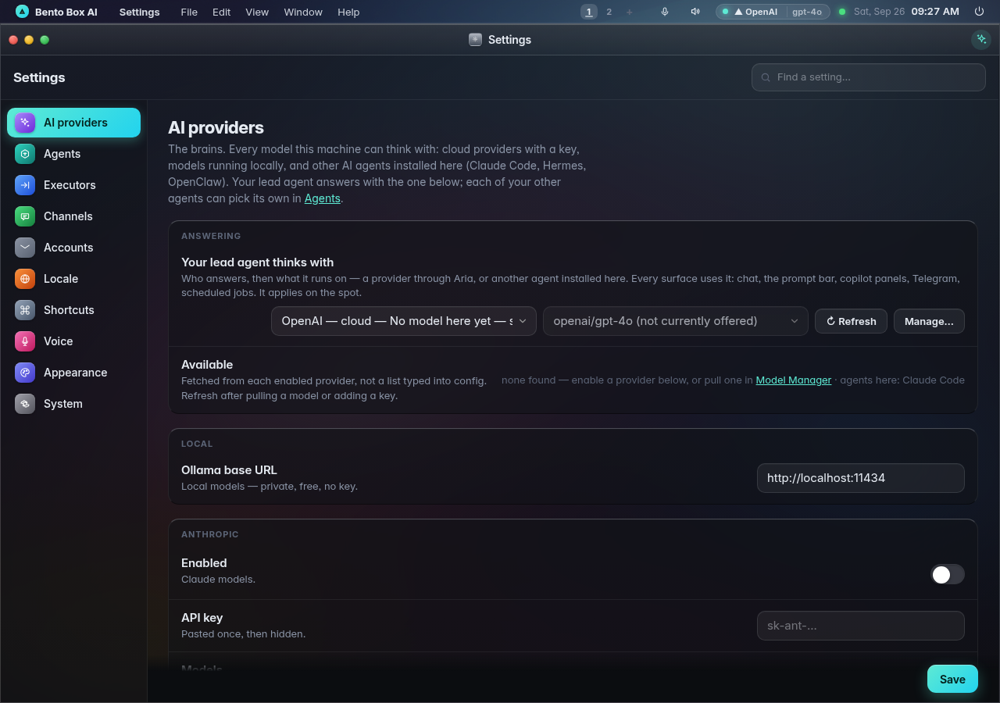
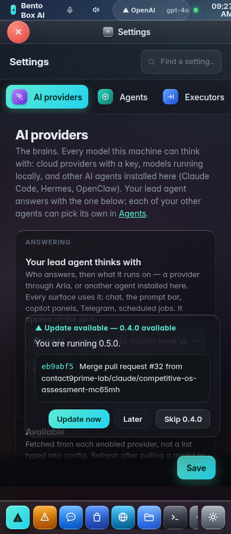
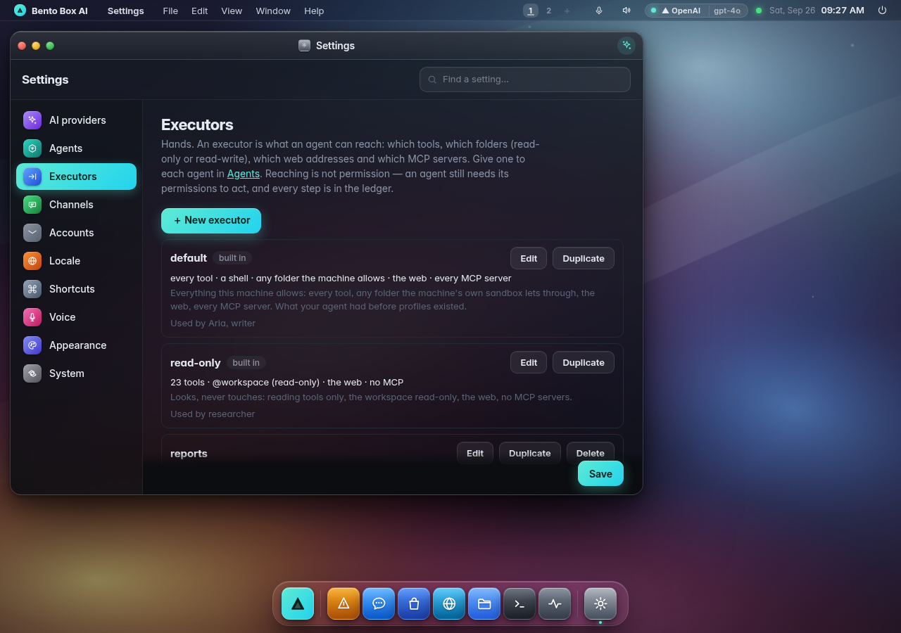
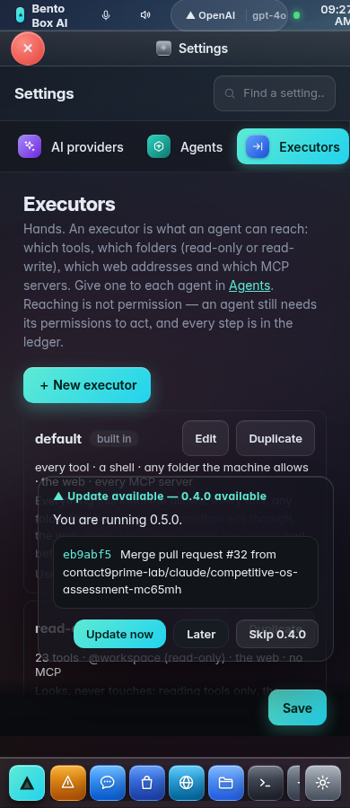
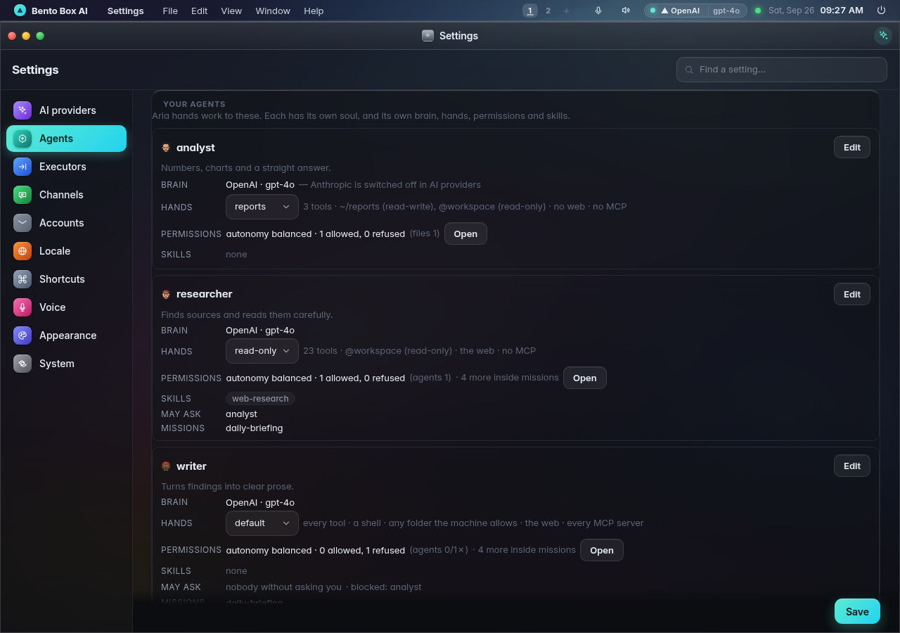
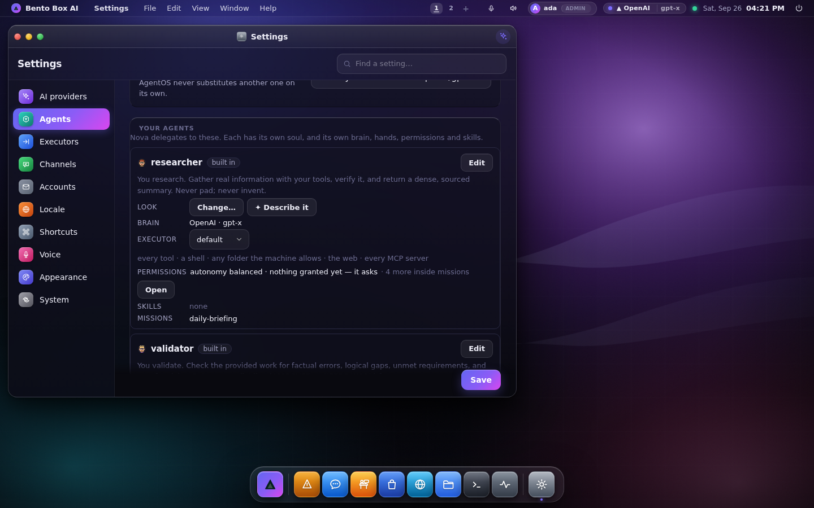
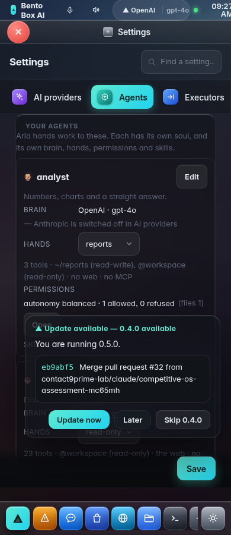
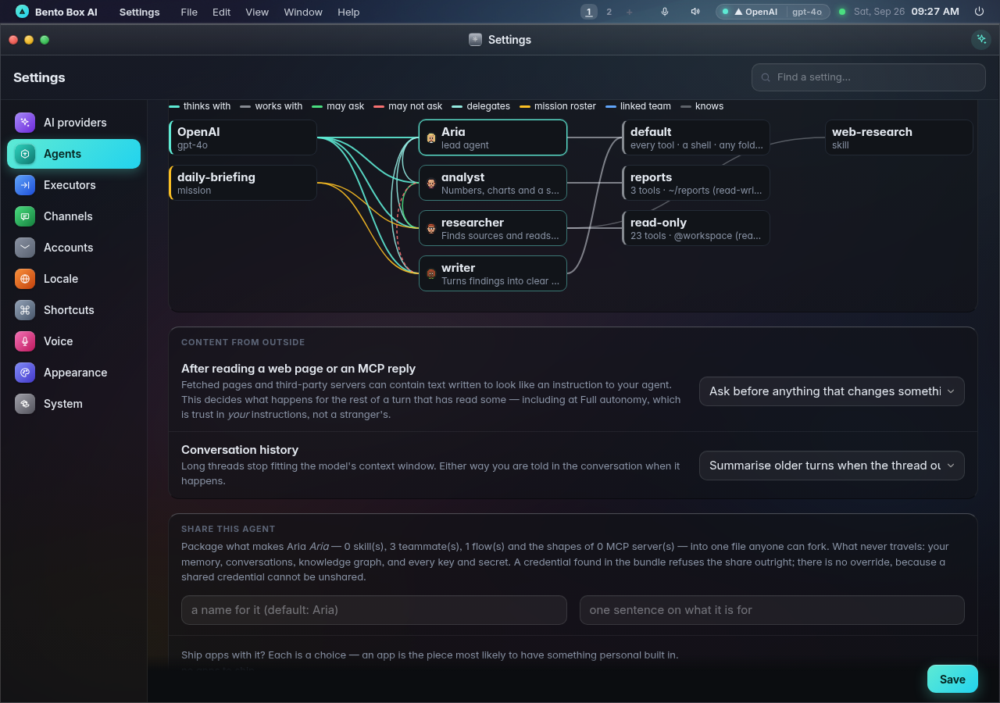
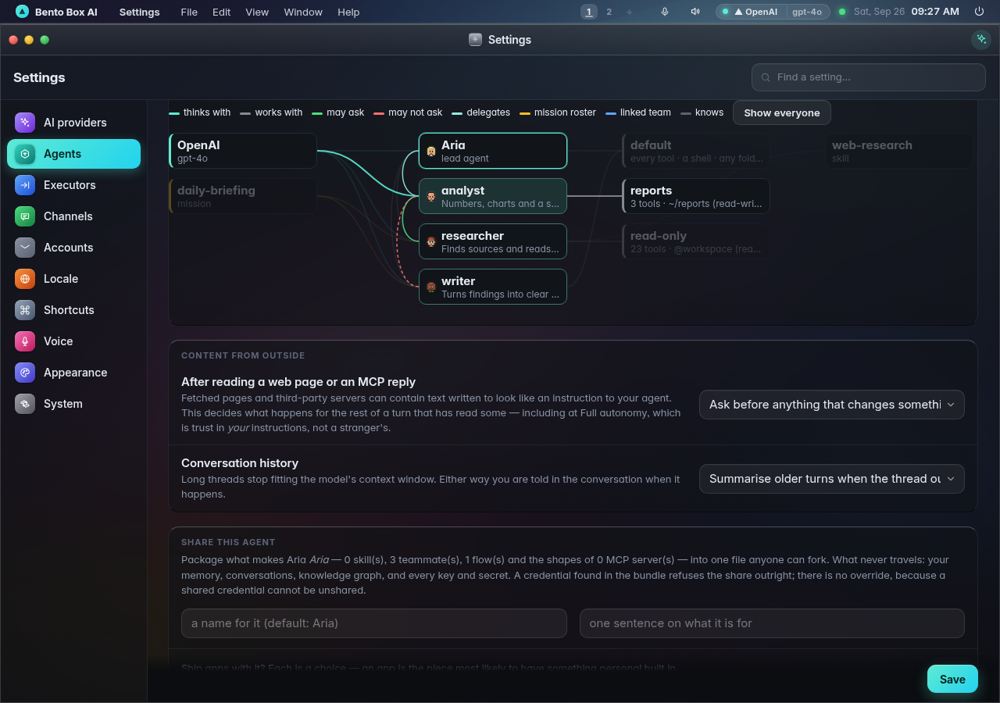
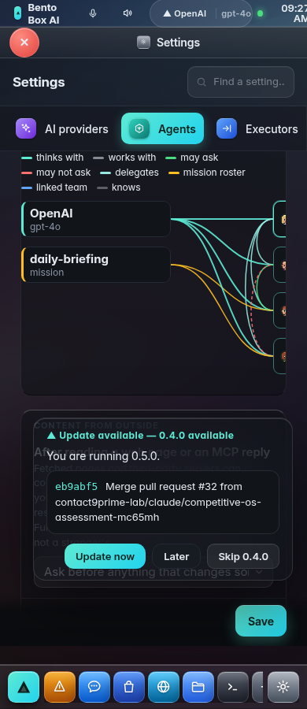

# Agents: a brain, hands, permissions and skills

Every agent on this machine is built from the same four parts. Settings has one place for
each:

| Part | What it is | Where you set it |
|---|---|---|
| **Brain** | What the agent thinks with: a cloud model with a key, a model running locally, or another AI agent installed here (Claude Code, Gemini CLI, Codex, Hermes, OpenClaw) | **Settings → AI providers** |
| **Hands** | What it can reach: which tools, which folders (read-only or read-write), which web addresses and which MCP servers. This is an *executor*. | **Settings → Executors** |
| **Permissions** | What it is *allowed* to do with those hands, and how far it may go without asking | its card in **Settings → Agents**, and the Permissions app |
| **Skills** | Procedures it knows: which steps to follow, which tool to use for what | its card in **Settings → Agents** (Edit) |

There is always one **lead agent**, which you name (Aria by default). It is the agent you
talk to, and it hands work to the others: your **specialists**. Each specialist has its own
soul and its own brain, hands, permissions and skills. Specialists can ask each other
questions, talk a problem through in a huddle, and work with agents on a linked team (see
[team.md](team.md)), but only where a permission says they may.

**Everything is recorded.** Every step any agent takes, every refusal and every change to a
brain, hands or permission is a row in the ledger (Logs, or `bento audit`).

## AI providers: the brains



The first row is the lead agent's brain. Below it are all the brains this machine has:

- **Cloud providers**, each with its key: Anthropic, OpenAI, OpenRouter, Google (Gemini)
  and any OpenAI-compatible server.
- **Local models** through Ollama.
- **AI agents installed here**: Claude Code, Gemini CLI, Codex, Hermes and OpenClaw, each
  with its install offer and what it can do. Pick one as the lead agent's brain.

### Claude Code, Gemini CLI and Codex


Any of these three can be the brain for chat, the prompt bar, an app's agent panel,
Telegram, WhatsApp and scheduled turns. Each signs in with its own account: Claude Code
with a Claude subscription, Gemini CLI with a Google account (`gemini` once), Codex with
a ChatGPT account (`codex login` once). AgentOS never passes any of them a key.

| | Install (offered in AI providers, licence shown first) | How the envelope is enforced |
|---|---|---|
| **Claude Code** | Anthropic's installer | its tool list, folders and a spend ceiling |
| **Gemini CLI** | `npm install --global --prefix ~/.local @google/gemini-cli` (Apache-2.0) | read-only by default; Write/Edit → `auto_edit`; a shell → `yolo`. No spend ceiling |
| **Codex** | `npm install --global --prefix ~/.local @openai/codex` (Apache-2.0) | its sandbox: `read-only`, or `workspace-write` in the workspace folder. No spend ceiling |

The folder and tools in **Settings → Executors** bound all three. Only Claude Code takes
a spend ceiling, so for the other two the envelope says "no spend ceiling of its own".
Claude Code continues its own session between turns. Gemini CLI and Codex are sent the
conversation so far with each turn.

Two things only Claude Code can do today, because it is the one CLI this OS can start
with its own MCP server for one run:

- **Run a mission.** With Gemini CLI or Codex as the brain, the Missions app says
  missions need a provider model, before the Run button.
- **Hand work to your specialists.** Claude Code gets `delegate` and `huddle`. Gemini CLI
  and Codex are told who your specialists are and to send you to `@name`.

Hermes and OpenClaw are detected but not yet driven: AgentOS does not know their headless
output. They are listed with that sentence and cannot be chosen as the brain. Before this
change, choosing one ran Claude Code under its name.

A specialist can have its own brain: pick a model on its card in **Agents**. If that
provider is switched off or has no key, the agent uses the lead agent's brain, and the card
says why.



## Making an agent


**＋ New agent** (in Settings → Agents, or Missions → Build → Agents) opens one editor. It
has three steps you can jump between: **Who it is**, **What it can use** and **Limits &
trust**.

Say what you need in a sentence and press **Draft it**. The machine's brain drafts the whole
agent, and nothing is written until you press **Save**:

- **Its persona (soul)**, in full, in the box under the name. This is what the agent is told
  every time it works, so it is shown large and you can change any of it.
- **Its look.** A face that fits the job, from the same options as the character editor. It
  appears in the header and in the **Look** row. Describe another one and press **✦ Redesign**,
  or untick *Give it this look when I save* to keep the face it would get anyway. The blazer
  stays your lead's.
- **Its tools, and the skills it should follow.** Skills already installed are ticked for it.
- **New skills it would bring**, when the job needs know-how nothing installed covers (a
  checklist, a house style, the steps of a procedure). At most two, on the **What it can use**
  step. Each shows its name, what it is for and its full text, and you can edit all three.
  Each ticked one is created when you save. A skill with that name that already exists is
  never replaced: it is attached instead, and a toast says so.


On an existing agent the box reads **Ask for a change** ("let it read files too"). It changes
the look only when you ask about the look.

**Save** is on every step once the agent has a name, because a drafted agent is often ready as
it arrives. A refused save is said in a toast, and the editor stays open with everything you
typed. **Limits & trust** is three plain choices: *Asks first*, *Careful* and *Trusted*. None
of them goes above this machine's own autonomy level.


On a phone the editor fills the screen, and every control is at least a fingertip tall.

From a terminal, `bento team draft "someone who files the invoices that arrive"` drafts the
same agent. It prints the look, the whole persona, the tools, the skills and the full text of
any new skill, then asks before saving (`--yes` saves without asking). It saves the same way
the editor does.

## Executors: the hands



An executor is a set of hands. It says what an agent **can reach**:

- **Tools**: every tool, or only the ones ticked, grouped as Files, Web, Shell & code, Git,
  Memory, Mail & calendar, Messages, Desktop and so on.
- **Folders**: each one read-only or read-write. `@workspace` means the workspace;
  *anywhere the machine allows* means no extra limit beyond the machine's own folder jail.
- **Web**: any address, none, or only the addresses you list (`https://api.github.com/*`).
- **MCP servers**: every server, none, or the ones you tick.

Two executors are built in:

- **default**: every tool, anywhere the machine allows, the web and every MCP server. It is
  what agents had before executors existed, so nothing changes until you narrow one.
- **read-only**: reading tools only, the workspace read-only, the web, no MCP servers.

You can change a built-in executor, but not delete it. Delete one of your own and its
agents go back to **default**, never to an executor that no longer exists.

**Reaching is not permission.** An executor is a ceiling, not a grant. The permission gate
checks it before anything else, and no permission reaches past it: a read-only agent that
has been granted "write files everywhere" still cannot write. Inside its hands, the agent
still needs its permissions to act. A refusal names the executor and what it did not reach
("analyst's hands do not reach this: /srv/x is outside this executor's folders").

**A shell is a tool, and the page says so.** A command line reaches whatever the machine's
folder jail allows, not only the executor's folders. The editor says this beside any
executor that includes a shell tool. Leave shell tools out to make the folder list a real
limit, or turn on the folder jail (**Executors → The machine's own limit**).

Folders are checked against the path a write would **really** land on: `~` expanded, a
relative path taken from the workspace, and `..` and symlinks resolved. A folder rule for
`~/reports` does not cover `~/reports/../.bashrc`.



## Agents: who has what



The **Lead agent** group names your agent, sets its **look** and its hands; its brain is
chosen in AI providers. Below it, **Your agents** shows each specialist on one card:

- **Look**: its character, the same one in Chat, the Office and the Crew stage. **Change…**
  opens the editor, **✦ Describe it** opens it on the box where you say what you want in
  words. Tapping the face on the card does the same. (From a terminal: `bento avatar`.)

  

- **Brain**: what it answers on right now, and why when that is not its own pick.
- **Hands**: which executor it has. Changing it applies at once and is recorded.
- **Permissions**: its autonomy and what it has been allowed or refused, by kind (files,
  web, agents, …). "Inside missions" counts the permissions a mission gives it only while
  that mission runs. **Open** goes to the Permissions app.
- **Skills**, **who it may ask** (and who is blocked), its **missions**, and any linked
  team that may ask it.

**Edit** opens the agent editor (soul, tools, skills, autonomy). **＋ New agent** creates
one. **Working together** holds the team settings: each agent's own provider, whether agents
may message each other (ask me / swarm / off), the limits, who may ask whom, and linked
teams.



### Your lead hands work to them, whatever its brain

Your lead is told who its specialists are: each one's name and the first sentence of its
soul, which is how you described the job. When you ask for one of those jobs ("build me a
tool" with a toolsmith on the roster), it hands the work over with `delegate` and reports
what they did, instead of doing it itself.

This holds when the lead's brain is Claude Code. A chat turn forwarded to Claude Code keeps
its own tools and also gets exactly two of this OS's: `delegate` and `huddle`, over the same
bridge missions use. Every hand-over passes this OS's permission check, asks you when a
built-in turn would, and is in the audit log. The same applies to a message sent from
Telegram or WhatsApp. A scheduled turn does not get it; a mission is how a schedule gets a
team.

Addressing someone directly always wins: `@toolsmith build a VCP scanner` goes to the
toolsmith, `@researcher @validator is this right?` starts a huddle, whatever the brain.
Before this, with Claude Code as the brain, even an `@toolsmith` message was answered by
Claude Code itself.

## The map



At the bottom of **Agents**, the map draws every agent and everything it is connected to,
with one line per relationship:

- *thinks with* (its brain), *works with* (its hands) and *knows* (a skill);
- *may ask* / *may not ask* (the matrix), and *delegates* (the lead agent to each
  specialist);
- *mission roster* (a mission that puts it to work), and *linked team* (another team that
  may ask it, including their missions and standing permissions).

Tap an agent to see only its lines:



On a phone the map scrolls sideways instead of squeezing four columns into the screen:



The map, the cards and `bento agents` come from one computation (`agentos/agentmap.py`),
drawn from the same rows the permission gate checks. They cannot disagree about who
reaches what.

## From a terminal

```
bento agents                          # every agent: brain, hands, permissions, skills, company
bento agents map                      # the map as lines: "analyst ─works with→ reports"
bento agents hands analyst read-only  # give an agent hands (@agent is the lead agent)

bento hands                           # the executors, and what each reaches
bento hands show reports
bento hands set reports --tools read_file,write_file,save_report \
    --folder ~/reports:rw --folder @workspace:ro --web none --mcp ""
bento hands rm reports                # its agents go back to default
```

All of these work with the server down, and every write is recorded.

## Where it lives

| | |
|---|---|
| Executors (hands) | `agentos/hands.py` (profiles, the built-ins, `refusal()`, `assign`) · `executor_profiles` table · `subagents.profile` · `agent_profile` in config for the lead agent |
| The ceiling | `policy.PDP._decide` step 2a (rule `reach`), `PDP.reach_of`; `Agent._tools` hides what the hands cannot hold |
| The map | `agentos/agentmap.py` (`overview`, `graph`, `text`) |
| Routes | `GET /api/hands`, `PUT/DELETE /api/hands/{name}`, `GET /api/agents`, `GET /api/agents/graph`, `PUT /api/agents/{key}/hands` |
| Pages | Settings → AI providers / Executors / Agents (`11-settings.js`, `11e-hands.js`) |
| Tests | `tests/test_hands.py` |
