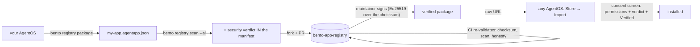

# The app commons: nobody hosts it

The distribution model is **federated**: every author's app lives in the author's
OWN GitHub repo, discovery is a GitHub topic search, and validity is decided by
the *installing* machine. There is no server to run, no storage to pay for, and
no central point whose outage or compromise takes the ecosystem down.

**Git is already the chain.** A git commit hash is a Merkle root over content —
the same tamper-evidence a blockchain provides, with none of the gas, nodes or
pinning services. `owner/repo@<commit-hash>` therefore names *immutable bytes*:
nobody — not the author, not GitHub, not a registry — can change what it installs
after the fact. GitHub and jsDelivr both serve those bytes free.

## Publishing (author — no infrastructure, ~2 minutes)

```bash
bento registry package "My App"           # export via your running AgentOS
bento registry scan my-app.agentapp.json --ai
bento registry sign my-app.agentapp.json  # your own key: bento registry keygen
# put it in YOUR repo at the well-known path, and tag the repo:
cp my-app.agentapp.json <your-repo>/bento.agentapp.json
gh repo edit --add-topic bento-app        # ← this line IS the listing
```

`bento registry publish "My App"` prints exactly this.

## Installing (any AgentOS)

Store → Import → type `owner/repo` (or `owner/repo@commit` to pin a release
forever), or search the commons box on the same tab — it queries the
`bento-app` topic on GitHub, so new apps appear for everyone the moment their
repo is tagged. Every install goes through the same consent screen.

## Validity without a central authority

Three independent checks, all on the receiving machine:

1. **Your machine re-scans the code.** The verdict on the consent screen is
   computed locally (`static/1`, and the author's recorded AI findings) — an
   author's claimed verdict that disagrees with a fresh scan of its own bytes is
   flagged in one sentence ("trust the fresh one").
2. **Trust on first use (the SSH model).** On first install, the app's source and
   signer are pinned in your config. An update from a different source warns; an
   update signed by a *different key* alarms in red — that is what a hijacked
   author account looks like, and `changed-key` is the loudest state.
3. **Author signatures.** Authors sign with their own Ed25519 key; the checksum
   covers manifest + code + verdict, so nothing can be edited under a signature.

## The curated registry is optional, on top


For apps that want an official review and badge, the registry repo
(`registry/` in this repo is its complete seed) is a **Git repository of
`.agentapp.json` packages** — the exact
format this OS already exports (Store → an app → Export) and imports (Store →
Import). That one decision does most of the work: propagation is a GitHub raw
URL into the Import door that already existed, publishing is a pull request, and
history/rollback/review are Git's, not ours.



## The trust chain, exactly

- `checksum` = sha256 over the **canonical manifest + the app HTML**. The security
  block lives inside the manifest, so the verdict is under the checksum.
- `signature` = Ed25519 over that checksum string, by a registry maintainer's key.
  The public key is pinned in `agentos/appregistry.py` (`BUILTIN_KEYS`); users can
  pin additional keys via `registry.keys` in config — config can **add** trust,
  never replace a built-in.
- Therefore: editing the code, the permission list, or the scan verdict of a
  verified package breaks verification. Recomputing the checksum after editing
  turns `checksum-mismatch` into `bad-signature`. There is no quiet path.

Statuses the install screen can show: `verified` / `unsigned` (your own exports —
fine) / `unknown-key` / `bad-signature` / `checksum-mismatch` (the last two mean
do not install, and the UI says so in red).

## The security scan

Two layers, honestly labelled in `manifest.security.scanner`:

- **static/1** — deterministic rules (sandbox-escape attempts, eval/obfuscation,
  external exfiltration channels, shell requests…). Runs identically on your
  machine and in the registry's CI, because it is the same imported code.
- **ai/<model>** — `bento registry scan --ai` reads the code with this machine's
  own brain using a fixed audit prompt; the report is recorded as a finding and
  the scanner name says which model looked.

A finding is a sentence for a human, not a ban — verdicts are `pass`/`caution`,
and refusal stays a person's decision, as everywhere else in this OS.

## The pipeline

```bash
bento registry package "My App"        # via the RUNNING server's export — one packaging path
bento registry scan my-app.agentapp.json --ai
bento registry sign my-app.agentapp.json    # refuses unscanned packages
bento registry verify <path-or-raw-URL>     # what the receiving side runs
bento registry publish "My App"             # prints the exact fork/PR steps
bento registry keygen                       # mint the registry identity (owner, once)
```

The registry's CI (`registry/.github/workflows/`) pip-installs this repo and
imports `agentos.appregistry` — **one implementation** of the checksum, scan and
signature check everywhere, so a package that passes locally passes there.

## Standing it up

`registry/` in this repo is the complete seed of
`contact9prime-lab/bento-app-registry` — see `registry/SETUP.md`. Until the
public key is pinned in `BUILTIN_KEYS`, everything works except the `verified`
badge: packages install as `unsigned`/`unknown-key`, which is the honest state.
