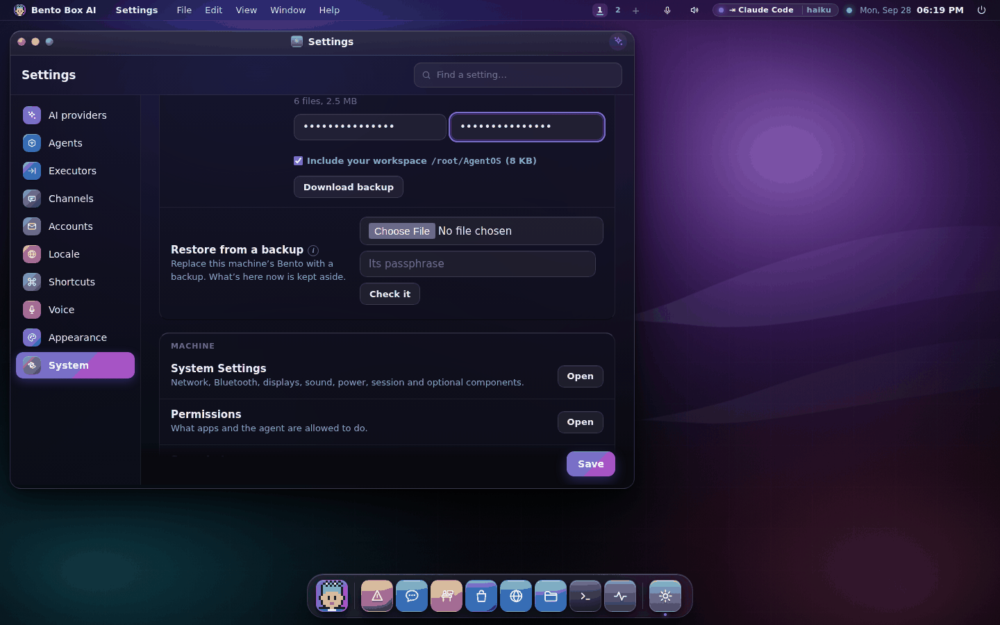
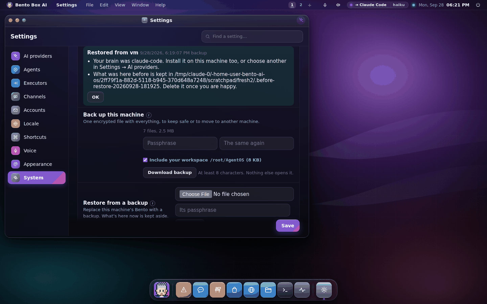

# Backup and moving to a new machine

One file holds your whole Bento: every account on the machine, every memory and
conversation, your agents and missions, your settings, the passwords kept in the vault,
and your workspace folder. It's encrypted with a passphrase you choose. Keep it
somewhere safe, or carry it to another machine and restore it there.

## Make a backup

**On the desktop:** Settings → System → Backup. Type a passphrase twice and press
**Download backup**. On a machine with accounts only an admin can do this, because the
file holds every account.



**In a terminal:**

```
bento backup                       # writes bento-<machine>-<date>.bento here
bento backup ~/Backups             # or into a folder
bento backup --no-workspace        # leave the workspace folder out
bento backup --inspect FILE        # what a backup holds, without restoring it
```

It works while Bento is running. For a backup on a schedule (cron, a systemd timer), give
it the passphrase with `--passphrase-file FILE` or `BENTO_BACKUP_PASSPHRASE`.

The passphrase is the only way to open the file. Nobody can recover it for you.

## What's in it, and what isn't

In it:

- the machine's home and every account's home (`~/.agentos` and `users/…`)
- every database, copied so that a running server still gives a consistent copy
- the vault's keys, so your mail and calendar sign-ins still open on the new machine
- the workspace folder, when it lives outside `~/.agentos`
- linked-team certificates and the WhatsApp linked device

Not in it:

- caches Bento rebuilds by itself (the MCP catalogue, spoken audio, logs, snapshots)
- local models. Pull them again in Ollama.
- the AI engines installed on the machine (Claude Code, Gemini CLI, Codex). Install them
  again, or choose another brain.

## Restore it

**On a new machine:** the first setup screen has **Moving from another machine? Restore
a backup**. It opens the same place as Settings → System → Backup → Restore.

1. Choose the `.bento` file and type its passphrase, then press **Check it**. The whole
   file is read and checked. Nothing changes yet.
2. Press **Restart and restore**. Bento restarts and swaps the backup in before anything
   opens.

Restoring replaces the whole machine, so the desktop only offers it at the machine
itself. From another computer, use the terminal:

```
bento restore FILE          # asks before it replaces anything
bento restore FILE --yes    # for a script
```

Stop Bento first (`bento service stop`); the terminal refuses while it runs.



## What happens to what was already here

Nothing is deleted. Before the backup moves in, everything that was there moves into
`.before-restore-<date-time>` inside `~/.agentos`, and a workspace folder that was in the
way is renamed to `<folder>.before-restore-<date-time>`. Delete them once you're happy.

## Moving to a different computer

A few things can't move by themselves. After a restore, Settings says which apply:

- **Folders.** Paths under your old home (`/home/ada/…`) are rewritten for the new one
  (`/Users/ada/…`), in every setting, in every agent's folder rules, and in the folders
  your missions watch and may read. Your workspace lands where the new machine keeps
  it, even when a fresh install has already made an empty one there.
- **The vault.** If the old machine kept the vault's key in its keyring, the key goes into
  the new machine's keyring. A machine with no keyring (a headless Pi) keeps it in a file
  only you can read, and Settings says so.
- **Telegram.** Only one machine can answer a bot. Switch the old one off.
- **WhatsApp.** The linked device comes along. Switch the old machine off; if it stops
  answering, link it again.
- **Linked teams.** They still know this machine, at its old address. If the address
  changed, link them again.

## How it's protected

- The file is encrypted with AES-256-GCM under a key derived from your passphrase with
  scrypt. It's written in 1 MB parts, so a Raspberry Pi can make and read one without
  holding it in memory (a 157 MB backup peaked at about 55 MB of memory).
- Each part is tied to its place and to whether it's the last one. A file that's cut
  short, reordered, edited or has anything added is refused with a sentence saying which,
  and nothing is restored from it.
- A wrong passphrase is refused before anything is written.
- Names inside the file are checked: nothing can land outside `~/.agentos`, and links are
  never followed.

## Snapshots and backups

Snapshots (Settings → System → Snapshots) are quick restore points kept on this machine.
A backup is the file you keep somewhere else or carry to another machine. Restoring a
snapshot taken on an older version now brings back its data only, never its program files.
