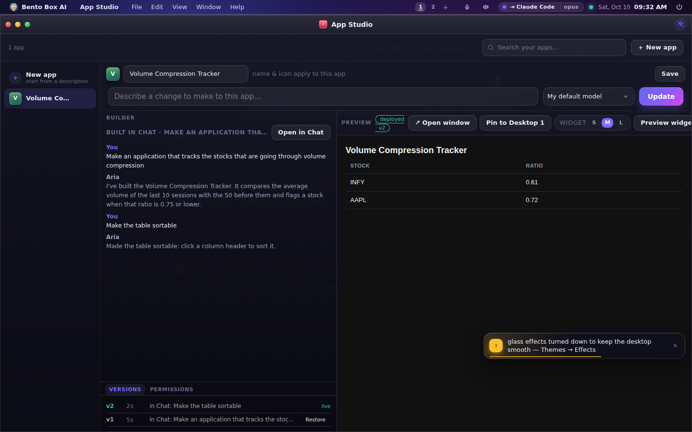
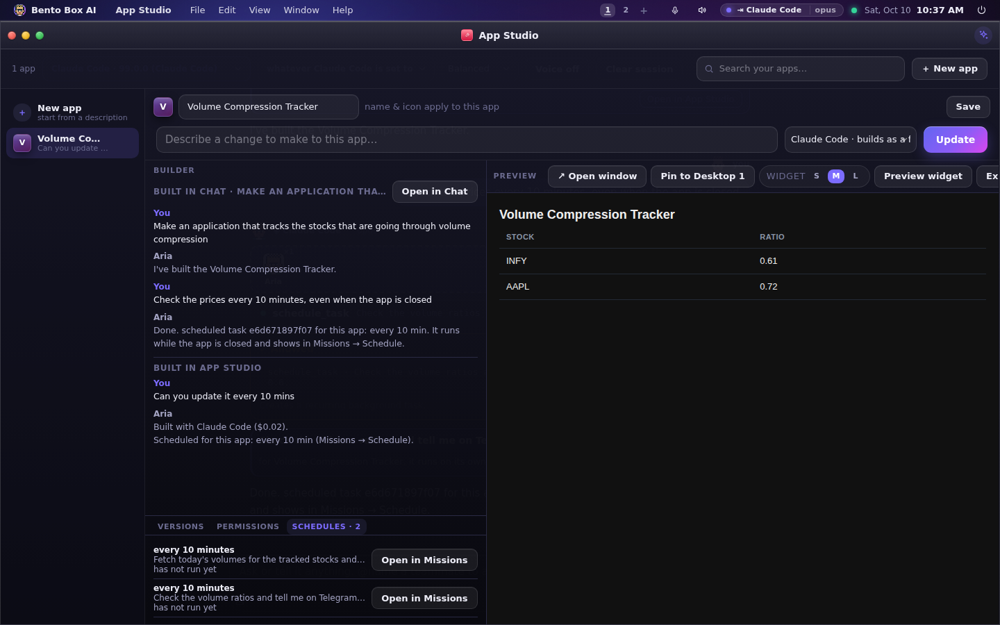

# Building Apps

AgentOS can build tools *into itself*. You describe an app in plain language and the agent builds a
working, self-contained app that gets a desktop icon and opens in a window. Apps can store their own
data and call the operating system.

---

## App Studio

Open **App Studio** and describe what you want — *"a habit tracker with daily checkboxes," "a
dashboard of my scheduled tasks," "a button that runs a command and shows the output."* The builder:

1. streams its work in the panel on the left,
2. installs the app,
3. shows a **live preview** on the right, and
4. asks you to approve the permissions the app needs before you use it.

**Refine** an app by selecting it from the dropdown and describing a change — the builder edits the
existing app in place, keeping context across iterations.

From App Studio you can also **Open** an app in its own window, **Pin** it to the desktop as a widget,
or **Delete** it. You can hand-edit an app's HTML directly, too.

### Watching a build

A build is not a spinner. The Builder panel shows, as it happens:

- **what the model is saying**, one block per message, with markdown rendered;
- **every tool call** — the file it is writing, the command it is running, the URL it is
  fetching — each with its own clock, so a four-minute step is visibly a four-minute step and
  not an unexplained gap;
- **failures, in place**: a tool call that failed turns red and prints why, because a silent
  retry loop looks exactly like a hang;
- **a heartbeat between calls** (`Bash · npm test · 2m 10s · $1.20`), so the gaps are accounted
  for too.

Cancel any time with the same button that started the build. If you close and reopen the window
mid-build, the Studio re-attaches to the run that is still going.

### Built in Chat

You don't have to open App Studio to build an app. Ask for one in Chat and the agent builds it
there, whichever brain answers: the built-in agent, Claude Code, Gemini CLI or Codex. When the turn
ends, the app is on your desktop and in App Studio, and the chat offers **Open in App Studio**.

- The app takes its name from its own title (*Volume Compression Tracker*), not from the first
  words of your message. A name that is taken gets a number.
- App Studio's Builder pane shows the chat it was built in, with **Open in Chat** to carry on
  there. Builds made in App Studio show there too, so an app that went back and forth shows both.
- Ask for a change in the same chat (*make the table sortable*) and it changes that app, as its
  next version, rather than building a second one.
- Every version says where it came from (*in Chat: make the table sortable*), and any of them can
  be restored.
- If you stop the turn after the app was written, it is still installed. If you stop it halfway
  through writing the file, nothing is installed, and the chat says where the unfinished file is.



### Keep it up to date on a schedule

*Update it every 10 minutes* can mean two things, and an app can do both:

- **While it is open**, the app refreshes itself. That is part of the app's own code.
- **While it is closed**, a schedule runs on its own and saves what it found into the app's data.
  The app shows it the next time it opens, and an open app hears it at once.

A schedule for an app belongs to that app. Ask for one in App Studio's Builder, in the chat that
built the app, or let the app make it itself, and it is the same schedule in three places:

- App Studio has a **Schedules** tab beside Versions and Permissions, with each schedule's last run.
- **Missions → Schedule** lists it with *for Volume Compression Tracker* and an **Open app** button.
- The chat and the Builder say *Scheduled for this app* with **Open in Missions**.

A schedule always asks you first, on the usual approval card, because it keeps running after the
chat or the build has ended. Asking for the same schedule twice keeps one. A schedule whose app
you later delete keeps running and says *for an app that was deleted*, so you can remove it.

In the terminal, `bento job schedules` lists them, and `bento job schedules "Volume Compression
Tracker"` lists one app's.



### Name and icon

The **name** and **icon** fields sit above the prompt and are yours, not the model's. Type a name
before you build and the app is called that; leave it empty and the builder picks one. For an app
that already exists the fields edit it in place — the id never changes, so its data, versions,
grants and pinned widgets all follow the rename.

The icon picker offers the OS's own tile set (the same glyphs Tasks, Files and Terminal use), an
emoji if you prefer one, or the default monogram — a letter on a colour derived from the app.

### Versions and permissions

Under the builder log are two tabs:

- **Versions** — every build and every hand edit records one, with the note that produced it. Any
  version can be restored; the current one stays in history, so a bad build is one click back.
  The last 30 are kept.
- **Permissions** — what the app asks for and what it has actually been granted. A finished build
  is read for the capabilities it uses (OS tools, MCP tools, the network, the AI model, its own
  data store) and the consent screen comes up as part of finishing, not as a link you may miss.
  Untick anything optional; **Rescan** re-reads the app after an edit. Nothing is granted by
  default, and everything here can be revoked later in **Permissions**.

> Build quality tracks the model. A tool-capable model (a `qwen` model, or a cloud model) produces
> noticeably better apps. If a build produces nothing, AgentOS automatically retries with a
> tool-capable model when one is available.

---

## The Store

The **Store** has four tabs:

- **Apps** — curated, ready-made apps (Focus Timer, Quick Notes, Calculator, World Clock, System
  Monitor) that install in **one click**, no model required.
- **Channels** — the MCP tool-server catalog; add browser automation, GitHub, search, and more.
- **Skills** — install skills from a git repo or URL.
- **Build with AI** — describe an app and hand off to App Studio.

---

## What apps can do

Every built app runs in a same-origin frame and is given a small runtime automatically. That means an
app's own JavaScript can:

### Store its own data
Each app has a private, server-side data store — its own little backend:

```js
const state = await appData.get();          // returns the app's saved object
state.count = (state.count || 0) + 1;
await appData.set(state);                    // persists it
```

This survives reloads **and** is readable by the agent, so you can ask *"what's in my Notes app?"*
and it will answer from the app's stored data. Prefer `appData` over `localStorage`.

### Call the operating system
Apps can run any agent or MCP tool to pull live data or take action:

```js
const sys = await appTool('system_info');                       // machine snapshot
const page = await appTool('fetch_url', { url: 'https://…' });   // fetch a page
const out  = await appTool('run_command', { command: 'uptime' });
```

`appTool` respects your autonomy and policy settings — risky actions are gated the same way they are
for the agent.

### Use the AI model inside their own features
The model the OS runs on is **inside every app**, not just in the chat window. This is the part
worth building around: it is how an app does the things ordinary code cannot — judge, classify,
summarise, extract a number from a page whose layout keeps changing, or predict what happens next.

```js
// one-shot: short, invisible work — classify a row, extract a field, name a thing
const label = await appLLM('Is this expense personal or business? Reply with one word.\n' + row);

// streaming: ALWAYS use this when the output is user-visible and longer than a sentence
await appLLM.stream('Read this session and call the next move.', {
  system: 'You are a market analyst. Be specific and say your confidence.',
  onDelta: (delta, soFar) => { out.textContent = soFar; },
});

// multi-turn: a real assistant inside the app, with history you keep in appData
const reply = await appChat([{ role: 'system', content: '…' }, ...history]);

// an agent: up to 5 tool-using steps, run AS this app under its own grants
await appAgent('Check the price, and if it moved more than 2% send me a Telegram alert',
               { tools: ['fetch_url', 'telegram_send'] });

// and the standard corner assistant, one line, in any app
appCopilot.mount({ starters: ['What changed today?', 'Explain this number'] });
```

The resilient-parsing trick is worth knowing: after `appTool('fetch_url', …)`, hand the page text
to `appLLM` asking for **only JSON**, then `JSON.parse` inside a `try/catch`. It survives a site
redesign that would break any regex.

Every AI call is authenticated as the app and gated by its permissions (`tool:llm_generate`), so
the consent screen tells you which of your apps can reach the model. Give every AI feature a
loading state and a readable fallback for when no model is configured.

#### Which brain answers, and what it may do

An app's AI is your agent's brain, whatever that is: a model from Settings → AI providers, or
Claude Code or Gemini CLI. On those two, the app's question runs with none of their own tools
switched on, and the app's own `system` text replaces theirs. Codex keeps a shell of its own, so
on a Codex machine an app answers on your provider model, or `appContext()` says why it can't
(`ai_ready` and `ai_note`).

The app is who's asking, every time, and the permission system decides:

| The app does | It needs | On the consent screen |
|---|---|---|
| `appLLM`, `appLLM.stream`, `appChat` | `tool.use tool:llm_generate` | uses the AI model inside the app |
| `appAgent`, the ✦ assistant | `agent.invoke agent:main` | asks your agent to do things inside the app |
| each tool the agent then uses, MCP tools included | that tool's own permission | asked on the card when not granted |
| any of these, on a given brain | `model.use model:<brain>` (open unless you deny it) | |

A permission the app doesn't hold asks you on the usual card, which names the app and offers
Remember. Each decision is a row in Permissions → Ledger under the app's name, and what its AI
spends is in Usage under the app. To stop one app reaching one brain, add a deny for
`model.use model:claude-code` (or the model's name) to that app in Permissions.

### Run on a schedule
`appTool('schedule_task', {prompt, schedule_type: 'interval', interval_minutes: 10})` makes a
schedule that belongs to the app calling it. Its runs can save into the app's data with the
`update_app_data` tool (one key at a time, the rest kept), which the app reads with
`appData.get()`. While the app is open it also gets an event when that happens:

```js
window.addEventListener('appdata', e => reload());   // e.detail.key names what changed
```

A schedule's run can change only its own app's data. Changing another app's needs a grant.

### Use the REST API and real-time streams
Apps can also call the [REST API](api-reference.md) directly (`/api/system`, `/api/chat`, …), poll on
a schedule, or open a WebSocket to `ws://<host>/ws` for real-time updates.

---

## Two surfaces: desktop and widget

Every app has **two surfaces**, and both are part of the same HTML:

| Surface | What it is | How to mark it |
|---|---|---|
| Desktop | the whole application | `<div class="desktop-only">…</div>` |
| Widget | the one glanceable fact, plus at most one action | `<div class="widget-only">…</div>` |

The OS shows exactly one — no script required, and no flash of the wrong surface, because the
class is applied before the app's own code runs. When you do need to branch in JS:

```js
window.appSurface   // {mode:'widget'|'desktop', size:'s'|'m'|'l', widget:bool, desktop:bool}
```

Both views read the same `appData` state; never duplicate the logic.

**Widget size is a property of the app**, chosen while editing it in App Studio (the **S · M · L**
picker beside *Pin to Desktop*), so the same app looks the same wherever it is pinned:

| Size | Canvas | Good for |
|---|---|---|
| S | 260 × 170 | one number or status line |
| M | 340 × 240 | a couple of stats, a short list |
| L | 460 × 340 | a small table or chart |

*Preview widget* in App Studio renders the widget surface at exactly that size, so "does it still
read at S?" is answered before pinning. Changing the size resizes every pinned copy and re-mounts
it, and the right-click menu on a widget offers the three sizes too.

Because widgets are full apps, they keep updating, persist their data, and restore when the
desktop starts. They can also live somewhere other than the desktop — the app deck, beside the
prompt bar, or shrunk into the menu bar (right-click → Move to). See
[The Desktop → Widgets](desktop.md#widgets).

---

## Under the hood

- Apps are stored in the database and served at `GET /api/apps/{id}/page`, with the runtime injected
  automatically.
- App data lives at `GET`/`PUT /api/apps/{id}/data`.
- The agent's `create_app`, `read_app_data`, and `pin_widget` tools power the build/inspect/pin flow.

See the [API Reference](api-reference.md) for the exact endpoints.
