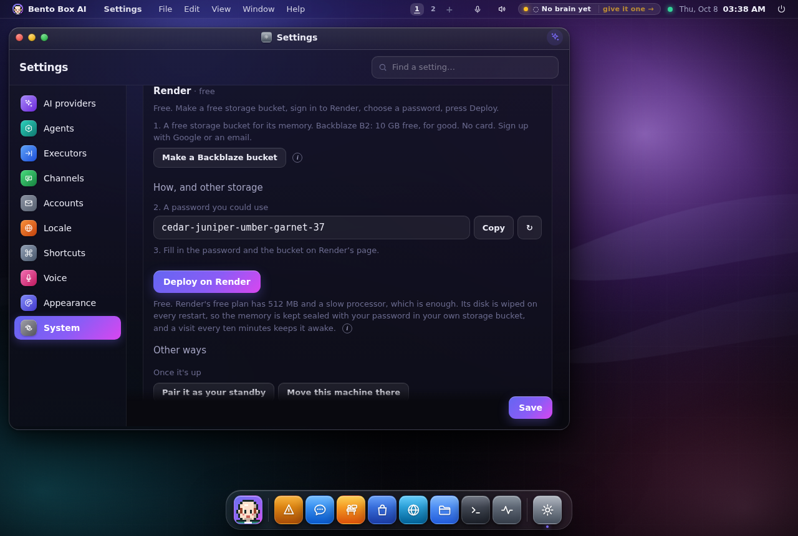
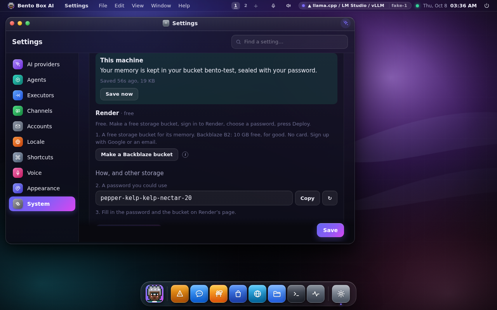
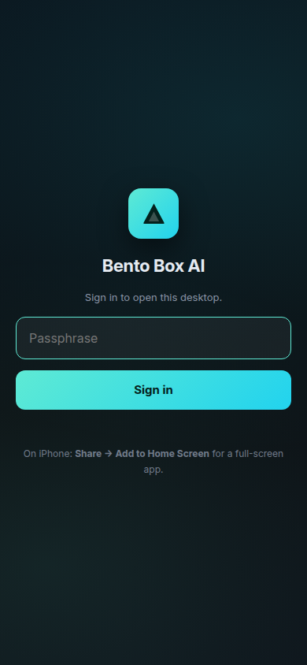
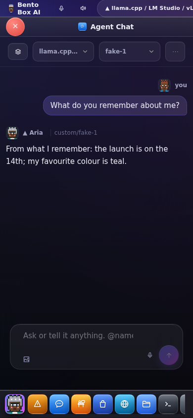
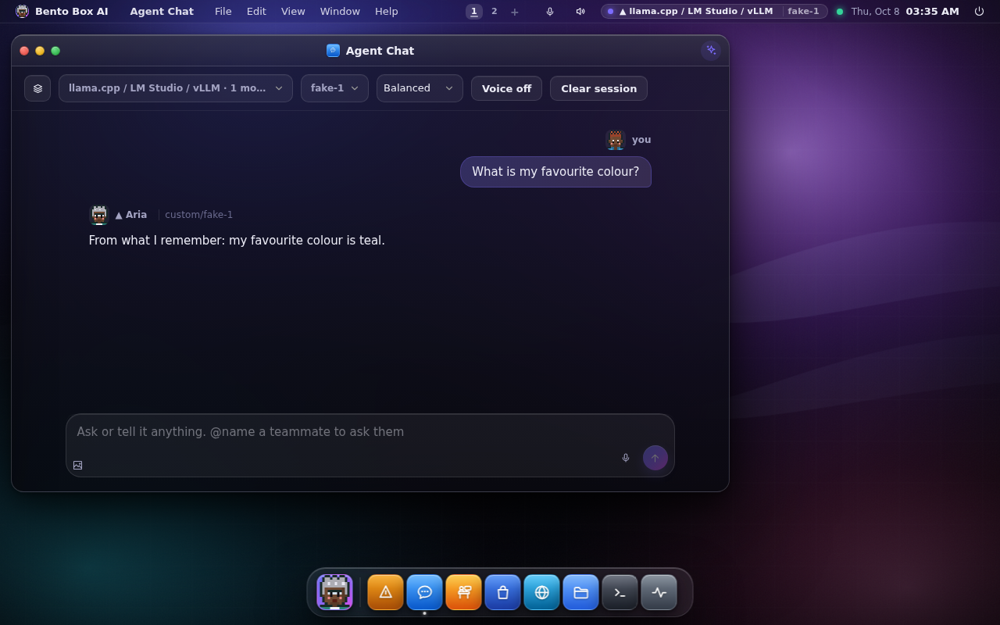
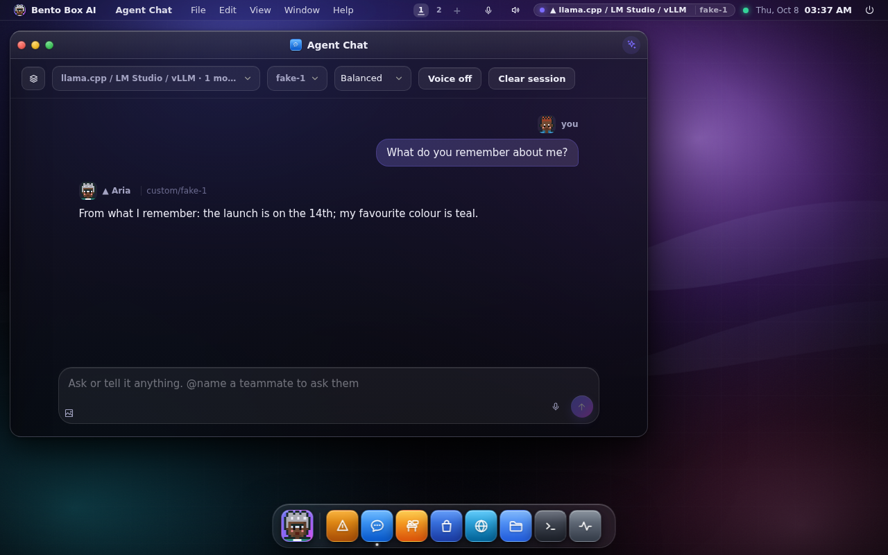

# Put Bento in the cloud

Your own Bento at an https address, running while your computer is off, for free. It takes
about five minutes and no terminal:

[](https://render.com/deploy?repo=https://github.com/contact9prime-lab/bento-ai-os)

1. **Make a free storage bucket for its memory.** [Sign up for Backblaze B2](https://www.backblaze.com/sign-up/cloud-storage)
   (10 GB free for good, no card, and you can sign up with Google). Then:
   - **Buckets → Create a Bucket**: give it a unique name and keep it **Private**.
   - **Application Keys → Add a New Application Key**: allow access to that bucket only, with
     **Read and Write**. Copy the **keyID** and the **applicationKey**; the second is shown once.
   - Note the bucket's **Endpoint** from its card under Buckets (`s3.us-west-004.backblazeb2.com` or similar).
2. **Press the button** and sign in to Render with GitHub, GitLab or Google. No card.
3. Render shows five boxes. Type a password in **AGENTOS_PASSPHRASE**; it's the lock on your cloud
   Bento and it seals the memory, so make it long (Settings → System → Put Bento in the cloud
   suggests one). Fill in the bucket: **BENTO_STORAGE_ENDPOINT** (the Endpoint),
   **BENTO_STORAGE_BUCKET** (its name), **BENTO_STORAGE_KEY_ID** (the keyID) and
   **BENTO_STORAGE_SECRET** (the applicationKey).
4. Press **Deploy Blueprint**. The first build takes about five minutes.
5. Open the address Render gives you (`https://bento-….onrender.com`) and sign in with that
   password. Setup starts as it does on a new computer.

The same choices are in Settings → System → **Put Bento in the cloud**, and in a terminal:

```bash
bento cloud
```



## How it stays working on a free plan

Render's free plan has no card and no bill, and two catches. Bento handles both:

- **The disk is wiped on every restart** (Render restarts free services when it likes, and on
  every deploy). So Bento keeps its home in **your own storage bucket**, sealed with your password
  before it leaves the machine: it saves within a couple of minutes of a change, and once more when
  Render stops it. On the next start it finds an empty disk, brings the home back from the bucket,
  and carries on. The storage service only ever holds a sealed file; without your password it is
  noise.
- **It sleeps after 15 minutes with no visitors.** Missions, schedules and Telegram need it awake,
  so the free blueprint has it visit its own address every ten minutes. One service uses about 744
  of Render's 750 free hours a month. If you run other free services on Render, set
  `BENTO_KEEP_AWAKE` to `0` and it will sleep when idle and wake (in about a minute) when you open it.

Settings → System → Put Bento in the cloud shows, on the cloud machine itself, where its memory is
kept and when it was last saved, with **Save now**. `bento keep` says the same in a terminal.



### Other storage

Any S3-compatible storage works; Bento talks to it directly and needs nothing installed. Fill in the
same four boxes from whichever you choose:

| Storage | Free | Endpoint |
|---|---|---|
| [Backblaze B2](https://www.backblaze.com/sign-up/cloud-storage) | 10 GB, for good. No card. | `s3.<region>.backblazeb2.com`, on the bucket's card |
| [Cloudflare R2](https://dash.cloudflare.com/sign-up) | 10 GB a month. Asks for a card to switch R2 on. | `<account id>.r2.cloudflarestorage.com`, under the bucket's Settings |
| [Tigris](https://console.storage.dev) | 5 GB a month. No card to start. | `t3.storage.dev` |
| Amazon S3, Wasabi, iDrive e2, MinIO, your own | depends | the service's S3 endpoint; set `BENTO_STORAGE_REGION` if the endpoint does not name the region |

Give the key access to that one bucket, read and write, and nothing else. Each save writes the
copy that is not current and then a small index naming it, so the copy before always stays whole.
A sealed home with a large workspace is kept without the workspace once it passes 200 MB.

## What you get

- **HTTPS**, from Render. Your password and your session never cross the internet in the clear.
- **A lock from the first second.** The password is asked for on Render's page and never written
  in any file, so there is no moment when the machine is open.
- **Your memory across restarts**, kept in your own bucket as above.
- **A small machine**: 512 MB and a tenth of a processor. Bento idles at about 100 MB; a chat turn
  waits on the model, not on the machine.
- **No local model.** A cloud server has no graphics card, so add a key in Settings → AI providers
  when setup asks for a brain. Google's Gemini API has a free tier (a key from Google AI Studio,
  signed in with Google), and OpenRouter lists free models.

### Tested the way Render runs it

The image was run here with Render Free's limits: 0.1 CPU, 512 MB, Render's `PORT`, and no volume
at all, so every start is an empty disk. The storage and the model were stand-ins
(`packaging/dev/free-cloud/`): the storage checks every request's signature the way Backblaze or
Cloudflare does, and the model calls Bento's real `remember` tool and answers only from what Bento
puts in its prompt. Render and a real storage service could not be reached from the test machine.
The request signing was also checked against AWS's own library and its published example, and the
save and restore against moto, a fuller S3 implementation.

| Step | Result |
|---|---|
| First start on an empty disk | Answered after 64 s (slow processor); nothing kept yet, so it starts fresh |
| "Remember that my favourite colour is teal" | Called the `remember` tool, then "From what I remember: my favourite colour is teal" on the next question |
| First save to the bucket | 18 KB sealed, plus a small index, within seconds of the change |
| Render stops it (SIGTERM) | Stopped in 3.8 s; the last save went to the second slot and carried something said 4 s before the stop |
| A new container on an empty disk | Answered after 54 s; restored 392 KB from the bucket in 2.1 s; the sign-in from before still worked |
| "What do you remember about me?" | "From what I remember: the launch is on the 14th; my favourite colour is teal", and all four chats were there |
| Memory in use | About 100 to 160 MB of the 512 MB |

 

Before the restart, on the first container:



After it, on a new container whose disk started empty:



### Paying instead

For a machine that never sleeps and keeps its own disk: deploy the same way, then in Render open
the service → Settings → **Instance Type** → Starter, and **Disks** → add 1 GB at `/data`. It costs
about $7 a month plus about $0.25 a month for the disk (Render's prices as of October 2026). You can
then remove the four `BENTO_STORAGE_` settings, `BENTO_EPHEMERAL` and `BENTO_KEEP_AWAKE`.

## Once it's up

Two things this OS already does with a cloud machine:

- **Use it as your standby.** On the cloud Bento, open Settings → System → Cloud standby and press
  **Show a code**. On your computer, type the cloud's address and that code and press **Pair**. Your
  computer does the work; the cloud takes over only while your computer is away.
  [Cloud standby →](standby.md)
- **Move this machine there.** Settings → System → Backup on your computer, then **Restore from a
  backup** on the cloud Bento. Everything comes across: accounts, memory, missions, the vault.
  [Backup →](backup.md)

Want people to have their own sign-in instead of one shared password? Add accounts in the Users
app. Accounts replace the password once there is one. [Users →](users.md)

## Other ways

**Fly.io**, four commands in a terminal, also with HTTPS and a disk. About $3 a month for a 512 MB
machine plus $0.15 a month per GB of disk.

```bash
git clone https://github.com/contact9prime-lab/bento-ai-os.git && cd bento-ai-os
fly launch --copy-config --no-deploy
fly secrets set AGENTOS_PASSPHRASE='<your password>'
fly deploy --volume-initial-size 1
```

`fly.toml` keeps the machine awake (`auto_stop_machines = "off"`): missions, schedules and
Telegram need it running, and a machine woken by the next web request would have missed them.

**Your own server**, any Linux machine you can reach (Hetzner, DigitalOcean, Lightsail):

```bash
curl -fsSL https://raw.githubusercontent.com/contact9prime-lab/bento-ai-os/master/install.sh | sh -s -- --yes --passphrase='<your password>'
```

This one has no HTTPS of its own. Put Caddy, a Cloudflare Tunnel or Tailscale in front of it before
you use it over the internet. [Remote access →](remote-access.md)

**Any Docker host** runs the image as it is: publish port 8321 (or set `PORT`), mount a volume at
`/data` and set `AGENTOS_PASSPHRASE`.

## Not offered, and why

| Host | Why not |
|---|---|
| Railway | No free plan, only a trial, and its deploy button can't add a disk. |
| Koyeb | Its free machine sleeps after an hour without visitors, and it now asks for a card. |
| Hugging Face Spaces | Free machines sleep after two days, and Docker apps there may need a paid plan. |
| DigitalOcean App Platform | No free plan for a server, and no disk. |
| Google Cloud Run | No disk, so every restart forgets everything. |

Free virtual machines with a real disk exist (Google Cloud's e2-micro, Oracle's Always Free). They
cost nothing but ask for a card to sign up and are not one click; the "your own server" line above
works on them.

## When something goes wrong

- **The deploy says it failed its health check.** The first build is slow, and the free machine
  takes about a minute to start. Render checks `/login`, which answers once the server is up; give
  it the full five minutes before retrying.
- **"Memory not saved: Backblaze B2 refused the key."** The key was deleted, or the keyID and the
  secret were swapped. Make a new application key for the bucket, then in Render open the service →
  Environment, replace `BENTO_STORAGE_KEY_ID` and `BENTO_STORAGE_SECRET` and save.
- **"…has no bucket named …"** or **"…wants another region"**. Check `BENTO_STORAGE_BUCKET` and
  `BENTO_STORAGE_ENDPOINT` against the bucket's page. A service whose endpoint does not name its
  region needs `BENTO_STORAGE_REGION` too.
- **It started fresh and says the kept copy is sealed with another password.** You changed
  `AGENTOS_PASSPHRASE`. The old copy in the bucket is left exactly as it is; put the old password
  back and restart to use it. Until then this machine saves next to it, under a new name.
- **It says it forgets everything when it restarts.** There is no bucket. Add the four
  `BENTO_STORAGE_` settings in Render's Environment.
- **Forgot the password.** In Render, open the service → Environment, change `AGENTOS_PASSPHRASE`
  and save. On the free plan that means the kept copy can no longer be opened (see above); on a plan
  with a disk, Bento restarts with the new password and every device signs in again. Restarting with
  the same password keeps everyone signed in.
- **Render says the repository has no render.yaml.** The button reads `render.yaml` from the
  repository's default branch. A fork deploys itself: Settings and `bento cloud` point the button
  at the repository this machine updates from.

## How it works

`render.yaml` (the button's blueprint) describes the free service: the Dockerfile in this
repository, the password and the bucket from Render's secret store, `BENTO_EPHEMERAL` and
`BENTO_KEEP_AWAKE`, and `/login` as the health check, because it answers without a session.
`fly.toml` is the same with a disk at `/data` instead of the bucket. The container's entrypoint
brings the memory back from the bucket (`bento keep restore`, only into an empty home), listens on the
`PORT` the host hands it (Render uses 10000), turns remote access on with the password, and starts
the server, which saves to the bucket when something changes and once more when it is stopped
(`agentos/keep.py`). `agentos/clouddeploy.py` is the one list of options that Settings,
`bento cloud` and this page describe. `tests/test_cloud_deploy.py` and `tests/test_keep.py` check
the blueprint and the copy; `packaging/dev/free-cloud/run.py` is the run in the table above.

Also tested with a disk the way Render's paid plan runs it (`PORT=10000`, a volume at `/data`, a
proxy's `X-Forwarded-Proto: https`): `/login` answers 200 and the API 401 without a session, a
signed-in save works through the cross-origin guard, and a restart keeps both the data and the
session.
