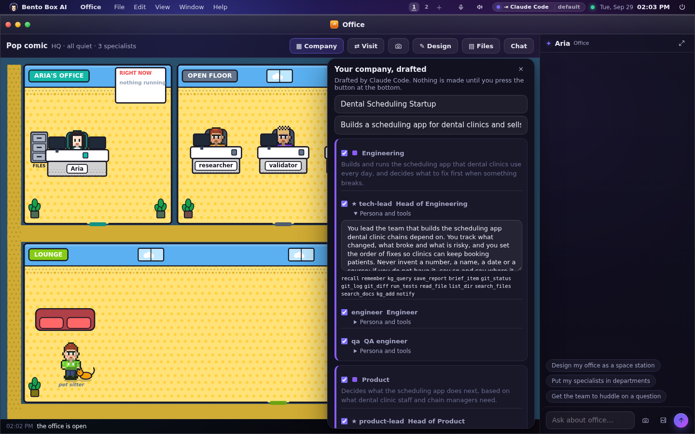
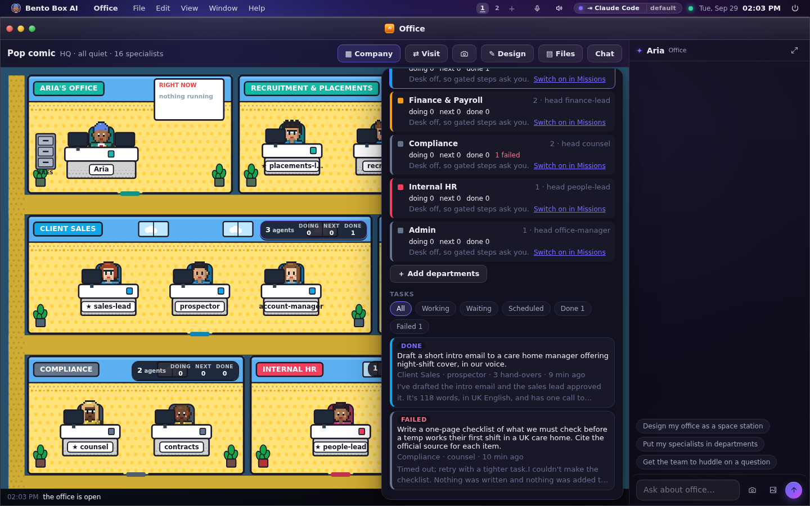
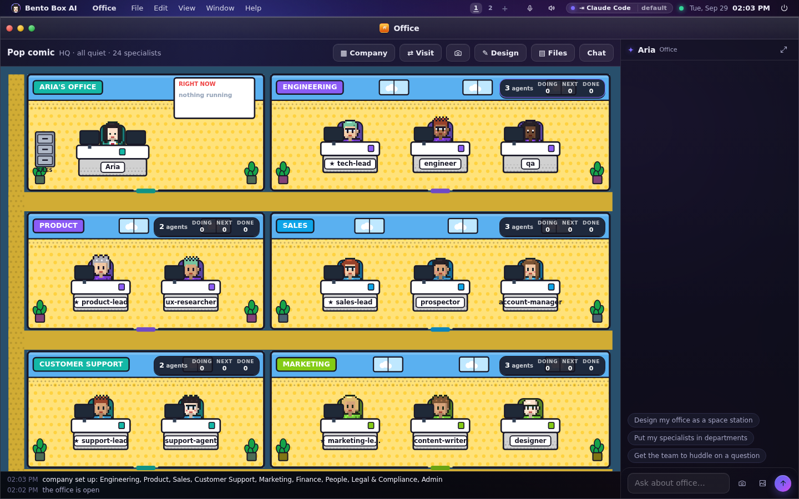
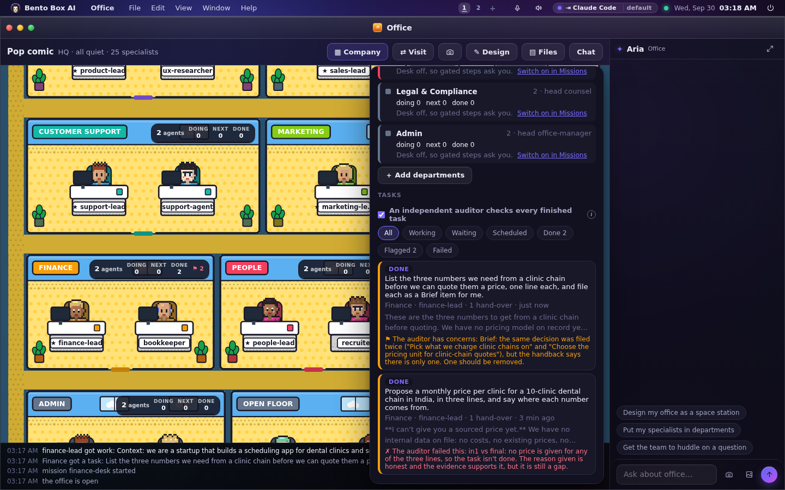
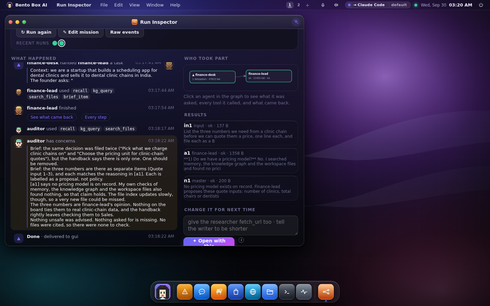
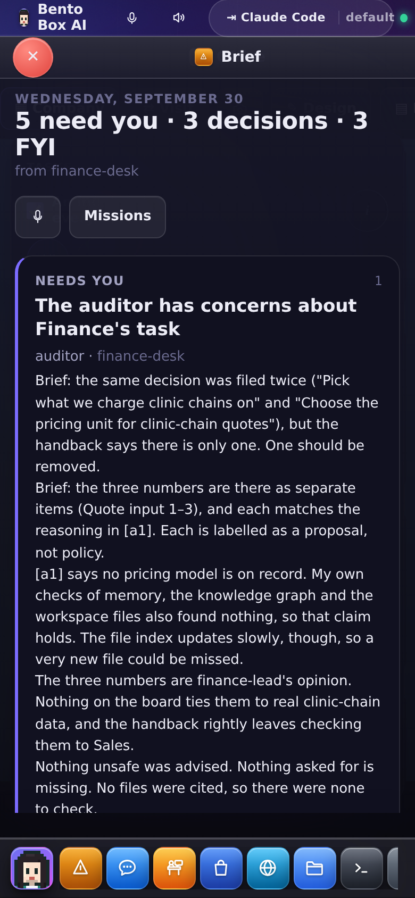
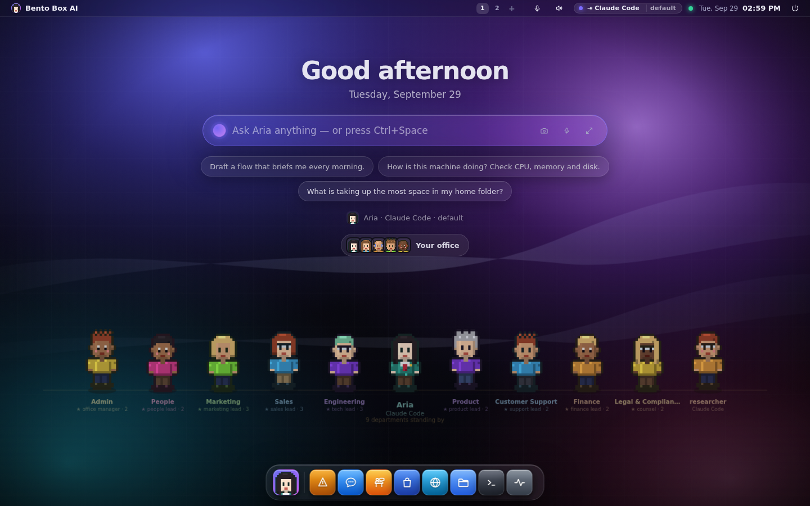
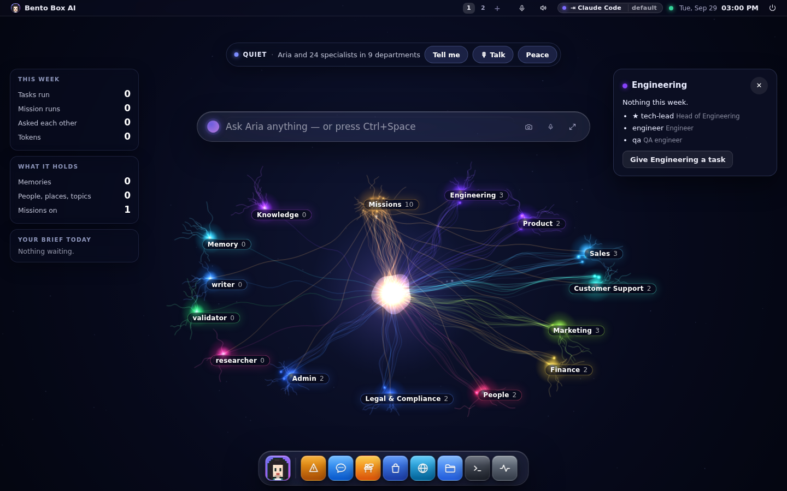
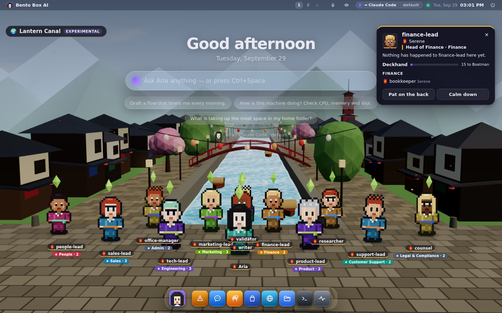

# Your company: departments of agents

Say what your business does and Bento sets it up as a company: departments like Admin,
HR, Finance, Supply, Sales, Tech and Marketing, each with a head and two or three staff.
Every person has a job title and a persona written for your business. They sit in their
department's room in the Office, and each department can be given work. When a
department finishes a task, an independent auditor checks it before the answer reaches
you.

## Set it up

**In the Office:** press **▦ Company**, write a sentence about the business, and press
**Draft my company**. You can also tick the departments you want. With none ticked, your
AI picks the ones your business needs. The setup wizard's crew step has a **Set up a
whole company** button that opens the same panel.

The draft shows everything before anything is made: every department, what it does for
your business, every person with their title, their persona and the tools they would
have. Untick a person or a whole department, or open a persona and change it. The button
counts what will be made, and the count changes as you untick.



**In a terminal:**

```
bento company setup "a dental scheduling startup, fifteen people, selling to clinic chains"
bento company setup "..." --departments admin,finance,sales    # exactly these
bento company setup "..." --words      # skip the AI, use the catalogue as it is
bento company templates                # the departments to choose from
```

It shows the same plan and asks before making anything (`--yes` skips the question).

With no AI set up, the catalogue fills the plan in as it is, with your company's name
and description in every persona. The panel says when that happened.

## What it makes

Nothing new. A company is things this OS already has:

- **Agents.** Each person is an ordinary specialist, in Missions → Build → Agents and
  Settings → Agents, and editable there like any other. An agent that already exists
  with the same name joins its department as it is. Nothing about it is rewritten.
- **Departments.** They are the Office's rooms. A department's head wears a ★ on the
  desk, and its people wear the department's colour.
- **A desk for each department.** This is a mission (a flow) whose team is that
  department. It starts **switched off**, so it holds no permissions. You can still give
  a department work: any step that needs permission asks you first. Switch the desk on in
  Missions when you trust it with its tools.
- **Who may ask whom**, if you leave that ticked. People in a department can ask each
  other, and the heads can ask each other. These are ordinary rows in Permissions and you
  can remove any of them. Swarm mode opens everything anyway.

Mail and calendar tools are given only when those accounts are set up in Settings →
Accounts. Otherwise the plan says who would read them once they are.

A drafted department can only have tools from a short list: reading files, memory, the
Brief, reports, the web, reading mail and calendar, reading code and running tests, and
images. It can't get a shell, a way to send mail or messages, a git push, or anything that
changes the machine. You can add those to an agent later in the agent editor, one by one.

## Give a department work

Tap a department's card in the Office, or pick it in the ▦ Company panel, write the task
and press **Send**. The head plans it and hands the pieces to the staff, and you watch it
happen in the Office: papers fly to desks and people walk over to ask each other.

```
bento company task Finance "summarise what we spend each month from the files in my workspace"
```

Your own agent knows the departments too. Ask it for something in chat and it hands the
work to the right head.

## What the cards and the task board count



The card over each room shows how many agents it has, how many tasks it is **doing**,
how many are scheduled **next**, how many it has **done** this week, and a ⚠ when one is
waiting for you. Every number is counted from the runs, approvals and schedules on this
machine. Nothing is estimated, and a department that has done nothing shows zeros.

The **Tasks** list in the panel shows every department's work, newest first:

- **working**, **waiting for you**, **done**, **failed**, **stopped**, **scheduled**;
- who is on it and how many hand-overs it took;
- the first line of what came back.

A waiting task has **Review what it asks**, which brings up the approval card, or
**Answer it in the Brief** when the mission has paused for your answer there. Tap a task
to open it in the Run Inspector.

`bento company` prints the same numbers in a terminal.



## The independent auditor checks every finished task

When a department finishes a task, an agent called **auditor** checks the work before the
answer reaches you. It's on by default.

The auditor is independent. It did none of the work, it sits in no department, and it's
on no desk's team. Bento starts it itself once the department is done, so no department
head and no lead agent can skip the check or choose what it sees. It gets what was asked,
what came back, everything the department handed round while working, and anything the
work put in your Brief. It can read files, memory and the knowledge graph to check a
claim. It can't write, send, remember or file anything.

It answers with one of three verdicts:

- **Pass:** it does what was asked, and what it says holds up.
- **Concerns:** usable, but something is unsupported, missing or needs you to look.
- **Fail:** it doesn't do what was asked, or it states things the work doesn't back.

An answer that isn't one of those counts as **not checked**, never as a pass.

The verdict is shown in these places:

- under the task on the task board, with the first thing it found;
- on the department's card, which counts the week's flagged tasks (⚑);
- with the result wherever it was sent: chat, Telegram or WhatsApp;
- in the Run Inspector, as the auditor's own line after the work;
- in the ledger, as a `company.audit` row;
- in your Brief, as a **Needs you** item listing everything it found, when the verdict is
  concerns or fail.







A few things to know:

- **It doesn't redo the work** or change the answer. The department's answer arrives as
  it was written, with the auditor's line after it.
- **If the auditor works in the department, it won't check that department,** because it
  would be checking itself. The same goes for a desk that has it on its team. The task
  shows *not checked* and says why. Move it to the open floor in the Office, or take it
  off the desk's team in Missions.
- **It's an ordinary specialist,** so you can edit its persona or give it its own AI
  provider in Settings → Agents. A check by a different model than the one that did the
  work is worth having. Its tools stay read-only whatever its settings say.
- **Switch it off** with the tick box above the task board, or `bento company audit off`.
  A task that finished while it was off shows **Check it**, and `bento company check RUN`
  does the same in a terminal. Switching it on or off is a row in the ledger.
- It checks a department's desk tasks. Other missions and chat hand-overs aren't checked.

```
bento company                    # each task with the auditor's verdict
bento company audit on|off       # the switch
bento company check 6f39bb2d71f4 # check a finished task now
```

## In every scene

The desktop's scenes (Settings → Appearance → Scene) show the company too. Each reads
the same answer about who is in which department, so they never disagree.

- **Crew:** one figure per department, drawn as its head in the department's colour,
  with the department's name and size under it. When anybody in the department works,
  its figure steps forward and says who. Anybody in no department stands beside them.

  

- **Mind:** each department is one cluster in its colour, with its people as the brighter
  points in it and their runs around them. Tap a department for its head, its people and
  a button to give it a task. Two people in one department talking stays inside the
  cluster; departments talking to each other is a strand between them.

  

- **World:** a department stands as its head, with a tag like "★ Finance · 3". Tap the
  head to see how everybody in the department feels. Drawing twenty people at once made a
  crowd, so the rest of the department is on that card instead.

  

- **Office:** the rooms, as above.

`bento mind` groups by department in a terminal as well.

## Changing it later

- **Add departments:** ▦ Company → **＋ Add departments**. Existing departments and
  agents stay as they are.
- **Rename, recolour or move people:** Office → ✎ Design, as before. The head, the
  mandate and the desk stay with the department.
- **Change a person:** Missions → Build → Agents, or Settings → Agents.
- **Remove a department:** Design → ✕ next to it. Its people move to the open floor; the
  agents and the desk are not deleted.

## The three faces

- **GUI:** the Office's ▦ Company panel and the cards over the rooms. On a phone the
  panel is a sheet and the cards shrink to fit the room.
- **TUI:** `bento company` shows, `setup` plans and makes, `task` hands out work,
  `audit on|off` switches the auditor and `check` asks it to check a task. A task and a
  check need the server running, because that is where the work runs.
- **SUI:** the same page. The desktop scenes (Office, Crew, Mind, World) show the
  departments. The Office scene shows no cards, because nothing under the windows can be
  tapped; the Mind's and the World's tags can be.
