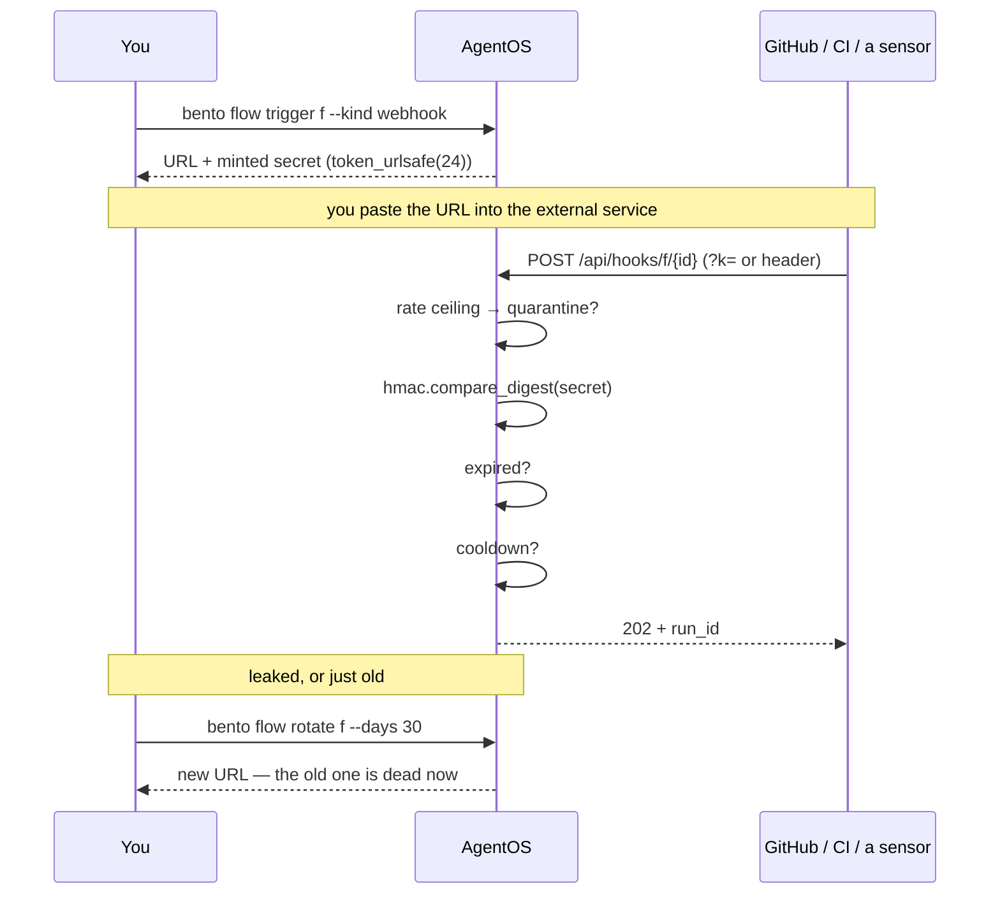
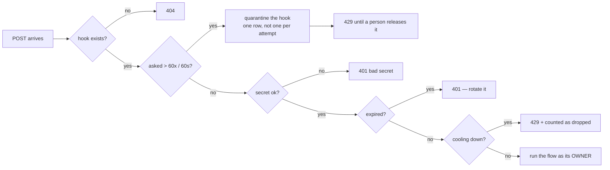
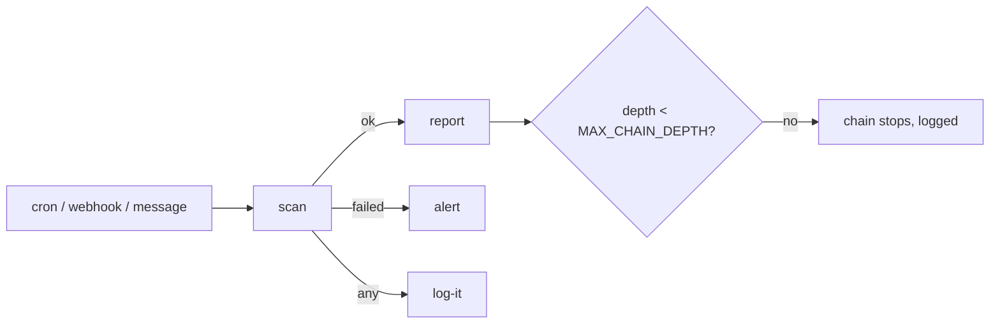

# Design: Flows — the master orchestrator as a control plane

*Status: **shipped**. Built on the F0 fabric ([subagents.md](subagents.md)); the isolation
levels L1–L3 described there remain design and are orthogonal to this.*

---

## 1. What a flow is

A **workflow** is a DAG somebody drew: fixed steps, fixed edges, decided before anything ran.
A **flow** is a standing mission: what you want, who may work on it, what it may touch, and
what starts it. A master orchestrator picks the agents and the order *while it runs*.

That is the whole reason there are no steps in a flow definition. The graph you watch is a
**trace**, not a plan — nodes appear as the master delegates.

```
                    ┌──────────────── CONTROL PLANE ───────────────┐
   trigger ────────▶│  master orchestrator                          │
   (cron/message/   │    · plans, delegates, aggregates, finishes    │
    webhook/event)  │    · holds NO tools that act                   │
                    │    · blackboard: full artefacts under handles  │
                    └───────┬──────────────────────┬────────────────┘
                       delegate                delegate
                            ▼                      ▼
                    ┌── DATA PLANE ──┐     ┌── DATA PLANE ──┐
                    │ researcher     │     │ writer         │
                    │ own tools,     │     │ (may NOT       │
                    │ own model,     │     │  delegate)     │
                    │ own autonomy   │     │                │
                    └────────────────┘     └────────────────┘
```

Both planes were already there for subagents. What is new is that the control plane is now
**an agent**, not a `for` loop over a step list.

## 2. The two-deep rule, enforced by the gate

The master runs as a new principal kind, `flow`. The agents it starts run as `subagent`,
which `policy.BUILTIN_DENY` already refuses `agent.invoke` — so a roster member cannot start
anything. The tree is therefore exactly two deep, and it is the permission gate that says so
rather than a depth counter somebody has to remember to increment.

Delegation itself is not free either. `delegate` is not in `risk_of`'s table, so it arrives
at the PDP as *safe* and would be allowed by default. `policy.PDP._default` gives a `flow`
principal **no default at all** for `agent.invoke` (`rule="roster"`); the only thing that
satisfies one is a grant the flow's own definition wrote. Adding a subagent to the OS does
not make it reachable — adding it to a roster and saving does.

Three independent things must fail before a flow could recurse: the roster check in
`delegate`, the PDP default, and the strip list that removes `delegate` from every child.

## 3. The blackboard

Step data used to be `prompt.replace("{step}", output[:5000])`. That is fine for two steps
and hopeless for aggregation.

Every child's output is written whole to `flow_artifacts` under a short **handle** (`a1`,
`a2`, `n1` for notes, `in1` for whatever started the run). The master never sees a full
output inline; it sees an index — handle, agent, status, tokens, size, preview — appended to
every tool result, and four tools:

| tool | what it does |
|---|---|
| `delegate(subagent, task, context_handles, model)` | one concrete task to one roster agent; the named handles are passed **in full** as its context |
| `read_handle(handle, offset, limit)` | read an artefact, paged, told how much remains |
| `note(text)` | a finding on the board, visible on the graph |
| `finish(summary, handles)` | the deliverable; ends the run |

These four are built **per run** and close over the run id — they are not in `tools.py`,
`TOOL_SCHEMAS`, `/api/tools` or the subagent wizard. A global `delegate(run_id=…)` would take
the run id as an argument, and an argument is something a model can invent; closing over it
means one flow reading another flow's board is not a bug that can be written, it is a call
that does not exist.

The master gets `recall` and `kg_query` and nothing else that acts. The failure mode of an
orchestrator with hands is that it does the work itself and the roster never runs.

## 4. Permissions are part of the definition

A flow declares what its roster may do — tools, MCP tools, skills, web addresses, file paths,
denied models, and a memory scope. On save, `flows.declared_grants()` turns that into real
rows in the same `grants` table the Permissions app shows and the same PDP gates everything
else with. There is no second permission system.

`declared_grants` is **pure** — no database — which is what lets the editor answer *"saving
this will grant 14 permissions"* before a single row is written.

Re-saving reconciles only rows matching `source='definition' AND source_ref='flow:<name>'`.
A grant you wrote by hand, or tapped **Always** on, is `source='user'` and is never in that
set. `Store.add_grant` includes `source_ref` in its dedupe key for exactly this reason: a
definition grant and a hand-written one can read identically, and collapsing them would mean
the next save silently revoked somebody's deliberate decision.

Skills are the one thing a grant cannot express — deny is evaluated first and returns
immediately, so a blanket `deny skill:*` beside per-skill allows would refuse everything. The
allow-list lives in `PDP._default` (`rule="skill-allowlist"`). A subagent that lists no skills
is unrestricted, which is the pre-existing behaviour.

## 5. Triggers: the declaration is here, the clock is not

`flow_triggers` is the declaration. For **cron** and **OS events** it materialises a real
`tasks` row with `tasks.flow` set, and `Scheduler._run_task` branches on it. The scheduler
already owns due-polling, the claim-on-fire that prevents double-firing, cooldowns, and the
file/idle/notification/login pollers; a second implementation of any of that is a second set
of bugs. Flows also show up in the Tasks app, the TUI and the CLI for free.

**Message**, **webhook** and **flow_done** triggers have no time dimension and get no task
row — a row with `next_run IS NULL` and no trigger kind is an invisible row nothing polls.
They dispatch from `telegram._handle`, the chat turn path, the hook route, and (for
`flow_done`) the moment the upstream run returns.

Two of the four **OS events cannot fire on every machine**, and the editor must say so
rather than offer them. `notification` needs AgentOS to own the session — the daemon claims
`org.freedesktop.Notifications` only in DE mode, because claiming it as a guest would steal
the host desktop's — and `login` runs only in DE/KIOSK. `file_change` and `idle` are polled
by the scheduler and work headless. `flows.os_event_problem(event, mode)` is the one answer:
`/api/platform` carries it as `os_events`, the editor greys the option with it, and the save
refuses it. A stored trigger that can never fire reads as armed for the life of the flow.

### The webhook key, and its life



The secret is **minted by AgentOS, never chosen by the caller**: a token somebody picks
is a token somebody reuses. It does **not** expire by default, because a key that dies on
its own would silently stop a standing job; `--days N` makes that a decision, and the
refusal afterwards says *expired* rather than *bad secret* — the difference between
"rotate it" and hunting a leak that never happened.

### Overflow is quarantine, here as everywhere else



Grants answer *may it?*, the cooldown answers *how often may it run?*, and neither bounds
how often it may be **asked**. That gap is the same one `policy.RateMeter` closes for tools,
so it gets the same answer: held until a person releases it, with `forever` kept as an
exemption so the next burst does not re-hold something already judged.

### Chaining: `flow_done`




A flow that starts when another finishes, with `status` of `any` / `ok` / `failed`, and the
upstream flow's output as its input. It exists because the alternative was the first flow
POSTing the second one's webhook — an HTTP round trip and a shared secret to say something
entirely local, which also made the second run look like it came from the internet (tainted,
with no memory of which run it followed).

Two things bound it. A flow naming **itself** is refused at the save, where the flow's own
name is finally known (one trigger on its own cannot see it). And `MAX_CHAIN_DEPTH` stops the
cycle a self-check cannot catch — A→B→A — because a chain is a graph somebody drew and graphs
get cycles; the per-trigger cooldown only slows such a loop down.

An explicit `@subagent` mention is always resolved **before** a message pattern: an address
is not a pattern to be second-guessed.

### The webhook

`POST /api/hooks/{flow}/{trigger_id}` is the one path in the OS deliberately reachable from
the network without the remote-access session — a service on the internet has none and cannot
get one. So:

- auth is `hmac.compare_digest` against a per-trigger `token_urlsafe(24)`, and nothing else;
- unknown hook, bad secret and cooldown are all answered **before the body is read**, so a
  caller in a retry loop cannot make the OS do work by asking rudely;
- the body is capped at 64 KB;
- refused fires are **counted**, not dropped — "it never ran" and "it ran less often than you
  think" look identical otherwise, and only one of those is a bug in the cooldown;
- the secret survives a re-save (rotating on every edit would break every caller) and rotates
  only when asked — `POST /api/flows/{name}/hooks/{id}/rotate` or `bento flow rotate <name>`,
  which revokes the old URL immediately without re-saving (and so re-validating, and possibly
  re-arming) the whole flow. `secret_rotated_at` records when, so "how old is this key?" has
  an answer;
- **the trigger row records its owner**, and this is what makes a hook work at all on a
  multi-user machine. A webhook is the one door with no cookie behind it, so the acting
  account cannot come from the request — and because accounts are isolated by DIRECTORY, the
  trigger lives in its owner's own database, where the machine store cannot see it. The route
  resolves the owner from the row (`_hook_owner`) and enters `users.as_user(uid)` before
  reading anything, so the run happens in the right home, against the right grants and budget.

A webhook body is content from outside this machine, so the run it starts is **tainted**:
`agent.taint` is seeded, the input artefact is marked, and any child handed that handle
inherits it. Everything after that is existing machinery — the PDP's taint ceiling escalates
risky steps to `ask` and deliberately offers no `grant_offer`, so **Always** cannot hand the
next payload the same key. Nothing new is invented for injection defence.

## 6. Grant, then escalate

Declared permissions let a flow run unattended within exactly what it was granted. Anything
outside that used to be auto-denied, because there is no human inside a data plane. Now the
run **pauses**: the approver emits an `approval` event, routes to Telegram inline buttons when
the run came from there (Allow once / Always / Deny) and otherwise to every open window —
which in the session desktop means the desktop itself — and resumes on the answer.

Two consequences worth writing down:

- **`max_seconds` is working seconds.** A run waiting for you to tap Allow is not burning its
  budget. The plain `asyncio.wait_for` this replaced could not tell the difference, which made
  asking a human a reliable way to kill a run: it would die at 300s having done 20s of work.
  A watchdog gives the nicer semantics; an outer `wait_for` at `budget + approval + 60` stays
  as the guaranteed ceiling, because a hung run holds `knowledge.turn_started()` and would
  degrade the whole OS, not just itself.
- **A timeout denies and the run continues.** The master sees the refusal in the receipt and
  can route around it. Only the budget kills a run. A flow that dies because nobody looked at
  their phone is the wrong failure.

The approver does **not** consult grants. It is only reached once the PDP has already returned
`ask`, which means grants were checked and the ledger row written. A second check there would
be a silent second gate.

## 7. Delivery

`flows.sinks` says where the answer goes; the default is `origin` — triggered from Telegram,
it answers in **that** chat, not privately to the owner. Other sinks: `gui` (a desktop
broadcast), `notify`, `report`, `conversation`. The control plane knows nothing about Telegram:
`deliver` and `approvals` are injected in server startup, the same way `broadcast` already was.

## 8. Making one

Two ways in, and they meet in the same editor.

**By hand.** The roster picker has a **＋ New agent** button that borrows the subagent
wizard: it opens over the flow editor (appended later, so it stacks above), the half-filled
flow is collected into `FLW.d` first so nothing typed is lost, and on save the new agent is
fetched, added to the roster and the editor redrawn. Creating the specialist and the flow
that needs it is one thought; making somebody leave, create three subagents and come back to
re-pick them is how a good idea becomes a chore.

**By asking.** `POST /api/flows/draft` takes a sentence and puts the result **in the list as
a disabled card** — not in a modal you have to answer. A draft you can read next to your
other flows, compare, come back to and delete is a better object than one that blocks the
screen until you decide.

That is only safe because of the rule in the next paragraph, which is what lets the OS create
something you did not explicitly approve: **a disabled flow holds nothing.** No grants, no
armed triggers, and `/api/flows/{name}/run` refuses it. The card shows what enabling it
*would* grant, and **Enable is the act of granting**. `POST /api/flows/compose` still exists
and returns the draft without saving, for callers that want to inspect first.

### Test run: trying it before granting it

Every flow card has a Run button; on a flow you have not enabled it says **Test run**, and
that is the point of the disabled state rather than a limitation of it. `/api/flows/{name}/run`
accepts a disabled flow: what "disabled" forbids is running *by itself*, not being tried.

It is safe for the same reason the state is: the flow holds no grants, so every gated step
stops and asks you, and no trigger can start it while you are not looking.

That forced one more distinction in the gate. A disabled flow has no `agent.invoke` grant, so
its delegations would be denied and a test run could never call anyone — useless. So the
roster branch of `PDP._default` now separates two refusals:

| | effect | rule |
|---|---|---|
| the agent is not on the roster | deny | `roster` |
| on the roster, flow not enabled | **ask**, with a grant offer | `roster-ungranted` |

The ask goes down the same escalation path as any other ungranted capability, so unattended
runs still end in a denial when nobody answers — this loosens nothing that runs alone. Answering
once does **not** write a grant: after a test run the flow is still disabled and still holds zero.

### The run inspector

Triggering a flow by hand is nearly always debugging, so the log comes to you: Run opens the
**Run Inspector** (`flowrun`), and clicking any node in any graph opens it too. It shows the
live graph, the control-plane log, the board, and — the part the inline panel does not have —
**step detail**: what that agent was asked, every tool it called and whether each succeeded,
and what it returned. Tool detail is fetched per node from the child's own run
(`/api/fabric/runs/{child}`) rather than duplicated into the flow's event stream, so a chatty
flow does not bloat `fabric_events`.

The inspector and the Flows tab's inline panel are two views of one piece of state. `fgPaint`
finds its targets **by class** (`.fg-svg`, `.fg-log`, `.fg-board`, `.fg-head`), not by id, so
both stay live and neither has to know the other exists.

### The agent can make flows too — but never enable them

`create_flow`, `enable_flow`, `list_flows` and `run_flow` are ordinary tools, so Aria can
build a flow from a chat message or a Telegram message. Telegram is not a special admin
channel: it acts as the **user** principal like any other surface, gated by the channel
posture, which is why "make me a flow that…" works from a phone.

Defining a flow is its own capability — **`flow.write`**, not another `tool.use` string —
because a flow definition *is* a set of standing permissions, and "may define a flow" is a
different question from "may fetch a URL". Two rules follow, and they are the whole
boundary:

- **`BUILTIN_DENY` refuses `flow.write` to apps, subagents, workflows and flows.** Anything
  that could define a flow could grant itself whatever it liked by writing one that says so.
  Only the user's own agent may.
- **A tool-created flow is always born disabled, and `enable_flow` is in `ALWAYS_ASK`** — it
  confirms every time, full autonomy included, and over Telegram that confirmation is the
  same inline keyboard as any other approval. So the agent can write the definition and tell
  you what it would grant; the granting is still a tap you make.

### Seeing it before it runs

There are no steps to draw, so `fgPredictSvg` draws what there is: the master, and everyone
it *may* call, ghosted, in the same visual language a live run uses. It appears on every
flow card and in the editor, and it redraws as the roster changes — so a flow is visible
while you are still writing it, not only after it has executed.

### Changing it with AI

The editor is two columns: the form on the left, and on the right the chart, an **ask for a
change** box, and what saving would grant. `compose(current=…)` revises rather than starts
over — "also send it to Telegram" and "make me one that sends to Telegram" are the same
question from two starting points, so they take one path.

What comes back is shown as a **diff** (`tools: system_info → system_info, fetch_url`,
`sinks: — → origin, telegram`) with the model's own note, and nothing is written until you
press Save. Two things the diff exists to catch: a model returns the *whole* definition on a
revision and fills untouched fields with `null`, which merged naively resets a budget
somebody tuned — so nulls are dropped and the revision is layered over the current
definition; and the name is always kept, because an edit must never fork into a second flow.

The Run Inspector has the same box: watching a flow go wrong is the best moment to fix it.
Editing there opens the editor with your sentence already applied and **does not touch the
run in flight** — a definition edit is for the next run, and mutating a flow mid-run would
make that run's own record of itself a lie.

The subagent wizard has the same pane, drafting a specialist from a sentence or revising the
one on screen (`compose_subagent`, `POST /api/subagents/compose`).

### Executions

`GET /api/flows/runs` — every flow run, newest first, filterable by flow, each with its
delegation count, which agents it used, which steps failed, duration, tokens and the surface
that started it. The Workflows app's **Runs** tab renders it with filter chips; clicking a row
replays that run in the Run Inspector. Per-agent totals and the older non-flow runs
(delegations, static workflows) fold out below it — one view, not two tabs.

### Enabled is the permission boundary

`reconcile_grants` computes `declared_grants(flow) if flow.enabled else []`, and
`reconcile_triggers` keeps the trigger *declarations* while removing the `tasks` rows that
make a clock tick. So:

| | disabled | enabled |
|---|---|---|
| definition grants | none (revoked) | written |
| `flow_triggers` rows | kept, `enabled=0`, no `task_id` | armed |
| `tasks` rows | none | one per cron/os_event trigger |
| `flow_done` chains | do not fire | fire |
| webhook secret | kept | kept |
| webhook POST | 409 | runs, as the trigger's owner |
| manual run | 409 | runs |

This is not a special "draft" state — it applies to any flow you turn off, which closes a
hole that existed before: a disabled flow used to keep its standing permissions, which is
exactly what turning something off is supposed to stop. Enabling restores precisely what you
wrote, webhook secret included, so callers do not need to be told a new URL.

Provenance lives in `flows.draft` (model, notes, warnings, request, and the agents the draft
created). It is cleared on Enable — once you have enabled it, it is yours, not a draft — and
**Discard** removes the flow along with the agents it brought, unless another flow's roster is
using them.

The composer is built to be inspectable rather than clever:

- The prompt carries the real inventory — existing agents with their personas, the actual
  tool names, installed skills — so it reuses what exists instead of inventing near-duplicates.
- Everything that comes back is filtered against that inventory. A tool this machine does not
  have is dropped, a roster entry with no agent behind it is dropped, and **both are reported
  in `warnings`** rather than silently disappearing.
- A worked example is in the prompt. Without one, small models write the mission beautifully
  and leave `roster` and `permissions.tools` empty — naming an agent in prose is not the same
  as putting it on the roster, and the example is what teaches that.
- `_lift_trigger` accepts the flatter shape models actually write
  (`{"type":"cron","at":"06:30"}`) and lifts it into `{kind, config}`. That is a wrapper key,
  not a misunderstanding; throwing away a good draft over it would be pedantry.
- `_at_time` normalises `730`, `7:30`, `7.30`, `7` to `07:30` and refuses anything else out
  loud — `_next_daily` silently falls back to 09:00 on what it cannot split, so a job would
  otherwise have run at the wrong hour and never said why.

New agents proposed by a draft are shown in the roster as **"will be created on save"** and
are created by `flows.ensure_agents` inside the one save path — so the API and the CLI get
the same behaviour. An existing name is never overwritten: a flow saying "I need a
researcher" must not rewrite the researcher you already tuned, or every other flow using it.

## 9. What the three faces get

- **GUI** — Workflows → Flows: definitions, a live graph that grows as the master delegates (solid
  edges are delegations, dashed edges are the data handed forward), the board, and the
  control-plane log. `fgApply` is pure state and never touches the DOM, so events arriving
  while the window is closed still build a correct graph and opening it paints the truth once
  rather than replaying what was missed. `fgPaint` is driven only by `winTick`.
- **TUI** — the Team tab lists flows, their triggers, the last run's board, and **what is
  waiting for you**. The animation genuinely is not available in a terminal; answering an
  approval is, which is what `/api/fabric/approvals` exists for.
- **CLI** — `agentos flow list | run | show | approvals | allow | deny | hooks`.
- **SUI** — nothing structural (the Workflows app is an ordinary window), but a paused flow must
  not depend on a window being open: the approval broadcast reaches the session desktop itself.

## 10. Event vocabulary

All ride `ControlPlane._emit`, so the single `case 'fabric_event'` in the websocket keeps
working — **and the same events replay from `GET /api/fabric/runs/{rid}`**. One vocabulary,
live and stored, so there is one way to build the graph and not two.

`flow_start` · `node_add` · `node_status` · `artifact` · `approval` · `log` · `flow_end`

Graph nodes are identified by their place in the flow (`d1`, `d2`), not by the child's run id:
the node has to appear the moment the work starts, and the run id does not exist until the
child's row has been written. `node_status` carries `child_run` once it does, which is what
makes a finished node clickable.

## 11. Known edges

- One flow, one master, one model. Heterogeneous smartness is per-delegation
  (`delegate(model=…)`), not per-flow-phase.
- `max_delegations` is a hard stop, not a nudge: at the limit `delegate` refuses and tells the
  master to summarise what it has.
- A flow whose children all failed reports `error` even if the master says otherwise; a flow
  with some failures reports `partial`. The master does not get to grade its own work.
- Artefacts are never garbage-collected yet. A chatty flow run holds every output in full.
