# The Desktop

AgentOS is a full desktop environment, not a chat box. This guide covers the shell — windows, the
taskbar, virtual desktops, widgets, themes, shortcuts — and the catalog of built-in apps.

---

## The shell

### Windows
Every app opens in a draggable, resizable window with minimize / maximize / close and proper
z-ordering. Double-click a title bar to maximize. The **taskbar** at the bottom tracks open windows.

### Windows sleep when you stop looking at them
On a native desktop every app is its own process, and a window you cannot see costs you nothing.
AgentOS apps are all live DOM in a single browser tab, so nothing about being minimized used to
stop an app's poller from firing — ten open apps meant ten pollers, ten requests and ten
re-renders competing for one main thread. That is the "it gets slow once several apps are loaded"
a native desktop doesn't have.

So windows have a lifecycle. A window is **awake** when you can actually see it, and **asleep**
when it is minimized, on another desktop, buried under a maximized window, or the page itself is
in the background. Asleep windows keep their state and their DOM — reopening is instant — but
stop doing periodic work. Waking runs that work immediately, so a window never comes back showing
a stale frame.

Measured on a desktop with six apps open, every one of them minimized:

| | requests in 10s |
|---|---|
| before | 25, including five full-screen captures from Host Screen |
| after | 2 |

Task Manager marks sleeping windows, so a background app whose numbers have stopped is
explained rather than mysterious.

### The app deck & system apps
Apps live in bento groups on the deck above the prompt bar. Alongside your groups, a **System
apps** group lists the applications installed on the machine itself, with their real icons — in
every run mode, whether AgentOS *is* your session or a window inside someone else's. Click one to
launch it on the host; right-click for *Show all applications*, or to hide the group.

### Arranging it: drag a tile, drag a group, hide what you never open
The deck is yours to arrange, and it is arranged by dragging rather than by a menu.

- **Drag a tile** to reorder it inside its group, or onto another group to move it there. The
  tiles around it part as you go, so what is on screen is the arrangement you are about to get.
  Drop it on a **folded** group and that group takes the app and opens.
- **Drag a group by its name** to reorder the groups themselves.
- **On a phone**, press and hold a tile for a moment first. A finger that moves straight away is
  scrolling the deck, which is what you want nine times out of ten.
- **Right-click a tile** for the same moves without a pointer: *Move earlier*, *Move later*,
  *Move to <group>*, *Pin to dock*.

**Hiding** is on the same menu: *Hide from the desktop*. The tile leaves the shelf and the app
stays installed — it is still in the launcher, still in the prompt bar, and still on the app wall
(scroll up over the tiles), where it shows dimmed and marked `hidden` so you can put it back with
*Show on the desktop*. A group whose apps you have hidden says how many, and its right-click menu
offers them all back at once. Nothing here deletes anything.

Your arrangement, your folded groups and your hidden list live in this browser's local storage, so
they are per-machine and instant. `bento apps` in a terminal always lists every app, hidden or not.

### Start menu & dock
- **Start** (bottom-left) opens the full app menu with descriptions.
- The **dock** next to Start holds quick-launch shortcuts for your favorite apps, each showing a dot
  when running. Right-click a dock icon to remove it.


Removing an icon only takes it off the dock. The app is still in the Launcher, the prompt bar
and the deck. The toast says so and offers **Undo**. To put it back later, right-click the app in
the Launcher → **Pin to dock**.

### Questions from the prompt bar


Every new question you ask the prompt bar starts its own conversation in Chat, titled with what
you asked, under **From the prompt bar**. A follow-up asked while the answer's card is still open
continues that thread. **Open in Chat** on a card opens that card's thread. The thread exists as
soon as you press Enter, so a question queued behind another turn is already in the list.

Before, every question from the bar went into one thread called "Desktop", so the list showed
"Desktop" and nothing else.

### Desktop icons
There are none, deliberately: the desktop is wallpaper and the apps live in the deck above the
prompt bar, where they are grouped, searchable and arrangeable. See **Arranging it** above.

### Virtual desktops
A pager in the taskbar (`1 2 +`) gives you multiple desktops:
- **Click** a number to switch; **right-click** a number to move the active window there.
- **Ctrl+1…6** switches desktops.
- Widgets are **per-desktop**, so each desktop is its own workspace.

### Command palette
Press **Alt+Space** or **Ctrl+Space** anywhere for a fast launcher: fuzzy-search to open any app, run
an action (new chat, clear session, toggle voice, reset wallpaper), or choose **"Ask …"** to send
your text straight to the agent.

### Fullscreen
Press **F11** (or use the Settings button) to toggle fullscreen. Launched via `agentos app`, the
desktop opens fullscreen automatically, hiding the host taskbar.

### Power & session
The **⏻ button** at the right of the menu bar carries real session controls — lock screen,
restart AgentOS, suspend, log out, restart and power off the machine (via
`loginctl`/`systemctl` on Linux, `pmset`/System Events on macOS; each destructive action asks
you to confirm). Apps can never reach these controls; the agent's shell keeps hard-blocking
`shutdown`/`reboot` commands.

Booting straight into AgentOS is no longer just a direction — AgentOS installs as a real
**Wayland login session** (and optionally boots the machine directly into it). See
**[AgentOS as your desktop environment](desktop-environment.md)** for the session, the
System Settings app (wifi, bluetooth, displays, sound, power), notifications, and the
lock screen.

---

## Widgets

Pin any app to the desktop as a **live tile**:
- From **App Studio**, select an app and choose **Pin to desktop**, or ask the agent
  (*"pin the stock tracker to my desktop"*).
- Widgets are frameless; hover to reveal a small toolbar (refresh, open in a window, unpin).
- **Drag** to move (snaps to a grid), drag the corner to resize — positions persist and restore on
  startup.
- Start menu → **▦ Arrange widgets** tiles them neatly.

Because widgets are full apps, they can poll on a schedule, call the OS, run tools, and update in
real time.

---

## Themes

Open **Settings → Appearance** and pick a theme; the entire interface recolors instantly:

- **Nova** (modern, the default): deep ink, an electric indigo-to-violet accent carried
  into buttons and highlights as a gradient, white text on the accent, the Geist typeface,
  softer and larger corners, and its own wallpaper
- **AgentOS** (teal)
- **Ember** (dark — warm orange accent)
- **Ember** (light)
- **Dracula**
- **Nord**
- **Frost** (glass) · **Field** (warm light) · **Shell** (terminal) · **Aura** (voice-first)

Your choice is remembered. A browser that never chose gets Nova.

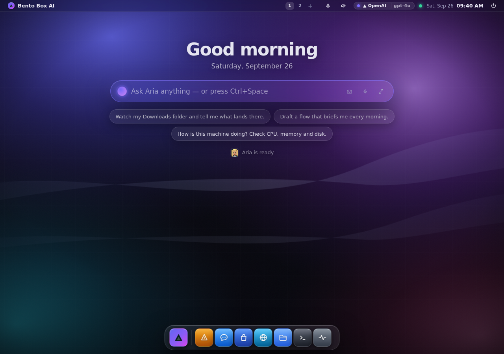

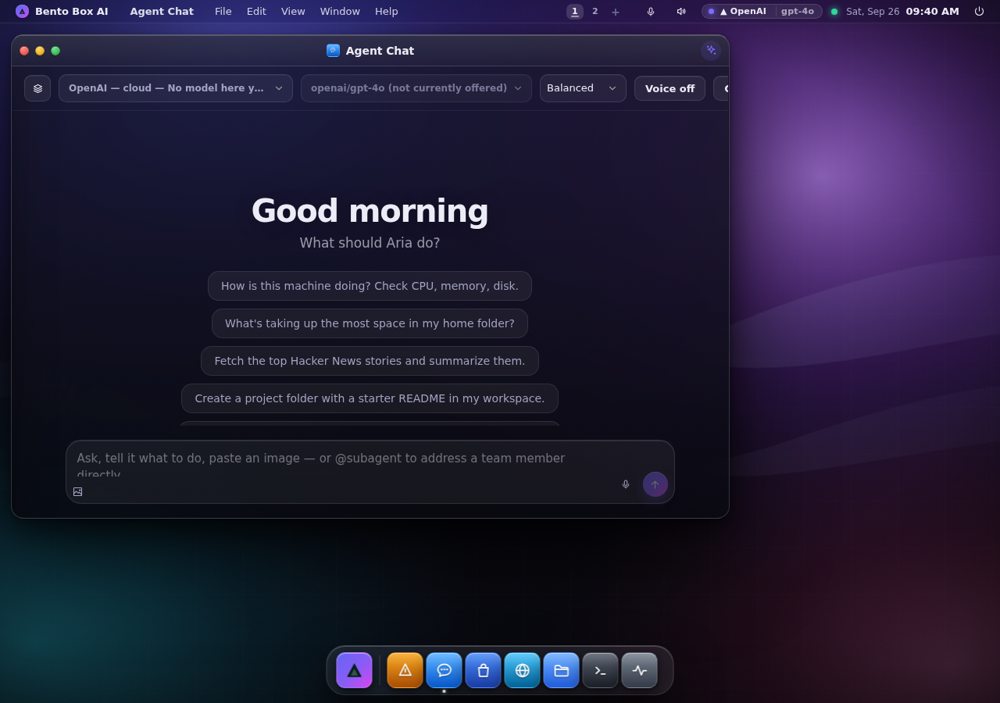

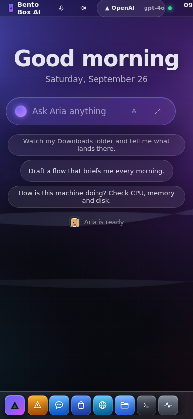

### Build your own

**Themes → Build a theme** builds the whole look and feel, and the desktop changes live
while you edit:

- **Colours**: pick light or dark, a background tint and two accents, and **Generate
  palette** derives every surface, border and text colour from them. Fine-tune any single
  colour after that, including the text that sits on the accent.
- **The contrast is said out loud**: "Text on surfaces 15.9:1 ✓ · muted text 9.2:1 ✓ ·
  text on the accent 7.7:1 ✓". A palette under 4.5:1 is marked, never silently saved.
- **Shape** (corner roundness), **Depth** (flat / soft / normal / deep shadows), **Glass**
  (solid / frosted / clear), **Type** (a font, or any web font, and the text size), and
  **Wallpaper** (keep yours, one of the built-ins, or one made from your colours).
- **Start from** any theme, **Save & apply**, or **Export** it as a file to share.

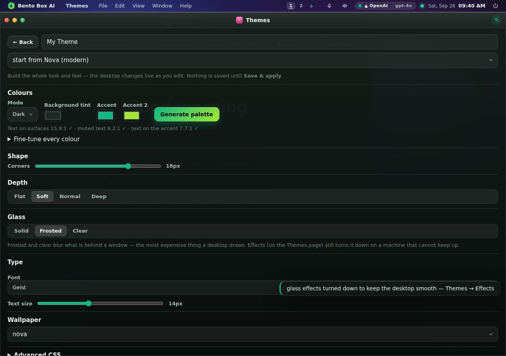

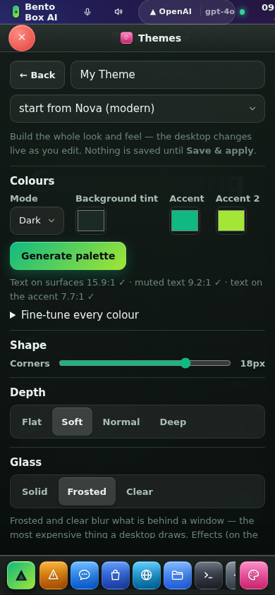

Every control writes a token the whole desktop already reads (`--r-md`, `--el-3`,
`--glass-blur`, `--fs-base`, `--acc-grad`, `--on-acc`…). Asking your agent to "design a warm
sunset theme" uses the same names (the `create_theme` tool). A terminal has no palette or
glass, so the builder has no terminal face; asking in chat is the words-only way to build one.

### Design-language themes

Five themes go further than a palette — each one re-cuts the whole shell (surfaces, radii,
elevation, blur and type) into a different visual language:

| Theme | Language |
|---|---|
| **Bento (grid)** | flat, chunky, gapped tiles with hard offset shadows and alternating tile weights — no blur anywhere |
| **Liquid Glass** | near-invisible surfaces: the wallpaper refracts through every pane, with a bright rim holding each one together |
| **Spatial (depth)** | panes floating in a room — heavy blur, deep drop shadows, nothing opaque |
| **Claymorphism** | puffed-up clay: fat radii, a soft outer shadow *and* an inner highlight, so surfaces look pressed out of the background |
| **Minimalism** | paper: hairlines instead of shadows, one accent colour, nothing else |

Themes control tokens, not just colours: anything in a theme's `v` map becomes a CSS custom
property, so a theme can redefine `--r-lg`, `--el-4`, `--glass-blur` or `--wall` alongside the
usual hues. The agent can create themes of its own with the same reach — see
[Models & Appearance](models.md).

### Effects: what glass costs, and the knob for it

`backdrop-filter` is the most expensive thing a desktop shell can ask a browser for, and the cost
**compounds**: every translucent surface makes the compositor re-blur everything beneath it, so
each window you open makes all of them more expensive. Measured with five windows open, in the
same session, on the same machine:

| Theme | frame rate |
|---|---|
| Bento, Claymorphism, Minimalism (no window blur) | 60 fps |
| Liquid Glass | 6.5 fps |
| Spatial | 6.3 fps |

**Themes → Effects** is the volume knob, and it defaults to **Automatic**:

| | |
|---|---|
| **Automatic** | full glass until the machine says otherwise. It measures real frame times with real windows open — no device sniffing, no GPU allowlist — and steps down only if it has to, telling you it did. |
| **Full glass** | every surface blurs, as the theme designed it. |
| **Reduced** | only the *focused* window is glass; the ones behind it go solid. Cost stops growing with the number of open windows. Liquid Glass went from 6.5 to 27 fps this way. |
| **Off** | no blur anywhere, panels go solid. 60 fps in every theme. The right answer on a Raspberry Pi or a VM. |

"Reduced" makes unfocused windows **solid**, not merely un-blurred: a glass window is around 66%
opaque and relies on the blur to turn what is behind it into a wash. Remove the blur and keep the
transparency and you get four windows of text legible through each other.

Flat themes cost nothing to begin with, so none of this applies to them.

### Immersive experience

**Settings → Appearance → Immersive experience** is on by default (switch it off there for
the plain desktop; the choice is remembered per browser). It is a *look*, not a theme: it lays a design
system, a scene and motion over whichever theme is on, so an immersive Dracula is still Dracula.
It was built ground-up in five phases, each judged in a real browser and by the OS's own agent:

- **A design system under it.** Body type at 15px with the small sizes lifted, radii up a step, a
  deeper elevation ladder, and one control kit — 36px fields with a drawn chevron, 32px secondary
  and 36px primary buttons, iOS-shaped switches, a glass segmented control, one card, one list row,
  unified toolbars, vibrant sidebars. The apps already share those classes, so all forty-five
  reflow from one stylesheet.
- **Icons, not glyphs.** A small stroke icon set drawn for this OS replaces ⚙ ✦ ⏻ and friends in
  the Settings rail (a coloured tile per category), the tray, the prompt bar, Chat and the deck.
  The standard desktop keeps its glyphs.
- **The desktop is a scene.** With no window open: a greeting by the hour (and by first name on a
  machine with accounts), the date, the prompt bar in the upper third with three things to try,
  and one line of what the agent is doing. The app deck leaves the desktop and becomes the wall
  (Launchpad) behind the dock's launcher button. Open a window and the scene fades; the bar stands
  down until Ctrl+Space, the brand mark, or a running turn brings it back.
- **Windows.** The focused window is a lighter, top-lit glass surface with a layered shadow; the
  ones behind it go dark and lose their border; the title bar and an app's toolbar are one band.
  Windows open with a touch of overshoot. Every panel, dock, menu and card is lit from above.
- **Spotlight and Chat.** The prompt bar's results read as sections (Actions, Apps, On this
  machine, Ask). Chat is one column: the conversation list is a drawer, replies carry an avatar,
  tool calls are cards with a status dot, the composer floats, and the empty state greets you.
- **A wallpaper that follows the day.** First light until late morning, the aurora through the
  afternoon and evening, the cold sky after dark — SVG, gradients only, sharp at 4K — and it
  drifts a few pixels against the pointer. A theme's own wallpaper, or one you picked, still wins.
- **A second scene: Movement.** The Scene picker beside the switch swaps the sky for a graphite
  plate with one big dial drawn on it, turning once an hour like a bezel, and everything the machine
  does is stamped on the dial the moment it happens, at twelve o'clock, then rides round with it: a
  tool call is a tick with its name (the name stays for seven minutes, the tick for the hour), a turn
  is an arc as long as it took and glows while it runs, every enabled workflow has a mark on the
  inner ring that lights while it runs, an activity ring creeps idle and turns while something runs,
  and the soul is the centre — the agent's name, the brain as calibre — breathing while a turn runs.
  So fifteen minutes ago is at a quarter past, and an hour of the machine's life is on the dial at
  once. Hairlines, brass and one ruby: the greeting and the prompt bar sit inside it. Drawn at most
  twenty times a second while the desktop is visible; it pauses under a full-screen or maximised
  window and when the tab is hidden, holds still under reduced motion, and uses no blur or shadow.
- **A third scene: Crew.** The same picker draws your roster instead — one small figure for every
  subagent in Team, your agent larger in the middle. They rest until something happens: a figure
  steps forward and brightens when its specialist starts working, with the tool it just called named
  above its head, and sits back down when the run ends. Nobody is ever completely still: they
  breathe, sway and blink while they wait, and hold still only under reduced motion.

  They are the same pixel-art people you see everywhere else on this desktop (see
  [Characters](#characters) below): the server draws each one once from its stored recipe and the
  stage blits frames from that sheet, scaled by a whole number with smoothing off, so they stay crisp
  from a phone to a 4K panel. The stage is also where the roster changes: a specialist made while it
  is on walks in from the edge and says **hello!**, and one whose work finished says **done ✓**. Both
  are events, not decoration. It costs what the dial costs (measured: 20 fps against a ceiling of 20,
  0.26 ms a frame, zero frames under a maximised window).

  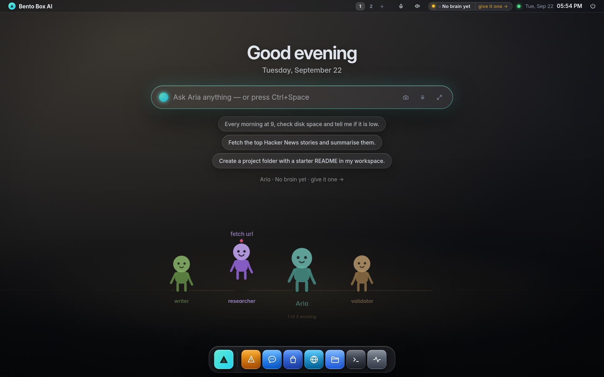

  **The cast is the real one.** Every figure is a subagent this machine actually has, so with none
  yet you get your agent alone and a line saying so, rather than a room of colleagues who do not
  exist. That is the same honesty rule the rest of this OS keeps: a crowd would look better and
  would be telling you something untrue about what you have.

  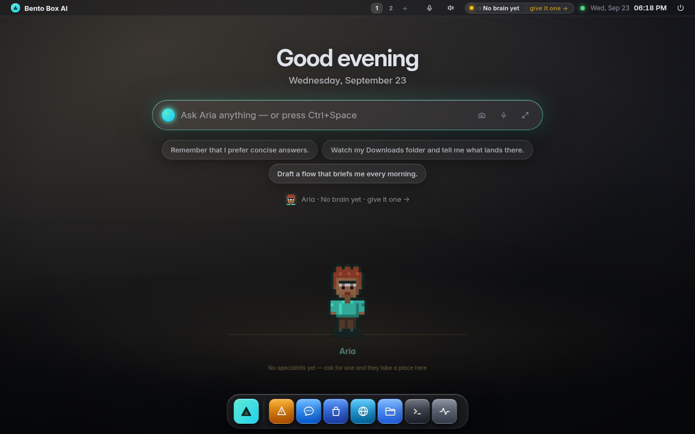
- **Toasts and panels.** A toast says what KIND of news it is before you read it: a green tick
  for something done, amber for a warning, red for a failure, the accent for anything else — worked
  out from the sentence itself, so every one of the few hundred toasts in the apps got it without an
  edit. Each has a ✕, and a thin bar that runs down while it waits; hovering holds it, and a failure
  stays on screen twice as long as a success, because it is the one you need to read. The newest is
  on top and at most five are kept. The notification centre is a stack of cards with a hover ✕ (always
  shown on a touch screen), an important one lit on its edge and a critical one washed red, and "all
  caught up" when there is nothing. The control centre is a set of tiles with an icon each —
  sound and brightness across, network and power side by side, notifications along the bottom — and a
  tile whose control this machine cannot offer says so instead of standing empty. On a phone a toast is the full width of the screen.

  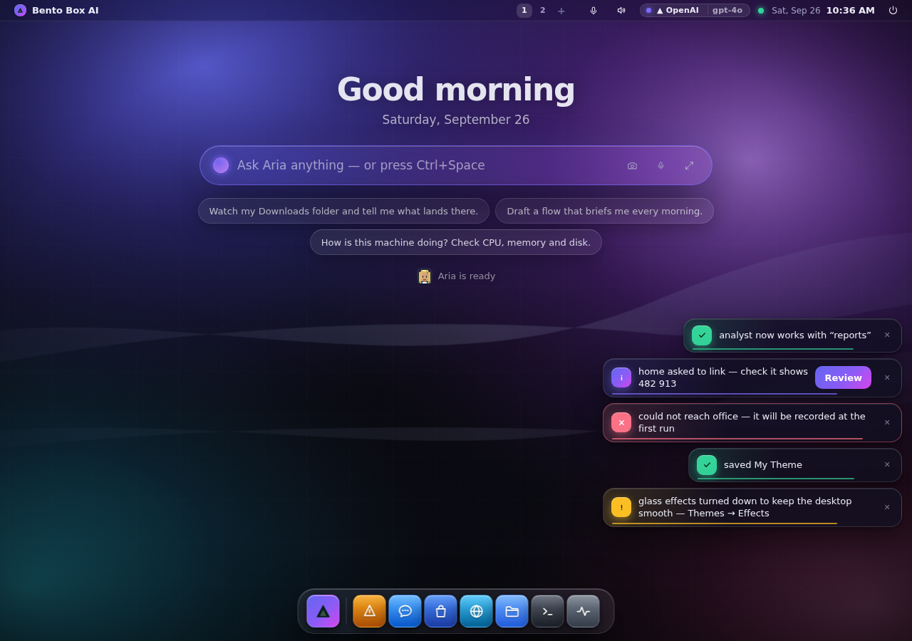

  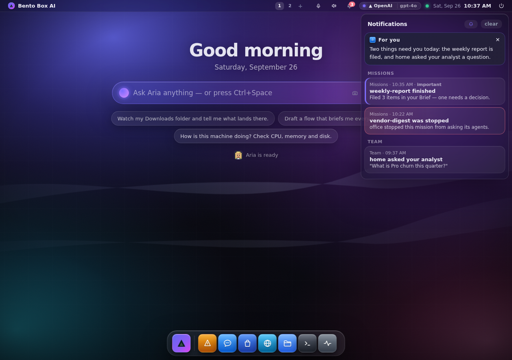

  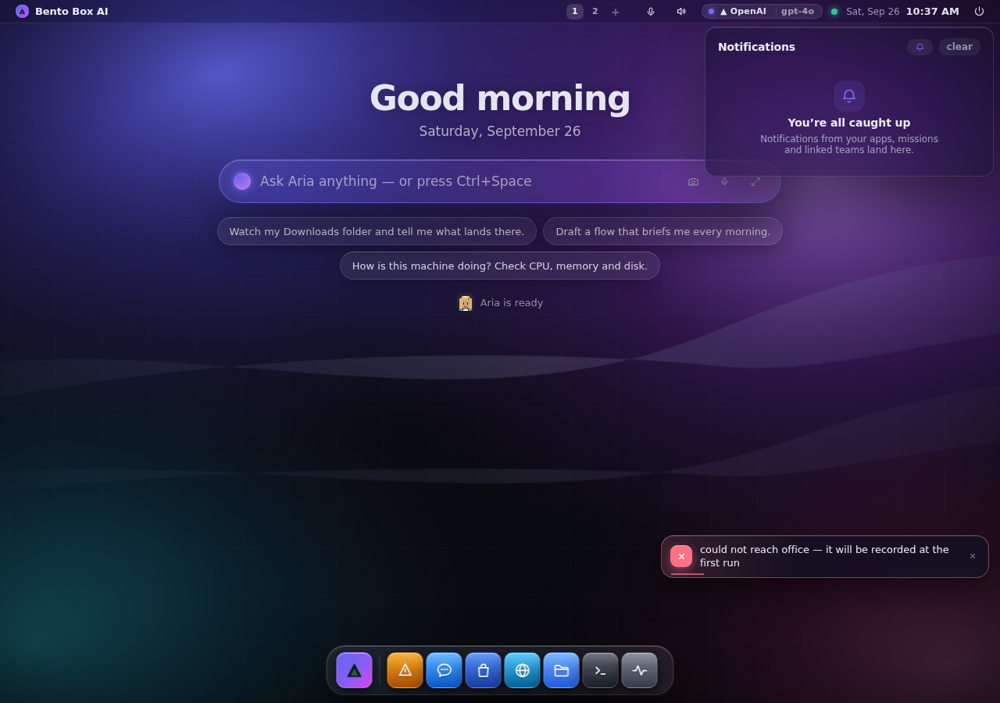

  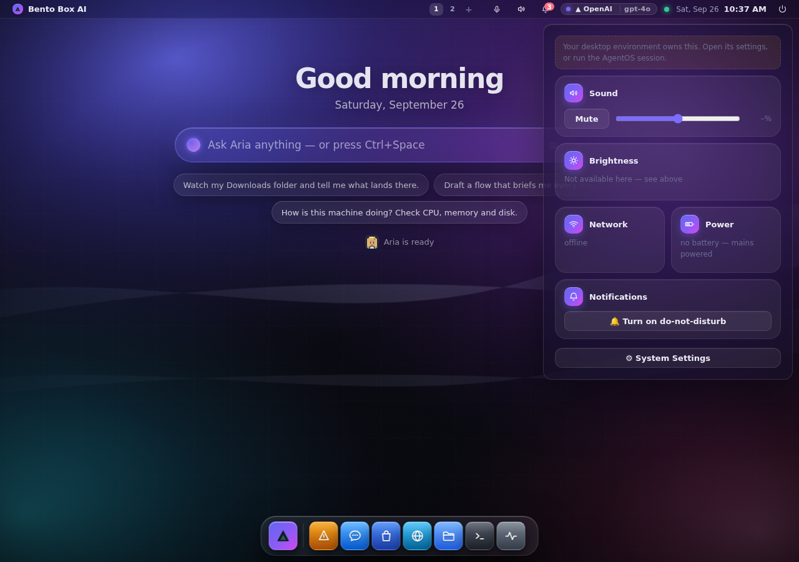

  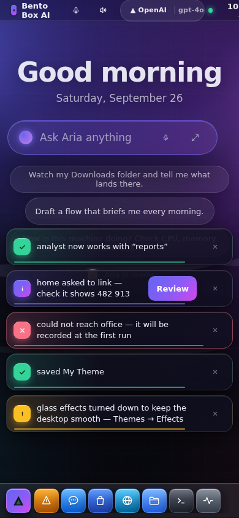
- **A phone gets the same system.** Home is the greeting and the prompt bar; the wall, the drawer
  and the kit all work at 390px, and every new control meets the 44px tap floor.

It is remembered by the browser, like the theme, so a phone looking at the same desktop can keep
the plain one. There is no terminal equivalent — a TUI has no wallpaper or glass — and the switch
says so.

## Characters

Everybody on this machine has a small pixel-art character: **you**, **your agent**, and **every
specialist** in Missions. It is the same character everywhere it appears — beside each message in
Chat, on the approval card when it asks for something, on its lines in Logs, on its card in
Missions → Build → Agents, on the home line, and on the Crew stage — so you learn who is who at a
glance instead of reading names.

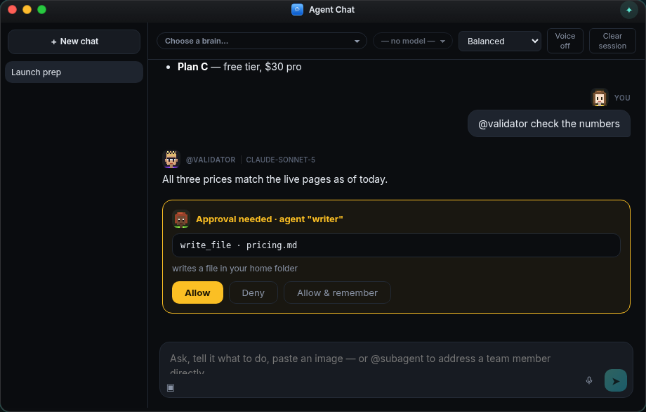

- **Generated, then kept.** A new specialist gets a character the first time anything looks at the
  roster — a skin tone, a hair style and colour, glasses or not, trousers, and a shirt colour that no
  other agent on this machine is wearing. Your agent always wears the desktop's teal. The recipe is
  stored, so adding a colleague never recolours the people already there.
- **Your agent is the lead, and dressed like it.** It wears a **blazer** in its teal, over a white
  shirt and a tie, with a gold pin, and the collar shows in every chat bubble. Specialists wear a
  shirt or a hoodie. That makes your agent the manager at a glance: on the Crew stage it stands in
  the middle, one head taller, and in the blazer. Its look is also this machine's **identity**. A
  linked team sees your agent's face and name on the request card, on the link, and at the top
  of your conversation (see [the team](team.md#talking-to-the-people-on-a-linked-team)). Each
  install draws its own agent and its own "you", so two linked Bentos never show the same person.
  The outfit is a choice like the rest (*Wears: shirt · blazer · hoodie*), and a reroll keeps it,
  so the lead is never demoted by accident.
- **Design one with AI.** At the top of the character editor, describe them: *"a calm lead
  with a grey bun and glasses, in a violet blazer"*. Then press **Design**. Your machine's
  model picks the look, but only from the same options the editor offers. Anything it makes
  up (a cape, green skin) is left out and named, so what you get is always something you could
  have clicked. It applies at once, says who designed it, and **Undo** puts back the previous
  look exactly. With no model set up, or none answering, it matches the words you used ("grey
  bun", "glasses", "hoodie") and says so, rather than claiming AI did it. The same designer is
  `bento avatar design NAME "…"` in a terminal. In chat, ask your agent ("make yourself look
  like a calm librarian"): it is the designer there, choosing through its `set_avatar` tool.
- **Change anybody.** Click a face in Settings → Appearance → Characters, or **Look** on a
  specialist's card. Every choice is saved the moment you click it and every surface changes as you
  pick; **Surprise me** is a new look in the same shirt colour. Or ask: *"give the researcher
  glasses"* — the agent has a `set_avatar` tool, gated like every other, that chooses from exactly the
  same set.
- **Yours, not a space's.** Characters live in your own database; switching project does not change
  who your colleagues look like, and another account on this machine has its own.
- **Only people get faces.** A flow, an app or the system is not a person, and its log lines stay
  plain. **Faces beside messages** (Settings → Appearance) turns them off in Chat, Logs and
  approvals if you would rather read text.

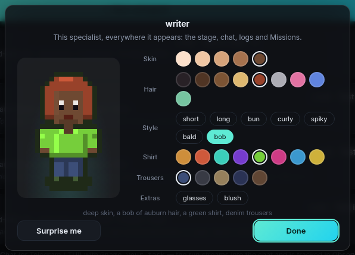

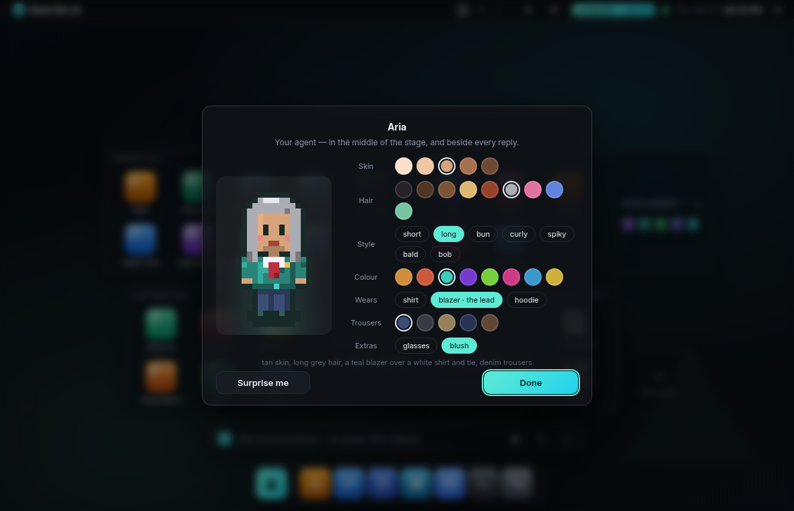

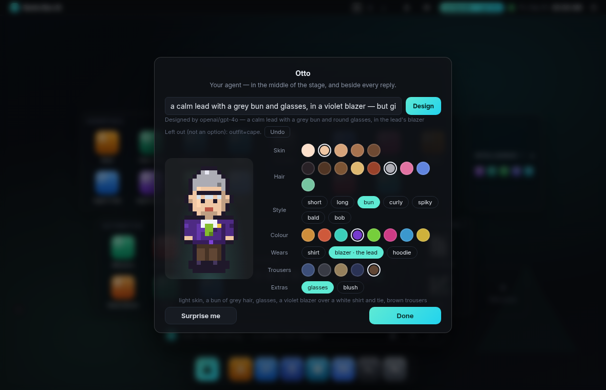

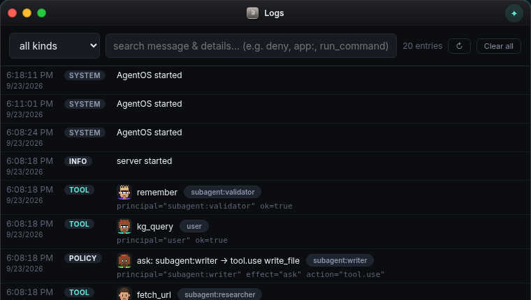

**They work together, on different providers.** Each specialist can answer on its own AI
provider, wears a badge saying which, and can talk a question through with the others in a
*huddle* — see [the team](team.md).

**In a terminal**, `bento avatar` draws the same characters in half-block pixels from the same
grid, and edits them with the server down:

```
bento avatar                       # everybody, side by side
bento avatar show researcher
bento avatar set researcher hair=pink style=bun glasses=yes
bento avatar set agent outfit=blazer    # the lead's look (shirt | blazer | hoodie)
bento avatar design agent "a calm lead with a grey bun and glasses, in a violet blazer"
bento avatar reroll writer
```

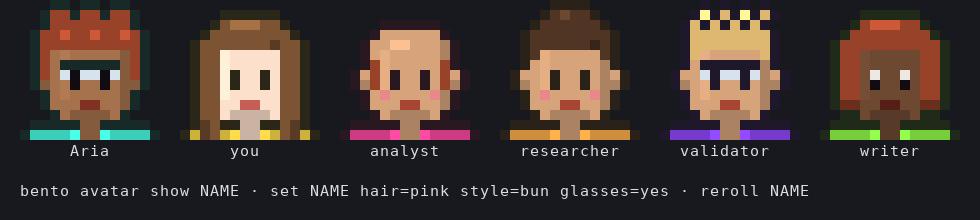

What it costs, measured with five windows open in software-rendered Chromium (the Pi case; a
laptop GPU draws a blur in a few milliseconds):

| | frame time |
|---|---|
| standard desktop, five windows | 16.7 ms (60 fps) |
| immersive, home scene, idle | 16.7 ms (60 fps) |
| immersive, five windows, **Effects → Full** | 50 ms — the focused window's blur is the whole cost |
| immersive, five windows, **Effects → Reduced** | 16.7 ms (60 fps) — that one blur goes, everything else stays |

So the Effects knob above still governs it: Automatic steps to Reduced on a machine that cannot keep
up, and the look survives the step. The parallax is never armed on a touch screen or under
prefers-reduced-motion.

---

## Hot corners

Rest the pointer in a screen corner and something happens. All four ship bound —
an unbound corner teaches you nothing:

| Corner | Default |
|---|---|
| Top left | **Overview** — every window on this desktop, laid out |
| Top right | **Control Centre** — sound, brightness, network, battery |
| Bottom left | **App deck** — the launcher |
| Bottom right | **Show desktop** — everything out of the way, and back again |

Rebind any corner in **Automations → Hot corners** to a desktop action, an app,
or one of your automations. The action list is the same table the keyboard uses,
so a corner can never do something a shortcut cannot.

A corner fires on *dwell*, not on touch: a pointer flying at a close button
clips the corner constantly, so nothing happens until the pointer has rested
there (240ms by default, adjustable), and it must leave the zone before it can
fire again. A quarter-disc fills during the dwell — that's both the affordance
and the escape hatch. Hot corners stand down mid-drag, while an automation is
running, and on phones, which have no pointer to rest.

---

## Automations

An automation is a **named, repeatable sequence of desktop steps**. Set one up
once, and from then on it does exactly that — every time, from anywhere.

Build one in the **Automations** app, or just describe it:

> *"Whenever I start work: open chat and the terminal, switch to the minimal
> theme, and summarise what changed in my workspace. Call it Start work."*

A step is one of:

| Kind | What it does |
|---|---|
| `app` | open an AgentOS app |
| `action` | a desktop action — overview, show desktop, app deck, tile windows, voice, … |
| `theme` | apply a theme |
| `wallpaper` | set a built-in wallpaper |
| `desktop` | switch virtual desktop |
| `agent` | put the agent on a task — the model decides how |
| `tool` | call any agent or **MCP** tool directly with JSON arguments — no model in the loop |
| `python` | run Python on this machine |
| `wait` | pause between steps |

`agent` and `tool`/`python` are the two halves of the same idea. Use `agent` when the step needs
judgement ("summarise what changed today"); use `tool` or `python` when it is exact and should come
out the same way every time. A `tool` step can reach anything the agent can, including every tool
your connected [MCP servers](integrations.md) expose — so an automation can pull a Linear issue,
query a database, or hit an internal API without a model deciding how.

Both go through `/api/tool`, which means they inherit the **permission gate**: an automation gets
no more reach than the agent has, it just skips the model. Their output surfaces as a card above
the prompt bar, so a routine that computes something actually shows you what it found.

**Ad-hoc, four ways:** type its name in the prompt bar, press **Run** in the
Automations app, bind it to a hot corner, or ask the agent for it by name
(`run_automation`). The agent can also build and edit them for you
(`save_automation`, `list_automations`) — saving an existing name edits that
automation rather than forking a second one with the same name.

However it's fired, the sequence runs in one place: the server only *stores*
automations and broadcasts "run this", and the desktop performs the steps. So a
schedule, a hot corner, the palette and the agent can't drift apart.

Malformed steps are rejected when you save, not when the automation runs — an
automation replayed unattended at 7am should fail at the door or not at all.

---

## Phone, tablet, desktop

The desktop serves the same URL to every screen and adapts to the one it lands on. Nothing is
removed on a small screen — the menu bar, dock, prompt bar, app deck and windows are all still
there; they just take a different amount of room.

| | Phone (< 720px) | Tablet (720–1179px) | Desktop (≥ 1180px) |
|---|---|---|---|
| Windows | full-bleed sheets, one at a time | floating, draggable | floating, draggable, snappable |
| Dock | fixed bar across the bottom edge | floating, slimmed down | floating |
| Prompt bar | full width above the dock | centred | centred |
| App deck | one column of full-width groups, 4 icons across | full width, tighter tiles | multi-column |
| Launcher | full-screen sheet | popover | popover |
| Menu bar | brand + status only | no app menus | everything |
| Popovers | bottom sheets | anchored panels | anchored panels |
| Tab strips (Settings, Store) | scroll sideways; Settings' rail moves above the content | as desktop | a rail beside the content |
| Copilot ✦ | not offered — its panel needs a second column | in the title bar | in the title bar |

The classification is on the **viewport**, not the user agent, so a narrow browser window on a
laptop gets the phone layout too — which is what you want when AgentOS is docked beside an editor.
Touch is tracked separately (`body.dev-touch`), so a touchscreen laptop gets larger hit targets at
desktop widths and hover-only affordances such as dock tooltips stand down.

**Touch targets have a floor, and it is real size.** A fingertip is about 9mm — Apple asks for
44pt and Android for 48dp — so on any touch device every control inside a window, popover or the
launcher is at least `--tap` (40px) in both directions, and the sheet's close button is 38px. That
reflows a dense row on a phone, which is the point: on a phone that row was too dense. The
alternative — an invisible enlarged hit area around a small button — is rejected deliberately,
because two neighbouring buttons' halos overlap and whichever paints last silently swallows the
other's taps.

Anything too wide to fit **scrolls and snaps** rather than clipping: the dock, `.seg` tab strips
and Settings' rail. Snapping matters as much as scrolling — a scroller resting halfway through an
icon puts the centre of that button outside its own box, where the tap lands on whatever is
behind it.

Screen-edge surfaces pad by `env(safe-area-inset-*)`, so the dock clears a home indicator and the
menu bar clears a notch. On a phone the window sheet reserves the height of the dock and the prompt
bar, so the agent stays reachable without ever covering an app's own composer.

Resizing across a breakpoint re-lays the desktop live: windows become sheets (and go back to their
remembered geometry on the way out), the dock and deck rebuild, and popovers anchored to chrome
that just moved are dismissed rather than left pointing at nothing.

---

### Wallpaper
AgentOS ships five wallpapers, one per design-language theme. They're **SVG**: a few KB each,
sharp from a phone to a 4K panel, and drawn with gradients rather than blur filters so they cost
almost nothing to rasterise on a slow GPU. They're part of this repository, under the same MIT
licence as the rest of it — no third-party assets, no attribution to track.

Pick a theme and its wallpaper follows automatically. In **Personalize** you can also:
- **Pin a built-in** — use one wallpaper regardless of the theme (*Follow the theme* undoes it).
- **Use your system wallpaper** — adopts the host desktop background so AgentOS matches your system.
- **Generate a wallpaper** with AI from a text description (saved to a local gallery you can pick
  from later).
- **Reset** to the built-in background.

Precedence, most specific first: a wallpaper file you generated or adopted → a built-in you pinned
→ the current theme's wallpaper → the default background. The wallpaper fills the whole viewport,
including behind the menu bar, so translucent chrome has something to blur.

See [Models & Appearance](models.md) for more.

---

## Keyboard shortcuts

| Shortcut | Action |
|---|---|
| **Alt+Space** / **Ctrl+Space** / **Ctrl+K** | command palette (launch app / ask the agent) |
| **Ctrl+Shift+P** | command palette (works inside the terminal too) |
| **Ctrl+Alt+T** | open a terminal |
| **Ctrl+1 … Ctrl+6** | switch virtual desktop |
| **F11** | toggle fullscreen |
| **Enter** (in chat) | send · **Shift+Enter** for a newline |

---

## App catalog

| App | Purpose |
|---|---|
| **Agent Chat** | talk to the agent — streaming replies, tool activity, approvals, voice |
| **Office** | watch your agents work in a comic office: they get work, walk over to ask each other and huddle — [The Office](office.md) |
| **Applications** | launch any program installed on your computer |
| **Web** | open web pages in your real system browser |
| **Files** | browse your workspace; click a file to open it |
| **Terminal** | a real shell on your machine (sandboxed if enabled) |
| **Quick Settings** | sound, network, battery, and shortcuts to native settings |
| **Store** | install ready-made apps, add tool channels, or build with AI |
| **App Studio** | build and refine apps by describing them |
| **Task Manager** | live CPU / memory / disk, processes, open windows |
| **Model Manager** | manage local Ollama models and view GPU usage |
| **Knowledge Graph** | what the agent knows, as a live graph |
| **Soul** | the agent's persistent identity and personality |
| ◈ **Memory** | long-term facts the agent remembers |
| **Skills** | reusable procedures; install from git or a URL |
| **MCP Servers** | connect external tool servers |
| **Telegram** | control the agent from your phone |
| **Policies** | always-allow / always-deny rules for the agent |
| **Logs** | everything the system did |
| **Token Analytics** | model token usage over time |
| **Scheduler** | recurring background jobs |
| **Personalize** | wallpapers and gallery |
| **Snapshots** | restore points for the whole system |
| **Settings** | providers, model, autonomy, appearance, voice, sandbox |
| ▲ **About** | system information |

Details for the interactive and integration apps are in [Building Apps](building-apps.md) and
[Integrations](integrations.md).

---

## Voice

In **Settings → Voice** you can enable:
- **Speak replies** (text-to-speech) — toggle with in the chat toolbar.
- **Dictation** — the button in the composer transcribes your speech into the message.

Both use your browser's built-in speech features; grant microphone permission on first use.
