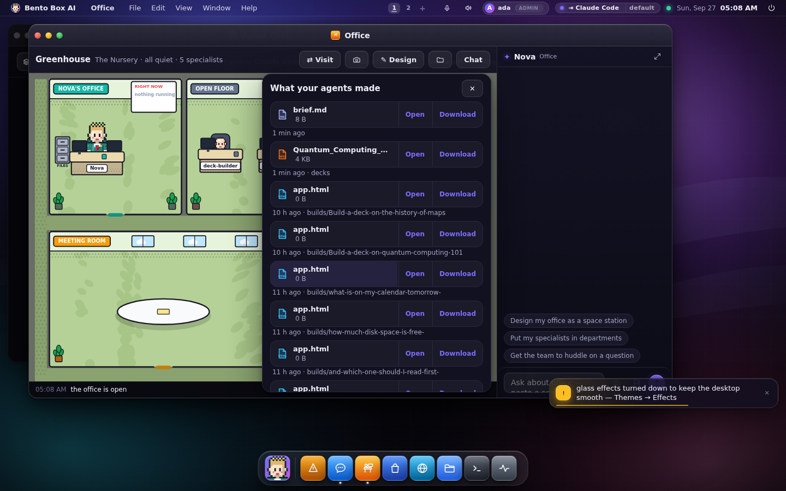

# Files your agents make

When your agent makes something, a deck, a report or a spreadsheet, you can open it from
wherever you read about it.

## In chat

A reply that names a file gets a card for it underneath, with **Open** and **Download**. The
name in the reply becomes a link too.


*Open* does what makes sense where you are. At the machine itself, it opens the file in the
app that owns it (Keynote or PowerPoint for a deck, Preview for a PDF). From a phone or
another computer, opening it on the machine would start an app in another room, so it shows
the file in your browser when a browser can show it, and downloads it when it can't.

The same cards appear in the agent panel of every app and in the prompt bar's answer.

## On your phone

On Telegram and WhatsApp, the files a reply names arrive right after the reply, as
documents. Telegram lets a bot send files up to 50 MB and WhatsApp up to 100 MB (16 MB
through a linked phone). A bigger file is named instead, with where it is on the machine.
To stop it, set `telegram.files` or `whatsapp.files` to `false`.

## In the Office

Your agent's office has a filing cabinet. When an agent saves a file, a paper flies into it
and a red badge counts what's new. Tap the cabinet, or **Files** in the Office's bar, to see
everything your agents made, newest first, each with Open and Download.



## From a terminal

```
bento files            # the 20 newest, with size, age and full path
bento files --limit 50
```

## Where files live

Everything your agents make goes in **your workspace**, the folder the Files app shows. That
includes turns answered by Claude Code, Gemini CLI or Codex. Until 0.6.5 those went to the
machine's shared folder (`~/.agentos/workspace`) instead, so on a machine with accounts a
deck could be made and still be missing from Files. If a folder is set in
Settings → Executors, forwarded turns use that folder.

Only files in folders you can reach are offered. That's your own workspace, and on a
machine without accounts, or for an admin, also the machine's shared folder and the
Executors folder. A reply that names a file anywhere else leaves it as plain text.
