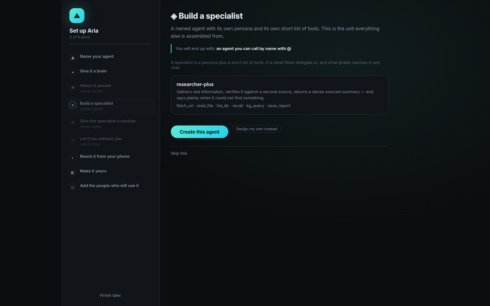
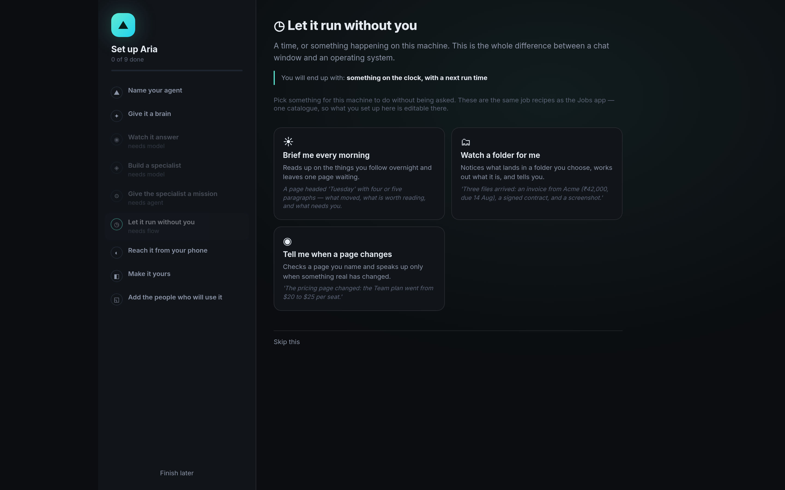

# Getting Started

This walks you from a fresh launch to giving the agent real work.

---

## 1. Launch

```bash
uv run agentos
```

The desktop opens at **http://127.0.0.1:8321**, and on a fresh install it opens onto
**setup** — nine steps down the left, one at a time on the right.


It is not a settings form with a progress bar. Every step **produces something real** and
shows it happening, and every step says what you will end up with before it asks you for
anything:

| Step | What exists afterwards |
|---|---|
| Name your agent | the name on the menu bar and in every reply |
| Give it a brain | a model this machine can actually reach |
| Watch it answer | a real reply, from your model, in front of you |
| Build a specialist | an agent you can call by name with `@` |
| Give it a mission | a flow you can run, and watch run |
| Let it run without you | something on the clock, with a next run time |
| Reach it from your phone | a paired chat that answers as your agent |
| Make it yours | a desktop that looks like your machine |
| Add the people who will use it | an account that can sign in, here and from anywhere |



The scheduling step is the same three job recipes as the **Jobs** app, so what you set up
here is editable there afterwards — and it prints exactly what the job will be allowed to
do before it is saved.



Three things are worth knowing about it:

- **Every step is probed, never remembered.** A step is ticked because the machine has the
  thing, not because this page remembers you clicking. Delete the agent and the step goes
  back to todo. That is what makes it safe to re-run.
- **Re-running is the same screen.** `Settings → Run setup again`, or `bento setup` in a
  terminal, walks the same steps on day 300 and finds most of them already green.
- **Every step can be skipped and says where it lives.** Nothing here is the only way to
  reach a setting.

### Setup is also an app

You do not have to wait for a fresh install to see it. **Setup** is an ordinary app —
in the deck, the start menu and the omnibar — so you can open the arc any time to look
at what a step actually does.


It is the **same arc**, not a preview of it: same catalogue, same probe, same panes,
same buttons. A tour mode that only showed you the steps would be a second
implementation to drift from the real one. That is safe here because re-running setup
is safe by design — it creates, it never wipes, and a step you have already done is
already ticked.

Two things behave differently because a window is not a wizard:

- **Closing it does not mark setup finished.** Otherwise somebody who opened the app
  to look around, on a half-configured machine, would silently never see the first-run
  screen again.
- **`Open it full screen`** hands the arc back to the wizard, on the step you were
  reading. There is only ever one arc alive — every step wires itself by element id,
  so two on screen would be a coin toss over which one your click reached.

`Settings → Setup` offers both: the app, and a full-screen run from the start with
anything you skipped offered again.

### The same arc in a terminal

A headless machine — a Pi over SSH, a server — gets the whole thing, from the same
catalogue and the same probe. Set up half of it in the browser and finish it over SSH; the
right steps are already ticked.

```
$ bento setup

▲ Set up Aria — 2 of 9 done

  ✓  1  Name your agent                   Bento
  ✓  2  Give it a brain                   ollama/qwen2.5
  ○  3  Watch it answer
  ○  4  Build a specialist
  ○  5  Give the specialist a mission     needs agent
  ○  6  Let it run without you            needs flow
  –  7  Reach it from your phone
  ○  8  Make it yours
  ○  9  Add the people who will use it

  next: 3. Watch it answer
  a number to do a step · s<n> to skip one · q to finish
  Step [3]:
```

Already set up but want a clean slate? **Settings → Danger zone → Factory reset** wipes
everything (memory, apps, conversations, settings, soul, accounts) and starts the arc again
— day one, properly.

---

## 2. Choose a model

Open **Settings** and configure a provider:

- **Ollama (local)** — detected automatically if Ollama is running. Nothing leaves your machine.
- **Anthropic**, **OpenAI**, **OpenRouter**, or any **OpenAI-compatible** endpoint — paste a key and
  list the models you want.

Pick the active model from the dropdown at the top of the chat window at any time.

> **Important:** the agent works by calling tools. Use a **tool-capable model** — any `qwen` model
> locally, or a cloud model. Small models like `gemma` often won't call tools reliably, so tasks may
> stop early or produce nothing.

---

## 3. Set your autonomy level

Also in the chat toolbar (and Settings):

| Level | Behavior |
|---|---|
| **Paranoid** / **Balanced** | read-only actions run automatically; anything that changes the system asks for approval first |
| **Full** | everything runs without prompting (destructive commands stay blocked either way) |

Start on **Balanced**. You approve risky actions with one click when they come up. See
[The Agent → Safety](agent.md#safety) for the full model.

---

## 4. Give it work

Type in **Agent Chat**, or press **Alt+Space** (or **Ctrl+Space**) anywhere to open the command
palette and either launch an app or send a request straight to the agent.

Things to try:

- *"How is this machine doing? Check CPU, memory, and disk."*
- *"What's taking up the most space in my home folder?"*
- *"Create a project folder with a starter README in my workspace."*
- *"Summarize today's top technology news and save it as a report."*
- *"Build me a pomodoro timer and pin it to the desktop."*
- *"Every morning at 9, check disk space and message me on Telegram if it's low."*
- *"Remember that I prefer concise answers."*

The agent will use its tools, show you what it's doing, ask approval where needed, and report the
real result.

---

## 5. Explore the desktop

- **Start menu / dock** — launch any built-in app.
- **Applications ()** — launch any installed program on your computer.
- **Store ()** — install ready-made apps in one click, add tool channels, or build a new app
  with AI.
- **Quick Settings ()** — sound, network, battery, and shortcuts to native settings.
- **Files ()** — browse your workspace; click a file to open it in your system browser.
- **Terminal ()** — a real shell on your machine.

See [The Desktop](desktop.md) for everything.

---

## 6. Make it permanent (optional)

```bash
uv run agentos install
```

Adds a menu entry, starts AgentOS at boot, and opens it automatically at login. Log out and back in
to see it come up on its own. See [Installation](installation.md).

---

## A note on results

The agent is instructed to **finish tasks** — to turn research and analysis into a concrete
deliverable (a report file, a created project, a scheduled job), not stop halfway. If a run ever
ends early, it's almost always the model: switch to a stronger/tool-capable one and retry.
