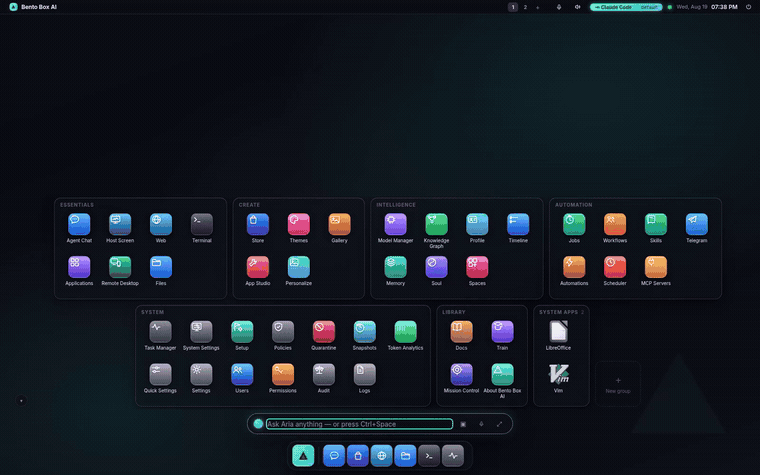

# Bento Box AI — نظام تشغيل وكيلي محلي أولاً

<p align="right"><sub>
<a href="../../README.md">English</a> ·
<a href="README.zh-CN.md">简体中文</a> ·
<a href="README.zh-TW.md">繁體中文</a> ·
<a href="README.ja.md">日本語</a> ·
<a href="README.ko.md">한국어</a> ·
<a href="README.es.md">Español</a> ·
<a href="README.pt-BR.md">Português&nbsp;(BR)</a> ·
<a href="README.fr.md">Français</a> ·
<a href="README.de.md">Deutsch</a> ·
<a href="README.ru.md">Русский</a> ·
<a href="README.hi.md">हिन्दी</a> ·
<b>العربية</b>
</sub></p>

<div dir="rtl" align="right">

**جهازك، وله عقل.** إن Bento Box AI هو **بيئة سطح مكتب بالذكاء الاصطناعي** ذاتية الاستضافة: سطح
مكتب كامل — نوافذ، تطبيقات، ملفات، طرفية — يقوده **وكيل ذكاء اصطناعي مستقل** يتخذ **إجراءات
حقيقية** على حاسوبك. استخدم النماذج المحلية عبر [Ollama](https://ollama.com) لخصوصية تامة، أو
النماذج السحابية (Anthropic Claude، أو OpenAI، أو OpenRouter، أو أي نقطة نهاية متوافقة مع OpenAI) — دائمًا
بموافقتك. يستطيع الوكيل أن يتصفّح، وأن يبني تطبيقاته الخاصة، وأن يجدول المهام، وأن يتذكّر ما يتعلّمه،
وأن يوسّع شيفرته المصدرية بنفسه، وأن يصل إليك على Telegram أو WhatsApp.


يعمل على `http://127.0.0.1:8321` — خاص افتراضيًا، وقابل للتثبيت كخدمة تعمل عند الإقلاع.

```bash
curl -fsSL https://raw.githubusercontent.com/contact9prime-lab/bento-ai-os/master/install.sh | sh
```



<sub>▶ [شاهد المقطع الكامل (MP4)](../screenshots/demo.mp4) — دور حقيقي أُجيب عنه على الجهاز؛ رد المحادثة أعلاه هو الوكيل الحي، وليس نموذجًا تمثيليًا.</sub>


**التوثيق الكامل موجود في [`docs/`](../README.md)** — التثبيت، ودليل المستخدم لسطح المكتب
ولكل تطبيق، والوكيل وأدواته، وبناء التطبيقات، والتكاملات، ومرجع الـ API،
واستكشاف الأعطال وإصلاحها.

---

## الإعداد تسع خطوات، وكل خطوة تترك أثرًا خلفها

ليس نموذج إعدادات يعلوه شريط تقدّم. كل خطوة **تُنتج شيئًا حقيقيًا** — نموذجًا
يجيب، ووكيلًا يوجد، وتدفّقًا يعمل، وجدولة تنطلق — وتخبرك بما ستحصل عليه في النهاية
قبل أن تطلب منك أي شيء.


كل خطوة **تُفحص، ولا تُحفظ**: تُعلَّم لأن الجهاز يملك الشيء فعلًا.
احذف الوكيل فتعود الخطوة إلى قائمة المهام. وهذا ما يجعل إعادة التشغيل آمنة — وإعادة
التشغيل أمر معتاد هنا، لأن **الإعداد نفسه تطبيق**. افتحه في أي وقت لترى
ما تفعله خطوة ما، على جهاز أعددته قبل أشهر.


نفس الكتالوج، ونفس الفحص، ونفس اللوحات — بما في ذلك في الطرفية، حيث يلتقط `bento setup` عبر
SSH الأمور من حيث تركها المتصفح تمامًا.

---

## أول ما يسألك عنه هو أيّ مهمة تريد إنجازها

ينتهي الإعداد بسؤال، لا بباب: **أعطني مهمة.** اختر واحدة من ثلاث، وأجب عن سؤالين،
ويصبح هذا الجهاز يفعل شيئًا من أجلك قبل أن تفتح أي تطبيق واحد.


| | |
|---|---|
| **أطلعني كل صباح** | يطالع الأشياء التي تتابعها ليلًا ويترك صفحة واحدة بانتظارك |
| **راقب مجلدًا من أجلي** | يلاحظ ما يصل إلى مجلد *تختاره أنت*، ويستنتج ما هو، ويخبرك |
| **أخبرني عندما تتغير صفحة** | يفحص صفحة ولا يتكلم إلا عندما يتغيّر فيها شيء حقيقي |

شيئان لن يفعلهما. لن يمنح نفسه أي شيء لم تره: تطبع اللوحة
الأذونات بالضبط قبل أن تضغط الزر، محسوبةً بنفس الشيفرة التي تكتبها —
"يقرأ `~/Downloads/*`، ولا شيء سواه". ولن يعرض عليك وسيلة للوصول إليك لا
تعمل: فحساب Telegram غير المقترن يظهر باهتًا مع الجملة التي تصلحه، لا يُخفى أبدًا
ولا يُستبدَل بهدوء أبدًا.

الزر الأخير هو **"شغّله الآن، لكي أراه يعمل"** — لأن جدولة لم ترها
تنطلق ما هي إلا وعد، وليس لدى مستخدم جديد سبب ليصدّق وعدًا.

المهمة *تدفّق*، وليست نوعًا جديدًا من الأشياء: نفس المجدول، ونفس بوابة الأذونات، ونفس سجل
التدقيق. على جهاز بلا شاشة: `bento job recipes`، ثم `bento job add morning-brief --topics "…"`.

---

## ثلاثة وجوه، برنامج واحد

يعمل Bento في ثلاثة أماكن، و**كل ميزة تُبنى للثلاثة جميعًا**. هذا هو أول
سؤال يُطرح على أي تغيير، لا آخره.

| | ما هو | ابدأه بـ |
|---|---|---|
| **GUI** | نافذة (أو علامة تبويب) على macOS أو Windows أو Linux. لا شيء إضافي للتثبيت | `bento` |
| **TUI** | نظام التشغيل بأكمله في طرفية — لخادم، أو Raspberry Pi بلا شاشة عبر SSH | `bento tui` |
| **SUI** | Bento **هو** جلسة Linux لديك: يملك الجهاز | `bento installer` |

> الأمر هو `bento`. لا يزال `agentos` يعمل وسيبقى كذلك دائمًا — فهو موجود في سجل أوامر الناس،
> ووحدات systemd والسكربتات، وإعادة التسمية التي اخترناها لا ينبغي أن تكلّفهم ذلك.

---

## شاهده أثناء العمل

| | |
|---|---|
|  **محادثة الوكيل** — تحدّث إلى جهازك؛ ردود متدفقة، وبطاقات أدوات، وموافقات، وصوت |  **الفريق** — وكلاء فرعيون متخصصون وتدفّقات عمل مرئية، مع مزج للنماذج لكل خطوة |
|  **الوثائق** — الدليل الكامل يعيش داخل نظام التشغيل |  **المتجر** — تطبيقات ومهارات وقنوات أدوات MCP بنقرة واحدة |

### عدة أشخاص، جهاز واحد

أضف حسابًا فيحصل كل شخص على **بيته الخاص** — قاعدة بياناته وذاكرته ووكلائه
وقنواته وخوادم MCP وبيانات اعتماده الخاصة. ليس عمودًا `user_id` تُسرّبه جملة `WHERE`
واحدة منسية: بل دليله الخاص، لأن ملفَّين لا يمكن أن يتسرّبا أحدهما إلى الآخر.


دوران — **منفّذ** (كل شيء داخل بيته الخاص) و**مسؤول** (ذلك، بالإضافة إلى
الجهاز). تبقى الإعدادات مشتركة، فيكون هناك مفتاح مزوّد واحد للجهاز بدلًا من واحد
لكل شخص. تعبر الوكلاء والتطبيقات عمدًا، كنُسخ، عبر مكتبة مشتركة.

وهو **تسجيل دخول واحد، هنا ومن أي مكان**: جهاز فيه حسابات يكون مقفلًا
بها، فالهاتف في جيب أحدهم يستخدم نفس اسم المستخدم وكلمة المرور مثل سطح المكتب
ويصل إلى بيته الخاص. لا عبارة سر مشتركة ثانية لاختراعها أو مشاركتها أو نسيانها.


### يمكنك أن ترى ما يفعله


الدور في معظمه انتظار، و"يعمل…" لمدة أربع دقائق لا يخبرك بشيء — فنموذج يفكّر
ودورٌ مات بصمت يبدوان متطابقين تحتها. كل سطح انتظار يقول **بماذا هو
مشغول ولكم من الوقت**: الاستدعاء الجاري يتقدّم عمره في مكانه (`running · 2m 14s`)، والاستدعاءات المنتهية تحتفظ
بمدتها، والسطر الذي تحتها يحمل الخطوة وإجمالي الدور. تظهر نفس الجملة
على فقاعة الحضور وشريط الأوامر الشامل، فتكون قابلة للإجابة من سطح المكتب دون
فتح المحادثة.

### يستطيع أن يبني فريقه الخاص — ويسأل قبل أن يفعل


عندما لا يناسب أي متخصص موجود، يقوم الوكيل بـ**بناء واحد** ويفوّض إليه. تعريف وكيل
لا يمنحه شيئًا؛ في أول مرة يُستخدم فيها فعلًا تحصل على بطاقة تسمّي النموذج الذي يعمل عليه،
وميزانيته، والأدوات والمهارات بالضبط التي يمنحها له تعريفه — لأن الموافقة على فاعل
لا تستطيع تصوّره هي موافقة بالاسم فقط. الموافقة على `researcher` ليست موافقة على `deploy-bot`،
والمنحة قابلة للإلغاء في الأذونات مثل أي منحة أخرى. [كيف يعمل ←](../security.md)

### يجيب عن الأسئلة حول نفسه من دليله الخاص


الدليل موجود في فهرس الاسترجاع، لذا فإن "كيف أمنع تطبيقًا من الوصول إلى الإنترنت مع إبقائه
يعمل؟" يُجاب عنه من **هذه الصفحات**، لا من ذاكرة نموذج عن مشروع مختلف — وينصّ
الرد على الصفحة التي استخدمها. إنه استرجاع وكيلي وليس بحثًا بضربة واحدة: الوكيل
يبحث، ويقرأ، ويبحث ثانيةً حين تخفق المحاولة الأولى.

### نوافذ تتصرّف كنوافذ


تُفتح النافذة **حيث تركتها** — الموضع والحجم محفوظان لكل تطبيق — والنافذة
التي تُفتح لأول مرة تتتالى بأكثر من شريط عنوان، فتبقى التي تحتها
مقروءة. تحمل النافذة المركّز عليها حلقة تمييز والظل الكامل؛ والأخريات ينحسرن. الرمز ✦
في شريط العنوان هو الوكيل *داخل ذلك التطبيق*: اسأله عمّا على الشاشة دون مغادرته.

### خمس لغات تصميم، لا خمس لوحات ألوان


**Bento · Liquid Glass · Spatial · Claymorphism · Minimalism.** كلٌّ منها يعيد قصّ القشرة كاملة —
الأسطح، والانحناءات، والارتفاع، والتمويه، والخط — وتأتي بخلفيتها الخاصة. تُشحن الخلفيات بصيغة SVG:
بضعة كيلوبايت لكل واحدة، حادة من هاتف إلى لوحة 4K. [المزيد ←](../desktop.md#themes)

الزجاج أغلى شيء يمكن لسطح مكتب أن يرسمه، والتكلفة تتراكم مع كل نافذة
تفتحها. **السمات ← التأثيرات** تقيس جهازك وتخفّض التكلفة فقط إذا اضطرّت — خمس نوافذ
بسمة Liquid Glass انتقلت من 6.5 إطارًا في الثانية إلى 27 (مخفّضة) أو 60 (مُطفأة).

### يصل إليك حيث أنت أصلًا


**Telegram وWhatsApp قناتان أصيلتان** — نفس المحادثة، ونفس الذاكرة، ونفس
الأدوات ونفس أزرار الموافقة كما على المكتب. ليس جسر إشعارات: فردٌ من
هاتفك يواصل الخيط الذي بدأته هذا الصباح.

لدى WhatsApp **ناقلان**، ويفشلان في اتجاهين متعاكسين. Cloud API من Meta
رسمي لكنه يحتاج إلى حساب مطوّر و webhook عام، وخارج نطاق 24 ساعة من آخر
رسالة لك لن يحمل ردًا حرّ الصياغة إطلاقًا — تقول البطاقة ما إذا كانت تلك النافذة مفتوحة،
والإرسال الذي لا يمكن أن يمر يقول ذلك وكيف يُصلَح، والمهمة المجدولة تحفظ تقريرها أولًا
كي لا يضيع شيء. ارتباط WhatsApp Web لا يحتاج إلا إلى مسح رمز QR وليس فيه نافذة 24 ساعة، لكنه
**غير رسمي** ويقول Bento ذلك على بطاقة التثبيت قبل أن يُنزّل أي شيء. [الإعداد ←](../whatsapp.md)

Telegram هو أيضًا **وحدة تحكّم مسؤول**: `/agents`، و`/run`، و`/flows`، و`/model`، و`/logs`، و`/perms` —
للمالك فقط، وكل أمر *يفعل* شيئًا يمر عبر نفس بوابة الأذونات ونفس
أزرار الموافقة مثل سطح المكتب، فلا يكون أبدًا مدخلًا أرخص. [الأوامر ←](../integrations.md)

### سطح مكتب واحد، لكل شاشة


هاتف، جهاز لوحي، محطة عمل — نفس سطح المكتب، يتكيّف. تصبح النوافذ أوراقًا ملء الشاشة، والرصيف
يمتد على الحافة السفلية، وتصبح النوافذ المنبثقة أوراقًا. شغّل **الوصول عن بُعد** وصِل إليه من هاتفك
عبر شبكتك، خلف عبارة سر؛ *إضافة إلى الشاشة الرئيسية* يجعله تطبيقًا بملء الشاشة.
[الوصول عن بُعد ←](../remote-access.md) · [التخطيط المتجاوب ←](../desktop.md#phone-tablet-desktop)

### يستطيع *أن يكون* سطح المكتب، لا أن يعيش على واحد فقط


سجّل الدخول واحصل على Bento كجلسة Linux لديك. يُرسم سطح المكتب كـ**سطح طبقة Wayland على
طبقة الخلفية**، فتكون نوافذ التطبيقات الأصيلة فوقه في ترتيب التكديس الطبيعي — لا لأن
شيئًا يُرفع أو يُخفض، بل لأن هذا هو معنى "الخلفية". يجلس شريط القوائم والرصيف
في نطاقات **محجوزة مع المؤلِّف (compositor)**، بنفس الآلية التي تستخدمها لوحة GNOME أو KDE، فيتوقّف
تطبيق ملء الشاشة عند حوافهما بدلًا من ابتلاعهما.


إدارة نوافذ كاملة للتطبيقات الأصيلة: التثبيت في أنصاف وأرباع، والتبليط، والتعويم، والتخطيطات، وتغيير الحجم
بلوحة المفاتيح، وأسطح العمل، والتصغير، ومبدّل Alt-Tab — مع شريط المهام وشريط القوائم يتتبّعان
أي تطبيق يملك التركيز. [واجهة الجلسة ←](../session-ui.md)

### ثبّت التطبيقات، من داخل Bento


سطح مكتب لا تستطيع تثبيت البرامج عليه ما هو إلا عرض تجريبي. *التطبيقات ← احصل على تطبيقات…* تبحث في كتالوج
الجهاز الخاص — AppStream أو Flatpak أو apt — وتُريك الأمر بالضبط قبل تشغيله. يُفضَّل Flatpak
حيثما وُجد لأن التثبيت لكل مستخدم لا يحتاج إلى كلمة مرور إطلاقًا. لا يعكس Bento
شيئًا ولا يحزم شيئًا؛ إنه يسأل مدير الحزم الذي تملكه أصلًا.

### شاشتك الحقيقية، على هاتفك، في المتصفح


**الوصول عن بُعد** يرسل إليك قشرة Bento، وهي HTML وتنتقل تمامًا — لكن التطبيق الأصيل
هو بكسلات على شاشة الجهاز نفسها ولم يكن قط جزءًا من الصفحة. **سطح المكتب البعيد** يسدّ
تلك الثغرة: يعيد Bento بثّ الشاشة عبر اتصاله *الخاص* المصادَق عليه، فتحصل على سطح المكتب الحقيقي،
قابلًا للنقر، دون تطبيق VNC لتثبيته على الهاتف.

الشكل هو المقصد — يبقى خادم VNC على `127.0.0.1` ولا يقترب أبدًا من الشبكة؛ وما
يحميه هو عبارة السر التي تستخدمها أصلًا. [الوصول عن بُعد ←](../remote-access.md)

### الأتمتة والزوايا الساخنة


سمِّ تسلسلًا مرة واحدة — افتح هذه التطبيقات، بدّل السمة، شغّل شيفرة Python هذه، استدعِ أداة MCP تلك، ضع
الوكيل على مهمة — وشغّله إلى الأبد بعد ذلك من شريط الأوامر، أو زاوية ساخنة، أو جدولة، أو
بطلبه بالاسم. [المزيد ←](../desktop.md#automations)

---

## لماذا Bento Box AI

- **سطح مكتب حقيقي، لا صندوق دردشة** — نوافذ قابلة للسحب، وشريط مهام، وأسطح مكتب افتراضية، وأدوات مصغّرة،
  وسمات، ولوحة أوامر، وأكثر من 25 تطبيقًا مدمجًا.
- **وكيل له أيدٍ** — أوامر صدفة (shell)، وإدارة ملفات، وبحث على الويب، وإشعارات سطح مكتب،
  ومهام مجدولة، وتقارير HTML، وبناء تطبيقات، كل ذلك بلغة بسيطة.
- **محلي أولًا وخاص** — كل شيء يمكن أن يعمل على عتادك مع Ollama؛ لا شيء يغادر
  جهازك ما لم تُضِف مفتاحًا سحابيًا. يرتبط بـ localhost فقط، حتى تُشغّل عمدًا
  [الوصول عن بُعد](../remote-access.md) المحمي بعبارة سر.
- **دورة الحياة كاملة تحت سقف واحد** — **تدريب · اختبار · تشغيل · بناء · شحن · إدارة**، حيّة
  على شاشة واحدة (مركز التحكم): اضبط نماذجك الخاصة بدقة على وحدة معالجة الرسومات لديك، واختبر بوابة كل
  تعديل ذاتي، وشغّل مهامًا مجدولة، وابنِ تطبيقات، واشحنها إلى GitHub.
- **موسّع لذاته** — يبني الوكيل تطبيقات واجهة مستخدم جديدة لنفسه (App Studio)، ويثبّت مهارات وخوادم أدوات
  MCP، ويستطيع تعديل شيفرة Bento المصدرية الخاصة (مع لقطات تلقائية ومجموعة اختبارات
  يجب أن تنجح قبل إعادة التشغيل).
- **ذاكرة تتراكم** — ذاكرة من طبقتين، ورسم بياني معرفي حي، و"روح" دائمة،
  تُتعلَّم تلقائيًا بعد كل محادثة.
- **آمن بحكم التصميم** — مستويات استقلالية، ومطالبات موافقة، وسياسات سماح/رفض، وصندوق رملي للمجلدات
  بـ bubblewrap، وأوامر مدمِّرة محظورة بشدة، ونقاط استعادة بنقرة واحدة.

---

## بداية سريعة

**أمر واحد، على macOS أو Linux.** يثبّت كل شيء — بما في ذلك Python، عبر `uv` — ويبدأ
Bento، ثم *يثبت أنه يعمل* بسؤال الخادم العامل سؤالًا قبل أن يقول "تم".

```bash
curl -fsSL https://raw.githubusercontent.com/contact9prime-lab/bento-ai-os/master/install.sh | sh
```

ثم افتح **http://127.0.0.1:8321**، أو شغّل `bento setup` لنفس الخطوات التسع في طرفية.

يترك أمر `bento` على `PATH` لديك (في `~/.local/bin`، يُضاف إلى ملف تعريف الصدفة إذا لم
يكن هناك — افتح طرفية جديدة بعد ذلك).

### تثبيته على عنوان ومنفذ مختارين

على خادم تصل إليه عبر SSH، فإن `127.0.0.1:8321` يعني "لا يصل إليه أحد". أعطِ
المثبّت عبارة سر وعنوانًا فيأتي جاهزًا، مع خدمة الإقلاع موجّهة أصلًا
نحو المنفذ الصحيح:

```bash
curl -fsSL https://raw.githubusercontent.com/contact9prime-lab/bento-ai-os/master/install.sh \
  | sh -s -- --passphrase='something long and unguessable' --bind=0.0.0.0 --port=8080
```

يجيب ذلك الجهاز الآن على **كل** واجهة على المنفذ 8080، ويطلب عبارة السر تلك
قبل أن يفعل أي شيء. الاستخدام المحلي عبر `127.0.0.1:8080` لم يتغيّر.

يخبرك المثبّت بأيّ الحالتين تركك عليها — `AgentOS is running` فقط عندما يكون هناك شيء
يستمع فعلًا. على جهاز بلا مدير خدمة متاح (حاوية، أو توزيعة بلا systemd،
أو SSH بلا D-Bus مستخدم) يقول ذلك بدلًا من ذلك، و`bento service start` يُتمّ المهمة.

واجهة واحدة بدلًا من كلها — VLAN خاصة، أو عنوان Tailscale:

```bash
curl -fsSL https://raw.githubusercontent.com/contact9prime-lab/bento-ai-os/master/install.sh \
  | sh -s -- --passphrase='something long and unguessable' --bind=192.168.1.20 --port=8080
```

مجرّد منفذ مختلف، ولا يزال loopback فقط:

```bash
curl -fsSL https://raw.githubusercontent.com/contact9prime-lab/bento-ai-os/master/install.sh \
  | sh -s -- --port=8080
```

> **`-s --` ليست اختيارية.** `curl … | sh --port=8080` يسلّم العَلَم إلى `sh`، الذي يرفضه
> — سكربت مُمرَّر عبر الأنبوب لا يحصل على وسائط خاصة به. `-s --` تعني "البقية للسكربت".
> هذه أكثر طريقة شائعة تضيع بها هذه الأعلام، والخطأ يسمّي `sh`، فيُقرأ
> كأنه مثبّت معطوب.

**كل الأعلام:**

| العَلَم | ما يفعله |
|---|---|
| `--passphrase=SECRET` | اطلب هذا لتسجيل الدخول، واسمح بالربط خارج loopback |
| `--bind=ADDR` | أي واجهة للاستماع عليها (الافتراضي `0.0.0.0`)؛ يحتاج إلى `--passphrase` |
| `--port=N` | أي منفذ (الافتراضي `8321`)؛ يُحفظ في الإعدادات، فتستخدمه خدمة الإقلاع |
| `--yes` | أجب بنعم على كل مكوّن اختياري |
| `--no-service` | لا مُشغِّل ولا خدمة إقلاع (الحاويات، CI) |
| `--no-verify` | تخطَّ خطوة "إثبات أنه يعمل" |

### تغييره بعد ذلك

كل ما سبق يعيش في **`~/.agentos/config.json`** (أو تحت `$AGENTOS_HOME`)، و
`bento config` يقرؤه ويكتبه دون أن تضطر إلى العثور عليه:

```bash
bento config                       # the whole file, secrets masked
bento config port                  # one setting
bento config port 8080             # change it
bento config remote.bind 0.0.0.0   # dotted paths for nested settings
bento config --path                # where the file is
bento config --edit                # open it in $EDITOR — refuses to save invalid JSON
```

`bento remote` هو نفس الإعدادات مع تجميع تلك المتعلقة بإمكانية الوصول معًا:

```bash
bento remote --on --passphrase 'something long' --bind 0.0.0.0   # the address
bento remote --port 8080                                          # the port
bento remote                                                      # what it is now
```

**تغيير المنفذ لا يصل إلى خدمة إقلاع مثبّتة من تلقاء نفسه** — فوحدة systemd
وLaunchAgent تخبزانه داخل `ExecStart`. يخبرك كلا الأمرين متى ينطبق ذلك:

```bash
bento service install && bento service restart
```

> **قابلية الوصول من أجهزة أخرى خيار متعمّد، لا افتراضي.** يستمع Bento على
> `127.0.0.1` فقط حتى تعطيه عبارة سر، لأن للوكيل صدفة حقيقية — منفذ
> مفتوح هنا هو صدفة مفتوحة. `--bind` وحده يُرفض لهذا السبب، وكذلك
> `bento serve --host 0.0.0.0` مع إيقاف الوصول عن بُعد.

**عن المنافذ دون 1024.** تُرفض لعملية غير جذرية على Linux، وعلى macOS يكون
الرفض لكل عنوان — يمنح `0.0.0.0:80` ويرفض `127.0.0.1:80`. فلا شيء هنا
يخمّن من الرقم: `--port` يحاول الربط الحقيقي، وإذا قالت النواة لا، طبع
سطر `sysctl`، أو قاعدة إعادة التوجيه، أو خيار البروكسي الذي يصلحه. على Linux، المنفذ 80 يعني عادةً
أمرًا واحدًا:

```bash
echo 'net.ipv4.ip_unprivileged_port_start=80' | sudo tee /etc/sysctl.d/50-agentos.conf
sudo sysctl --system
```

تشغيل الخادم كجذر (root) ليس منصوحًا به — فللوكيل صدفة حقيقية.

<details>
<summary><b>من نسخة git بدلًا من ذلك</b></summary>

```bash
uv sync                 # install dependencies (or: pip install -e .)
uv run bento            # start the server and open the desktop in your browser
```
</details>

<details>
<summary><b>في Docker</b></summary>

```bash
docker build -t bento .
docker run -d --name bento -p 8321:8321 -v bento-data:/data \
  -e AGENTOS_PASSPHRASE='something long and unguessable' bento
```

يتعيّن على الحاوية أن تربط `0.0.0.0` لتكون قابلة للوصول أصلًا، فتكون عبارة السر مطلوبة لا
اختيارية — تُرفض نقطة الدخول أن تبدأ غير قابلة للوصول *أو* غير آمنة وتخبرك بأيهما.
كل ما قد يضيع يعيش في وحدة تخزين `/data`. ابنِ فرعًا محددًا بـ
`--build-arg SOURCE=git --build-arg REF=my-branch`.
</details>

إذا كان **Ollama** يعمل، فسيتم التقاط نماذجك المحلية تلقائيًا. أضف مفاتيح API السحابية تحت
**الإعدادات** إذا أردتها. هذا هو الإعداد كله.

> **نصيحة:** البناءات، واستدعاء الأدوات، والمهام متعددة الخطوات أكثر موثوقية بكثير مع **نموذج
> قادر على الأدوات** (أي نموذج `qwen*`، أو نموذج سحابي). النماذج المحلية الأضعف مثل `gemma` لن
> تستدعي الأدوات بموثوقية.

---

## شغّله كسطح مكتب Linux لديك (SUI)

```bash
uv run bento installer      # detects your distro, installs what's missing, adds it to the login screen
```

ثم سجّل الخروج واختر **Bento Box AI** في شاشة تسجيل الدخول. سطح مكتبك الحالي لم يُمَس —
العودة إليه هي تسجيل الخروج واختيار Ubuntu مجددًا.

يكتشف المثبّت التوزيعة، ويسمّي كل حزمة يريدها ولماذا، ويسأل قبل
تثبيت أي شيء. مجموعتان: محرّك المؤلِّف (sway وأصدقاؤه، MIT)، وسطح المكتب الأصيل
(`python3-gi`، و`python3-gi-cairo`، وgtk-layer-shell، وWebKitGTK) الذي يجعل سطح المكتب
سطح Wayland حقيقيًا بدلًا من نافذة متصفح.

**لا يشحن Bento أيًّا منها ولا يعيد توزيعها.** gtk-layer-shell هو MIT، لكن GTK وPyGObject و
WebKitGTK هي LGPL، وما *يعتمد* عليه هذا المشروع يبقى متساهلًا — فهي مطلوبة، مع
الرخص في مرأى العين. من دونها لا تزال الجلسة تعمل، راسمةً سطح المكتب في نافذة Chromium.
[الترخيص ←](../licensing.md) · [واجهة الجلسة ←](../session-ui.md)

إذا أساء أي شيء متعلق بسطح المكتب التصرّف، أمر واحد يخبرك بالسبب:

```bash
uv run bento doctor --session   # probes what can actually draw on THIS machine, and says so
```

يفحص المفسّر، وعرض GTK، ودعم المؤلِّف لـ layer-shell، وما إذا كان WebKit
يستطيع الرسم *وأن يواصل الرسم* — في نافذة وعلى سطح طبقة — ثم يعطي حكمًا. تُشغَّل الفحوص
في عمليات فرعية، لأن الأعطال التي تبحث عنها هي إجهاضات وأخطاء تجزئة، وفحص
يعطّل الطبيب لا يستطيع الإبلاغ عن أنه تعطّل.

---

## التثبيت كحزمة Debian/Ubuntu (.deb)

حزمة `.deb` مكتفية ذاتيًا (تحزم التطبيق **و**بيئة Python افتراضية بكل الاعتماديات — لا حاجة إلى
شبكة عند التثبيت):

```bash
./packaging/build-deb.sh                                   # → packaging/dist/agentos_<ver>_<arch>.deb
sudo dpkg -i packaging/dist/agentos_0.1.0_amd64.deb        # installs to /opt/agentos + launcher + service
systemctl --user enable --now agentos                      # start at login (per user)
bento app                                                  # or launch it from your menu
```

يتولّى `apt`/`dpkg` التحديثات والإزالة. **يوصي** بـ `bubblewrap` (صندوق رملي) و`xdg-utils`،
و**يقترح** `ollama`، و`nodejs`، و`git`. حزمة سطح المكتب **تقترح** إضافةً
حزمة واجهة الجلسة و`wayvnc`/`novnc` — مقترحة لا معتمَدة عليها، لأن apt يثبّت
التوصيات افتراضيًا وذلك سيكون حزمًا باسم أنعم.

## التثبيت كتطبيق حقيقي (بدء تلقائي عند الإقلاع) — من المصدر

```bash
uv run bento install      # app launcher + a background service that starts at login/boot
```

تُستخدم الآلية الأصيلة الصحيحة تلقائيًا: مُشغِّل `.desktop` مع **خدمة مستخدم
systemd** على Linux (مع linger، فتبدأ عند الإقلاع)، وحزمة تطبيق مع **LaunchAgents** على
macOS، واختصار قائمة ابدأ مع **مدخلات بدء التشغيل** على Windows.

مجموعة أوامر واحدة تقود الثلاثة — لا ينبغي أن تضطر إلى معرفة ما إذا كان هذا الجهاز
يستخدم systemd أو launchd للتحكّم في وكيلك الخاص:

```bash
bento service status       # is it running, will it come back at boot, is the port answering
bento service start        # …stop, restart
bento service logs -f      # journalctl or the log file, whichever this machine uses
bento service uninstall    # remove the background service only — launcher and data stay
bento uninstall            # remove launcher + service (your data stays)
bento app                  # open as a chromeless desktop window any time
```

يُبلّغ `bento service status` عمّا يعتقده المشرف **و**ما إذا كان المنفذ
يجيب، بشكل منفصل: وحدة "نشطة" بينما لا شيء يستمع هي حلقة
تعطّل، وتلك هي الحالة الجديرة بأن تكون قادرًا على رؤيتها.

---

## أوضاع الإطلاق

| الأمر | ما يفعله |
|---|---|
| `uv run bento` | ابدأ الخادم **و**افتح سطح المكتب في متصفحك |
| `uv run bento serve --no-browser --port 8321` | خادم بلا شاشة (تستخدمه خدمة الإقلاع) |
| `uv run bento app` | افتح سطح المكتب كنافذة بإحساس أصيل |
| `uv run bento tui` | نظام التشغيل بأكمله في طرفية (**TUI**) |
| `uv run bento installer` | اكتشف هذه التوزيعة وأعدّ جلسة Linux (**SUI**) |
| `uv run bento doctor` / `doctor --session` | فحص البيئة / ما يمكنه رسم سطح المكتب هنا |
| `uv run bento service status \| start \| stop \| restart \| logs \| uninstall` | الخادم في الخلفية، على أي مشرف يملكه نظام التشغيل هذا |
| `uv run bento update` / `update --apply` | تحقّق من إصدار أحدث / اسحب، وزامن، واختبر، وأعد التشغيل |
| `uv run bento config [key] [value]` | اقرأ أو غيّر `~/.agentos/config.json` (`--edit`، `--path`) |
| `uv run bento remote --port 8080 --bind 0.0.0.0` | العنوان الذي يجيب عليه، محفوظًا في الإعدادات |
| `uv run bento serve --if-running open\|port\|restart\|fail` | ماذا تفعل حين يكون هناك واحد يعمل أصلًا (الافتراضي: اسأل) |
| `uv run bento apps search \| install \| remove` | التطبيقات الأصيلة، من طرفية |
| `uv run bento remote --on --passphrase '…'` | صِل إلى سطح المكتب هذا من هاتفك |
| `uv run bento remote-desktop --on` | سطح المكتب البعيد في المتصفح (شاشة حقيقية، تطبيقات أصيلة) |
| `uv run bento ask "…"` | تشغيل وكيل بضربة واحدة في الطرفية (`--full`، `--model …`) |

---

## المتطلّبات

- **Python ≥ 3.10** و[**uv**](https://docs.astral.sh/uv/) (أو pip).
- **مزوّد نموذج** — إمّا [Ollama](https://ollama.com) محليًا (مُوصى به: نموذج قادر على
  الأدوات مثل `qwen3.5:9b`)، أو مفتاح API سحابي.

اختيارية، تفتح ميزات إضافية عند وجودها — `bento installer` يعرض كلًّا منها مع رخصتها:

- **جلسة Linux (SUI)** — `sway` وأصدقاؤه، بالإضافة إلى `python3-gi`، و`python3-gi-cairo`،
  و`gir1.2-gtklayershell-0.1`، و`gir1.2-webkit2-4.1`. [التفاصيل ←](../session-ui.md)
- **wayvnc + novnc** — سطح المكتب البعيد من متصفح هاتف، مُعاد بثّه على loopback.
- **bubblewrap** (`bwrap`) — **الصندوق الرملي** للمجلدات الذي يحبس الوكيل والطرفية في مجلد واحد.
- **Node/npx** و/أو **uvx** — لتشغيل **خوادم MCP** (Playwright، والملفات، وgit، …).
- **git** — لتثبيت **المهارات** من المستودعات.

---

## سطح المكتب

- **النوافذ** — يُفتح كل تطبيق في نافذة قابلة للسحب وتغيير الحجم مع تصغير/تكبير/إغلاق
  وترتيب z. **شريط مهام** يتتبّع النوافذ المفتوحة؛ و**قائمة ابدأ** تُطلق كل شيء.
- **نوافذ تنام** — نافذة لا تستطيع رؤيتها تتوقف عن العمل الدوري وتُحدّث في
  اللحظة التي تعود فيها. ستة تطبيقات مفتوحة وكلها مصغّرة انتقلت من 25 طلبًا لكل 10 ثوانٍ إلى 2.
- **أسطح مكتب افتراضية** — مُبدّل صفحات في شريط المهام؛ `Ctrl+1..6` للتبديل، انقر بالزر الأيمن لنقل نافذة إليها.
  الأدوات المصغّرة لكل سطح مكتب، فكلٌّ فضاؤه الخاص.
- **الأدوات المصغّرة** — ثبّت أي تطبيق كبلاطة حية بلا إطار؛ اسحب، وغيّر الحجم، وتُستعاد عند بدء التشغيل.
- **لوحة الأوامر** — `Ctrl+Space` (أو `Ctrl+K`) لإطلاق ضبابي لأي تطبيق أو إجراء، أو
  "اسأل Aria …" للإرسال مباشرةً إلى الوكيل. `Ctrl+Alt+T` يفتح طرفية.
- **المظهر والإحساس** — خلفيات مولّدة بالذكاء الاصطناعي مع معرض محلي، وحركة تفكير أثناء عمل
  الوكيل، وصوت اختياري. الصق الصور مباشرةً في المحادثة للنماذج القادرة على الرؤية.

### التطبيقات المدمجة

| التطبيق | ما هو |
|---|---|
| **محادثة الوكيل** | تحدّث إلى الوكيل؛ تدفّق، وبطاقات أدوات، وموافقات، وصوت، ولصق صور |
| **التطبيقات** | كل تطبيق سطح مكتب مثبّت — أطلقها، أو ثبّت جديدة |
| **سطح المكتب البعيد** | شاشة الجهاز الحقيقية، قابلة للنقر، من هنا أو من هاتف |
| **شاشة المضيف** | لقطة ثابتة متجدّدة للشاشة الحقيقية، بما في ذلك نوافذ التطبيقات الأصيلة |
| **الويب** | يفتح الروابط في **متصفح نظامك الحقيقي** (مواقع كاملة، وتسجيلات دخول، وإضافات) |
| **الملفات** | تصفّح مساحة العمل؛ انقر ملفًا لفتحه في متصفح/تطبيق مضيفك |
| **الطرفية** | صدفة مضيف حقيقية (xterm.js عبر PTY)، محبوسة في مجلد الصندوق الرملي |
| **App Studio** | صف تطبيقًا بلغة بسيطة فيبنيه الوكيل **حيًّا** |
| **مدير المهام** | وحدة معالجة مركزية/ذاكرة/قرص حية، وعمليات، ونوافذ مفتوحة (وأيها نائم) |
| **الرسم البياني المعرفي** | ما يعرفه الوكيل، كرسم بياني حي موجَّه بالقوى |
| **الروح** | هوية/شخصية الوكيل الدائمة (تُحقن كل دور) |
| **الذاكرة** | ذاكرة المستخدم والجلسة مع تعلّم تلقائي + استدعاء دلالي |
| **الملف الشخصي** | كل ما يعرفه الوكيل عنك، في مكان واحد |
| **الفريق** | وكلاء فرعيون وتدفّقات عمل مرئية (امزج النماذج لكل خطوة) + قابلية الملاحظة |
| **الوثائق** | هذا الدليل، داخل نظام التشغيل |
| **الأتمتة** | روتينات مسمّاة، وزوايا ساخنة، وباني الخطوات |
| **المهارات** | إجراءات قابلة لإعادة الاستخدام؛ ثبّت من مستودع git أو رابط `.md` خام |
| **خوادم MCP** | اربط خوادم أدوات خارجية من كتالوج |
| **Telegram** | تحكّم في الوكيل من هاتفك؛ قائمة سماح لكل دردشة |
| **السياسات** | قواعد سماح-دائم / رفض-دائم للأدوات والأوامر |
| **السجلات** | كل ما فعله النظام (أدوار، أدوات، MCP، telegram، مهام) |
| **المُجدوِل** | **مهام** خلفية متكررة |
| **اللقطات** | نقاط استعادة لنظام التشغيل بأكمله (الإعدادات، والبيانات، والمصدر) |
| **الإعدادات** | المزوّدون، والنموذج، والاستقلالية، والصوت، والصندوق الرملي، واسم الوكيل |

---

## ما يستطيع الوكيل فعله

للوكيل (الاسم الافتراضي **Aria**) مجموعة أدوات كبيرة ويستطيع قيادة نظام التشغيل بأكمله من المحادثة أو
Telegram:

- **التصرّف على الجهاز** — تشغيل أوامر الصدفة، وقراءة/كتابة الملفات، وجلب الويب، وفتح تطبيقات/ملفات على
  المضيف، وإشعارات سطح المكتب.
- **تسليم النتائج** — `save_report` يكتب تقرير HTML منسّقًا يظهر في الملفات ويُفتح في
  متصفحك، ويستطيع شحن ملخص إلى Telegram. يُوجَّه الوكيل إلى **إنهاء المهمة** — تحويل
  البحث إلى تسليم فعلي، لا التوقّف بعد بحث.
- **بناء نظام التشغيل** — `create_app` يصنع تطبيقات واجهة مستخدم جديدة بأيقونة سطح مكتب؛ و`pin_widget` يضعها على
  سطح المكتب؛ و`add_mcp_server` يربط قنوات أدوات جديدة.
- **النمو** — ذاكرة من طبقتين، ورسم بياني معرفي، و`update_soul` — بالإضافة إلى **التعلّم التلقائي**: تمريرة
  خلفية بعد كل دور تستخرج الذكريات والحقائق بنفسها.
- **الأتمتة** — `schedule_task` يُنشئ **مهامًا** بلا شاشة تُسلَّم إلى تقرير و/أو Telegram.
- **توسيع ذاته** — `read_source` / `develop_agentos` يتيحان له تعديل **شيفرة Bento المصدرية الخاصة**؛
  فيأخذ لقطة تلقائيًا أولًا ويتحقق من الصياغة قبل الكتابة.

اطلب بلغة بسيطة: *"أضف قناة github MCP"، "ابنِ لي متتبّع عادات وثبّته على سطح المكتب
2"، "أبلِغ كل صباح عن اتجاهات وسائل التواصل الاجتماعي إلى Telegram الخاص بي"، "ثبّت inkscape".*

---

## النماذج والمزوّدون

- **Ollama** (محلي) — يُكتشف تلقائيًا؛ لا شيء يغادر جهازك.
- **Anthropic**، و**OpenAI**، و**OpenRouter**، أو أي نقطة نهاية **متوافقة مع OpenAI** (LM Studio، وvLLM،
  وGroq، …).
- **توليد الصور** — نماذج صور Google Gemini أو OpenAI عند ضبط مفتاح، أو بديل مجاني
  خلاف ذلك.

يُلتقط `ANTHROPIC_API_KEY`، و`OPENAI_API_KEY`، و`OPENROUTER_API_KEY`، و`GOOGLE_API_KEY`
تلقائيًا. بدّل النماذج أثناء الطيران من القائمة المنسدلة في نافذة المحادثة.

---

## الأمان

- **مستويات الاستقلالية** — Paranoid / Balanced تشغّلان تلقائيًا الإجراءات للقراءة فقط وتسألان قبل أي شيء
  يعدّل النظام؛ وFull يشغّل كل شيء. الأوامر المدمِّرة **محظورة بشدة** في كل مستوى.
- **السياسات** — قواعد سماح-دائم / رفض-دائم (مع أحرف بدل `*`) تُطابَق مع
  `<tool> <command>`.
- **الصندوق الرملي للمجلدات** — مع bubblewrap، تُحبس أدوات الصدفة/الملفات للوكيل والطرفية في
  مجلد واحد؛ وبقية نظام الملفات للقراءة فقط.
- **اللقطات** — نقاط استعادة؛ يأخذ الوكيل لقطة تلقائيًا قبل تعديل شيفرته الخاصة.
- **خاص افتراضيًا** — يرتبط بـ `127.0.0.1`. الوصول عن بُعد مُطفأ حتى تشغّله بعبارة
  سر، وتثبيت البرامج مرفوض من أي مكان سوى الجهاز نفسه.

---

## Telegram · MCP · قابل للبرمجة

**Telegram** — راسِل @BotFather، والصق الرمز في تطبيق Telegram، وتصبح أول دردشة خاصة
هي المالك. للوكيل كل أدواته هناك؛ والإجراءات الخطرة ترسل أزرار سماح/رفض مضمّنة.

**خوادم MCP** — أضف خوادم أدوات خارجية من الكتالوج (Playwright، والملفات، وجلب، وgit،
وGitHub، وPostgres، وSlack، وبحث، …) أو خادم `stdio`/`http` مخصص. تظهر أدواتها للوكيل
كـ `mcp_<server>_<tool>`، وللتطبيقات المبنية عبر `POST /api/tool`.

**قابل للبرمجة** — `bento ask "…"` للتشغيلات بضربة واحدة؛ وواجهة REST API (`POST /api/chat`، و`GET /api/system`،
و`POST /api/tool`، …)؛ وWebSockets على `/ws` (محادثة متدفقة + موافقات) و`/ws/terminal` (PTY المضيف).
التطبيقات التي تبنيها تعمل في iframe من نفس الأصل وتستطيع استدعاء كل ذلك.

---

## المعمارية

```
agentos/                 # the Python package keeps its original name; see "On the name" below
├── __main__.py    # CLI entry: serve · app · installer · doctor · apps · remote-desktop · ask
├── agent.py       # the kernel: plan → act (tools) → observe loop, approval gates, personas
├── providers.py   # unified streaming chat: Ollama / Anthropic / OpenAI / OpenRouter / custom
├── tools.py       # the hands: shell, files, web, apps, reports, memory, KG, soul, skills, MCP
├── shellhost.py   # the SUI: the desktop as a wlr-layer-shell surface (GTK + WebKitGTK)
├── sessiondoctor.py # what can actually draw the desktop on this machine
├── compositor.py  # sway/wlroots IPC: windows, workspaces, outputs, live events
├── appstore.py    # installing native applications via appstream / flatpak / apt
├── remotedesktop.py # the browser remote desktop, relayed over the authenticated connection
├── installer.py   # OS-aware setup: detect the distro, install what is missing, ask first
├── memory.py      # SQLite: conversations, memories, tasks, logs, KG, skills, apps
├── server.py      # FastAPI: desktop UI, REST API, WebSocket streams, file serving
└── ui/
    ├── src/       # the desktop's source — edit here
    └── index.html # generated by `python -m agentos.ui.build` (do not edit)
```

**الحالة تعيش في `~/.agentos/`:** `config.json`، وقاعدة بيانات SQLite، و`soul.md`، و`wallpapers/`،
و`snapshots/`. دليل عمل الوكيل هو `~/AgentOS/`.

### عن الاسم

المنتج هو **Bento Box AI**. وحزمة Python، ودليل البيانات، ووحدة systemd لا تزال
`agentos` — عمدًا. إعادة تسميتها تكسر خدمة كل تثبيت موجود وإعداداته و
سكربتاته، ولا تشتري للمستخدم شيئًا يستطيع رؤيته. ستتحرّك عندما يكون هناك ترحيل يستحق
التشغيل، وليس قبل ذلك. الاسم والعلامة ملكنا بالطريقة نفسها التي تكون بها علامة Ubuntu ملك Canonical: انسخ الشيفرة
بحرية تحت MIT، واشحنها باسمك الخاص. [الترخيص والعلامات التجارية ←](../licensing.md)

---

*Bento Box AI بديل مفتوح ومحلي أولاً لمساعدي الذكاء الاصطناعي السحابيين: نظام تشغيل وكيلي، وسطح مكتب بالذكاء الاصطناعي،
ومنصة أتمتة تشغّلها بنفسك — على Linux أو macOS أو Windows.*

</div>
