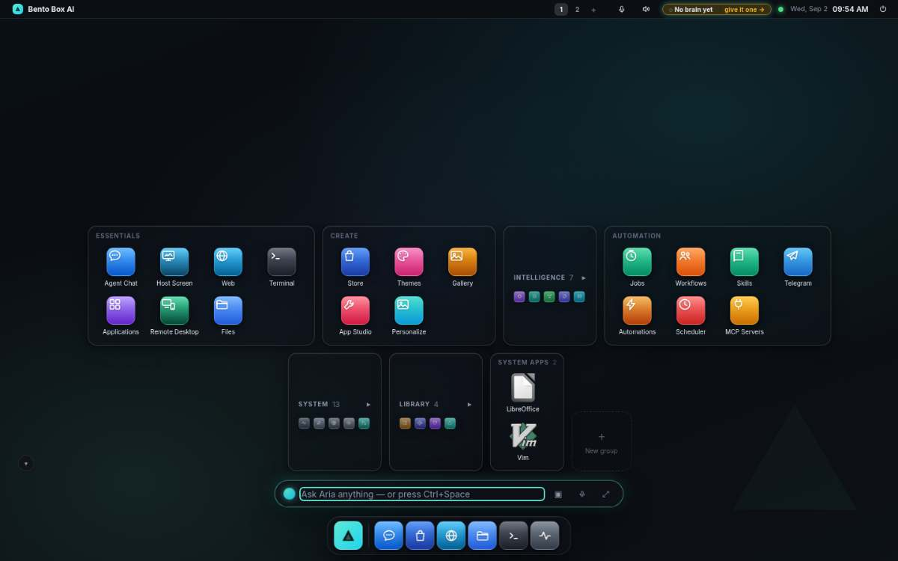
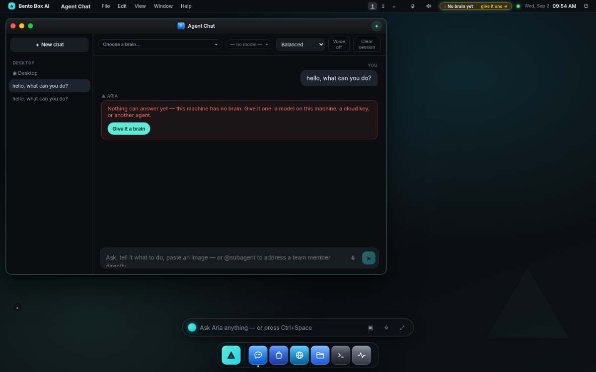

# Bento Box AI — un système d'exploitation agentique local d'abord

<p align="right"><sub>
<a href="../../README.md">English</a> ·
<a href="README.zh-CN.md">简体中文</a> ·
<a href="README.zh-TW.md">繁體中文</a> ·
<a href="README.ja.md">日本語</a> ·
<a href="README.ko.md">한국어</a> ·
<a href="README.es.md">Español</a> ·
<a href="README.pt-BR.md">Português&nbsp;(BR)</a> ·
<b>Français</b> ·
<a href="README.de.md">Deutsch</a> ·
<a href="README.ru.md">Русский</a> ·
<a href="README.hi.md">हिन्दी</a> ·
<a href="README.ar.md">العربية</a>
</sub></p>

<!-- ai-translated: generated by an AI, not yet proofread; the English README is the reference -->
> **Note :** cette traduction a été générée par une IA et n'a pas encore été relue par une personne ; elle peut contenir des erreurs. En cas de divergence, la [version anglaise](../../README.md) fait foi.

**Votre machine, dotée d'un cerveau.** Bento Box AI est un **environnement de bureau IA** auto-hébergé : un
bureau complet — fenêtres, applications, fichiers, terminal — piloté par un **agent IA autonome** qui accomplit
des **actions réelles** sur votre ordinateur. Utilisez des modèles locaux via [Ollama](https://ollama.com) pour une
confidentialité totale, ou des modèles cloud (Anthropic Claude, OpenAI, OpenRouter, ou tout point de terminaison
compatible OpenAI) — toujours avec votre approbation. L'agent peut naviguer, construire ses propres applications,
planifier des tâches, se souvenir de ce qu'il apprend, étendre son propre code source et vous joindre sur Telegram
ou WhatsApp.


S'exécute sur `http://127.0.0.1:8321` — privé par défaut, installable comme service au démarrage.

```bash
curl -fsSL https://raw.githubusercontent.com/contact9prime-lab/bento-ai-os/master/install.sh | sh
```


**La documentation complète se trouve dans [`docs/`](../README.md)** — installation, un guide utilisateur du bureau
et de chaque application, l'agent et ses outils, la construction d'applications, les intégrations, la référence de
l'API et le dépannage.

---

## L'installation tient en onze étapes, et chacune laisse quelque chose derrière elle

Pas un formulaire de réglages avec une barre de progression. Chaque étape **produit quelque chose de réel** — un
modèle qui répond, un agent qui existe, un flow qui s'exécute, une planification qui se déclenche — et dit ce que
vous obtiendrez avant de vous demander quoi que ce soit.


Chaque étape est **sondée, jamais mémorisée** : elle est cochée parce que la machine possède la chose. Supprimez
l'agent et l'étape repasse à « à faire ». C'est ce qui rend sûr de la relancer — et la relancer est une chose
normale ici, parce que **l'installation est aussi une application**. Ouvrez-la à tout moment pour voir ce que fait
une étape, sur une machine que vous avez configurée il y a des mois.


Même catalogue, même sonde, mêmes volets — y compris dans un terminal, où `bento setup` par SSH reprend exactement
là où le navigateur s'était arrêté.

---

## La première chose qu'il vous demande, c'est quel travail accomplir

L'installation se termine sur une question, pas sur une porte : **donnez-moi un travail.** Choisissez-en un parmi
trois, répondez à deux questions, et cette machine fait déjà quelque chose pour vous avant même que vous ayez ouvert
une seule application.


| | |
|---|---|
| **Me faire un briefing chaque matin** | s'informe pendant la nuit sur les choses que vous suivez et laisse une page en attente |
| **Surveiller un dossier pour moi** | remarque ce qui atterrit dans un dossier *que vous choisissez*, comprend ce que c'est, vous le dit |
| **Me prévenir quand une page change** | vérifie une page et ne parle que lorsque quelque chose de réel a changé |

Deux choses qu'il ne fera pas. Il ne s'accordera rien que vous n'ayez pas vu : le panneau imprime les permissions
exactes avant que vous n'appuyiez sur le bouton, calculées par le même code qui les écrit — « lit
`~/Downloads/*`, et rien d'autre ». Et il n'offrira pas un moyen de vous joindre qui ne fonctionne pas : un Telegram
non appairé est affiché grisé avec la phrase qui le corrigerait, jamais masqué et jamais discrètement remplacé.

Le dernier bouton est **« Lancez-le maintenant, pour que je le voie fonctionner »** — parce qu'une planification que
vous n'avez pas vue se déclencher n'est qu'une promesse, et un nouvel utilisateur n'a aucune raison d'en croire une.

Un travail est un *flow*, pas un nouveau type de chose : même planificateur, même barrière de permissions, même
registre d'audit. Sur une machine sans écran : `bento job recipes`, puis `bento job add morning-brief --topics "…"`.

---

## Le premier jour pèse moins que la quatrième semaine

Le bureau s'ouvrait sur 43 tuiles, sur une machine qui ne pouvait pas encore répondre à une question. Désormais :



- **Le deck replie ce que vous n'avez pas encore utilisé.** Intelligence, System et Library commencent comme une ligne avec un compteur et un aperçu de leurs icônes ; ils se déplient d'un clic, ou la première fois que vous ouvrez l'une de leurs apps. Un deck que vous avez arrangé reste exactement comme vous l'avez laissé.
- **La barre de menu dit dans quel état est la machine.** Si rien n'est configuré pour répondre, elle affiche *Pas encore de cerveau · donnez-lui-en un →*, et un clic ouvre cette étape de l'installation.
- **Un tour raté est une phrase avec une porte.** Pas de modèle, Ollama à l'arrêt, une clé refusée, une limite de débit, un modèle non téléchargé : chacun est une phrase et un bouton (*Donnez-lui un cerveau*, *Ouvrir les fournisseurs d'IA*, *Ouvrir Model Manager*), dans le Chat, dans la carte de la barre de saisie et dans chaque panneau copilote. Le nom de l'exception va dans les Logs, à sa place.
- **Une règle pour chaque popover.** Le lanceur, les menus, les notifications, l'alimentation et les Réglages rapides s'ouvrent un à la fois, se ferment avec Échap et d'un clic à côté, et le lanceur tient sur l'écran où il se trouve.
- **Sur un téléphone, une seule zone de saisie.** Une feuille avec sa propre saisie masque la barre de saisie ; les apps liste/détail affichent un volet à la fois avec un retour ; l'assistant d'installation garde sa sortie.



Chacun de ces points a été mesuré dans un vrai navigateur, avant et après. L'examen qui les a trouvés, avec les chiffres : [docs/design/ux-review-2026-09.md](../design/ux-review-2026-09.md).

---

## Trois visages, un seul programme

Bento s'exécute à trois endroits, et **chaque fonctionnalité est conçue pour les trois**. C'est la première question
posée à propos de tout changement, pas la dernière.

| | Ce que c'est | Démarrez-le avec |
|---|---|---|
| **GUI** | une fenêtre (ou un onglet) sous macOS, Windows ou Linux. Rien de plus à installer | `bento` |
| **TUI** | tout l'OS dans un terminal — pour un serveur, ou un Pi sans écran par SSH | `bento tui` |
| **SUI** | Bento **est** votre session Linux : il possède la machine | `bento installer` |

> La commande est `bento`. `agentos` fonctionne toujours et fonctionnera toujours — elle est dans l'historique des
> shells, les unités systemd et les scripts des gens, et un renommage que nous avons choisi ne devrait pas leur
> coûter cela.

---

## Voyez-le à l'œuvre

| | |
|---|---|
|  **Chat avec l'agent** — parlez à votre machine ; réponses en flux, cartes d'outils, approbations, voix |  **Équipe** — sous-agents spécialisés et workflows visuels, avec un mélange de modèles par étape |
|  **Docs** — le manuel complet vit à l'intérieur de l'OS |  **Boutique** — applications en un clic, compétences et canaux d'outils MCP |

### Plusieurs personnes, une seule machine

Ajoutez un compte et chaque personne obtient **son propre foyer** — sa propre base de données, mémoire, agents,
canaux, serveurs MCP et identifiants. Pas une colonne `user_id` qu'une clause `WHERE` oubliée fait fuiter : son
propre répertoire, parce que deux fichiers ne peuvent pas fuiter l'un dans l'autre.


Deux rôles — **exécuteur** (tout ce qui se trouve dans son propre foyer) et **admin** (cela, plus la machine). Les
réglages restent partagés, de sorte qu'il y a une clé de fournisseur pour la machine plutôt qu'une par personne. Les
agents et les applications se croisent délibérément, sous forme de copies, via une bibliothèque partagée.

Et c'est **une seule connexion, ici et depuis n'importe où** : une machine avec des comptes est verrouillée par eux,
de sorte que le téléphone dans la poche de quelqu'un utilise le même nom d'utilisateur et le même mot de passe que le
bureau et atterrit dans son propre foyer. Aucune seconde phrase de passe partagée à inventer, partager ou oublier.


### Vous pouvez voir ce qu'il fait


Un tour, c'est surtout de l'attente, et « en cours de traitement… » pendant quatre minutes ne vous dit rien — un
modèle qui réfléchit et un tour qui est mort en silence se ressemblent en dessous. Chaque surface d'attente dit **sur
quoi elle travaille et depuis combien de temps** : l'appel en cours vieillit sur place (`running · 2m 14s`), les
appels terminés conservent leur durée, et la ligne en dessous porte l'étape et le total du tour. La même phrase
apparaît sur la bulle de présence et l'omnibar, de sorte qu'on peut y répondre depuis le bureau sans ouvrir le chat.

### Il peut construire sa propre équipe — et demande avant de le faire


Lorsqu'aucun spécialiste existant ne convient, l'agent **en construit un** et lui délègue. Définir un agent ne lui
accorde rien ; la première fois qu'il est réellement utilisé, vous obtenez une carte nommant le modèle sur lequel il
tourne, son budget, et les outils et compétences exacts que sa définition lui donne — parce que le consentement à un
acteur que vous ne pouvez pas vous représenter n'est un consentement que de nom. Approuver `researcher` n'est pas
approuver `deploy-bot`, et l'autorisation est révocable dans Permissions comme n'importe quelle autre.
[Comment ça marche →](../security.md)

### Il répond aux questions sur lui-même à partir de son propre manuel


Le manuel se trouve dans l'index de récupération, de sorte que « comment empêcher une application d'accéder à
Internet tout en la gardant fonctionnelle ? » reçoit une réponse à partir de **ces pages**, et non de la mémoire d'un
modèle sur un autre projet — et la réponse nomme la page qu'elle a utilisée. C'est de la récupération agentique
plutôt qu'une recherche en une seule fois : l'agent cherche, lit, et cherche à nouveau lorsque le premier passage
échoue.

### Des fenêtres qui se comportent comme des fenêtres


Une fenêtre s'ouvre **là où vous l'avez laissée** — position et taille sont mémorisées par application — et une
fenêtre qui s'ouvre pour la première fois se décale en cascade de plus d'une barre de titre, de sorte que celle en
dessous reste lisible. La fenêtre avec le focus porte un anneau d'accentuation et l'ombre complète ; les autres
reculent. Le ✦ dans la barre de titre est l'agent *à l'intérieur de cette application* : posez-lui des questions sur
ce qui est à l'écran sans la quitter.

### Cinq langages de design, pas cinq palettes


**Bento · Liquid Glass · Spatial · Claymorphism · Minimalism.** Chacun retaille tout le shell — surfaces, rayons,
élévation, flou, typographie — et apporte son propre fond d'écran. Les fonds d'écran sont livrés en SVG : quelques Ko
chacun, nets d'un téléphone à un écran 4K. [Plus →](../desktop.md#themes)

Le verre est la chose la plus coûteuse qu'un bureau puisse dessiner, et le coût s'accumule à chaque fenêtre que vous
ouvrez. **Thèmes → Effets** mesure votre machine et ne le réduit que si nécessaire — cinq fenêtres en Liquid Glass
sont passées de 6,5 fps à 27 (réduit) ou 60 (désactivé).

### Il vous joint là où vous êtes déjà


**Telegram et WhatsApp sont des canaux natifs** — la même conversation, la même mémoire, les mêmes outils et les
mêmes boutons d'approbation qu'au bureau. Pas un pont de notifications : une réponse depuis votre téléphone continue
le fil que vous avez commencé ce matin.

WhatsApp a **deux transports**, et ils échouent dans des directions opposées. L'API Cloud de Meta est officielle mais
nécessite un compte développeur et un webhook public, et au-delà de 24 heures après votre dernier message, elle ne
transportera pas du tout une réponse en texte libre — la carte indique si cette fenêtre est ouverte, un envoi qui ne
peut pas passer le dit et comment le corriger, et une tâche planifiée sauvegarde d'abord son rapport pour que rien ne
soit perdu. Le lien WhatsApp Web ne nécessite qu'un scan de QR code et n'a pas de fenêtre de 24 heures, mais il est
**non officiel** et Bento le dit sur la carte d'installation avant tout téléchargement. [Configuration →](../whatsapp.md)

Telegram est aussi une **console d'administration** : `/agents`, `/run`, `/flows`, `/model`, `/logs`, `/perms` —
propriétaire uniquement, et chaque commande qui *fait* quelque chose passe par la même barrière de permissions et les
mêmes boutons d'approbation que le bureau, de sorte que ce n'est jamais une porte d'entrée moins chère.
[Commandes →](../integrations.md)

### Un seul bureau, chaque écran


Téléphone, tablette, station de travail — le même bureau, qui s'adapte. Les fenêtres deviennent des feuilles pleine
largeur, le dock s'étend sur le bord inférieur, les popovers deviennent des feuilles. Activez l'**accès à distance**
et joignez-le depuis votre téléphone sur votre réseau, derrière une phrase de passe ; *Ajouter à l'écran d'accueil*
en fait une application plein écran. [Accès à distance →](../remote-access.md) · [Mise en page adaptative →](../desktop.md#phone-tablet-desktop)

### Il peut *être* le bureau, pas seulement y vivre


Connectez-vous et obtenez Bento comme session Linux. Le bureau est dessiné comme une **surface de couche Wayland sur
la couche d'arrière-plan**, de sorte que les fenêtres des applications natives sont au-dessus de lui dans l'ordre
d'empilement normal — non pas parce que quelque chose est monté ou descendu, mais parce que c'est ce que signifie
« arrière-plan ». La barre de menu et le dock se trouvent dans des bandes **réservées auprès du compositeur**, le même
mécanisme qu'utilise un panneau GNOME ou KDE, de sorte qu'une application plein écran s'arrête à leurs bords au lieu
de les engloutir.


Gestion complète des fenêtres pour les applications natives : accrochage aux moitiés et aux quarts, mosaïque,
flottement, dispositions, redimensionnement au clavier, espaces de travail, réduction, et un sélecteur Alt-Tab — avec
la barre des tâches et la barre de menu qui suivent l'application ayant le focus. [L'interface de session →](../session-ui.md)

### Installez des applications, depuis l'intérieur de Bento


Un bureau sur lequel vous ne pouvez pas installer de logiciels est une démo. *Applications → Obtenir des
applications…* recherche dans le propre catalogue de la machine — AppStream, Flatpak ou apt — et vous montre la
commande exacte avant qu'elle ne s'exécute. Flatpak est préféré là où il existe parce qu'une installation par
utilisateur ne nécessite aucun mot de passe. Bento ne met rien en miroir et ne regroupe rien ; il interroge le
gestionnaire de paquets que vous avez déjà.

### Votre vrai écran, sur votre téléphone, dans le navigateur


L'**accès à distance** vous envoie le shell Bento, qui est du HTML et voyage parfaitement — mais une application
native, ce sont des pixels sur le propre affichage de la machine et n'a jamais fait partie de la page. Le **Bureau
distant** comble cela : Bento relaie l'écran par sa *propre* connexion authentifiée, de sorte que vous obtenez le vrai
bureau, cliquable, sans application VNC à installer sur le téléphone.

La forme est l'essentiel — le serveur VNC reste sur `127.0.0.1` et ne s'approche jamais du réseau ; ce qui le protège
est la phrase de passe que vous utilisez déjà. [Accès à distance →](../remote-access.md)

### Automatisations et coins actifs


Nommez une séquence une fois — ouvrir ces applications, changer de thème, exécuter ce Python, appeler cet outil MCP,
mettre l'agent sur une tâche — et exécutez-la à jamais depuis la barre de commande, un coin actif, une planification,
ou en la demandant par son nom. [Plus →](../desktop.md#automations)

---

## Pourquoi Bento Box AI

- **Un vrai bureau, pas une boîte de chat** — fenêtres déplaçables, barre des tâches, bureaux virtuels, widgets,
  thèmes, une palette de commandes, et plus de 25 applications intégrées.
- **Un agent avec des mains** — commandes shell, gestion de fichiers, recherche web, notifications de bureau, tâches
  planifiées, rapports HTML, et construction d'applications, le tout en langage naturel.
- **Local d'abord et privé** — tout peut s'exécuter sur votre matériel avec Ollama ; rien ne quitte votre machine à
  moins que vous n'ajoutiez une clé cloud. Se lie uniquement à localhost, jusqu'à ce que vous activiez délibérément
  l'[accès à distance](../remote-access.md) protégé par phrase de passe.
- **Tout le cycle de vie sous un même toit** — **Entraîner · Tester · Exploiter · Construire · Livrer · Gérer**, en
  direct sur un seul écran (Mission Control) : affinez vos propres modèles sur votre GPU, testez chaque
  auto-modification, exécutez des tâches planifiées, construisez des applications et livrez-les sur GitHub.
- **Auto-extensible** — l'agent construit de nouvelles applications d'interface pour lui-même (App Studio), installe
  des compétences et des serveurs d'outils MCP, et peut modifier le propre code source de Bento (avec des
  auto-instantanés et une suite de tests qui doit réussir avant un redémarrage).
- **Une mémoire qui se cumule** — mémoire à deux niveaux, un graphe de connaissances en direct, et une « âme »
  persistante, apprise automatiquement après chaque conversation.
- **Sûr par conception** — niveaux d'autonomie, invites d'approbation, politiques d'autorisation/refus, un bac à sable
  de dossier bubblewrap, des commandes destructrices bloquées en dur, et des points de restauration en un clic.

---

## Démarrage rapide

**Une seule commande, sous macOS ou Linux.** Elle installe tout — y compris Python, via `uv` — démarre Bento, puis
*prouve que ça marche* en posant une question au serveur en cours d'exécution avant de dire « terminé ».

```bash
curl -fsSL https://raw.githubusercontent.com/contact9prime-lab/bento-ai-os/master/install.sh | sh
```

Puis ouvrez **http://127.0.0.1:8321**, ou exécutez `bento setup` pour les mêmes onze étapes dans un terminal.

S'il y a un terminal pour poser la question, l'installateur en pose deux avant de finir : si cette machine
doit être joignable depuis vos autres appareils et — si oui — si vous vous connectez avec une **phrase de
passe** ou avec un **compte**. Sur une machine sans écran, cette première question fait la différence entre
une installation que vous pouvez regarder et une que vous ne pouvez pas. `--yes` n'y répond délibérément
pas : un port ouvert ici est un shell ouvert.

Elle laisse une commande `bento` dans votre `PATH` (dans `~/.local/bin`, ajouté à votre profil shell s'il n'y était
pas — ouvrez un nouveau terminal ensuite). `bento --help` montre les dix commandes dont une nouvelle machine a besoin ; `bento help --all` donne le reste.

### L'installer sur une adresse et un port choisis

Sur un serveur que vous atteignez par SSH, `127.0.0.1:8321` signifie « accessible par personne ». Donnez à
l'installateur une phrase de passe et une adresse et il démarre prêt, avec le service de démarrage déjà pointé sur le
bon port :

```bash
curl -fsSL https://raw.githubusercontent.com/contact9prime-lab/bento-ai-os/master/install.sh \
  | sh -s -- --passphrase='something long and unguessable' --bind=0.0.0.0 --port=8080
```

Cette machine répond désormais sur **toutes** les interfaces au port 8080, et demande cette phrase de passe avant de
faire quoi que ce soit. L'utilisation locale via `127.0.0.1:8080` est inchangée.

L'installateur indique lequel des deux il vous a laissé — `AgentOS is running` seulement lorsque quelque chose écoute
réellement. Sur une machine sans gestionnaire de services à portée de main (un conteneur, une distribution non
systemd, SSH sans D-Bus utilisateur) il le dit plutôt, et `bento service start` termine le travail.

Une seule interface plutôt que toutes — un VLAN privé, une adresse Tailscale :

```bash
curl -fsSL https://raw.githubusercontent.com/contact9prime-lab/bento-ai-os/master/install.sh \
  | sh -s -- --passphrase='something long and unguessable' --bind=192.168.1.20 --port=8080
```

Juste un port différent, toujours en loopback uniquement :

```bash
curl -fsSL https://raw.githubusercontent.com/contact9prime-lab/bento-ai-os/master/install.sh \
  | sh -s -- --port=8080
```

> **`-s --` n'est pas optionnel.** `curl … | sh --port=8080` transmet le drapeau à `sh`, qui le rejette — un script
> transmis par tube ne reçoit aucun argument à lui. `-s --` signifie « le reste est pour le script ». C'est la façon
> la plus courante de perdre ces drapeaux, et l'erreur nomme `sh`, donc cela se lit comme un installateur cassé.

**Tous les drapeaux :**

| drapeau | ce qu'il fait |
|---|---|
| `--passphrase=SECRET` | l'exiger pour se connecter, et autoriser la liaison hors loopback — donnée ici, l'installateur ne pose pas la question |
| `--bind=ADDR` | quelle interface écouter (par défaut `0.0.0.0`) ; nécessite `--passphrase` |
| `--port=N` | quel port (par défaut `8321`) ; enregistré dans la config, de sorte que le service de démarrage l'utilise |
| `--yes` | répondre oui à chaque composant optionnel — **pas** à l'ouverture du port |
| `--no-service` | pas de lanceur ni de service de démarrage (conteneurs, CI) |
| `--no-verify` | sauter l'étape « prouver que ça marche » |

### Le modifier après coup

Tout ce qui précède vit dans **`~/.agentos/config.json`** (ou sous `$AGENTOS_HOME`), et `bento config` le lit et
l'écrit sans que vous ayez à le trouver :

```bash
bento config                       # le fichier entier, secrets masqués
bento config port                  # un seul réglage
bento config port 8080             # le modifier
bento config remote.bind 0.0.0.0   # chemins pointés pour les réglages imbriqués
bento config --path                # où se trouve le fichier
bento config --edit                # l'ouvrir dans $EDITOR — refuse d'enregistrer un JSON invalide
```

`bento remote` est le même réglage avec ceux de l'accessibilité regroupés :

```bash
bento remote --on --passphrase 'something long' --bind 0.0.0.0   # un seul secret partagé
bento user add alice && bento remote --on --bind 0.0.0.0          # ou un compte chacun
bento remote --port 8080                                          # le port
bento remote                                                      # ce que c'est maintenant, et qui se connecte
```

**Un changement de port n'atteint pas de lui-même un service de démarrage installé** — l'unité systemd et le
LaunchAgent le figent dans `ExecStart`. Les deux commandes vous préviennent quand cela s'applique :

```bash
bento service install && bento service restart
```

> **Être accessible depuis d'autres machines est un choix délibéré, pas un défaut.** Bento écoute uniquement sur
> `127.0.0.1` jusqu'à ce qu'il ait un verrou — une phrase de passe, ou un compte avec lequel quelqu'un se
> connecte —, parce que l'agent a un vrai shell et qu'un port ouvert
> ici est un shell ouvert. `--bind` seul est refusé pour cette raison, tout comme `bento serve --host 0.0.0.0` avec
> l'accès à distance désactivé. Les deux verrous sont des alternatives, pas des couches : dès qu'un compte existe, c'est lui le verrou, et une phrase de passe devant n'est qu'une configuration que rien ne lit.

**À propos des ports inférieurs à 1024.** Ils sont refusés à un processus non-root sous Linux, et sous macOS le refus
est par adresse — il accorde `0.0.0.0:80` et refuse `127.0.0.1:80`. Donc rien ici ne devine à partir du numéro :
`--port` tente la liaison réelle et, si le noyau dit non, imprime la ligne `sysctl`, la règle de redirection, ou
l'option de proxy qui corrige cela. Sous Linux, le port 80 signifie généralement une seule commande :

```bash
echo 'net.ipv4.ip_unprivileged_port_start=80' | sudo tee /etc/sysctl.d/50-agentos.conf
sudo sysctl --system
```

Exécuter le serveur en tant que root n'est pas conseillé — l'agent a un vrai shell.

<details>
<summary><b>Depuis un checkout git à la place</b></summary>

```bash
uv sync                 # installer les dépendances (ou : pip install -e .)
uv run bento            # démarrer le serveur et ouvrir le bureau dans votre navigateur
```
</details>

<details>
<summary><b>Dans Docker</b></summary>

```bash
docker build -t bento .
docker run -d --name bento -p 8321:8321 -v bento-data:/data \
  -e AGENTOS_PASSPHRASE='something long and unguessable' bento
```

Un conteneur doit se lier à `0.0.0.0` pour être accessible tout court, de sorte que la phrase de passe est requise
plutôt qu'optionnelle — le point d'entrée refuse de démarrer inaccessible *ou* non sécurisé et vous dit lequel. Tout
ce qui serait perdu vit dans le volume `/data`. Construisez une branche spécifique avec
`--build-arg SOURCE=git --build-arg REF=my-branch`.
</details>

Si **Ollama** est en cours d'exécution, vos modèles locaux sont détectés automatiquement. Ajoutez des clés d'API
cloud sous **Settings** si vous les voulez. C'est toute la configuration.

> **Astuce :** les constructions, l'appel d'outils et les tâches en plusieurs étapes sont bien plus fiables avec un
> **modèle capable d'outils** (n'importe quel modèle `qwen*`, ou un modèle cloud). Les modèles locaux plus faibles
> comme `gemma` n'appelleront pas les outils de manière fiable.

---

## L'exécuter comme votre bureau Linux (SUI)

```bash
uv run bento installer      # détecte votre distribution, installe ce qui manque, l'ajoute à l'écran de connexion
```

Puis déconnectez-vous et choisissez **Bento Box AI** à l'écran de connexion. Votre bureau existant est intact —
revenir en arrière, c'est se déconnecter et choisir Ubuntu à nouveau.

L'installateur détecte la distribution, nomme chaque paquet qu'il veut et pourquoi, et demande avant d'installer quoi
que ce soit. Deux groupes : le moteur de compositeur (sway et ses amis, MIT), et la surface de bureau native
(`python3-gi`, `python3-gi-cairo`, gtk-layer-shell, WebKitGTK) qui permet au bureau d'être une vraie surface Wayland
plutôt qu'une fenêtre de navigateur.

**Bento n'en livre ni n'en redistribue aucun.** gtk-layer-shell est sous licence MIT, mais GTK, PyGObject et
WebKitGTK sont sous LGPL, et ce dont ce projet *dépend* reste permissif — ils sont donc demandés, avec les licences en
vue. Sans eux, la session s'exécute quand même, en dessinant le bureau dans une fenêtre Chromium.
[Licences →](../licensing.md) · [L'interface de session →](../session-ui.md)

Si quoi que ce soit à propos du bureau se comporte mal, une seule commande vous dit pourquoi :

```bash
uv run bento doctor --session   # sonde ce qui peut réellement dessiner sur CETTE machine, et le dit
```

Elle vérifie l'interpréteur, l'affichage de GTK, la prise en charge de layer-shell par le compositeur, et si WebKit
peut rendre *et continuer à rendre* — dans une fenêtre et sur une surface de couche — puis rend un verdict. Les
sondes s'exécutent dans des sous-processus, parce que les défaillances qu'elle recherche sont des abandons et des
segfaults, et une sonde qui fait planter le docteur ne peut pas signaler qu'elle a planté.

---

## Installer comme paquet Debian/Ubuntu (.deb)

Un `.deb` autonome (regroupe l'application **et** un venv Python avec toutes les dépendances — aucun réseau nécessaire
à l'installation) :

```bash
./packaging/build-deb.sh                                   # → packaging/dist/agentos_<ver>_<arch>.deb
sudo dpkg -i packaging/dist/agentos_0.1.0_amd64.deb        # installe dans /opt/agentos + lanceur + service
systemctl --user enable --now agentos                      # démarrer à la connexion (par utilisateur)
bento app                                                  # ou lancez-le depuis votre menu
```

`apt`/`dpkg` gère les mises à jour et la suppression. Il **Recommends** `bubblewrap` (bac à sable) et `xdg-utils`, et
**Suggests** `ollama`, `nodejs` et `git`. Le paquet de bureau **Suggests** en plus la pile de l'interface de session
et `wayvnc`/`novnc` — suggéré plutôt que dépendant, parce qu'apt installe les Recommends par défaut et ce serait un
regroupement sous un nom plus doux.

## Installer comme une vraie application (démarrage automatique au boot) — depuis les sources

```bash
uv run bento install      # lanceur d'application + un service en arrière-plan qui démarre à la connexion/au boot
```

Le bon mécanisme natif est utilisé automatiquement : un lanceur `.desktop` plus un **service utilisateur systemd**
sous Linux (avec linger, pour qu'il démarre au boot), un app bundle plus des **LaunchAgents** sous macOS, un raccourci
du menu Démarrer plus des **entrées de démarrage** sous Windows.

Un seul ensemble de commandes pilote les trois — vous ne devriez pas avoir à savoir si cette machine utilise systemd
ou launchd pour contrôler votre propre agent :

```bash
bento service status       # est-il en cours d'exécution, reviendra-t-il au boot, le port répond-il
bento service start        # …stop, restart
bento service logs -f      # journalctl ou le fichier de log, selon ce que cette machine utilise
bento service uninstall    # supprimer uniquement le service en arrière-plan — le lanceur et les données restent
bento uninstall            # supprimer le lanceur + le service (vos données restent)
bento app                  # ouvrir comme une fenêtre de bureau sans chrome à tout moment
```

`bento service status` signale ce que le superviseur croit **et** si le port répond, séparément : une unité qui est
« active » alors que rien n'écoute est une boucle de plantage, et c'est l'état qui vaut la peine d'être visible.

---

## Modes de lancement

| Commande | Ce qu'elle fait |
|---|---|
| `uv run bento` | démarrer le serveur **et** ouvrir le bureau dans votre navigateur |
| `uv run bento serve --no-browser --port 8321` | serveur sans écran (utilisé par le service de démarrage) |
| `uv run bento app` | ouvrir le bureau comme une fenêtre à l'aspect natif |
| `uv run bento tui` | tout l'OS dans un terminal (**TUI**) |
| `uv run bento installer` | détecter cette distribution et configurer la session Linux (**SUI**) |
| `uv run bento doctor` / `doctor --session` | vérification de l'environnement / ce qui peut dessiner le bureau ici |
| `uv run bento service status \| start \| stop \| restart \| logs \| uninstall` | le serveur en arrière-plan, sur le superviseur que cet OS possède |
| `uv run bento update` / `update --apply` | vérifier une version plus récente / tirer, synchroniser, tester et redémarrer |
| `uv run bento config [key] [value]` | lire ou modifier `~/.agentos/config.json` (`--edit`, `--path`) |
| `uv run bento remote --port 8080 --bind 0.0.0.0` | l'adresse sur laquelle il répond, enregistrée dans la config |
| `uv run bento serve --if-running open\|port\|restart\|fail` | quoi faire quand un est déjà en cours d'exécution (par défaut : demander) |
| `uv run bento apps search \| install \| remove` | applications natives, depuis un terminal |
| `uv run bento remote --on --passphrase '…'` | joindre ce bureau depuis votre téléphone |
| `uv run bento remote-desktop --on` | le bureau distant du navigateur (vrai écran, applications natives) |
| `uv run bento ask "…"` | exécution d'agent unique dans le terminal (`--full`, `--model …`) |
| `uv run bento user add <nom>` | comptes — le premier adopte cette machine et est administrateur |
| `uv run bento help --all` | toutes les commandes ; `bento --help` montre les dix dont une nouvelle machine a besoin |

---

## Prérequis

- **Python ≥ 3.10** et [**uv**](https://docs.astral.sh/uv/) (ou pip).
- **Un fournisseur de modèles** — soit [Ollama](https://ollama.com) en local (recommandé : un modèle capable
  d'outils tel que `qwen3.5:9b`), soit une clé d'API cloud.

Optionnel, débloque des fonctionnalités supplémentaires lorsqu'il est présent — `bento installer` propose chacun avec
sa licence :

- **La session Linux (SUI)** — `sway` et ses amis, plus `python3-gi`, `python3-gi-cairo`,
  `gir1.2-gtklayershell-0.1` et `gir1.2-webkit2-4.1`. [Détails →](../session-ui.md)
- **wayvnc + novnc** — Bureau distant depuis le navigateur d'un téléphone, relayé sur loopback.
- **bubblewrap** (`bwrap`) — le **bac à sable** de dossier qui enferme l'agent et le terminal dans un seul dossier.
- **Node/npx** et/ou **uvx** — pour exécuter des **serveurs MCP** (Playwright, système de fichiers, git, …).
- **git** — pour installer des **compétences** depuis des dépôts.

---

## Le bureau

- **Fenêtres** — chaque application s'ouvre dans une fenêtre déplaçable et redimensionnable avec
  réduire/agrandir/fermer et ordre z. Une **barre des tâches** suit les fenêtres ouvertes ; un **menu Démarrer**
  lance tout.
- **Des fenêtres qui dorment** — une fenêtre que vous ne pouvez pas voir cesse d'effectuer un travail périodique et
  se rafraîchit dès qu'elle revient. Six applications ouvertes et toutes réduites sont passées de 25 requêtes par 10 s
  à 2.
- **Bureaux virtuels** — un sélecteur de barre des tâches ; `Ctrl+1..6` pour basculer, clic droit pour y déplacer une
  fenêtre. Les widgets sont par bureau, de sorte que chacun est son propre espace.
- **Widgets** — épinglez n'importe quelle application comme une tuile en direct sans cadre ; déplacez, redimensionnez,
  et elle se restaure au démarrage.
- **Palette de commandes** — `Ctrl+Space` (ou `Ctrl+K`) pour un lancement flou de n'importe quelle application ou
  action, ou « Ask Aria … » pour l'envoyer directement à l'agent. `Ctrl+Alt+T` ouvre un terminal.
- **Apparence** — fonds d'écran générés par IA avec une galerie locale, une animation de réflexion pendant que
  l'agent travaille, et une voix optionnelle. Collez des images directement dans le chat pour les modèles capables de
  vision.

### Applications intégrées

| Application | Ce que c'est |
|---|---|
| **Agent Chat** | parlez à l'agent ; flux, cartes d'outils, approbations, voix, collage d'images |
| **Applications** | chaque application de bureau installée — lancez-les, ou installez-en de nouvelles |
| **Remote Desktop** | le vrai écran de la machine, cliquable, d'ici ou depuis un téléphone |
| **Host Screen** | une image fixe rafraîchie de l'affichage réel, y compris les fenêtres d'applications natives |
| **Web** | ouvre les URL dans votre **vrai navigateur système** (sites complets, connexions, extensions) |
| **Files** | parcourir l'espace de travail ; cliquez sur un fichier pour l'ouvrir dans votre navigateur/application hôte |
| **Terminal** | un vrai shell hôte (xterm.js sur un PTY), enfermé dans le dossier du bac à sable |
| **App Studio** | décrivez une application en langage naturel et l'agent **la construit en direct** |
| **Task Manager** | CPU/mémoire/disque en direct, processus, fenêtres ouvertes (et lesquelles dorment) |
| **Knowledge Graph** | ce que l'agent sait, sous forme de graphe à force dirigée en direct |
| **Soul** | l'identité/personnalité persistante de l'agent (injectée à chaque tour) |
| **Memory** | mémoire utilisateur et session avec apprentissage automatique + rappel sémantique |
| **Profile** | tout ce que l'agent sait de vous, au même endroit |
| **Team** | sous-agents et workflows visuels (mélangez les modèles par étape) + observabilité |
| **Docs** | ce manuel, à l'intérieur de l'OS |
| **Automations** | routines nommées, coins actifs, et le constructeur d'étapes |
| **Skills** | procédures réutilisables ; installer depuis un dépôt git ou une URL `.md` brute |
| **MCP Servers** | connecter des serveurs d'outils externes depuis un catalogue |
| **Telegram** | contrôlez l'agent depuis votre téléphone ; liste d'autorisation par chat |
| **Policies** | règles toujours-autoriser / toujours-refuser pour les outils et commandes |
| **Logs** | tout ce que le système a fait (tours, outils, MCP, telegram, tâches) |
| **Scheduler** | **tâches** en arrière-plan récurrentes |
| **Snapshots** | points de restauration pour tout l'OS (config, données et sources) |
| **Settings** | fournisseurs, modèle, autonomie, voix, bac à sable, nom de l'agent |

---

## Ce que l'agent peut faire

L'agent (nom par défaut **Aria**) dispose d'un large ensemble d'outils et peut piloter tout l'OS depuis le chat ou
Telegram :

- **Agir sur la machine** — exécuter des commandes shell, lire/écrire des fichiers, récupérer le web, ouvrir des
  applications/fichiers sur l'hôte, notifications de bureau.
- **Livrer des résultats** — `save_report` écrit un rapport HTML stylé qui s'affiche dans Files et s'ouvre dans votre
  navigateur, et peut expédier un résumé à Telegram. On dit à l'agent de **terminer le travail** — transformer la
  recherche en un livrable réel, pas s'arrêter après une recherche.
- **Construire l'OS** — `create_app` crée de nouvelles applications d'interface avec une icône de bureau ;
  `pin_widget` les met sur le bureau ; `add_mcp_server` connecte de nouveaux canaux d'outils.
- **Grandir** — mémoire à deux niveaux, un graphe de connaissances, `update_soul` — plus l'**apprentissage
  automatique** : un passage en arrière-plan après chaque tour extrait des souvenirs et des faits de lui-même.
- **Automatiser** — `schedule_task` crée des **tâches** sans écran qui livrent à un rapport et/ou à Telegram.
- **S'étendre lui-même** — `read_source` / `develop_agentos` lui permettent de modifier le **propre code source** de
  Bento ; il prend un auto-instantané d'abord et vérifie la syntaxe avant d'écrire.

Demandez en langage naturel : *« ajoute le canal MCP github », « construis-moi un suivi d'habitudes et épingle-le au
bureau 2 », « chaque matin, rapporte les tendances des réseaux sociaux à mon Telegram », « installe inkscape ».*

---

## Modèles et fournisseurs

- **Ollama** (local) — auto-découvert ; rien ne quitte votre machine.
- **Anthropic**, **OpenAI**, **OpenRouter**, ou tout point de terminaison **compatible OpenAI** (LM Studio, vLLM,
  Groq, …).
- **Génération d'images** — modèles d'image Google Gemini ou OpenAI lorsqu'une clé est définie, repli gratuit sinon.

`ANTHROPIC_API_KEY`, `OPENAI_API_KEY`, `OPENROUTER_API_KEY` et `GOOGLE_API_KEY` sont détectés automatiquement.
Changez de modèle à la volée depuis le menu déroulant de la fenêtre de chat.

---

## Sécurité

- **Niveaux d'autonomie** — Paranoid / Balanced exécutent automatiquement les actions en lecture seule et demandent
  avant tout ce qui modifie le système ; Full exécute tout. Les commandes destructrices sont **bloquées en dur** à
  chaque niveau.
- **Politiques** — règles toujours-autoriser / toujours-refuser (avec des caractères génériques `*`) confrontées à
  `<tool> <command>`.
- **Bac à sable de dossier** — avec bubblewrap, les outils shell/fichiers de l'agent et le Terminal sont enfermés dans
  un seul dossier ; le reste du système de fichiers est en lecture seule.
- **Instantanés** — points de restauration ; l'agent prend un auto-instantané avant de modifier son propre code.
- **Privé par défaut** — se lie à `127.0.0.1`. L'accès à distance est désactivé jusqu'à ce que vous l'activiez avec
  une phrase de passe, et l'installation de logiciels est refusée depuis tout autre endroit que la machine elle-même.

---

## Telegram · MCP · Programmable

**Telegram** — envoyez un message à @BotFather, collez le token dans l'application Telegram, et le premier chat privé
devient le propriétaire. L'agent y dispose de tous ses outils ; les actions risquées envoient des boutons en ligne
Allow/Deny.

**Serveurs MCP** — ajoutez des serveurs d'outils externes depuis le catalogue (Playwright, système de fichiers,
fetch, git, GitHub, Postgres, Slack, recherche, …) ou un serveur `stdio`/`http` personnalisé. Leurs outils
apparaissent à l'agent comme `mcp_<server>_<tool>`, et aux applications construites via `POST /api/tool`.

**Programmable** — `bento ask "…"` pour des exécutions uniques ; une API REST (`POST /api/chat`, `GET /api/system`,
`POST /api/tool`, …) ; des WebSockets sur `/ws` (chat en flux + approbations) et `/ws/terminal` (PTY hôte). Les
applications que vous construisez s'exécutent dans une iframe de même origine et peuvent appeler tout cela.

---

## Architecture

```
agentos/                 # le paquet Python garde son nom d'origine ; voir « À propos du nom » ci-dessous
├── __main__.py    # point d'entrée CLI : serve · app · installer · doctor · apps · remote-desktop · ask
├── agent.py       # le noyau : boucle planifier → agir (outils) → observer, barrières d'approbation, personas
├── providers.py   # chat en flux unifié : Ollama / Anthropic / OpenAI / OpenRouter / personnalisé
├── tools.py       # les mains : shell, fichiers, web, applications, rapports, mémoire, KG, âme, compétences, MCP
├── shellhost.py   # le SUI : le bureau comme surface wlr-layer-shell (GTK + WebKitGTK)
├── sessiondoctor.py # ce qui peut réellement dessiner le bureau sur cette machine
├── compositor.py  # IPC sway/wlroots : fenêtres, espaces de travail, sorties, événements en direct
├── appstore.py    # installation d'applications natives via appstream / flatpak / apt
├── remotedesktop.py # le bureau distant du navigateur, relayé sur la connexion authentifiée
├── installer.py   # configuration adaptée à l'OS : détecter la distribution, installer ce qui manque, demander d'abord
├── memory.py      # SQLite : conversations, souvenirs, tâches, logs, KG, compétences, applications
├── server.py      # FastAPI : interface du bureau, API REST, flux WebSocket, service de fichiers
└── ui/
    ├── src/       # les sources du bureau — éditez ici
    └── index.html # généré par `python -m agentos.ui.build` (ne pas éditer)
```

**L'état vit dans `~/.agentos/` :** `config.json`, la base de données SQLite, `soul.md`, `wallpapers/`,
`snapshots/`. Le répertoire de travail de l'agent est `~/AgentOS/`.

### À propos du nom

Le produit est **Bento Box AI**. Le paquet Python, le répertoire de données et l'unité systemd sont toujours
`agentos` — délibérément. Renommer ceux-ci casse le service, la config et les scripts de chaque installation
existante, et n'apporte à l'utilisateur rien qu'il puisse voir. Ils bougeront lorsqu'il y aura une migration qui vaut
la peine d'être exécutée, pas avant. Le nom et la marque sont les nôtres de la même manière que ceux d'Ubuntu sont
ceux de Canonical : forkez le code librement sous MIT, livrez-le sous votre propre nom.
[Licences et marques →](../licensing.md)

---

*Bento Box AI est une alternative ouverte et local d'abord aux assistants IA cloud : un OS agentique, un bureau IA et
une plateforme d'automatisation que vous exécutez vous-même — sous Linux, macOS ou Windows.*
