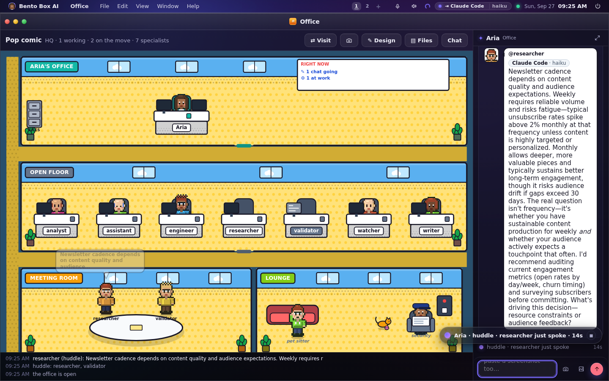

# Bento Box AI: एक ऑपरेटिंग सिस्टम जिसे AI एजेंटों की एक टीम चलाती है

<p align="right"><sub>
<a href="../../README.md">English</a> ·
<a href="README.zh-CN.md">简体中文</a> ·
<a href="README.zh-TW.md">繁體中文</a> ·
<a href="README.ja.md">日本語</a> ·
<a href="README.ko.md">한국어</a> ·
<a href="README.es.md">Español</a> ·
<a href="README.pt-BR.md">Português&nbsp;(BR)</a> ·
<a href="README.fr.md">Français</a> ·
<a href="README.de.md">Deutsch</a> ·
<a href="README.ru.md">Русский</a> ·
<b>हिन्दी</b> ·
<a href="README.ar.md">العربية</a>
</sub></p>

<!-- ai-translated: generated by an AI, not yet proofread; the English README is the reference -->
> **सूचना:** यह अनुवाद AI ने तैयार किया है और अभी किसी व्यक्ति ने इसकी जाँच नहीं की है; कोई अंतर होने पर [अंग्रेज़ी संस्करण](../../README.md) ही मान्य है।

> चैट असिस्टेंट आपके सवालों का जवाब देते हैं। Bento आपकी मशीन को एक पूरी टीम देता है: एक लीड एजेंट
> और कुछ विशेषज्ञ (specialists), जो आपके लिए लगातार चलने वाला काम करते हैं, आपस में बात करके चीज़ें
> सुलझाते हैं, और किसी भी अहम काम से पहले आपसे पूछते हैं।

Bento एक self-hosted AI डेस्कटॉप है, जिसे आप अपने ही हार्डवेयर पर चलाते हैं। इसमें असली विंडो, फ़ाइलें
और टर्मिनल हैं, और इसे ऐसे एजेंट चलाते हैं जो आपकी मंज़ूरी से असली काम करते हैं। इसका "दिमाग" (brain)
[Ollama](https://ollama.com) के ज़रिए कोई local मॉडल हो सकता है, कोई क्लाउड मॉडल (Claude, OpenAI,
OpenRouter या कोई भी OpenAI-compatible endpoint), या कोई ऐसा एजेंट जो आपके पास पहले से इंस्टॉल है:
**Claude Code, Gemini CLI या Codex**। आपकी टीम के अलग-अलग एजेंट अलग-अलग दिमाग पर चल सकते हैं।

हर सुबह यह आपके लिए एक Brief छोड़ता है, यानी उन चीज़ों की सूची जिन पर आपको कुछ करना है। आप अपने
एजेंटों को एक कॉमिक-स्ट्रिप जैसे Office में काम करते देख सकते हैं। यह आपका मेल और कैलेंडर तभी पढ़ता है
जब आप इजाज़त दें, और आप तक आपके फ़ोन पर, Telegram पर और WhatsApp पर पहुँचता है। किसी भी एजेंट का हर
कदम एक ही permission gate से होकर गुज़रता है और एक ऐसे लेजर (ledger) में दर्ज होता है जिसमें छेड़छाड़
छिपी नहीं रह सकती।

[](https://github.com/contact9prime-lab/bento-ai-os/actions/workflows/ci.yml)


```bash
curl -fsSL https://raw.githubusercontent.com/contact9prime-lab/bento-ai-os/master/install.sh | sh
```

[](https://render.com/deploy?repo=https://github.com/contact9prime-lab/bento-ai-os)

फिर **http://127.0.0.1:8321** खोलें। जब तक आप खुद [remote access](../remote-access.md) चालू नहीं
करते, यह सिर्फ़ localhost पर सुनता है। न कोई अकाउंट बनाना है, न कोई telemetry है, और जब तक आप कोई
key नहीं जोड़ते तब तक कोई क्लाउड भी नहीं।


पूरा मैनुअल [`docs/`](../README.md) में है, और यह OS के अंदर Docs ऐप के रूप में भी आता है।

---

## तीन चेहरे, एक प्रोग्राम

Bento तीन जगहों पर चलता है, और हर फ़ीचर तीनों के लिए बनाया जाता है।

| | यह क्या है | कैसे शुरू करें |
|---|---|---|
| **GUI** | macOS, Windows या Linux पर एक विंडो या ब्राउज़र टैब, या आपके नेटवर्क पर एक फ़ोन | `bento` |
| **TUI** | पूरा OS एक टर्मिनल में, किसी सर्वर या SSH पर headless Pi के लिए | `bento tui` |
| **SUI** | Bento ही आपका Linux session है और पूरी स्क्रीन उसी की है | `bento installer` |

> कमांड `bento` है। `agentos` अब भी काम करता है, क्योंकि यह लोगों की shell history, systemd units
> और scripts में मौजूद है।

---

## जल्दी शुरुआत

macOS या Linux पर एक ही कमांड सब कुछ इंस्टॉल कर देती है, Python भी (`uv` के ज़रिए)। यह Bento को
शुरू करती है और "हो गया" कहने से पहले चलते हुए सर्वर से एक सवाल पूछकर जाँचती है कि वह काम कर रहा है।

```bash
curl -fsSL https://raw.githubusercontent.com/contact9prime-lab/bento-ai-os/master/install.sh | sh
```

फिर **http://127.0.0.1:8321** खोलें, या यही setup टर्मिनल में करने के लिए `bento setup` चलाएँ।

अगर पूछने के लिए कोई टर्मिनल मौजूद है, तो installer पूछता है कि क्या यह मशीन आपके दूसरे डिवाइसों से
पहुँच में होनी चाहिए, और अगर हाँ, तो लोग **passphrase** से साइन इन करेंगे या **account** से। बिना
स्क्रीन वाली मशीन पर यही जवाब तय करता है कि आप अभी-अभी इंस्टॉल की गई चीज़ को खोल पाएँगे या नहीं।
`--yes` इसका जवाब नहीं देता, क्योंकि यहाँ खुला पोर्ट मतलब खुला shell।

यह `~/.local/bin` में एक `bento` कमांड छोड़ देता है और ज़रूरत हो तो उसे आपकी shell profile में जोड़
देता है, इसलिए बाद में एक नया टर्मिनल खोलें। `bento --help` वे दस कमांड दिखाता है जिनकी एक नई मशीन
को ज़रूरत होती है, और `bento help --all` बाकी सब।

<details>
<summary><b>किसी चुने हुए पते और पोर्ट पर इंस्टॉल करना</b></summary>

### किसी चुने हुए पते और पोर्ट पर इंस्टॉल करना

जिस सर्वर तक आप SSH से पहुँचते हैं, उस पर `127.0.0.1:8321` किसी और जगह से नहीं पहुँचा जा सकता।
Installer को एक passphrase और एक पता दीजिए, तो वह तैयार होकर आता है, और boot service सही पोर्ट पर
होती है:

```bash
curl -fsSL https://raw.githubusercontent.com/contact9prime-lab/bento-ai-os/master/install.sh \
  | sh -s -- --passphrase='something long and unguessable' --bind=0.0.0.0 --port=8080
```

वह मशीन हर interface पर पोर्ट 8080 पर जवाब देती है और कुछ भी करने से पहले passphrase माँगती है।
सिर्फ़ एक interface इस्तेमाल करना हो, जैसे कोई private VLAN या Tailscale पता, तो वही पता `--bind` को
दें। loopback पर बस अलग पोर्ट चाहिए, तो सिर्फ़ `--port` दें।

> `-s --` रहने दें। `curl … | sh --port=8080` फ़्लैग को `sh` को दे देता है, जो उसे ठुकरा देता है, और
> error में नाम `sh` का आता है, इसलिए लगता है जैसे installer ही खराब है।

| फ़्लैग | यह क्या करता है |
|---|---|
| `--passphrase=SECRET` | साइन इन के लिए यह ज़रूरी करता है, और loopback के बाहर bind करने देता है |
| `--bind=ADDR` | किस interface पर सुनना है (डिफ़ॉल्ट `0.0.0.0`); इसके लिए `--passphrase` चाहिए |
| `--port=N` | कौन सा पोर्ट (डिफ़ॉल्ट `8321`); config में सेव होता है ताकि boot service भी वही इस्तेमाल करे |
| `--yes` | हर वैकल्पिक component को हाँ कहता है। यह पोर्ट कभी नहीं खोलता |
| `--no-service` | न launcher, न boot service (containers, CI) |
| `--no-verify` | काम करने की जाँच को छोड़ देता है |

</details>

<details>
<summary><b>बाद में पता, पोर्ट या passphrase बदलना</b></summary>

### बाद में बदलना

ऊपर की हर चीज़ `~/.agentos/config.json` में (या `$AGENTOS_HOME` के तहत) रहती है, और `bento config`
उसे आपके लिए पढ़ता और लिखता है:

```bash
bento config                       # the whole file, secrets masked
bento config port 8080             # change one setting
bento config remote.bind 0.0.0.0   # dotted paths for nested settings
bento config --edit                # open it in $EDITOR; invalid JSON is refused
```

`bento remote` उन settings को एक साथ रखता है जो तय करती हैं कि मशीन तक कौन पहुँच सकता है:

```bash
bento remote --on --passphrase 'something long' --bind 0.0.0.0   # one shared secret
bento user add alice && bento remote --on --bind 0.0.0.0          # or an account each
bento remote                                                      # what it is now, and who signs in
```

पोर्ट बदलने से पहले से इंस्टॉल boot service अपने-आप नहीं बदलती, क्योंकि systemd unit और LaunchAgent
पोर्ट को अपने अंदर लिख लेते हैं। दोनों कमांड आपको बता देती हैं कि कब
`bento service install && bento service restart` चलाना है।

> जब तक Bento के पास कोई ताला (lock) नहीं होता, यह `127.0.0.1` पर ही सुनता है: या तो एक passphrase,
> या ऐसे accounts जिनसे लोग साइन इन करें। एजेंट के पास असली shell है, इसलिए अकेले `--bind` को ठुकरा
> दिया जाता है। ये दोनों ताले एक-दूसरे के विकल्प हैं। जैसे ही कोई account बनता है, वही ताला बन जाता है।

Linux पर 1024 से नीचे के पोर्ट के लिए अतिरिक्त अनुमति चाहिए। `--port` असली bind करके देखता है और
अगर kernel मना करे, तो वह `sysctl` लाइन, redirect rule या proxy का विकल्प छाप देता है जिससे यह ठीक
हो जाए। सर्वर को root के रूप में चलाने की सलाह नहीं दी जाती।

<details>
<summary><b>इसके बजाय git checkout से</b></summary>

```bash
uv sync                 # install dependencies (or: pip install -e .)
uv run bento            # start the server and open the desktop in your browser
```
</details>

<details>
<summary><b>Docker में</b></summary>

```bash
docker build -t bento .
docker run -d --name bento -p 8321:8321 -v bento-data:/data \
  -e AGENTOS_PASSPHRASE='something long and unguessable' bento
```

पहुँच में आने के लिए container को `0.0.0.0` पर bind करना पड़ता है, इसलिए passphrase ज़रूरी है। जो कुछ
भी रखने लायक है, वह `/data` volume में रहता है।
</details>

अगर Ollama चल रहा है, तो आपके local मॉडल अपने-आप पकड़ लिए जाते हैं। अगर Claude Code, Gemini CLI या
Codex इंस्टॉल और साइन-इन है, तो वह भी दिमाग के रूप में पेश किया जाता है। क्लाउड keys Settings में
डाली जाती हैं।

> यहाँ tool calling मायने रखता है। ऐसा मॉडल चुनें जो tools चला सके (local में कोई भी `qwen*`, या कोई
> क्लाउड मॉडल)। `gemma` जैसे छोटे local मॉडल tools को भरोसेमंद तरीके से नहीं बुलाते।

</details>

---

## Setup का अंत इसे एक काम सौंपकर होता है

Setup कुछ छोटे कदमों की सूची है, और हर कदम पीछे कुछ असली चीज़ छोड़ता है: एक मॉडल जो जवाब देता है, नाम
और चेहरे वाला एक एजेंट, एक crew और एक office, एक mission जो चलता है। कोई कदम तभी टिक होता है जब
मशीन के पास सच में वह चीज़ हो, इसलिए इसे दोबारा चलाना सुरक्षित है, और Setup एक ऐप भी है जिसे आप बाद
में खोल सकते हैं। `bento setup` टर्मिनल में यही कदम है।

यह एक सवाल पर खत्म होता है: **यह मशीन आपके लिए क्या करे?** Missions (लगातार चलने वाले काम) इस हिसाब
से समूहों में हैं कि पूछ कौन रहा है (एक founder, एक coder, एक consultant, या बस आप), और हर एक को दो-तीन
जवाब चाहिए।

| एक founder के लिए | एक coder के लिए | एक consultant के लिए | किसी के भी लिए |
|---|---|---|---|
| हर सुबह मुझे brief करो | आज जो मैंने push किया उसे review करो | किसी client के फ़ोल्डर पर नज़र रखो | मेरे लिए एक फ़ोल्डर पर नज़र रखो |
| मेरे competitors पर नज़र रखो | मेरे tests हरे रखो | हफ़्ते की client report का ड्राफ़्ट बनाओ | कोई पेज बदले तो बताओ |
| मेरे investor update का ड्राफ़्ट बनाओ | कोई dependency नया release निकाले तो बताओ | आज की meetings से पहले मुझे brief करो | हर सुबह मेरा inbox छाँटो |
| कोई खबरों में आए तो बताओ | मेरा standup लिखो | बताओ किसे मुझे जवाब देना बाकी है | आने वाला हफ़्ता दिखाओ |

बटन दबाने से पहले यह ठीक-ठीक छाप देता है कि mission को क्या करने की इजाज़त होगी ("`~/Downloads/*` पढ़ता
है, और कुछ नहीं"), और यह उसी कोड से निकाला जाता है जो permissions लिखता है। आप तक पहुँचने का कोई ऐसा
तरीका जो अभी सेट नहीं है, धुँधला दिखाया जाता है, साथ में वह वाक्य जो बताता है कि उसे कैसे ठीक करें।
आखिरी बटन है **Run it now** (अभी चलाओ), क्योंकि जो schedule आपने कभी चलते नहीं देखा, वह सिर्फ़ एक वादा है।

---

## इसके साथ एक दिन

### होम स्क्रीन और prompt bar

डेस्कटॉप एक अभिवादन, prompt bar, एक लाइन में आज के Brief और आपकी crew के चेहरों के साथ खुलता है।
Bar से कुछ भी पूछें (कहीं से भी **Ctrl+Space**)। हर सवाल Chat में अपना अलग thread बन जाता है, और जो
turn कुछ बनाता है (कोई ऐप, कोई mission, कोई schedule) वह उस बनी हुई चीज़ तक ले जाने वाला बटन देता है।

Bar उन शब्दों से ऐप के अंदर की जगहें भी ढूँढ लेता है जो आप आम तौर पर बोलते हैं। *channel* टाइप करें
तो Settings → Channels मिलता है, जहाँ Telegram और WhatsApp हैं। *flow* या *job* टाइप करें तो Missions
मिलता है।


### Brief: दिन में एक बार, करने लायक चीज़ें

Mission आपको कोई संदेश नहीं भेजता। वह **items** दर्ज करता है: कुछ जिस पर आपकी ज़रूरत है, कोई फ़ैसला
जो लेना है, आपकी जानकारी के लिए कुछ, कुछ जो पहले ही हो चुका है। हर item बताता है कि वह किसके बारे में
है, कब तक, कहाँ से आया, और अक्सर उसके साथ एक ड्राफ़्ट भी होता है। फ़ैसला एक टैप का काम है, और जवाब
वापस उसी item पर आ जाता है।


यही पेज होम स्क्रीन पर है, आपके फ़ोन पर, बटनों वाले Telegram संदेश में, ज़ोर से पढ़कर सुनाया जाता है,
और टर्मिनल में `bento brief` के रूप में। [Brief →](../brief.md)

### Missions: यह मशीन आपके लिए क्या करती है

Missions लगातार चलने वाले काम का ऐप है। **Run** हर mission दिखाता है, उसने पिछली बार क्या किया, इस
हफ़्ते के runs और tokens, और उसके पास कौन-सी permissions हैं। आप अपने शब्दों में एक नया mission बता
भी सकते हैं, और कुछ भी चालू होने से पहले आपको एक ड्राफ़्ट कार्ड मिलता है जिसमें उसका trigger और
permissions साफ़ लिखे होते हैं। **Build** नीचे का editor है: flows, हर roster के specialists, और हर run।


एक mission एक flow है जिसे एक master एजेंट चलाता है, और वह चलते-चलते specialists चुनता है। यह
schedule पर शुरू हो सकता है, किसी संदेश पर, किसी webhook पर, मशीन पर कुछ होने पर, या किसी दूसरे
mission के खत्म होने पर। ड्राफ़्ट और नए missions **disabled** (बंद) हालत में आते हैं, क्योंकि चालू
करना ही अनुमति देना है। `bento job` और `bento flow` यह सब टर्मिनल से करते हैं। [Missions →](../missions.md)


**Run Inspector** किसी भी run को एक पढ़ने लायक timeline के रूप में दिखाता है: किसे कौन-सा काम सौंपा
गया, उन्होंने कौन-से tools इस्तेमाल किए, एजेंटों के बीच सवाल और उनके जवाब, और आखिर में क्या लौटा।

### टीम: Claude Code, Gemini CLI और Codex एक साथ

आपके लीड एजेंट का एक नाम और एक चेहरा है। यह specialists के साथ काम करता है (एक researcher, एक writer,
एक validator, एक engineer, एक watcher, एक analyst, एक assistant, और जो भी आप जोड़ें), और **हर एक
अलग दिमाग पर चल सकता है**। Researcher को Gemini CLI पर, validator को Claude Code पर और writer को Codex
पर रखिए, तो हर एक अपने CLI पर, इस OS के tools के साथ और इस OS के gate के तहत जवाब देता है।


जब कोई specialist किसी CLI पर चलता है, तो उस CLI के अपने tools बंद कर दिए जाते हैं और उसे जो भी tools
दिखते हैं वे MCP के ज़रिए Bento से आते हैं, इसलिए हर कदम फिर भी permission gate से गुज़रता है और लेजर
में दर्ज होता है। Claude Code और Gemini CLI के अपने सारे tools बंद किए जा सकते हैं, इसलिए वे mission के
अंदर चल सकते हैं। Codex एक read-only shell रखता है, इसलिए mission के अंदर Codex एजेंट मशीन के दिमाग पर
चलता है और log में इसकी वजह लिखी होती है।

हर एजेंट एक दिमाग, हाथ, permissions और skills है। **हाथ** (executor profiles) बताते हैं कि एजेंट किन
tools, फ़ोल्डरों, वेब पतों और MCP servers तक पहुँच सकता है, और ये एक ऐसी सीमा हैं जिसके पार कोई grant
नहीं जा सकता। Settings → Agents में एक नक्शा है कि कौन किस तक पहुँचता है, और "Draft it" आपके लिए एक
पूरा नया specialist लिख देता है (persona, tools, skills और रूप), जिसे आप सेव करने से पहले जाँच लेते हैं।
[Agents →](../agents.md) · [टीम →](../team.md)

### Huddles, swarm और democracy

एक ही संदेश में दो या ज़्यादा एजेंटों का ज़िक्र करें (`@researcher @validator should we…`), तो वे एक
**huddle** में बात करके मामला सुलझाते हैं, हर एक अपने दिमाग पर, बारी-बारी से, और आप सब पढ़ सकते हैं।

एजेंट एक-दूसरे से मदद कैसे माँग सकते हैं, यह एक matrix है जो आपके हाथ में है, हर जोड़ी के लिए एक
cell। इसे चलाने के चार तरीके हैं:

| मोड | खाली cell क्या करता है |
|---|---|
| **Off** | एजेंट कभी एक-दूसरे को संदेश नहीं भेजते |
| **Ask me first** | आपसे पूछा जाता है, और "Allow & remember" उस cell को भर देता है |
| **Swarm** | इजाज़त है, और लीड बेझिझक आपके specialists को काम सौंप सकता है |
| **Democracy** | एक परिषद वोट करती है: आपका लीड और दो और एजेंट, और **3 में से 2 फ़ैसला करते हैं** |

Allow और block वाले cells हमेशा मोड से ऊपर रहते हैं। Democracy मोड में huddle आखिरी कही गई बात पर वोट
के साथ खत्म होता है, और हर वोट लेजर में लिखा जाता है। जो फ़ैसला किसी इंसान का होना चाहिए, वह अब भी
इंसान के पास ही जाता है।


### Office: उन्हें काम करते देखें

Office आपकी टीम का कॉमिक-स्ट्रिप जैसा floor plan है। इसमें तब तक कुछ नहीं हिलता जब तक सच में कुछ हुआ
न हो। जब कोई काम सौंपा जाता है तो कागज़ उड़कर डेस्क तक जाते हैं, एक एजेंट सवाल पूछने के लिए चलकर किसी
सहकर्मी के पास जाता है, एक ही mission के दो specialists मेज़ पर मिलते हैं, और जो आपकी मंज़ूरी का
इंतज़ार कर रहा है वह हाथ उठाए लीड के ऑफ़िस के बाहर खड़ा रहता है। कोई कदम फ़ेल हो जाए तो उस डेस्क के
नीचे एक लाल निशान तब तक रहता है जब तक वह एजेंट दोबारा न चले। Lounge में एक guard और एक pet sitter
हैं, जो सिर्फ़ सजावट हैं।



दाईं ओर का chat, Office का अपना agent panel है, और वहाँ शुरू हुआ huddle वहीं बनता दिखता है, टीम के
वोट के साथ खत्म होता है। आप जो रूप चाहते हैं उसे शब्दों में बता सकते हैं ("a cosy greenhouse"), फ़ोन पर
भेजने के लिए एक **Snap** ले सकते हैं, और किसी linked टीम का office देखने जा सकते हैं। यही फ़्लोर
डेस्कटॉप के पीछे एक दृश्य के रूप में है, Chat और हर ऐप के panel में एक पट्टी के रूप में, और टर्मिनल
में `bento office` के रूप में। जिस turn में एजेंटों ने बात की हो, उसके बाद Telegram और WhatsApp को
एक कॉमिक स्ट्रिप मिलती है। [Office →](../office.md)

### आपका मेल और कैलेंडर, आपके लिए पढ़ा गया

**Sign in with Google or Microsoft**, किसी MCP server, या एक app password से एक mailbox और एक कैलेंडर
जोड़ें। एजेंट उन्हें आपकी ओर से पढ़ता है, और बस इतना ही: यह कभी कुछ mark, move या delete नहीं करता,
भेजना एक अलग permission है जिसके लिए हमेशा पूछा जाता है, और मेल को अविश्वसनीय (untrusted) सामग्री माना
जाता है, इसलिए किसी संदेश के अंदर लिखा निर्देश ऐसी चीज़ है जिसकी सूचना दी जाए, न कि जिसे माना जाए।
Inbox triage, meeting की तैयारी और "मुझे किसे जवाब देना बाकी है" जैसे missions इन्हीं पर बने हैं।
[Accounts →](../accounts.md)

Passwords और sign-in tokens आपके अपने home में एक encrypted **vault** में रहते हैं, और जहाँ system
keyring हो वहाँ उसी से उनकी key बनती है। Config में सिर्फ़ एक reference रहता है, और कोई भी चीज़ असली
value नहीं छापती। [Vault →](../vault.md)

### आपके एजेंटों की बनाई फ़ाइलें

जब कोई जवाब किसी फ़ाइल का नाम लेता है, तो उसके साथ **Open** और **Download** बटन आते हैं। मशीन पर यह
host ऐप में खुलती है; फ़ोन से ब्राउज़र उसे दिखाता है। Telegram और WhatsApp को फ़ाइल खुद मिलती है,
Office में हाल ही में बनी चीज़ों की एक filing cabinet है, और `bento files` उन्हें टर्मिनल में दिखाता है।


Claude Code, Gemini CLI या Codex को भेजा गया turn अपना context नहीं खोता। दोबारा शुरू हुए session को बता
दिया जाता है कि उसके पिछली बार चलने के बाद thread में क्या हुआ, और जो session अब CLI के पास नहीं है,
उसकी जगह फ़ेल होने के बजाय thread को text के रूप में दे दिया जाता है। [Files →](../files.md)

### आपके फ़ोन, Telegram और WhatsApp पर

Remote access चालू करें, तो वही डेस्कटॉप फ़ोन पर काम करता है: विंडो sheets बन जाती हैं, dock नीचे आ
जाता है, और हर control कम से कम एक उँगली जितना चौड़ा होता है। *Add to Home Screen* इसे full-screen
ऐप बना देता है।

<p>


</p>

**Telegram और WhatsApp उसी एजेंट तक पहुँचने के channels हैं**, उसी बातचीत, memory, tools और मंज़ूरी
वाले बटनों के साथ जो डेस्क पर हैं। फ़ोन से दिया गया जवाब वही thread आगे बढ़ाता है जो आपने सुबह शुरू किया
था, और जिस फ़ैसले के लिए एजेंट को आपसे पूछना ज़रूरी है, वह वहीं पूछा जाता है। Telegram मालिक के लिए एक
admin console भी है (`/agents`, `/run`, `/flows`, `/office`)।

WhatsApp के दो transport हैं। Meta का Cloud API आधिकारिक है, उसके लिए developer account और एक public
webhook चाहिए, और वह आपके आखिरी संदेश के 24 घंटे के भीतर ही कोई खुला (free-form) जवाब ले जाता है। एक
linked WhatsApp Web डिवाइस को सिर्फ़ एक QR scan चाहिए और उसमें कोई समय-सीमा नहीं है, लेकिन यह
**अनौपचारिक (unofficial)** है, और कुछ भी डाउनलोड होने से पहले Bento यह बात कह देता है।
[WhatsApp →](../whatsapp.md) · [Remote access →](../remote-access.md)

### Linked टीमें

अपनी टीम को किसी दूसरे Bento से, या उसी मशीन के किसी दूसरे account से link करें, तो आपके एजेंट उनके
एजेंटों से पूछ सकते हैं (`ask analyst@office`)। मशीनों के बीच link mutual TLS है, जो एक request से बनता
है जिसे दूसरी तरफ़ वाला मंज़ूर करता है, और दोनों स्क्रीनें उन certificates से छह अंक निकालती हैं जो
उन्होंने देखे। Accounts के बीच यह साइन-इन रहते हुए दी गई एक मंज़ूरी है।

Link अपने-आप कुछ भी अनुमति नहीं देता। उनके एजेंट अपने ही gate के तहत, अपने ही tools से जवाब देते हैं,
और दूसरी तरफ़ से आया हर जवाब अविश्वसनीय माना जाता है। आप चुनते हैं कि हर link आपके किन एजेंटों तक पहुँच
सकता है, आप किसी linked एजेंट को mission के roster पर रख सकते हैं, और दोनों तरफ़ के लोग Team Chat में
एक-दूसरे को संदेश भेज सकते हैं, जिसे कोई एजेंट नहीं पढ़ता। `bento link` यह सब करता है।
[Linked टीमें →](../team.md)

### टर्मिनल में

`bento tui` पूरा OS एक टर्मिनल में है, और लगभग हर चीज़ के लिए एक verb है, इसलिए SSH पर एक headless
Pi के पास भी वही फ़ीचर हैं जो डेस्कटॉप के पास।


`bento brief`, `bento job`, `bento flow runs`, `bento team`, `bento office`, `bento link`,
`bento mail`, `bento vault`, `bento audit`, `bento agents` और बाकी सब वही rows पढ़ते हैं जो डेस्कटॉप
पढ़ता है, और कई तो सर्वर बंद होने पर भी काम करते हैं। [TUI →](../tui.md)

### पूरा Linux session (SUI)

लॉग इन करें और Bento को अपने Linux session के रूप में पाएँ। डेस्कटॉप background layer पर एक Wayland
layer surface के रूप में बनाया जाता है, इसलिए native ऐप की विंडो सामान्य क्रम में उसके ऊपर रहती हैं, और
menu bar और dock compositor के पास उसी तरह आरक्षित रहते हैं जैसे GNOME या KDE का panel। Native ऐप
आधी और चौथाई स्क्रीन पर snap होते हैं, tile होते हैं, float करते हैं, और Alt-Tab से बदले जाते हैं।


Remote Desktop मशीन की असली स्क्रीन, native ऐप समेत, Bento के अपने साइन-इन वाले connection पर फ़ोन के
ब्राउज़र तक पहुँचाता है। VNC server कभी `127.0.0.1` से बाहर नहीं जाता।
[Session UI →](../session-ui.md)

### कई लोग, एक मशीन

एक account जोड़ें, तो हर व्यक्ति को अपना home मिलता है: अपना database, memory, एजेंट, office, channels,
मेल और vault। हर व्यक्ति के लिए एक अलग directory है, इसलिए कोई भूला हुआ `WHERE` clause किसी की memory
लीक नहीं कर सकता। Admins मशीन को भी संभालते हैं, और वही username और password फ़ोन से भी काम करते हैं।
[Users →](../users.md)


### बैकअप और क्लाउड में एक स्टैंडबाय मशीन

`bento backup` पूरी मशीन को एक सील की हुई फ़ाइल में रखता है: हर अकाउंट, vault और workspace। `bento restore` इसे इसी मशीन पर या किसी नई मशीन पर वापस ले आता है। [बैकअप →](../backup.md)

क्लाउड मशीन पर दूसरा Bento जोड़ें, तो वह एक सील की हुई कॉपी के साथ तैयार रहता है। अगर आपकी मशीन चुप हो जाए, तो क्लाउड आपके missions और channels जारी रखता है, और आपकी मशीन लौटने पर काम वापस दे देता है। active sync चालू करें, तो हर बदलाव, हर chat message समेत, कुछ ही सेकंड में क्लाउड तक पहुँचता है। [क्लाउड स्टैंडबाय →](../standby.md)

### अपना एजेंट शेयर करें, किसी और का fork करें

जिस एजेंट को आपने गढ़ा है उसे एक फ़ाइल के रूप में शेयर करें: उसकी skills, specialists, missions, चुने
हुए ऐप और MCP servers के ढाँचे। आपकी memory, बातचीत और credentials कभी साथ नहीं जाते। तैयार फ़ाइल पर एक
leak scan चलता है और अगर उसे कोई secret मिले तो वह फ़ाइल को ठुकरा देता है, और इसे टालने का कोई तरीका
नहीं है। Fork सब कुछ बंद और बिना किसी permission के आता है, और अंत में आपको बताता है कि क्या आया और
पहले क्या आज़माएँ। आप किसी share को **host** भी कर सकते हैं, ताकि साथी एक ऐसी key से live संस्करण लें
जिसे आप रद्द कर सकें। [Agent sharing →](../agent-sharing.md)

ऐप भी इसी तरह चलते हैं। कोई भी अपनी repo से एक ऐप publish कर सकता है, और उसे पाने वाली मशीन कोड को
दोबारा scan करती है, signature जाँचती है और याद रखती है कि उस पर किसने sign किया, जैसे SSH किसी host
key के साथ करता है। [App registry →](../app-registry.md)

### OpenClaw से आ रहे हैं

Bento OpenClaw plugins को एक scan और एक consent screen के ज़रिए इंस्टॉल कर सकता है, और वे बंद हालत में
आते हैं। यह किसी plugin को खुद host कर सकता है ताकि हर tool call Bento के gate से गुज़रे, या एजेंट से
plugin को उसके manifest से **native रूप में दोबारा बनवा** सकता है, उन हिस्सों से जिन्हें Bento पहले से
नियंत्रित करता है। एक port की समाप्ति एक report पर होती है: क्या आ गया, क्या नहीं आया, और हर कमी की
आपको क्या कीमत चुकानी पड़ेगी। [OpenClaw plugins →](../openclaw-plugins.md)

### रूप और किरदार

डिफ़ॉल्ट रूप **Nova** है, immersive मोड चालू के साथ: एक होम दृश्य, जिस विंडो में आप काम कर रहे हैं उस
पर glass, हर ऐप में एक icon set और एक control kit, और एक wallpaper जो दिन के समय के साथ बदलता है।
**Build a theme** तीन रंगों, कोनों, गहराई, glass और type से आपका अपना theme बनाता है, और आपको palette
का contrast बताता है। पाँच design languages (Bento, Liquid Glass, Spatial, Claymorphism, Minimalism)
पहले से मौजूद हैं, और **Effects** धीमी मशीन पर glass कम कर देता है।
[डेस्कटॉप →](../desktop.md#immersive-experience)

हर एजेंट का, और आपका भी, एक pixel किरदार है जिसे सर्वर एक सेव की हुई recipe से बनाता है, और वह Chat,
approvals, Logs, Office और टर्मिनल में एक जैसा दिखता है। किसी को शब्दों में बताइए, या "Draft it" को नए
specialist के साथ उसका डिज़ाइन बनाने दीजिए।

---

## एजेंट क्या कर सकता है

- **मशीन पर काम करना**: कमांड चलाना, फ़ाइलें पढ़ना और लिखना, वेब से चीज़ें लाना, host पर ऐप और फ़ाइलें
  खोलना, डेस्कटॉप notifications भेजना।
- **काम पूरा करना**: reports और decks लिखना, उन्हें ऐसी जगह सेव करना जहाँ आप खोल सकें, और आपके फ़ोन पर
  भेजना।
- **OS बनाना**: App Studio एक विवरण से नए ऐप बनाता है, missions एक वाक्य से ड्राफ़्ट होते हैं, MCP
  servers हज़ारों की एक सूची से जोड़े जाते हैं।
- **याद रखना**: memory, एक knowledge graph और एक स्थायी soul, जो हर बातचीत के बाद सीखे जाते हैं और
  आप चाहें तो **spaces** (projects) तक सीमित रहते हैं।
- **काम सौंपना**: किसी specialist को काम देना, huddle करना, या किसी linked टीम से पूछना।
- **खुद को बढ़ाना**: Bento का अपना source पढ़ना और बदलना, पहले एक snapshot लेकर, और restart से पहले
  test suite को gate बनाकर।

सीधी भाषा में पूछें: *"every morning at 8, brief me on my market"*, *"@researcher @validator
should our newsletter be weekly?"*, *"build me a habit tracker and pin it to desktop 2"*।
[एजेंट →](../agent.md)

---

## मॉडल और providers

- **Ollama** (local), अपने-आप मिल जाता है। कुछ भी आपकी मशीन से बाहर नहीं जाता।
- **Claude Code, Gemini CLI या Codex**: यहाँ पहले से इंस्टॉल और साइन-इन कोई एजेंट दिमाग बन सकता है, या
  किसी एक specialist का दिमाग। Bento उसे कभी कोई key नहीं देता।
- **Anthropic, OpenAI, OpenRouter**, या कोई भी OpenAI-compatible endpoint (LM Studio, vLLM, Groq…)।
- **Image generation** Google Gemini या OpenAI से, जब कोई key सेट हो।

दिमाग एक ही चुनाव है, एक executor और उसका एक मॉडल, जो एक जगह तय होता है और menu bar में दिखता है।
`ANTHROPIC_API_KEY`, `OPENAI_API_KEY`, `OPENROUTER_API_KEY` और `GOOGLE_API_KEY` अपने-आप पकड़ लिए जाते
हैं। Token Analytics और `bento usage` दिखाते हैं कि हर turn ने कितना खर्च किया। [Models →](../models.md)

---

## सुरक्षा

- **हर चीज़ के लिए एक gate।** किसी भी एजेंट, ऐप, mission या linked टीम का हर tool call permission
  engine से गुज़रता है और एक audit row लिखता है। लेजर hash-chained है, इसलिए कोई बदलाव या हटाया गया
  row पकड़ में आ जाता है, और इसे ऐसा सेट किया जा सकता है कि जो कुछ भी यह दर्ज न कर सके, उसे ठुकरा दे।
- **Autonomy levels, grants और approvals।** सिर्फ़ पढ़ने वाला काम चलता है, और सिस्टम को बदलने वाली
  कोई भी चीज़ पहले पूछती है, जब तक आपने उसकी अनुमति न दी हो। कुछ चीज़ों (मेल भेजना, एजेंट के
  अविश्वसनीय सामग्री पढ़ने के बाद कोई जोखिम भरा कदम) के लिए हमेशा एक इंसान चाहिए, और जिस run को कोई
  देख नहीं रहा वह उन्हें ठुकरा देता है।
- **हाथ एक सीमा हैं।** एजेंट का executor profile उन tools, फ़ोल्डरों, वेब और MCP को सीमित करता है जिन
  तक वह पहुँच सकता है, चाहे उसे कुछ भी grant किया गया हो।
- **Quarantine।** कोई ऐप या webhook जो बेकाबू हो जाए (एक मिनट में सैकड़ों calls) तब तक रोक दिया जाता है
  जब तक आप उसे छोड़ न दें।
- **Sandboxes।** bubblewrap के साथ shell और Terminal एक फ़ोल्डर में बंद रहते हैं, और accounts वाली मशीन
  पर हर व्यक्ति का shell दूसरे homes से अलग बंद रहता है। ऐप एक opaque-origin iframe में चलते हैं और OS
  तक सिर्फ़ एक token के ज़रिए पहुँचते हैं जिसे gate जाँचता है।
- **हर extension एक ताले से होकर आता है।** ऐप, MCP servers, missions, OpenClaw plugins और fork किए गए
  एजेंट, सब एक scan और एक consent screen से होकर आते हैं, और जहाँ लागू हो वहाँ बंद हालत में आते हैं।
- **डिफ़ॉल्ट रूप से निजी।** यह `127.0.0.1` पर bind होता है, और जब तक आप इसे कोई ताला नहीं देते तब तक
  remote access बंद रहता है।

[Security →](../security.md)

---

## पहले से मौजूद ऐप

| ऐप | यह क्या है |
|---|---|
| **Agent Chat** | एजेंट से बात करें: streaming, tool cards, approvals, huddles, file chips, आवाज़, images |
| **Brief** | आपके missions से आज के items, हर एक पर एक बटन के साथ |
| **Missions** | Run: मशीन आपके लिए क्या करती है। Build: flows, specialists और हर run |
| **Office** | काम करती हुई आपकी टीम, अपने chat panel के साथ |
| **Run Inspector** | एक run एक timeline के रूप में, हिस्सा लेने वालों के ग्राफ़ के साथ |
| **Team Chat** | linked टीमों के लोगों के साथ संदेश |
| **Files** | आपका workspace और आपके एजेंटों की बनाई चीज़ें |
| **Terminal** | एक असली shell, sandbox फ़ोल्डर में बंद |
| **App Studio** | एक ऐप का वर्णन करें और एजेंट उसे live बनाता है |
| **Store** | ऐप, skills और MCP servers |
| **Memory, Knowledge Graph, Soul, Profile** | एजेंट क्या जानता है, और वह कौन है |
| **Permissions, Audit, Quarantine, Logs** | grants, लेजर, क्या रोका गया, और डायरी |
| **Applications, Web, Remote Desktop** | native ऐप, आपका असली ब्राउज़र, असली स्क्रीन |
| **Automations, Scheduler, Snapshots** | routines और hot corners, jobs, restore points |
| **Train** | अपने GPU पर अपने मॉडल fine-tune करें |
| **Docs, Setup, Settings** | यह मैनुअल, setup के कदम, और बाकी सब कुछ |

---

## MCP और API

**MCP servers**: इन्हें एक सूची से जोड़ें (Playwright, filesystem, git, GitHub, Canva, Notion और हज़ारों
और) या अपने खुद के `stdio`/`http` server की ओर इशारा करें। इनके tools एजेंट तक और उसके बनाए ऐप तक उसी
gate से होकर पहुँचते हैं।

**Programmable**: एक बार के runs के लिए `bento ask "…"`, एक REST API (`POST /api/chat`, `POST /api/tool`
और भी), और streaming chat और टर्मिनल के लिए WebSockets। [API reference →](../api-reference.md)

---

<details>
<summary><b>इसे अपने पूरे Linux डेस्कटॉप के रूप में चलाएँ (SUI)</b></summary>

## इसे अपने Linux डेस्कटॉप के रूप में चलाएँ (SUI)

```bash
bento installer      # detects your distro, installs what is missing, adds it to the login screen
```

फिर लॉग आउट करें और login screen पर **Bento Box AI** चुनें। आपका मौजूदा डेस्कटॉप जैसा है वैसा रहता है,
और वापस जाने के लिए बस लॉग आउट करके उसे फिर से चुनना है।

Installer हर उस package का नाम बताता है जो उसे चाहिए और क्यों, और पहले पूछता है। Compositor engine
(sway) MIT है। Native surface (GTK, PyGObject, WebKitGTK) LGPL है, इसलिए Bento उसे साथ भेजने के बजाय
उसके लिए पूछता है, और उसके बिना भी session एक Chromium विंडो में चलता है।
[Licensing →](../licensing.md)

`bento doctor --session` जाँचता है कि इस मशीन पर असल में क्या डेस्कटॉप बना सकता है, और एक नतीजा बताता है।

</details>

<details>
<summary><b>Debian/Ubuntu package (.deb) के रूप में इंस्टॉल करें</b></summary>

## Debian/Ubuntu package (.deb) के रूप में इंस्टॉल करें

ऐप और एक Python environment के साथ एक self-contained `.deb`, इसलिए इंस्टॉल करने के लिए नेटवर्क नहीं
चाहिए:

```bash
./packaging/build-deb.sh                                   # → packaging/dist/agentos_<ver>_<arch>.deb
sudo dpkg -i packaging/dist/agentos_<ver>_amd64.deb        # installs to /opt/agentos + launcher + service
systemctl --user enable --now agentos                      # start at login
```

यह `bubblewrap` और `xdg-utils` को Recommends करता है, और `ollama`, `nodejs` और `git` को Suggests करता
है। Session stack सिर्फ़ Suggested है, क्योंकि apt डिफ़ॉल्ट रूप से Recommends को इंस्टॉल कर देता है।

</details>

<details>
<summary><b>Boot पर शुरू होने वाले ऐप के रूप में इंस्टॉल करें</b></summary>

## Boot पर शुरू होने वाले ऐप के रूप में इंस्टॉल करें

```bash
bento install      # app launcher + a background service that starts at login or boot
```

यह Linux पर एक systemd user service, macOS पर LaunchAgents और Windows पर Startup entries इस्तेमाल करता
है, और कमांडों का एक ही सेट तीनों को चलाता है:

```bash
bento service status       # is it running, will it come back at boot, does the port answer
bento service restart      # also start, stop
bento service logs -f
bento uninstall            # remove launcher and service; your data stays
```

`bento update --apply` pull करता है, sync करता है, हर account को migrate करता है, tests चलाता है और
restart करता है। यह वापस पुराने पर तभी जाता है जब update किसी पास होते test को लाल कर दे।

</details>

<details>
<summary><b>Launch modes और सबसे ज़्यादा इस्तेमाल होने वाली कमांड</b></summary>

## Launch modes

| कमांड | यह क्या करती है |
|---|---|
| `bento` | सर्वर शुरू करती है और आपके ब्राउज़र में डेस्कटॉप खोलती है |
| `bento serve --no-browser --port 8321` | headless सर्वर (boot service यही चलाती है) |
| `bento app` | डेस्कटॉप अपनी अलग विंडो में |
| `bento tui` | पूरा OS एक टर्मिनल में |
| `bento setup` | setup के कदम टर्मिनल में (दोबारा करने के लिए `--again`) |
| `bento job` / `bento flow` | टर्मिनल से missions |
| `bento brain` | कौन-सा executor जवाब देता है, और उसका कौन-सा मॉडल |
| `bento team` | हर एजेंट किस दिमाग पर जवाब देता है, और वे कैसे बात करते हैं |
| `bento doctor` | environment की जाँच (Linux session के लिए `--session`) |
| `bento remote` | इस मशीन तक कौन पहुँच सकता है, और वे कैसे साइन इन करते हैं |
| `bento user add <name>` | accounts; पहला account इस मशीन को अपना लेता है और admin होता है |
| `bento reset` | factory reset, पुष्टि के लिए एक टाइप किया गया वाक्यांश |
| `bento help --all` | हर कमांड |

</details>

<details>
<summary><b>ज़रूरतें, और हर वैकल्पिक हिस्सा क्या खोलता है</b></summary>

## ज़रूरतें

- **Python 3.10 या नया** और [**uv**](https://docs.astral.sh/uv/) (या pip)। Installer दोनों ले आता है।
- **एक दिमाग**: [Ollama](https://ollama.com) के साथ `qwen3.5:9b` जैसा कोई tool चलाने वाला मॉडल, एक
  क्लाउड API key, या इंस्टॉल और साइन-इन किया हुआ Claude Code, Gemini CLI या Codex।

वैकल्पिक, और हर एक उसके licence के साथ पेश किया जाता है:

- **Linux session (SUI)**: `sway` और उसके साथी, साथ में `python3-gi`, `python3-gi-cairo`,
  `gir1.2-gtklayershell-0.1` और `gir1.2-webkit2-4.1`। [विवरण →](../session-ui.md)
- **wayvnc और novnc**, फ़ोन के ब्राउज़र से Remote Desktop के लिए।
- **bubblewrap** (`bwrap`), फ़ोल्डर sandbox और हर account के shell jail के लिए।
- **Node/npx** या **uvx**, MCP servers चलाने के लिए, और WhatsApp link के लिए।
- **git**, repositories से skills इंस्टॉल करने और updates पाने के लिए।

</details>

---

## आर्किटेक्चर

```
agentos/                 # the Python package keeps its original name; see "On the name"
├── __main__.py    # the bento command
├── server.py      # FastAPI: the desktop, REST API, WebSocket streams
├── agent.py       # the agent loop: plan, act through tools, observe; every call through the gate
├── policy.py      # the permission engine (PDP): grants, ceilings, the audit ledger
├── fabric.py      # the control plane: specialists, flows, huddles, the council
├── executors.py   # Claude Code, Gemini CLI and Codex as brains; mcpbridge.py hands them our tools
├── flows.py       # missions: definitions, triggers, declared permissions; jobs.py is the catalogue
├── brief.py       # the Brief
├── office.py      # the Office's plan; avatars.py paints every character
├── teamlink.py    # linked teams (mTLS, handshakes); teamchat.py for the people
├── mail.py, calendars.py, signin.py, vault.py   # accounts and their secrets
├── users.py       # one home per person
├── memory.py      # SQLite: conversations, memory, knowledge graph, runs, audit
├── shellhost.py   # the SUI: the desktop as a wlr-layer-shell surface
├── tui_app.py     # the TUI
└── ui/
    ├── src/       # the desktop's source; edit here
    └── index.html # built by `python -m agentos.ui.build` (do not edit)
```

State `~/.agentos/` में रहती है: `config.json`, database, `soul.md`, vault, और `users/` के तहत हर
account का एक फ़ोल्डर। एजेंट `~/AgentOS/` में काम करता है। [Architecture →](../architecture.md)

### नाम के बारे में

प्रोडक्ट का नाम **Bento Box AI** है। Python package, data फ़ोल्डर और systemd unit जानबूझकर अब भी
`agentos` कहलाते हैं: इनका नाम बदलने से हर मौजूदा install की service, config और scripts टूट जाते, और
बदले में किसी को कुछ भी दिखने लायक नहीं मिलता। कोड MIT है, इसलिए बेझिझक fork करें और अपने नाम से
ship करें। [Licensing और trademarks →](../licensing.md)

---

*Bento Box AI एक खुला, local-first एजेंटिक OS है: एक AI डेस्कटॉप और एजेंटों की एक टीम, जिसे आप खुद
Linux, macOS या Windows पर चलाते हैं।*
