# Bento Box AI — 로컬 우선 에이전트 운영체제

<p align="right"><sub>
<a href="../../README.md">English</a> ·
<a href="README.zh-CN.md">简体中文</a> ·
<a href="README.zh-TW.md">繁體中文</a> ·
<a href="README.ja.md">日本語</a> ·
<b>한국어</b> ·
<a href="README.es.md">Español</a> ·
<a href="README.pt-BR.md">Português&nbsp;(BR)</a> ·
<a href="README.fr.md">Français</a> ·
<a href="README.de.md">Deutsch</a> ·
<a href="README.ru.md">Русский</a> ·
<a href="README.hi.md">हिन्दी</a> ·
<a href="README.ar.md">العربية</a>
</sub></p>

**당신의 컴퓨터에, 두뇌를.** Bento Box AI는 셀프 호스팅 **AI 데스크톱 환경**입니다. 창, 앱, 파일,
터미널을 갖춘 완전한 데스크톱을, 당신의 컴퓨터에서 **실제 동작**을 수행하는 **자율 AI 에이전트**가
움직입니다. 완전한 프라이버시를 위해 [Ollama](https://ollama.com)로 로컬 모델을 사용하거나, 클라우드
모델(Anthropic Claude, OpenAI, OpenRouter, 또는 모든 OpenAI 호환 엔드포인트)을 사용하세요 — 언제나
당신의 승인 아래에서요. 에이전트는 웹을 탐색하고, 자신의 앱을 만들고, 작업을 예약하고, 배운 것을
기억하고, 자기 자신의 소스 코드를 확장하고, Telegram이나 WhatsApp으로 당신에게 연락할 수 있습니다.


`http://127.0.0.1:8321`에서 실행됩니다 — 기본적으로 비공개이며, 부팅 시 시작되는 서비스로 설치할 수 있습니다.

```bash
curl -fsSL https://raw.githubusercontent.com/contact9prime-lab/bento-ai-os/master/install.sh | sh
```

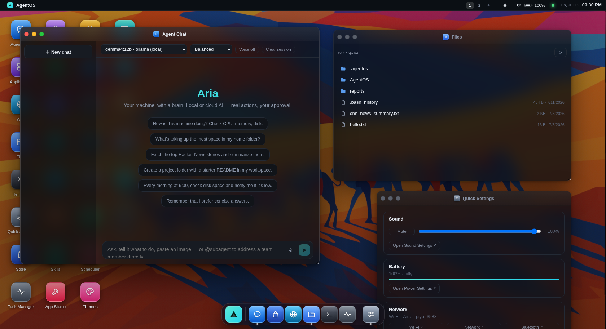

**전체 문서는 [`docs/`](../README.md)에 있습니다** — 설치, 데스크톱과 모든 앱에 대한 사용자 가이드,
에이전트와 그 도구들, 앱 만들기, 통합, API 레퍼런스, 그리고 문제 해결까지.

---

## 설정은 열한 단계이며, 각 단계는 무언가를 남긴다

진행 막대가 달린 설정 양식이 아닙니다. 모든 단계는 **실제로 무언가를 만들어냅니다** — 답하는 모델,
존재하는 에이전트, 실행되는 플로우, 발화하는 스케줄 — 그리고 무엇을 요청하기 전에 당신이 결국 무엇을
얻게 될지를 먼저 알려줍니다.

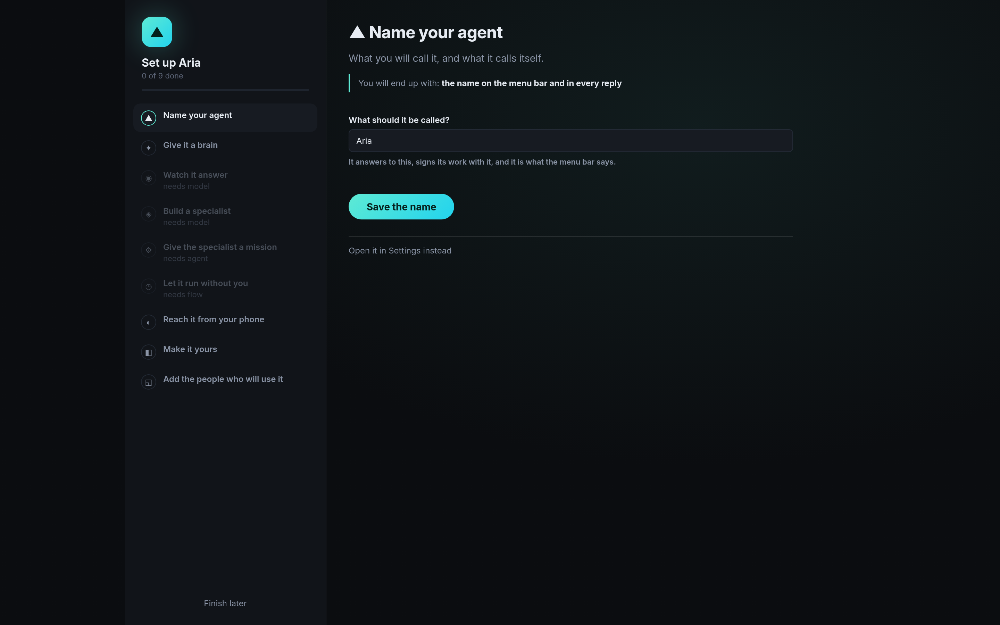

모든 단계는 **기억되는 것이 아니라 탐지됩니다**: 기계가 그것을 가지고 있기 때문에 체크되는 것입니다.
에이전트를 삭제하면 그 단계는 다시 할 일로 돌아갑니다. 그것이 재실행을 안전하게 만드는 이유입니다 —
그리고 여기서 재실행은 흔한 일입니다. **설정 또한 하나의 앱이기 때문입니다.** 몇 달 전에 설정한 기계에서
어떤 단계가 무엇을 하는지 보려면 언제든 열어보세요.

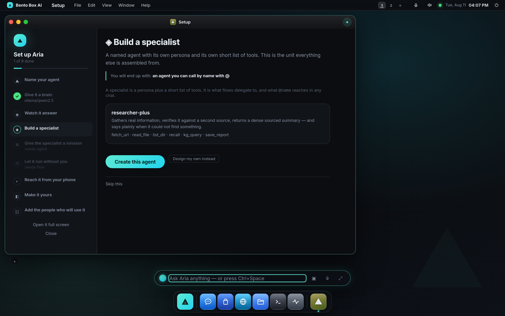

같은 카탈로그, 같은 탐지, 같은 창들 — 터미널에서도 마찬가지입니다. SSH를 통한 `bento setup`은 브라우저가
멈춘 바로 그 지점에서 이어집니다.

---

## 그것이 당신에게 가장 먼저 묻는 것은 어떤 일을 할지다

설정은 문이 아니라 질문으로 끝납니다: **일을 하나 주세요.** 세 가지 중 하나를 고르고, 두 가지 질문에
답하면, 앱을 하나도 열기 전에 이 기계는 이미 당신을 위해 무언가를 하고 있습니다.

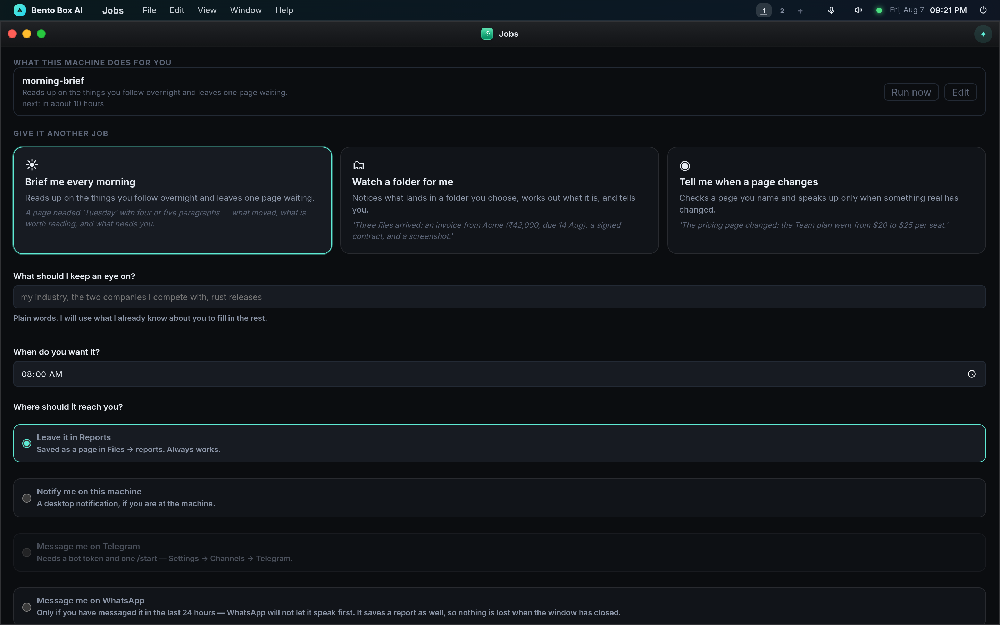

| | |
|---|---|
| **매일 아침 브리핑해줘** | 당신이 관심 두는 것들을 밤새 살펴보고 페이지 한 장을 대기시켜 둡니다 |
| **폴더를 지켜봐줘** | *당신이 고른* 폴더에 무엇이 들어오는지 알아채고, 그것이 무엇인지 파악해 알려줍니다 |
| **페이지가 바뀌면 알려줘** | 페이지를 확인하고 진짜로 무언가 바뀌었을 때만 입을 엽니다 |

그것이 하지 않을 두 가지가 있습니다. 당신이 보지 못한 것은 스스로에게 절대 허가하지 않습니다: 패널은
버튼을 누르기 전에 정확한 권한을 인쇄하며, 그것을 작성하는 바로 그 코드가 계산합니다 —
"`~/Downloads/*`를 읽고, 그 외에는 아무것도 하지 않음". 그리고 작동하지 않는 연락 수단은 제안하지
않습니다: 페어링되지 않은 Telegram은 그것을 해결할 문구와 함께 회색으로 표시되며, 숨겨지거나 조용히
대체되지 않습니다.

마지막 버튼은 **"지금 실행해서 작동하는 걸 보여줘"**입니다 — 발화하는 걸 본 적 없는 스케줄은 약속일
뿐이고, 새 사용자에게는 그 약속을 믿을 이유가 없기 때문입니다.

일(job)은 새로운 종류의 무언가가 아니라 하나의 *플로우*입니다: 같은 스케줄러, 같은 권한 게이트, 같은
감사 원장. 화면 없는 기계에서는: `bento job recipes`, 그리고 `bento job add morning-brief --topics "…"`.

---

## 세 얼굴, 하나의 프로그램

Bento는 세 곳에서 실행되며, **모든 기능은 세 곳 모두를 위해 만들어집니다.** 이것은 모든 변경에 대해
마지막이 아니라 가장 먼저 묻는 질문입니다.

| | 그것이 무엇인가 | 시작하는 법 |
|---|---|---|
| **GUI** | macOS, Windows, Linux 위의 창(또는 탭). 추가로 설치할 것이 없습니다 | `bento` |
| **TUI** | 터미널 속의 전체 OS — 서버, 또는 SSH를 통한 화면 없는 Pi를 위한 것 | `bento tui` |
| **SUI** | Bento가 **곧** 당신의 Linux 세션입니다: 기계를 소유합니다 | `bento installer` |

> 명령은 `bento`입니다. `agentos`도 여전히 작동하며 앞으로도 그럴 것입니다 — 사람들의 셸 히스토리,
> systemd 유닛, 스크립트에 남아 있으니, 우리가 선택한 이름 변경이 그것을 앗아가서는 안 됩니다.

---

## 실제로 작동하는 모습

| | |
|---|---|
| 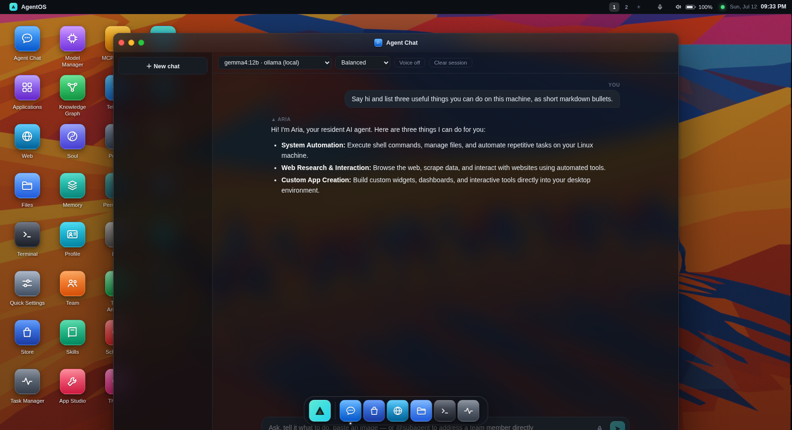 **에이전트 채팅** — 당신의 기계와 대화하세요; 스트리밍 답변, 도구 카드, 승인, 음성 | 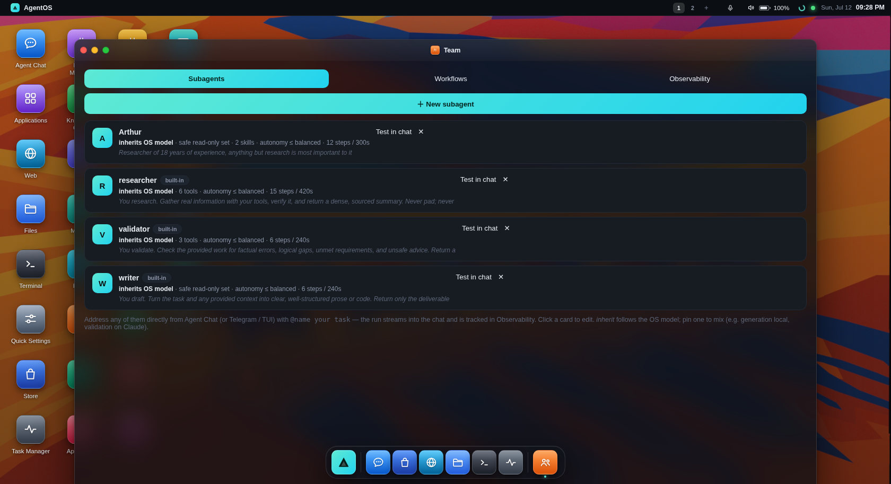 **팀** — 전문 서브에이전트와 시각적 워크플로우, 단계별 모델 조합 지원 |
| 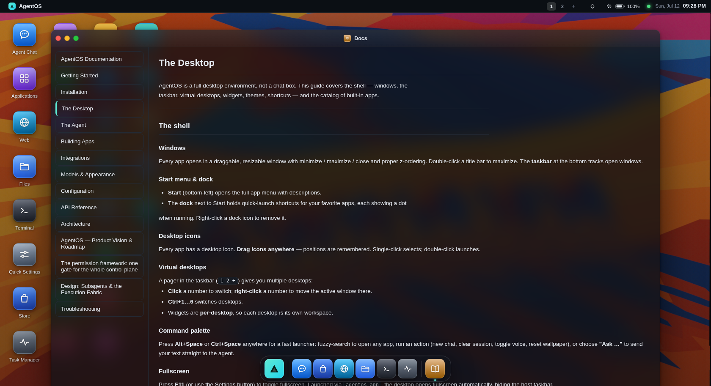 **문서** — 전체 매뉴얼이 OS 안에 살아 있습니다 | 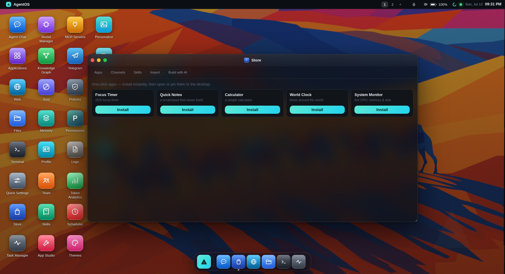 **스토어** — 원클릭 앱, 스킬, MCP 도구 채널 |

### 여러 사람, 하나의 기계

계정을 추가하면 각 사람은 **자기만의 홈**을 갖습니다 — 자신의 데이터베이스, 메모리, 에이전트, 채널,
MCP 서버, 자격 증명. 한 번 잊은 `WHERE` 절이 새어나가는 `user_id` 컬럼이 아니라: 자기만의 디렉터리
입니다. 두 개의 파일은 서로에게 새어나갈 수 없기 때문입니다.

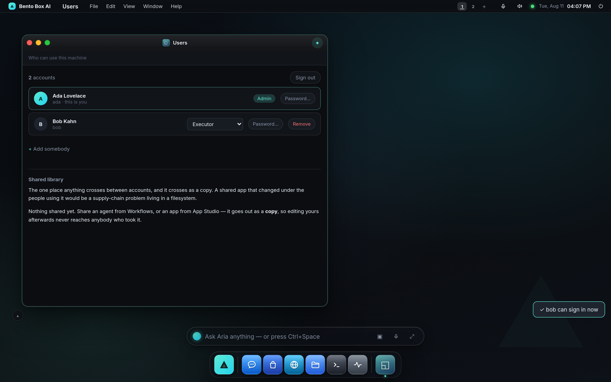

두 가지 역할 — **executor**(자기 홈 안의 모든 것)와 **admin**(그것에 더해 기계까지). 설정은 공유된
채로 남으므로, 사람마다 하나가 아니라 기계에 하나의 제공자 키가 있습니다. 에이전트와 앱은 공유
라이브러리를 통해 복사본으로서 의도적으로 넘나듭니다.

그리고 그것은 **하나의 로그인, 여기서든 어디서든**입니다: 계정이 있는 기계는 그 계정들로 잠겨 있으므로,
누군가의 주머니 속 전화기는 데스크톱과 동일한 사용자 이름과 비밀번호를 쓰고 자기 홈으로 들어갑니다.
새로 만들거나 공유하거나 잊어버릴 두 번째 공유 암호구가 없습니다.

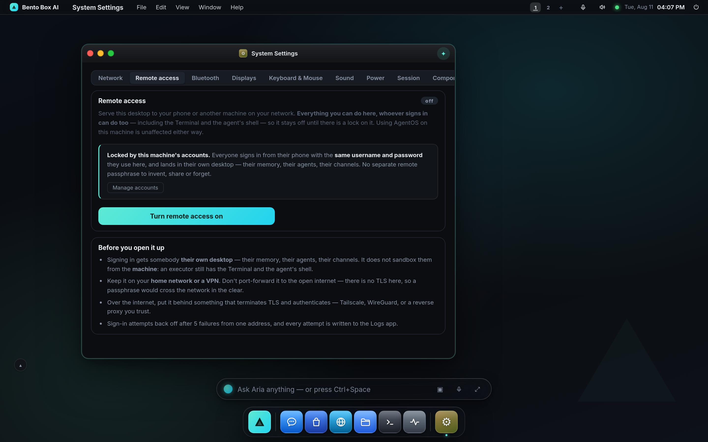

### 그것이 무엇을 하고 있는지 볼 수 있다

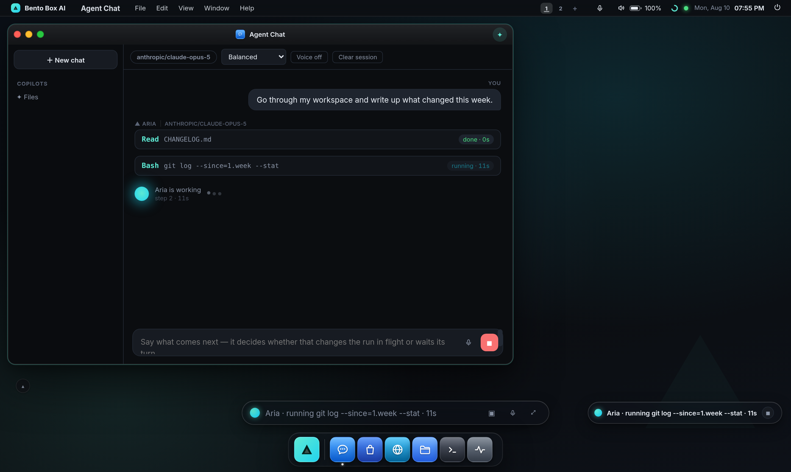

턴은 대부분 기다림이고, 4분 동안 "작동 중…"은 아무것도 말해주지 않습니다 — 생각하는 모델과 조용히
죽어버린 실행이 그 아래에서 똑같아 보입니다. 모든 대기 화면은 **무엇을 하고 있으며 얼마나 오래
걸렸는지**를 말해줍니다: 실행 중인 호출은 제자리에서 나이를 먹고(`running · 2m 14s`), 완료된 호출은 그
소요 시간을 유지하며, 그 아래 행은 단계와 턴 총합을 담습니다. 같은 문장이 프레즌스 버블과 옴니바에도
나타나므로, 채팅을 열지 않고도 데스크톱에서 답을 얻을 수 있습니다.

### 그것은 자기 팀을 만들 수 있다 — 그리고 그러기 전에 묻는다

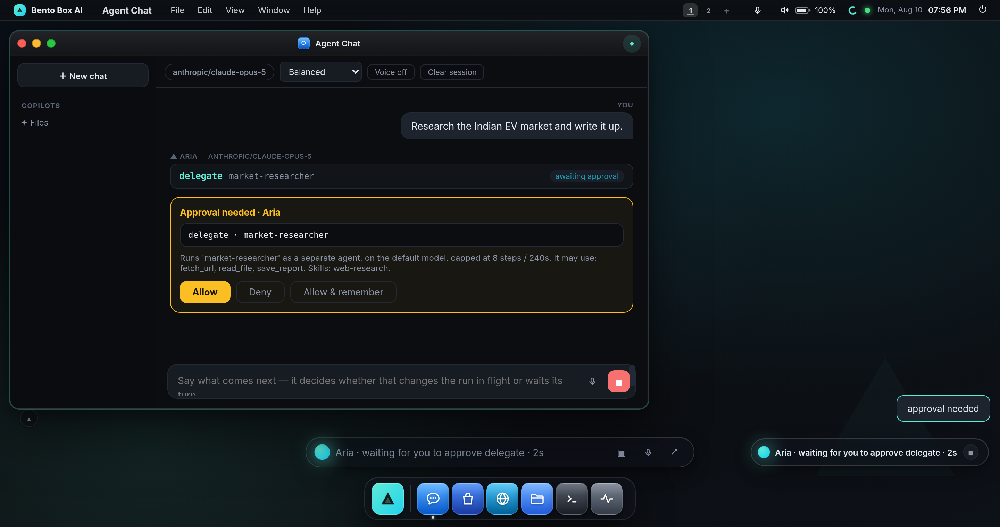

기존 전문가가 맞지 않을 때, 에이전트는 하나를 **만들어** 그것에게 위임합니다. 에이전트를 정의하는 것은
그것에게 아무 권한도 주지 않습니다; 실제로 처음 사용될 때 당신은 그것이 실행되는 모델, 그 예산, 그리고
그 정의가 부여하는 정확한 도구와 스킬을 명시한 카드를 받습니다 — 그릴 수 없는 행위자에 대한 동의는
이름뿐인 동의이기 때문입니다. `researcher`를 승인하는 것은 `deploy-bot`을 승인하는 것이 아니며, 그
허가는 다른 모든 것처럼 권한에서 취소할 수 있습니다. [작동 방식 →](../security.md)

### 그것은 자기 매뉴얼로 자기 자신에 관한 질문에 답한다

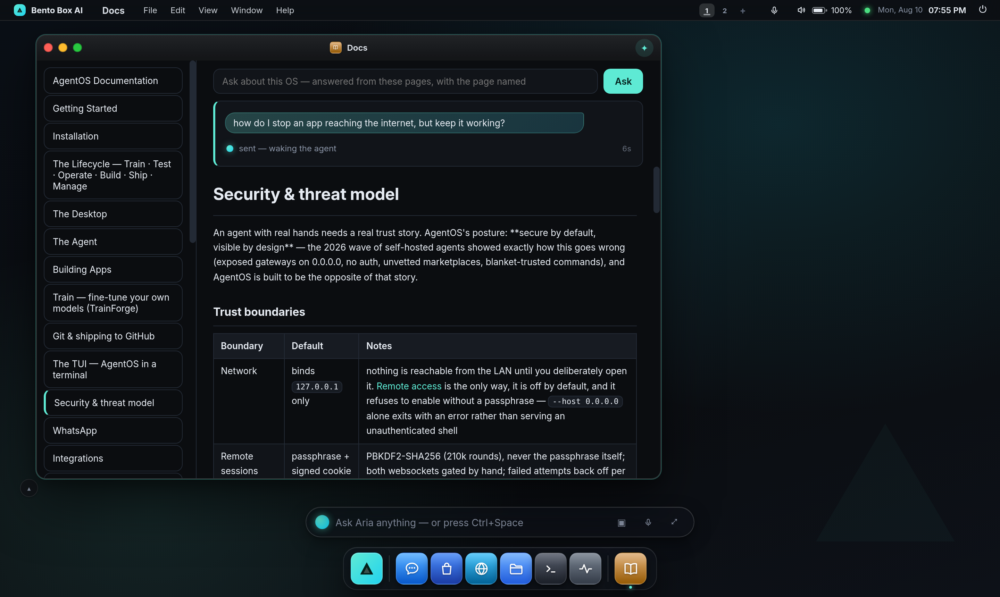

매뉴얼은 검색 인덱스 안에 있으므로, "앱이 인터넷에 닿지 못하게 하면서도 계속 작동하게 하려면 어떻게
하나요?"는 다른 프로젝트에 대한 모델의 기억이 아니라 **이 페이지들**에서 답해집니다 — 그리고 답변은
사용한 페이지를 명시합니다. 단발성 조회가 아니라 에이전트적 검색입니다: 에이전트는 검색하고, 읽고,
첫 시도가 빗나가면 다시 검색합니다.

### 창처럼 행동하는 창

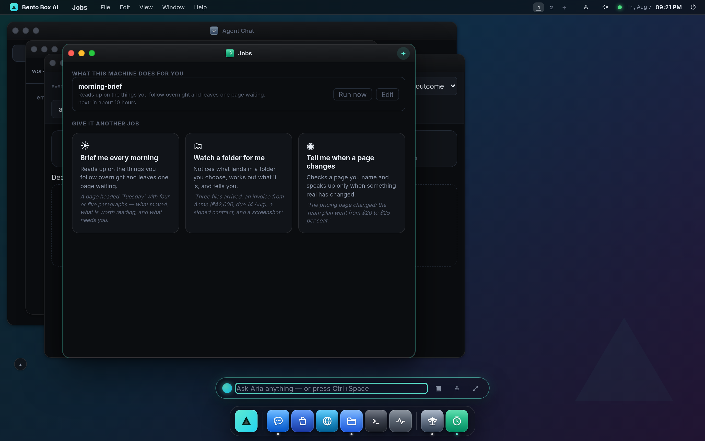

창은 **당신이 두고 간 자리에서** 열립니다 — 위치와 크기는 앱별로 기억됩니다 — 그리고 처음 열리는 창은
제목 표시줄보다 더 많이 계단식으로 어긋나므로, 그 아래의 창 이름이 여전히 읽힙니다. 초점이 있는 창은
강조 링과 완전한 그림자를 지니고, 나머지는 물러납니다. 제목 표시줄의 ✦는 *그 앱 안의* 에이전트입니다:
그 앱을 떠나지 않고 화면에 무엇이 있는지 물어보세요.

### 다섯 가지 디자인 언어, 다섯 가지 팔레트가 아니라

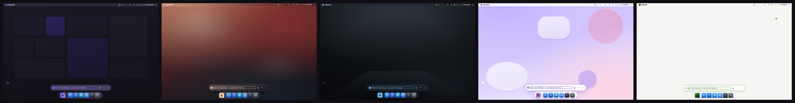

**Bento · Liquid Glass · Spatial · Claymorphism · Minimalism.** 각각은 셸 전체를 다시 재단합니다 —
표면, 모서리, 고도, 블러, 서체 — 그리고 자기만의 배경화면을 가져옵니다. 배경화면은 SVG로 배포됩니다:
각각 몇 KB이며, 전화기에서 4K 패널까지 선명합니다. [더 보기 →](../desktop.md#themes)

유리는 데스크톱이 그릴 수 있는 가장 비싼 것이고, 그 비용은 창을 열 때마다 복리로 불어납니다.
**Themes → Effects**는 당신의 기계를 측정하고 꼭 필요할 때만 그것을 낮춥니다 — Liquid Glass에서 다섯
창은 6.5fps에서 27(낮춤) 또는 60(끔)으로 바뀌었습니다.

### 그것은 당신이 이미 있는 곳으로 당신에게 닿는다

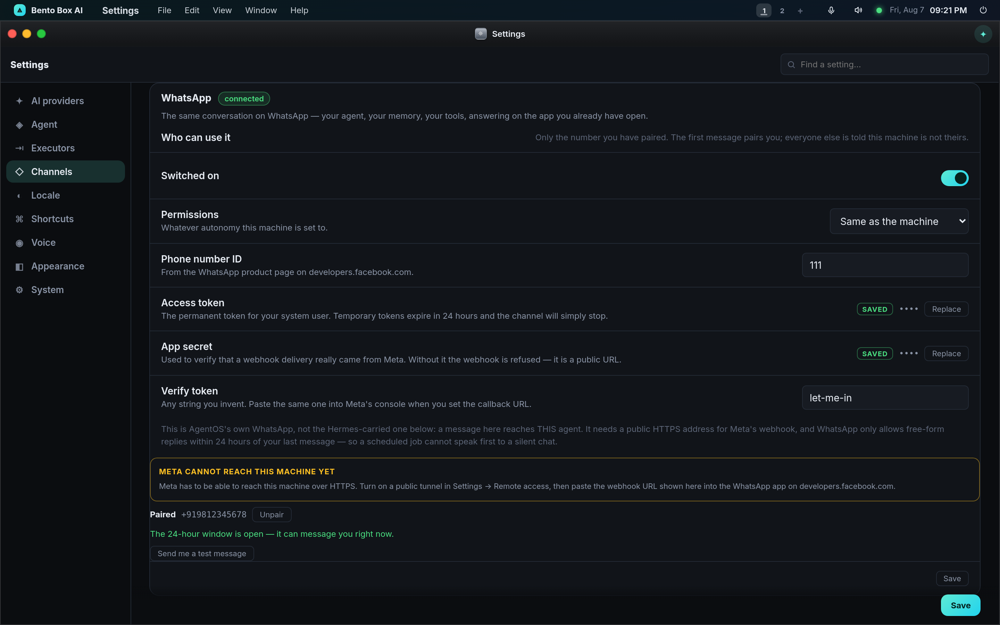

**Telegram과 WhatsApp은 네이티브 채널입니다** — 책상에서와 같은 대화, 같은 메모리, 같은 도구, 같은
승인 버튼. 알림 브리지가 아닙니다: 당신의 전화에서 온 답변은 오늘 아침 시작한 스레드를 이어갑니다.

WhatsApp에는 **두 가지 전송 방식**이 있으며, 그것들은 반대 방향으로 실패합니다. Meta의 Cloud API는
공식이지만 개발자 계정과 공개 웹훅이 필요하고, 마지막 메시지로부터 24시간 밖에서는 자유 형식 답변을
전혀 전달하지 않습니다 — 카드는 그 창이 열려 있는지 알려주고, 통과할 수 없는 전송은 그렇다고 그리고
어떻게 고칠지 말해주며, 예약된 일은 보고서를 먼저 저장해 아무것도 잃지 않도록 합니다. WhatsApp Web
링크는 QR 스캔만 필요하고 24시간 창이 없지만, **비공식**이며 Bento는 무언가 다운로드되기 전에 설치
카드에서 그렇다고 말합니다. [설정 →](../whatsapp.md)

Telegram은 **관리자 콘솔**이기도 합니다: `/agents`, `/run`, `/flows`, `/model`, `/logs`, `/perms` —
소유자 전용이며, *무언가를 하는* 모든 명령은 데스크톱과 같은 권한 게이트와 같은 승인 버튼을 거치므로,
결코 더 쉬운 진입로가 되지 않습니다. [명령 →](../integrations.md)

### 하나의 데스크톱, 모든 화면

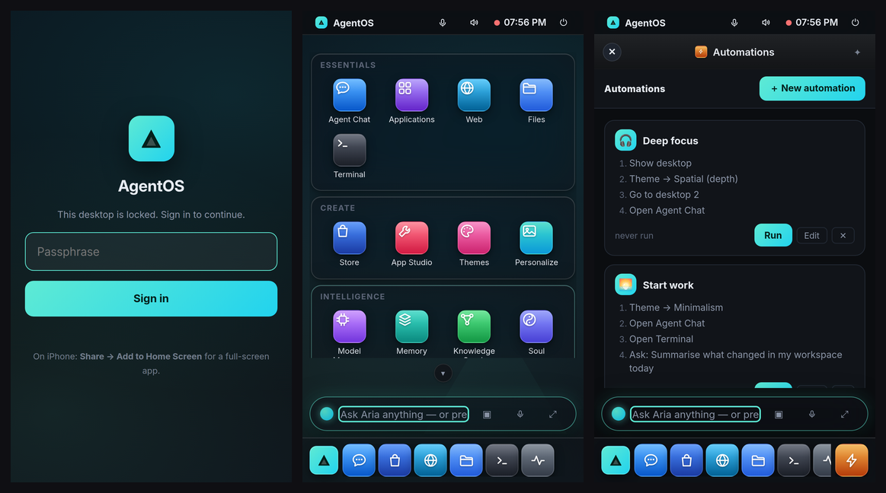

전화기, 태블릿, 워크스테이션 — 같은 데스크톱이 적응합니다. 창은 풀블리드 시트가 되고, 독은 아래 가장
자리에 걸치며, 팝오버는 시트가 됩니다. **원격 접속**을 켜고 암호구 뒤에서 네트워크를 통해 전화로 닿으
세요; *홈 화면에 추가*는 그것을 전체 화면 앱으로 만듭니다.
[원격 접속 →](../remote-access.md) · [반응형 레이아웃 →](../desktop.md#phone-tablet-desktop)

### 그것은 데스크톱 위에서 사는 것을 넘어, 데스크톱이 *될* 수 있다

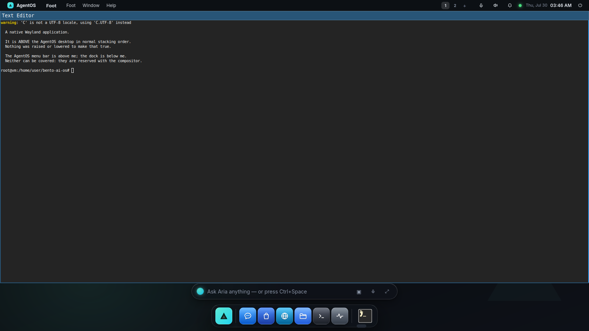

로그인하면 Bento가 당신의 Linux 세션이 됩니다. 데스크톱은 **배경 레이어 위의 Wayland 레이어 표면**으로
그려지므로, 네이티브 애플리케이션 창은 일반 쌓임 순서에서 그 위에 놓입니다 — 무언가가 올려지거나
내려져서가 아니라, 그것이 "배경"이 뜻하는 바이기 때문입니다. 메뉴 바와 독은 **컴포지터에 예약된** 띠에
자리하며, 이는 GNOME이나 KDE 패널이 쓰는 것과 같은 방식이므로, 전체 화면 앱은 그것들을 삼키는 대신
그 가장자리에서 멈춥니다.

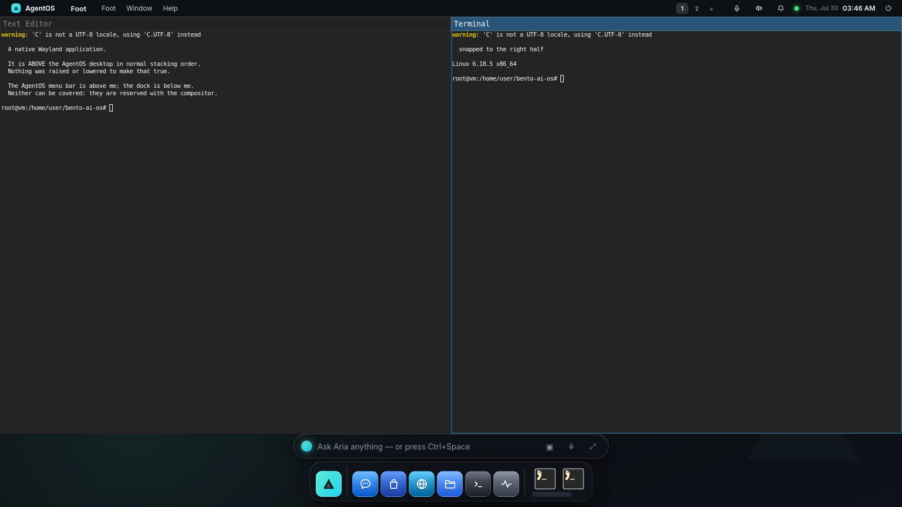

네이티브 앱을 위한 완전한 창 관리: 절반과 4분의 1로 스냅, 타일, 플로트, 레이아웃, 키보드 크기 조절,
워크스페이스, 최소화, 그리고 Alt-Tab 전환기 — 작업 표시줄과 메뉴 바가 초점을 가진 앱을 따라가면서요.
[세션 UI →](../session-ui.md)

### Bento 안에서 애플리케이션을 설치한다

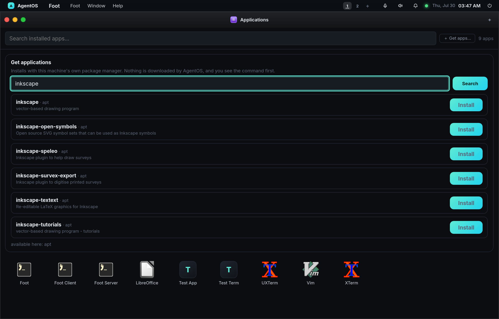

소프트웨어를 설치할 수 없는 데스크톱은 데모입니다. *Applications → 앱 받기…*는 기계 자신의 카탈로그를
검색하고 — AppStream, Flatpak 또는 apt — 실행되기 전에 정확한 명령을 보여줍니다. 사용자별 설치는
비밀번호가 전혀 필요 없으므로 Flatpak이 있으면 그것을 선호합니다. Bento는 아무것도 미러링하지 않고
아무것도 번들하지 않습니다; 이미 당신이 가진 패키지 관리자에게 물어봅니다.

### 당신의 진짜 화면을, 당신의 전화기에서, 브라우저 안에서

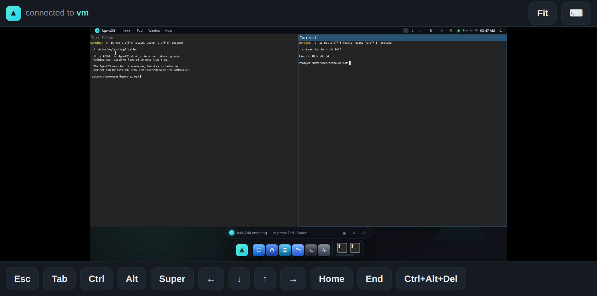

**원격 접속**은 Bento 셸을 당신에게 보내며, 이는 HTML이고 완벽하게 전달됩니다 — 하지만 네이티브 앱은
기계 자신의 디스플레이 위의 픽셀이고 결코 페이지의 일부였던 적이 없습니다. **원격 데스크톱**은 그것을
메웁니다: Bento는 화면을 자신의 *고유한* 인증된 연결로 중계하므로, 전화기에 설치할 VNC 앱 없이 클릭
가능한 진짜 데스크톱을 얻습니다.

그 형태가 핵심입니다 — VNC 서버는 `127.0.0.1`에 머물며 네트워크 근처에 절대 가지 않습니다; 그것을
보호하는 것은 당신이 이미 쓰는 암호구입니다. [원격 접속 →](../remote-access.md)

### 자동화와 핫 코너

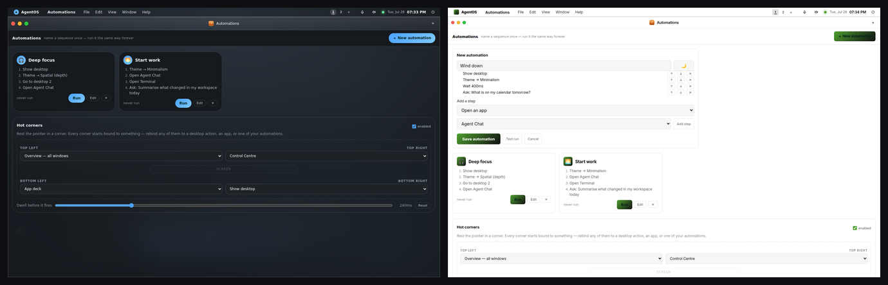

시퀀스에 한 번 이름을 붙이면 — 이 앱들을 열고, 테마를 전환하고, 이 Python을 실행하고, 그 MCP 도구를
호출하고, 에이전트에게 작업을 맡기기 — 그 후로는 프롬프트 바, 핫 코너, 스케줄, 또는 이름으로 요청해
영원히 실행할 수 있습니다. [더 보기 →](../desktop.md#automations)

---

## 왜 Bento Box AI인가

- **채팅 상자가 아니라 진짜 데스크톱** — 드래그 가능한 창, 작업 표시줄, 가상 데스크톱, 위젯, 테마,
  명령 팔레트, 그리고 25개 이상의 내장 앱.
- **손을 가진 에이전트** — 셸 명령, 파일 관리, 웹 리서치, 데스크톱 알림, 예약된 일, HTML 보고서,
  그리고 앱 만들기, 모두 평범한 언어로부터.
- **로컬 우선이며 비공개** — 모든 것이 Ollama와 함께 당신의 하드웨어에서 실행될 수 있습니다; 클라우드
  키를 추가하지 않는 한 아무것도 당신의 기계를 떠나지 않습니다. 당신이 의도적으로 암호구로 보호된
  [원격 접속](../remote-access.md)을 켤 때까지 localhost에만 바인딩합니다.
- **한 지붕 아래의 전체 수명 주기** — **훈련 · 테스트 · 운영 · 빌드 · 배포 · 관리**를 한 화면(미션
  컨트롤)에 실시간으로: 당신의 GPU에서 자기 모델을 파인튜닝하고, 모든 자기 수정을 테스트 게이트로
  통과시키고, 예약된 일을 실행하고, 앱을 빌드하고, GitHub로 배포하세요.
- **자기 확장** — 에이전트는 자기 자신을 위한 새 UI 앱을 만들고(App Studio), 스킬과 MCP 도구 서버를
  설치하며, Bento 자신의 소스 코드를 수정할 수 있습니다(자동 스냅샷과, 재시작 전에 반드시 통과해야 하는
  테스트 스위트와 함께).
- **복리로 쌓이는 메모리** — 2계층 메모리, 실시간 지식 그래프, 그리고 모든 대화 후 자동으로 학습되는
  지속적인 "영혼".
- **설계상 안전** — 자율성 레벨, 승인 프롬프트, 허용/거부 정책, bubblewrap 폴더 샌드박스,
  하드 차단된 파괴적 명령, 그리고 원클릭 복원 지점.

---

## 빠른 시작

**하나의 명령, macOS 또는 Linux에서.** 그것은 모든 것을 설치하고 — `uv`를 통해 Python까지 — Bento를
시작한 다음, "완료"라고 말하기 전에 실행 중인 서버에 질문을 던져 *작동함을 증명합니다*.

```bash
curl -fsSL https://raw.githubusercontent.com/contact9prime-lab/bento-ai-os/master/install.sh | sh
```

그런 다음 **http://127.0.0.1:8321**을 열거나, 터미널에서 같은 열한 단계를 위해 `bento setup`을 실행하세요.

물어볼 터미널이 있다면, 설치 프로그램은 끝내기 전에 두 가지를 묻습니다. 이 기계가 당신의 다른 기기에서
닿을 수 있어야 하는지, 그리고 그렇다면 **암호구**로 로그인할지 **계정**으로 로그인할지입니다. 화면이 없는
기계에서 그 첫 질문은 들여다볼 수 있는 설치와 그렇지 못한 설치를 가릅니다. `--yes`는 의도적으로 그 질문에
답하지 않습니다 — 여기서 열린 포트는 열린 셸이니까요.

그것은 당신의 `PATH`에 `bento` 명령을 남깁니다(`~/.local/bin`에, 거기 없었다면 셸 프로필에 추가됩니다 —
그 후 새 터미널을 여세요). `bento --help`는 새 기계에 필요한 열 개의 명령을 보여 주고, 나머지는 `bento help --all`에 있습니다.

### 선택한 주소와 포트에 설치하기

SSH로 닿는 서버에서 `127.0.0.1:8321`은 "아무것도 닿을 수 없음"을 뜻합니다. 설치 프로그램에 암호구와
주소를 주면, 이미 올바른 포트를 가리키는 부팅 서비스와 함께 준비된 채로 올라옵니다:

```bash
curl -fsSL https://raw.githubusercontent.com/contact9prime-lab/bento-ai-os/master/install.sh \
  | sh -s -- --passphrase='something long and unguessable' --bind=0.0.0.0 --port=8080
```

이제 그 기계는 포트 8080에서 **모든** 인터페이스에 응답하며, 무언가를 하기 전에 그 암호구를 요구합니다.
`127.0.0.1:8080`을 통한 로컬 사용은 변함없습니다.

설치 프로그램은 둘 중 어느 것을 남겼는지 말해줍니다 — `AgentOS is running`은 실제로 무언가 수신 대기할
때만 나옵니다. 서비스 관리자가 없는 기계(컨테이너, 비-systemd 배포판, 사용자 D-Bus가 없는 SSH)에서는
대신 그렇다고 말하며, `bento service start`가 일을 마무리합니다.

전부가 아니라 하나의 인터페이스 — 사설 VLAN, Tailscale 주소:

```bash
curl -fsSL https://raw.githubusercontent.com/contact9prime-lab/bento-ai-os/master/install.sh \
  | sh -s -- --passphrase='something long and unguessable' --bind=192.168.1.20 --port=8080
```

포트만 다르고 여전히 루프백 전용:

```bash
curl -fsSL https://raw.githubusercontent.com/contact9prime-lab/bento-ai-os/master/install.sh \
  | sh -s -- --port=8080
```

> **`-s --`는 선택 사항이 아닙니다.** `curl … | sh --port=8080`은 플래그를 `sh`에게 넘기고, `sh`는
> 그것을 거부합니다 — 파이프된 스크립트는 자기 자신의 인자를 받지 못합니다. `-s --`는 "나머지는
> 스크립트를 위한 것"을 뜻합니다. 이것이 이 플래그들이 사라지는 단연 가장 흔한 방식이며, 오류는 `sh`를
> 지목하므로 망가진 설치 프로그램처럼 읽힙니다.

**모든 플래그:**

| 플래그 | 하는 일 |
|---|---|
| `--passphrase=SECRET` | 로그인에 이것을 요구하고, 루프백 밖 바인딩을 허용 — 여기서 주면 설치 프로그램은 묻지 않습니다 |
| `--bind=ADDR` | 어느 인터페이스에서 수신할지(기본값 `0.0.0.0`); `--passphrase` 필요 |
| `--port=N` | 어느 포트(기본값 `8321`); 설정에 저장되어 부팅 서비스가 사용 |
| `--yes` | 모든 선택적 구성 요소에 예로 응답 — 포트를 여는 것에는 **아닙니다** |
| `--no-service` | 런처도 부팅 서비스도 없음(컨테이너, CI) |
| `--no-verify` | "작동함을 증명" 단계를 건너뜀 |

### 나중에 바꾸기

위의 모든 것은 **`~/.agentos/config.json`**(또는 `$AGENTOS_HOME` 아래)에 있으며, `bento config`는 당신이
그것을 찾지 않고도 읽고 씁니다:

```bash
bento config                       # the whole file, secrets masked
bento config port                  # one setting
bento config port 8080             # change it
bento config remote.bind 0.0.0.0   # dotted paths for nested settings
bento config --path                # where the file is
bento config --edit                # open it in $EDITOR — refuses to save invalid JSON
```

`bento remote`는 도달성 관련 설정들을 한데 모은 같은 설정입니다:

```bash
bento remote --on --passphrase 'something long' --bind 0.0.0.0   # one shared secret
bento user add alice && bento remote --on --bind 0.0.0.0          # or an account each
bento remote --port 8080                                          # the port
bento remote                                                      # what it is now, and who signs in
```

**포트 변경은 설치된 부팅 서비스에 저절로 닿지 않습니다** — systemd 유닛과 LaunchAgent는 그것을
`ExecStart`에 구워 넣습니다. 두 명령 모두 그것이 적용될 때를 알려줍니다:

```bash
bento service install && bento service restart
```

> **다른 기계에서 닿을 수 있는 것은 기본값이 아니라 의도적인 선택입니다.** 에이전트는 진짜 셸을 가지고
> 있으므로 — 여기서 열린 포트는 열린 셸입니다 — Bento는 잠금이 — 암호구든, 누군가 그것으로 로그인하는
> 계정이든 — 생기기 전까지는 `127.0.0.1`에만
> 수신합니다. 그 이유로 `--bind` 단독은 거부되며, 원격 접속이 꺼진 상태의
> `bento serve --host 0.0.0.0`도 마찬가지입니다. 두 잠금은 겹쳐 쓰는 것이 아니라 둘 중 하나입니다. 계정이 하나라도 있으면 그 계정이 곧 잠금이고, 그 앞의 암호구는 아무것도 읽지 않는 설정일 뿐입니다.

**1024 미만의 포트에 관하여.** Linux에서는 비-root 프로세스에 거부되고, macOS에서는 그 거부가 주소별
입니다 — `0.0.0.0:80`은 허용하고 `127.0.0.1:80`은 거부합니다. 그래서 여기서는 아무것도 번호로부터 추측
하지 않습니다: `--port`는 실제 바인드를 시도하고, 커널이 안 된다고 하면 그것을 고치는 `sysctl` 줄,
리다이렉트 규칙, 또는 프록시 옵션을 인쇄합니다. Linux에서 포트 80은 보통 명령 하나를 뜻합니다:

```bash
echo 'net.ipv4.ip_unprivileged_port_start=80' | sudo tee /etc/sysctl.d/50-agentos.conf
sudo sysctl --system
```

서버를 root로 실행하는 것은 권장되지 않습니다 — 에이전트는 진짜 셸을 가지고 있습니다.

<details>
<summary><b>대신 git 체크아웃에서</b></summary>

```bash
uv sync                 # install dependencies (or: pip install -e .)
uv run bento            # start the server and open the desktop in your browser
```
</details>

<details>
<summary><b>Docker에서</b></summary>

```bash
docker build -t bento .
docker run -d --name bento -p 8321:8321 -v bento-data:/data \
  -e AGENTOS_PASSPHRASE='something long and unguessable' bento
```

컨테이너는 애초에 닿을 수 있으려면 `0.0.0.0`에 바인딩해야 하므로, 암호구는 선택이 아니라 필수입니다 —
엔트리포인트는 닿을 수 없거나 *또는* 안전하지 않은 상태로 시작하기를 거부하고 어느 쪽인지 말해줍니다.
잃어버릴 수 있는 모든 것은 `/data` 볼륨에 있습니다. 특정 브랜치를
`--build-arg SOURCE=git --build-arg REF=my-branch`로 빌드하세요.
</details>

**Ollama**가 실행 중이면 당신의 로컬 모델이 자동으로 잡힙니다. 원한다면 **Settings** 아래에 클라우드
API 키를 추가하세요. 그것이 설정의 전부입니다.

> **팁:** 빌드, 도구 호출, 다단계 작업은 **도구 지원 모델**(모든 `qwen*` 모델, 또는 클라우드 모델)과
> 함께라면 훨씬 더 안정적입니다. `gemma` 같은 더 약한 로컬 모델은 도구를 안정적으로 호출하지 못합니다.

---

## Linux 데스크톱으로 실행하기 (SUI)

```bash
uv run bento installer      # detects your distro, installs what's missing, adds it to the login screen
```

그런 다음 로그아웃하고 로그인 화면에서 **Bento Box AI**를 고르세요. 기존 데스크톱은 손대지 않은 채로
남습니다 — 되돌아가기는 로그아웃하고 다시 Ubuntu를 고르는 일입니다.

설치 프로그램은 배포판을 감지하고, 원하는 모든 패키지와 그 이유를 명시하며, 무언가 설치하기 전에
묻습니다. 두 그룹: 컴포지터 엔진(sway와 그 친구들, MIT), 그리고 데스크톱이 브라우저 창이 아니라 진짜
Wayland 표면이 되게 하는 네이티브 데스크톱 표면(`python3-gi`, `python3-gi-cairo`, gtk-layer-shell,
WebKitGTK).

**Bento는 그중 무엇도 배포하거나 재배포하지 않습니다.** gtk-layer-shell은 MIT이지만, GTK, PyGObject,
WebKitGTK는 LGPL이며, 이 프로젝트가 *의존*하는 것은 관대한(permissive) 채로 남습니다 — 그래서 그것들은
라이선스를 눈앞에 둔 채 요청됩니다. 그것들 없이도 세션은 여전히 실행되며, Chromium 창에 데스크톱을
그립니다. [라이선싱 →](../licensing.md) · [세션 UI →](../session-ui.md)

데스크톱에 관해 무언가 잘못 작동하면, 명령 하나가 그 이유를 말해줍니다:

```bash
uv run bento doctor --session   # probes what can actually draw on THIS machine, and says so
```

그것은 인터프리터, GTK의 디스플레이, 컴포지터의 레이어 셸 지원, 그리고 WebKit이 렌더링*하고 계속
렌더링할* 수 있는지를 — 창에서 그리고 레이어 표면에서 — 확인한 다음 판정을 내립니다. 탐지는
하위 프로세스에서 실행되는데, 그것이 찾는 실패는 중단과 세그폴트이고, 크래시가 난 탐지는 자신이
크래시했다고 보고할 수 없기 때문입니다.

---

## Debian/Ubuntu 패키지(.deb)로 설치하기

자기 완결적인 `.deb`(앱 **과** 모든 의존성을 담은 Python venv를 번들 — 설치 시 네트워크 불필요):

```bash
./packaging/build-deb.sh                                   # → packaging/dist/agentos_<ver>_<arch>.deb
sudo dpkg -i packaging/dist/agentos_0.1.0_amd64.deb        # installs to /opt/agentos + launcher + service
systemctl --user enable --now agentos                      # start at login (per user)
bento app                                                  # or launch it from your menu
```

`apt`/`dpkg`가 업데이트와 제거를 처리합니다. 그것은 `bubblewrap`(샌드박스)과 `xdg-utils`를
**Recommends**하고, `ollama`, `nodejs`, `git`을 **Suggests**합니다. 데스크톱 패키지는 추가로 세션 UI
스택과 `wayvnc`/`novnc`를 **Suggests**합니다 — 의존이 아니라 제안인데, apt가 기본적으로 Recommends를
설치하고 그것은 더 부드러운 이름의 번들링이 되기 때문입니다.

## 진짜 앱으로 설치하기(부팅 시 자동 시작) — 소스에서

```bash
uv run bento install      # app launcher + a background service that starts at login/boot
```

올바른 네이티브 메커니즘이 자동으로 사용됩니다: Linux에서는 `.desktop` 런처에 더해 **systemd 사용자
서비스**(linger와 함께, 그래서 부팅 시 시작), macOS에서는 앱 번들에 더해 **LaunchAgents**, Windows
에서는 시작 메뉴 바로 가기에 더해 **시작 프로그램 항목**.

하나의 명령 세트가 셋 모두를 움직입니다 — 자기 자신의 에이전트를 제어하는 데 이 기계가 systemd를 쓰는지
launchd를 쓰는지 알 필요가 없어야 합니다:

```bash
bento service status       # is it running, will it come back at boot, is the port answering
bento service start        # …stop, restart
bento service logs -f      # journalctl or the log file, whichever this machine uses
bento service uninstall    # remove the background service only — launcher and data stay
bento uninstall            # remove launcher + service (your data stays)
bento app                  # open as a chromeless desktop window any time
```

`bento service status`는 관리자(supervisor)가 믿는 바 **와** 포트가 응답하는지를 따로 보고합니다:
아무것도 수신하지 않는데 "active"인 유닛은 크래시 루프이며, 그것이 볼 수 있어야 할 가치가 있는
상태입니다.

---

## 실행 모드

| 명령 | 하는 일 |
|---|---|
| `uv run bento` | 서버를 시작하고 **그리고** 브라우저에서 데스크톱을 엽니다 |
| `uv run bento serve --no-browser --port 8321` | 화면 없는 서버(부팅 서비스가 사용) |
| `uv run bento app` | 네이티브 느낌의 창으로 데스크톱을 엽니다 |
| `uv run bento tui` | 터미널 속의 전체 OS (**TUI**) |
| `uv run bento installer` | 이 배포판을 감지하고 Linux 세션을 설정 (**SUI**) |
| `uv run bento doctor` / `doctor --session` | 환경 점검 / 여기서 무엇이 데스크톱을 그릴 수 있는지 |
| `uv run bento service status \| start \| stop \| restart \| logs \| uninstall` | 이 OS가 가진 어떤 관리자에서든, 백그라운드 서버 |
| `uv run bento update` / `update --apply` | 더 새 버전 확인 / 풀, 동기화, 테스트, 재시작 |
| `uv run bento config [key] [value]` | `~/.agentos/config.json` 읽기 또는 변경 (`--edit`, `--path`) |
| `uv run bento remote --port 8080 --bind 0.0.0.0` | 응답할 주소, 설정에 저장 |
| `uv run bento serve --if-running open\|port\|restart\|fail` | 이미 실행 중일 때 무엇을 할지(기본값: 물어봄) |
| `uv run bento apps search \| install \| remove` | 터미널에서, 네이티브 애플리케이션 |
| `uv run bento remote --on --passphrase '…'` | 전화에서 이 데스크톱에 닿기 |
| `uv run bento remote-desktop --on` | 브라우저 원격 데스크톱(진짜 화면, 네이티브 앱) |
| `uv run bento ask "…"` | 터미널에서 단발성 에이전트 실행 (`--full`, `--model …`) |
| `uv run bento user add <이름>` | 계정 — 첫 계정이 이 기계를 물려받고 관리자가 됩니다 |
| `uv run bento help --all` | 모든 명령. `bento --help`는 새 기계에 필요한 열 개를 보여 줍니다 |

---

## 요구 사항

- **Python ≥ 3.10** 및 [**uv**](https://docs.astral.sh/uv/) (또는 pip).
- **모델 제공자** — 로컬로 [Ollama](https://ollama.com)(권장: `qwen3.5:9b` 같은 도구 지원 모델), 또는
  클라우드 API 키.

선택 사항, 있을 때 추가 기능을 잠금 해제 — `bento installer`가 각각을 그 라이선스와 함께 제안합니다:

- **Linux 세션 (SUI)** — `sway`와 그 친구들, 더해 `python3-gi`, `python3-gi-cairo`,
  `gir1.2-gtklayershell-0.1`, `gir1.2-webkit2-4.1`. [자세히 →](../session-ui.md)
- **wayvnc + novnc** — 전화 브라우저에서의 원격 데스크톱, 루프백에서 중계.
- **bubblewrap** (`bwrap`) — 에이전트와 터미널을 한 폴더에 가두는 폴더 **샌드박스**.
- **Node/npx** 및/또는 **uvx** — **MCP 서버**(Playwright, filesystem, git, …)를 실행하기 위해.
- **git** — 저장소에서 **스킬**을 설치하기 위해.

---

## 데스크톱

- **창** — 모든 앱은 최소화/최대화/닫기와 z-순서를 가진 드래그 및 크기 조절 가능한 창에서 열립니다.
  **작업 표시줄**이 열린 창을 추적하고; **시작 메뉴**가 모든 것을 실행합니다.
- **잠드는 창** — 볼 수 없는 창은 주기적 작업을 멈추고 다시 나타나는 순간 새로고침합니다. 여섯 앱을
  열고 모두 최소화하면 10초당 25요청에서 2요청으로 바뀌었습니다.
- **가상 데스크톱** — 작업 표시줄 페이저; 전환하려면 `Ctrl+1..6`, 창을 거기로 옮기려면 우클릭.
  위젯은 데스크톱별이라 각각이 자기만의 공간입니다.
- **위젯** — 어떤 앱이든 프레임 없는 실시간 타일로 고정하세요; 드래그하고, 크기를 조절하면, 시작 시
  복원됩니다.
- **명령 팔레트** — 어떤 앱이나 동작이든 퍼지 실행하려면 `Ctrl+Space`(또는 `Ctrl+K`), 또는 에이전트에게
  곧장 보내려면 "Ask Aria …". `Ctrl+Alt+T`는 터미널을 엽니다.
- **룩 앤 필** — 로컬 갤러리를 갖춘 AI 생성 배경화면, 에이전트가 작업하는 동안의 사고 애니메이션,
  그리고 선택적 음성. 비전 지원 모델을 위해 이미지를 채팅에 곧바로 붙여넣으세요.

### 내장 앱

| 앱 | 그것이 무엇인가 |
|---|---|
| **에이전트 채팅** | 에이전트와 대화; 스트리밍, 도구 카드, 승인, 음성, 이미지 붙여넣기 |
| **Applications** | 설치된 모든 데스크톱 앱 — 실행하거나 새로 설치 |
| **원격 데스크톱** | 기계의 진짜 화면, 클릭 가능, 여기서든 전화에서든 |
| **호스트 화면** | 네이티브 앱 창을 포함한, 진짜 디스플레이의 새로고침되는 정지 화면 |
| **Web** | URL을 당신의 **진짜 시스템 브라우저**에서 엽니다(전체 사이트, 로그인, 확장 프로그램) |
| **파일** | 워크스페이스 탐색; 파일을 클릭하면 호스트 브라우저/앱에서 엽니다 |
| **터미널** | 진짜 호스트 셸(PTY 위의 xterm.js), 샌드박스 폴더에 갇힘 |
| **App Studio** | 앱을 평범한 언어로 설명하면 에이전트가 **실시간으로 만듭니다** |
| **작업 관리자** | 실시간 CPU/메모리/디스크, 프로세스, 열린 창(그리고 어느 것이 잠들었는지) |
| **지식 그래프** | 에이전트가 아는 것을, 실시간 힘-방향 그래프로 |
| **영혼** | 에이전트의 지속적 정체성/성격(매 턴 주입됨) |
| **메모리** | 자동 학습 + 의미 회상을 갖춘 사용자 및 세션 메모리 |
| **프로필** | 에이전트가 당신에 대해 아는 모든 것을, 한곳에 |
| **팀** | 서브에이전트 및 시각적 워크플로우(단계별 모델 조합) + 관찰 가능성 |
| **문서** | 이 매뉴얼, OS 안에서 |
| **자동화** | 이름 붙인 루틴, 핫 코너, 그리고 단계 빌더 |
| **스킬** | 재사용 가능한 절차; git 저장소나 원시 `.md` URL에서 설치 |
| **MCP 서버** | 카탈로그에서 외부 도구 서버를 연결 |
| **Telegram** | 전화에서 에이전트를 제어; 채팅별 허용 목록 |
| **정책** | 도구 및 명령에 대한 항상 허용/항상 거부 규칙 |
| **로그** | 시스템이 한 모든 것(턴, 도구, MCP, telegram, 일) |
| **스케줄러** | 반복되는 백그라운드 **일** |
| **스냅샷** | 전체 OS(설정, 데이터, 소스)를 위한 복원 지점 |
| **설정** | 제공자, 모델, 자율성, 음성, 샌드박스, 에이전트 이름 |

---

## 에이전트가 할 수 있는 것

에이전트(기본 이름 **Aria**)는 큰 도구 세트를 가지고 있으며 채팅이나 Telegram에서 전체 OS를 움직일 수
있습니다:

- **기계에 대한 동작** — 셸 명령 실행, 파일 읽기/쓰기, 웹 가져오기, 호스트에서 앱/파일 열기, 데스크톱
  알림.
- **결과 전달** — `save_report`는 파일에 보이고 브라우저에서 열리는 스타일이 적용된 HTML 보고서를 쓰며,
  요약을 Telegram으로 보낼 수 있습니다. 에이전트는 **일을 끝내라**고 지시받습니다 — 리서치를 검색 후
  멈추지 말고 실제 산출물로 바꾸라고요.
- **OS 빌드** — `create_app`은 데스크톱 아이콘을 가진 새 UI 앱을 만들고; `pin_widget`은 그것들을
  데스크톱에 놓으며; `add_mcp_server`는 새 도구 채널을 연결합니다.
- **성장** — 2계층 메모리, 지식 그래프, `update_soul` — 더해 **자동 학습**: 매 턴 후 백그라운드 패스가
  스스로 메모리와 사실을 추출합니다.
- **자동화** — `schedule_task`는 보고서 및/또는 Telegram으로 전달하는 화면 없는 **일**을 만듭니다.
- **자기 자신을 확장** — `read_source` / `develop_agentos`는 Bento의 **자기 자신의 소스 코드**를
  수정하게 합니다; 먼저 자동 스냅샷하고 쓰기 전에 구문을 검사합니다.

평범한 언어로 물어보세요: *"github MCP 채널을 추가해줘", "습관 추적기를 만들어서 데스크톱 2에
고정해줘", "매일 아침 소셜 미디어 트렌드를 내 Telegram으로 보고해줘", "inkscape를 설치해줘".*

---

## 모델 & 제공자

- **Ollama** (로컬) — 자동 발견됨; 아무것도 당신의 기계를 떠나지 않습니다.
- **Anthropic**, **OpenAI**, **OpenRouter**, 또는 모든 **OpenAI 호환** 엔드포인트(LM Studio, vLLM,
  Groq, …).
- **이미지 생성** — 키가 설정되면 Google Gemini 또는 OpenAI 이미지 모델, 그렇지 않으면 무료 폴백.

`ANTHROPIC_API_KEY`, `OPENAI_API_KEY`, `OPENROUTER_API_KEY`, `GOOGLE_API_KEY`는 자동으로 잡힙니다.
채팅 창의 드롭다운에서 실행 중에 모델을 전환하세요.

---

## 안전

- **자율성 레벨** — Paranoid / Balanced는 읽기 전용 동작을 자동 실행하고 시스템을 수정하는 무언가 전에는
  묻습니다; Full은 모든 것을 실행합니다. 파괴적 명령은 모든 레벨에서 **하드 차단**됩니다.
- **정책** — `<tool> <command>`에 대해 매칭되는 항상 허용/항상 거부 규칙(`*` 와일드카드 포함).
- **폴더 샌드박스** — bubblewrap과 함께, 에이전트의 셸/파일 도구와 터미널은 한 폴더에 갇히고;
  나머지 파일 시스템은 읽기 전용입니다.
- **스냅샷** — 복원 지점; 에이전트는 자기 코드를 편집하기 전에 자동 스냅샷합니다.
- **기본적으로 비공개** — `127.0.0.1`에 바인딩합니다. 원격 접속은 당신이 암호구로 켤 때까지 꺼져 있으며,
  소프트웨어 설치는 기계 자신을 제외한 어디에서도 거부됩니다.

---

## Telegram · MCP · 프로그래밍 가능

**Telegram** — @BotFather에 메시지를 보내고, Telegram 앱에 토큰을 붙여넣으면, 첫 비공개 채팅이
소유자가 됩니다. 에이전트는 거기서 모든 도구를 가지며; 위험한 동작은 인라인 Allow/Deny 버튼을 보냅니다.

**MCP 서버** — 카탈로그에서 외부 도구 서버(Playwright, filesystem, fetch, git, GitHub, Postgres,
Slack, search, …)를, 또는 커스텀 `stdio`/`http` 서버를 추가하세요. 그 도구들은 에이전트에게는
`mcp_<server>_<tool>`로, 빌드된 앱에는 `POST /api/tool`을 통해 나타납니다.

**프로그래밍 가능** — 단발성 실행을 위한 `bento ask "…"`; REST API(`POST /api/chat`, `GET /api/system`,
`POST /api/tool`, …); `/ws`(스트리밍 채팅 + 승인)와 `/ws/terminal`(호스트 PTY)의 WebSocket. 당신이
빌드하는 앱은 동일 출처 iframe에서 실행되며 그 모든 것을 호출할 수 있습니다.

---

## 아키텍처

```
agentos/                 # the Python package keeps its original name; see "On the name" below
├── __main__.py    # CLI entry: serve · app · installer · doctor · apps · remote-desktop · ask
├── agent.py       # the kernel: plan → act (tools) → observe loop, approval gates, personas
├── providers.py   # unified streaming chat: Ollama / Anthropic / OpenAI / OpenRouter / custom
├── tools.py       # the hands: shell, files, web, apps, reports, memory, KG, soul, skills, MCP
├── shellhost.py   # the SUI: the desktop as a wlr-layer-shell surface (GTK + WebKitGTK)
├── sessiondoctor.py # what can actually draw the desktop on this machine
├── compositor.py  # sway/wlroots IPC: windows, workspaces, outputs, live events
├── appstore.py    # installing native applications via appstream / flatpak / apt
├── remotedesktop.py # the browser remote desktop, relayed over the authenticated connection
├── installer.py   # OS-aware setup: detect the distro, install what is missing, ask first
├── memory.py      # SQLite: conversations, memories, tasks, logs, KG, skills, apps
├── server.py      # FastAPI: desktop UI, REST API, WebSocket streams, file serving
└── ui/
    ├── src/       # the desktop's source — edit here
    └── index.html # generated by `python -m agentos.ui.build` (do not edit)
```

**상태는 `~/.agentos/`에 있습니다:** `config.json`, SQLite 데이터베이스, `soul.md`, `wallpapers/`,
`snapshots/`. 에이전트의 작업 디렉터리는 `~/AgentOS/`입니다.

### 이름에 관하여

제품은 **Bento Box AI**입니다. Python 패키지, 데이터 디렉터리, systemd 유닛은 여전히 `agentos`입니다 —
의도적으로요. 그것들을 이름 바꾸면 기존 모든 설치의 서비스, 설정, 스크립트가 깨지며, 사용자가 볼 수 있는
아무것도 사주지 않습니다. 그것들은 실행할 가치가 있는 마이그레이션이 있을 때 움직일 것이지, 그 전에는
아닙니다. 이름과 마크는 Ubuntu의 것이 Canonical의 것인 방식으로 우리의 것입니다: MIT 아래에서 코드를
자유롭게 포크하고, 당신 자신의 이름으로 배포하세요. [라이선싱과 상표 →](../licensing.md)

---

*Bento Box AI는 클라우드 AI 어시스턴트에 대한 열린, 로컬 우선 대안입니다: 당신이 스스로 실행하는 에이전트
OS, AI 데스크톱, 그리고 자동화 플랫폼 — Linux, macOS, 또는 Windows에서.*
