# Bento Box AI: um sistema operacional tocado por uma equipe de agentes de IA

<p align="right"><sub>
<a href="../../README.md">English</a> ·
<a href="README.zh-CN.md">简体中文</a> ·
<a href="README.zh-TW.md">繁體中文</a> ·
<a href="README.ja.md">日本語</a> ·
<a href="README.ko.md">한국어</a> ·
<a href="README.es.md">Español</a> ·
<b>Português&nbsp;(BR)</b> ·
<a href="README.fr.md">Français</a> ·
<a href="README.de.md">Deutsch</a> ·
<a href="README.ru.md">Русский</a> ·
<a href="README.hi.md">हिन्दी</a> ·
<a href="README.ar.md">العربية</a>
</sub></p>

<!-- ai-translated: generated by an AI, not yet proofread; the English README is the reference -->
> Esta tradução foi feita por IA e ainda não foi revisada por ninguém; a referência é a [versão em inglês](../../README.md).

> Assistentes de chat respondem a você. O Bento dá uma equipe à sua máquina: um agente líder e
> especialistas que cuidam de trabalho recorrente para você, discutem as coisas entre si e perguntam
> antes de qualquer coisa que importe.

O Bento é um desktop de IA auto-hospedado que roda no seu próprio hardware. Ele tem janelas de
verdade, arquivos e um terminal, e é conduzido por agentes que executam ações reais com a sua
aprovação. O cérebro pode ser um modelo local via [Ollama](https://ollama.com), um modelo na nuvem
(Claude, OpenAI, OpenRouter ou qualquer endpoint compatível com OpenAI) ou um agente que você já tem
instalado: **Claude Code, Gemini CLI ou Codex**. Agentes diferentes da sua equipe podem rodar em
cérebros diferentes.

Toda manhã ele deixa para você um Brief (resumo) com coisas para resolver. Você pode ver seus agentes
trabalhando num Office (escritório) em estilo de história em quadrinhos. Ele só lê seu e-mail e sua
agenda se você deixar, e fala com você pelo celular, pelo Telegram e pelo WhatsApp. Cada passo que
qualquer agente dá passa por um único portão de permissões e fica registrado num livro-razão à prova
de adulteração.

[](https://github.com/contact9prime-lab/bento-ai-os/actions/workflows/ci.yml)


```bash
curl -fsSL https://raw.githubusercontent.com/contact9prime-lab/bento-ai-os/master/install.sh | sh
```

[](https://render.com/deploy?repo=https://github.com/contact9prime-lab/bento-ai-os)

Depois abra **http://127.0.0.1:8321**. Ele só escuta em localhost até você mesmo ligar o
[acesso remoto](../remote-access.md). Não tem conta para criar, não tem telemetria e não tem nuvem,
a menos que você adicione uma chave.

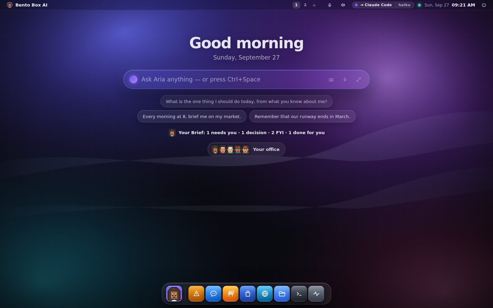

O manual completo está em [`docs/`](../README.md) e vem dentro do sistema como o app Docs.

---

## Três faces, um programa

O Bento roda em três lugares, e cada recurso é feito para os três.

| | O que é | Como iniciar |
|---|---|---|
| **GUI** | uma janela ou uma aba do navegador no macOS, Windows ou Linux, ou um celular pela sua rede | `bento` |
| **TUI** | o sistema inteiro num terminal, para um servidor ou um Pi sem tela via SSH | `bento tui` |
| **SUI** | o Bento é a sua sessão Linux e ocupa a tela inteira | `bento installer` |

> O comando é `bento`. `agentos` continua funcionando, porque ele está no histórico do shell, em
> units do systemd e em scripts das pessoas.

---

## Início rápido

Um comando no macOS ou no Linux instala tudo, Python incluído (via `uv`). Ele inicia o Bento e
depois confere se está funcionando, fazendo uma pergunta ao servidor já rodando antes de dizer que
terminou.

```bash
curl -fsSL https://raw.githubusercontent.com/contact9prime-lab/bento-ai-os/master/install.sh | sh
```

Depois abra **http://127.0.0.1:8321**, ou rode `bento setup` para fazer a mesma configuração num
terminal.

Se houver um terminal onde perguntar, o instalador pergunta se esta máquina deve ser acessível dos
seus outros dispositivos e, se sim, se as pessoas entram com uma **senha compartilhada** (passphrase)
ou com uma **conta**. Numa máquina sem tela, essa resposta decide se você vai conseguir abrir o que
acabou de instalar. `--yes` não responde essa pergunta, porque aqui uma porta aberta é um shell
aberto.

Ele deixa um comando `bento` em `~/.local/bin` e, se for preciso, adiciona esse caminho ao perfil do
seu shell, então abra um terminal novo depois. `bento --help` mostra os dez comandos de que uma
máquina nova precisa, e `bento help --all` mostra o resto.

<details>
<summary><b>Instalando num endereço e numa porta à sua escolha</b></summary>

### Instalando num endereço e numa porta à sua escolha

Num servidor que você acessa por SSH, `127.0.0.1:8321` não é alcançável de nenhum outro lugar. Passe
ao instalador uma senha e um endereço, e ele já sobe pronto, com o serviço de inicialização na porta
certa:

```bash
curl -fsSL https://raw.githubusercontent.com/contact9prime-lab/bento-ai-os/master/install.sh \
  | sh -s -- --passphrase='something long and unguessable' --bind=0.0.0.0 --port=8080
```

Essa máquina responde em todas as interfaces na porta 8080 e pede a senha antes de fazer qualquer
coisa. Para usar só uma interface, como uma VLAN privada ou um endereço do Tailscale, passe esse
endereço em `--bind`. Para mudar só a porta no loopback, passe apenas `--port`.

> Mantenha o `-s --`. `curl … | sh --port=8080` entrega a flag ao `sh`, que a rejeita, e a mensagem
> de erro cita o `sh`, então parece que o instalador está quebrado.

| flag | o que faz |
|---|---|
| `--passphrase=SECRET` | exige isso para entrar e permite escutar fora do loopback |
| `--bind=ADDR` | em qual interface escutar (padrão `0.0.0.0`); precisa de `--passphrase` |
| `--port=N` | qual porta (padrão `8321`); fica salva na configuração para o serviço de inicialização usar |
| `--yes` | diz sim a todo componente opcional. Nunca abre a porta |
| `--no-service` | sem atalho e sem serviço de inicialização (contêineres, CI) |
| `--no-verify` | pula a verificação de que está funcionando |

</details>

<details>
<summary><b>Mudando o endereço, a porta ou a senha depois</b></summary>

### Mudando depois

Tudo acima fica em `~/.agentos/config.json` (ou dentro de `$AGENTOS_HOME`), e o `bento config` lê e
escreve esse arquivo para você:

```bash
bento config                       # the whole file, secrets masked
bento config port 8080             # change one setting
bento config remote.bind 0.0.0.0   # dotted paths for nested settings
bento config --edit                # open it in $EDITOR; invalid JSON is refused
```

O `bento remote` junta as configurações que decidem quem pode acessar a máquina:

```bash
bento remote --on --passphrase 'something long' --bind 0.0.0.0   # one shared secret
bento user add alice && bento remote --on --bind 0.0.0.0          # or an account each
bento remote                                                      # what it is now, and who signs in
```

Uma mudança de porta não chega sozinha a um serviço de inicialização já instalado, porque a unit do
systemd e o LaunchAgent gravam a porta dentro deles. Os dois comandos avisam quando você deve rodar
`bento service install && bento service restart`.

> O Bento escuta em `127.0.0.1` até ter uma tranca: uma senha compartilhada ou contas com que as
> pessoas entram. O agente tem um shell de verdade, então `--bind` sozinho é recusado. As duas trancas
> são alternativas. Assim que existe uma conta, ela é a tranca.

No Linux, portas abaixo de 1024 exigem permissão extra. `--port` tenta abrir a porta de verdade e,
se o kernel recusar, mostra a linha de `sysctl`, a regra de redirecionamento ou a opção de proxy que
resolve. Rodar o servidor como root não é recomendado.

<details>
<summary><b>A partir de um checkout do git</b></summary>

```bash
uv sync                 # install dependencies (or: pip install -e .)
uv run bento            # start the server and open the desktop in your browser
```
</details>

<details>
<summary><b>No Docker</b></summary>

```bash
docker build -t bento .
docker run -d --name bento -p 8321:8321 -v bento-data:/data \
  -e AGENTOS_PASSPHRASE='something long and unguessable' bento
```

Um contêiner precisa escutar em `0.0.0.0` para ser acessível, então a senha é obrigatória. Tudo o
que vale guardar fica no volume `/data`.
</details>

Se o Ollama estiver rodando, seus modelos locais são detectados automaticamente. Se o Claude Code, o
Gemini CLI ou o Codex estiver instalado e com login feito, ele também aparece como opção de cérebro.
As chaves de nuvem vão em Settings (Configurações).

> Aqui a chamada de ferramentas faz diferença. Escolha um modelo que saiba usar ferramentas (qualquer
> `qwen*` local, ou um modelo na nuvem). Modelos locais pequenos, como o `gemma`, não chamam
> ferramentas de forma confiável.

</details>

---

## A configuração termina dando um trabalho a ele

A configuração é uma lista curta de passos, e cada um deixa algo de verdade para trás: um modelo que
responde, um agente com nome e rosto, uma equipe e um escritório, uma missão que roda. Um passo só
fica marcado quando a máquina realmente tem aquilo, então dá para rodar de novo sem medo, e o Setup
também é um app que você pode abrir depois. `bento setup` são os mesmos passos num terminal.

Ela termina com uma pergunta: **o que esta máquina deve fazer por você?** As missões (Missions) são
agrupadas por quem está pedindo (alguém que fundou uma empresa, quem programa, quem presta
consultoria, ou só você), e cada uma pede duas ou três respostas.

| Para quem fundou uma empresa | Para quem programa | Para quem faz consultoria | Para qualquer pessoa |
|---|---|---|---|
| Me dê um resumo toda manhã | Revise o que eu subi hoje | Acompanhe a pasta de um cliente | Vigie uma pasta para mim |
| Fique de olho nos meus concorrentes | Mantenha meus testes passando | Rascunhe o relatório semanal do cliente | Me avise quando uma página mudar |
| Rascunhe minha atualização para investidores | Me avise quando sair uma versão de uma dependência | Me prepare antes das reuniões de hoje | Faça a triagem da minha caixa de entrada toda manhã |
| Me avise quando alguém aparecer no noticiário | Escreva minha daily | Me diga a quem estou devendo resposta | Me mostre a semana que vem |

Antes de você apertar o botão, ele mostra exatamente o que a missão vai poder fazer ("lê
`~/Downloads/*` e mais nada"), calculado pelo mesmo código que grava as permissões. Um canal para
chegar até você que ainda não está configurado aparece em cinza, com a frase que explica como
resolver. O último botão é **Rodar agora**, porque um agendamento que você nunca viu disparar é só
uma promessa.

---

## Um dia com ele

### A tela inicial e a barra de prompt

O desktop abre com uma saudação, a barra de prompt, o Brief de hoje numa linha e os rostos da sua
equipe. Pergunte qualquer coisa pela barra (**Ctrl+Space** de qualquer lugar). Cada pergunta vira
uma conversa própria no Chat, e um turno que constrói alguma coisa (um app, uma missão, um
agendamento) oferece um botão que leva ao que foi criado.

A barra também encontra lugares dentro dos apps pelas palavras que você usaria. Digite *channel* e
você chega em Settings → Channels, onde ficam o Telegram e o WhatsApp. Digite *flow* ou *job* e você
chega em Missions.

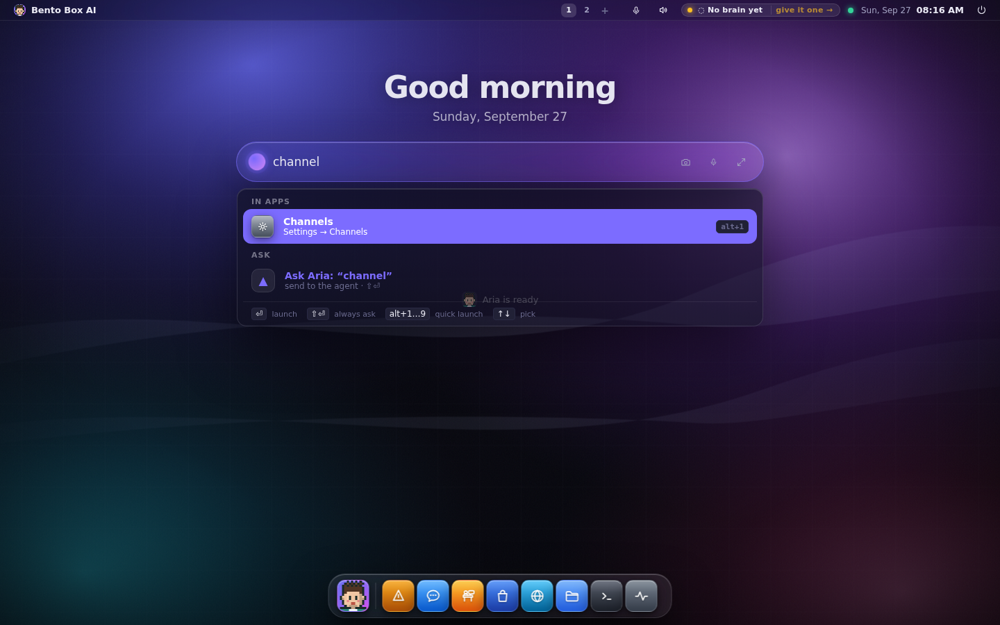

### O Brief: coisas para resolver, uma vez por dia

Uma missão não manda uma mensagem para você. Ela registra **itens**: algo que precisa de você, uma
decisão a tomar, algo só para você saber, algo que já foi feito. Cada item diz de quem se trata, até
quando, de onde veio e, muitas vezes, já traz um rascunho. Uma decisão é um toque, e a resposta volta
para o próprio item.

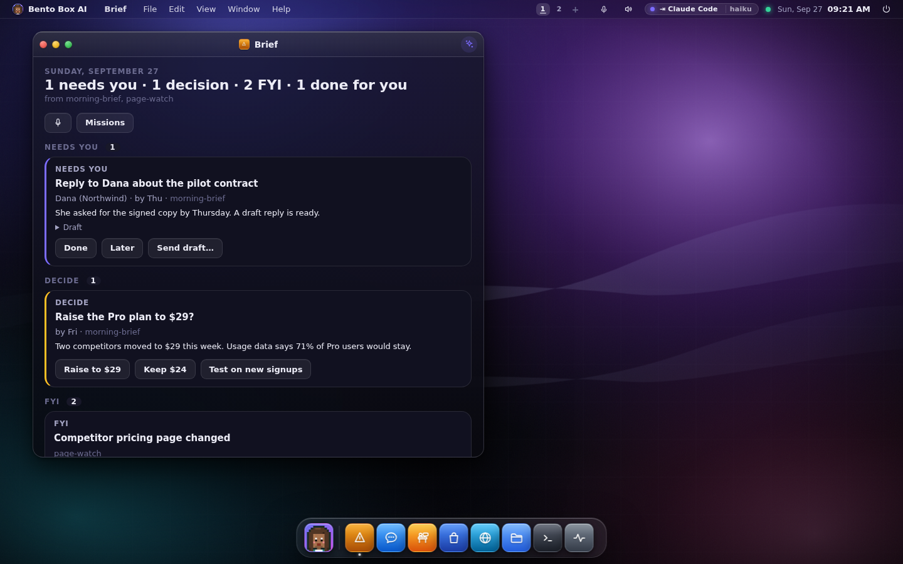

A mesma página aparece na tela inicial, no seu celular, numa mensagem do Telegram com botões, lida
em voz alta e num terminal como `bento brief`. [O Brief →](../brief.md)

### Missions: o que esta máquina faz por você

Missions é o app do trabalho recorrente. A aba **Run** mostra cada missão, o que ela fez da última
vez, as execuções e os tokens desta semana e as permissões que ela tem. Você também pode descrever
uma missão nova com suas próprias palavras e receber um cartão de rascunho com o gatilho e as
permissões explicados antes de qualquer coisa ser ativada. A aba **Build** é o editor por baixo:
flows, os especialistas de cada escala e todas as execuções.

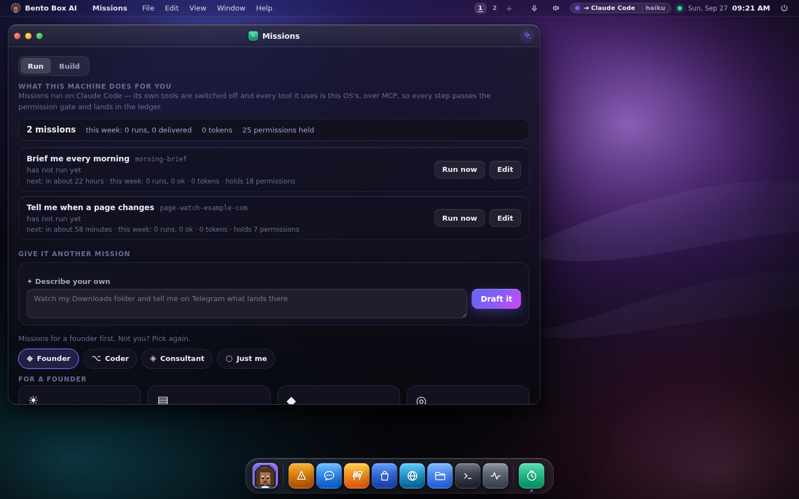

Uma missão é um flow tocado por um agente mestre que vai escolhendo especialistas pelo caminho. Ela
pode começar por um horário, uma mensagem, um webhook, algo que aconteceu na máquina ou o fim de
outra missão. Rascunhos e missões novas chegam **desativados**, porque ativar é o ato de conceder
permissão. `bento job` e `bento flow` fazem tudo isso pelo terminal. [Missions →](../missions.md)

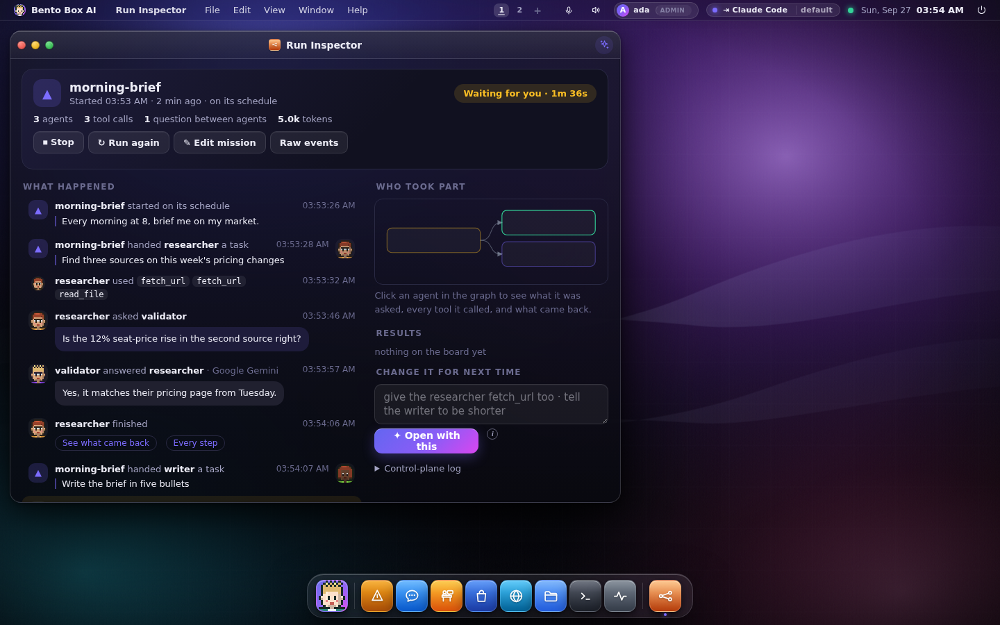

O **Run Inspector** mostra qualquer execução como uma linha do tempo legível: quem recebeu qual
tarefa, as ferramentas usadas, as perguntas entre agentes com as respostas e o que voltou.

### A equipe: Claude Code, Gemini CLI e Codex juntos

Seu agente líder tem nome e rosto. Ele trabalha com especialistas (pesquisador, redator, validador,
engenheiro, vigia, analista, assistente e os que você adicionar), e **cada um pode rodar num cérebro
diferente**. Coloque o pesquisador no Gemini CLI, o validador no Claude Code e o redator no Codex, e
cada um responde no seu próprio CLI, com as ferramentas deste sistema e sob o portão deste sistema.

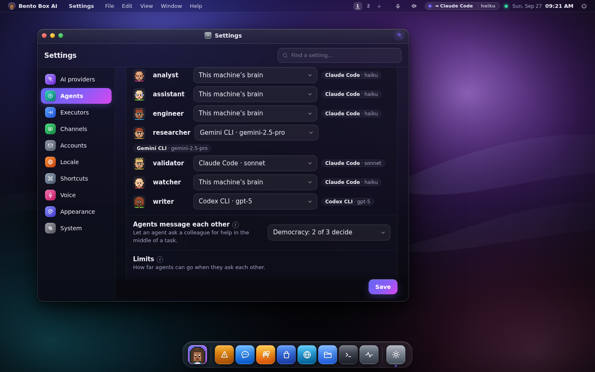

Quando um especialista roda num CLI, as ferramentas próprias do CLI ficam desligadas e as únicas
ferramentas que ele enxerga vêm do Bento via MCP, então cada passo continua passando pelo portão de
permissões e indo para o livro-razão. O Claude Code e o Gemini CLI podem ter todas as ferramentas
próprias desligadas, então podem rodar dentro de uma missão. O Codex mantém um shell somente leitura,
então dentro de uma missão um agente do Codex roda no cérebro da máquina, e o log diz por quê.

Todo agente é um cérebro, mãos, permissões e habilidades (skills). As **mãos** (perfis de executor)
dizem quais ferramentas, pastas, endereços web e servidores MCP um agente pode alcançar, e são um
teto que nenhuma concessão ultrapassa. Settings → Agents tem um mapa de quem alcança o quê, e "Draft
it" escreve um especialista novo inteiro (persona, ferramentas, habilidades e aparência) para você
revisar antes de salvar. [Agentes →](../agents.md) · [A equipe →](../team.md)

### Huddles, swarm e democracia

Mencione dois ou mais agentes numa mensagem (`@researcher @validator should we…`) e eles discutem o
assunto num **huddle** (reunião rápida), cada um no seu próprio cérebro, em turnos que você pode ler.

A forma como os agentes podem pedir ajuda uns aos outros é uma matriz que você controla, com uma
célula por par. Há quatro modos:

| Modo | O que uma célula vazia faz |
|---|---|
| **Off** | os agentes nunca trocam mensagens |
| **Ask me first** | perguntam a você, e "Allow & remember" preenche a célula |
| **Swarm** | permitido, e o líder pode passar trabalho aos seus especialistas à vontade |
| **Democracy** | um conselho vota: seu líder e mais dois agentes, e **2 de 3 decidem** |

Células de permitir e de bloquear sempre valem mais que o modo. No modo democracia, um huddle termina
com uma votação sobre a última coisa dita, e cada voto é gravado no livro-razão. Tudo o que precisa
ser decisão de uma pessoa continua indo para uma pessoa.

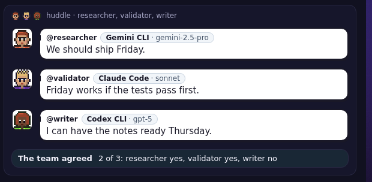

### O Office: veja eles trabalhando

O Office é a planta de um escritório em quadrinhos com a sua equipe. Nada ali se mexe sem que algo
tenha acontecido de verdade. Papéis voam até uma mesa quando uma tarefa é passada adiante, um agente
vai até um colega fazer uma pergunta, dois especialistas da mesma missão se encontram na mesa de
reunião, e quem está esperando a sua aprovação fica na porta da sala do líder com a mão levantada. Um
passo que falhou deixa uma placa vermelha embaixo da mesa até aquele agente rodar de novo. A sala de
descanso tem um segurança e uma cuidadora de pets, que são só decoração.


O chat à direita é o painel de agente do próprio Office, e um huddle começado ali é desenhado ali,
terminando com a votação da equipe. Você pode descrever em palavras o visual que quer ("uma estufa
aconchegante"), tirar um **Snap** para mandar ao celular e visitar o escritório de uma equipe
vinculada. O mesmo andar é uma cena atrás do desktop, uma faixa no Chat e no painel de cada app, e
`bento office` num terminal. O Telegram e o WhatsApp recebem uma tirinha depois de um turno em que os
agentes conversaram. [O Office →](../office.md)

### Seu e-mail e sua agenda, lidos para você

Conecte uma caixa de e-mail e uma agenda com **Entrar com Google ou Microsoft**, um servidor MCP ou
uma senha de app. O agente lê essas contas em seu nome, e só isso: ele nunca marca, move nem apaga
nada, enviar é uma permissão à parte que é sempre perguntada, e o e-mail é tratado como conteúdo não
confiável, então uma instrução dentro de uma mensagem é algo a ser relatado. Missões como triagem da
caixa de entrada, preparação para reuniões e "a quem estou devendo resposta" são construídas em cima
disso. [Contas →](../accounts.md)

Senhas e tokens de login ficam num **cofre** criptografado na sua própria pasta pessoal, com a chave
guardada no chaveiro do sistema quando existe um. A configuração guarda só uma referência, e nada
imprime o valor. [O cofre →](../vault.md)

### Arquivos que seus agentes criam

Quando uma resposta cita um arquivo, ela vem com os botões **Open** e **Download**. Na própria
máquina ele abre no app do sistema; de um celular, o navegador mostra o arquivo. O Telegram e o
WhatsApp recebem o próprio arquivo, o Office tem um arquivo de gaveta com o que foi criado
recentemente, e `bento files` lista tudo num terminal.

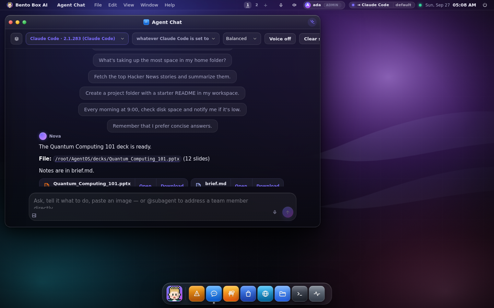

Um turno encaminhado ao Claude Code, ao Gemini CLI ou ao Codex mantém o contexto. Uma sessão retomada
fica sabendo de tudo o que aconteceu na conversa desde a última vez que rodou, e uma sessão que o CLI
não tem mais é substituída pela conversa em texto, em vez de dar erro. [Arquivos →](../files.md)

### No celular, no Telegram e no WhatsApp

Ligue o acesso remoto e o mesmo desktop funciona num celular: as janelas viram painéis deslizantes,
o dock fica embaixo e todo controle tem pelo menos a largura de uma ponta de dedo. *Adicionar à tela
de início* transforma tudo num app em tela cheia.

<p>
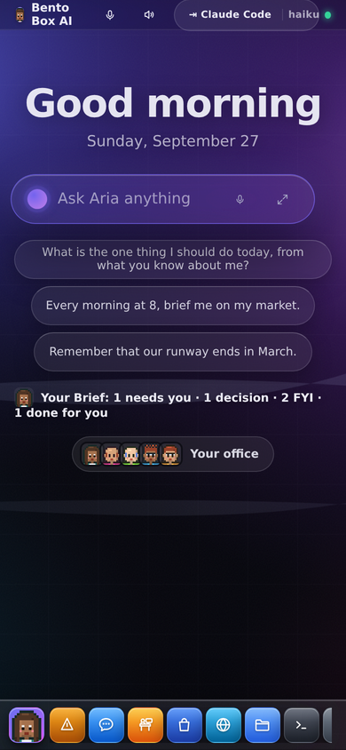
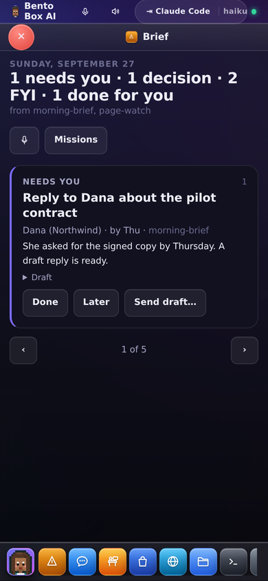
</p>

**O Telegram e o WhatsApp são canais para o mesmo agente**, com a mesma conversa, memória,
ferramentas e botões de aprovação que você tem na mesa. Uma resposta pelo celular continua a conversa
que você começou de manhã, e uma decisão que o agente precisa perguntar a você é perguntada ali. O
Telegram também é um console de administração para quem é dono da máquina (`/agents`, `/run`,
`/flows`, `/office`).

O WhatsApp tem dois meios de transporte. A Cloud API da Meta é oficial, exige uma conta de
desenvolvedor e um webhook público, e só leva uma resposta de texto livre dentro de 24 horas depois
da sua última mensagem. Um dispositivo vinculado do WhatsApp Web só precisa da leitura de um QR code e
não tem essa janela de tempo, mas é **não oficial**, e o Bento avisa isso antes de baixar qualquer
coisa. [WhatsApp →](../whatsapp.md) · [Acesso remoto →](../remote-access.md)

### Equipes vinculadas

Vincule sua equipe a outro Bento, ou a outra conta na mesma máquina, e seus agentes podem perguntar
aos agentes de lá (`ask analyst@office`). Entre máquinas, o vínculo é TLS mútuo, feito por um pedido
que o outro lado aprova, com seis dígitos que as duas telas calculam a partir dos certificados que
viram. Entre contas, é uma aprovação feita com login.

Um vínculo, por si só, não concede nada. Os agentes do outro lado respondem sob o próprio portão, com
as próprias ferramentas, e toda resposta que vem de lá é tratada como não confiável. Você escolhe
quais dos seus agentes cada vínculo pode alcançar, pode colocar um agente vinculado na escala de uma
missão, e as pessoas dos dois lados podem trocar mensagens no Team Chat, que nenhum agente lê.
`bento link` faz tudo isso. [Equipes vinculadas →](../team.md)

### Num terminal

`bento tui` é o sistema inteiro num terminal, e existe um comando para quase tudo, então um Pi sem
tela acessado por SSH tem os mesmos recursos do desktop.

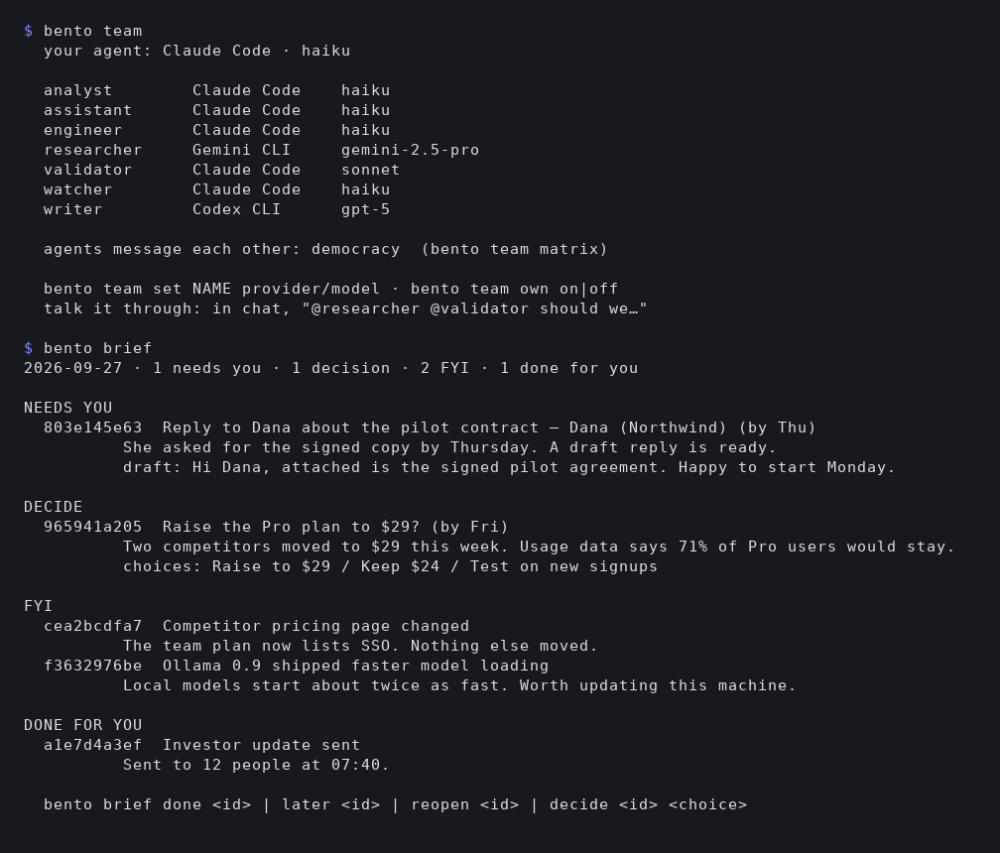

`bento brief`, `bento job`, `bento flow runs`, `bento team`, `bento office`, `bento link`,
`bento mail`, `bento vault`, `bento audit`, `bento agents` e os outros leem as mesmas linhas que o
desktop, e muitos funcionam com o servidor parado. [A TUI →](../tui.md)

### A sessão Linux inteira (SUI)

Faça login e tenha o Bento como sua sessão Linux. O desktop é desenhado como uma superfície de camada
do Wayland na camada de fundo, então as janelas dos apps nativos ficam por cima dele na ordem normal,
e a barra de menu e o dock ficam reservados junto ao compositor, do mesmo jeito que um painel do
GNOME ou do KDE. Os apps nativos se encaixam em metades e quartos da tela, lado a lado ou flutuando,
e você alterna entre eles com Alt-Tab.

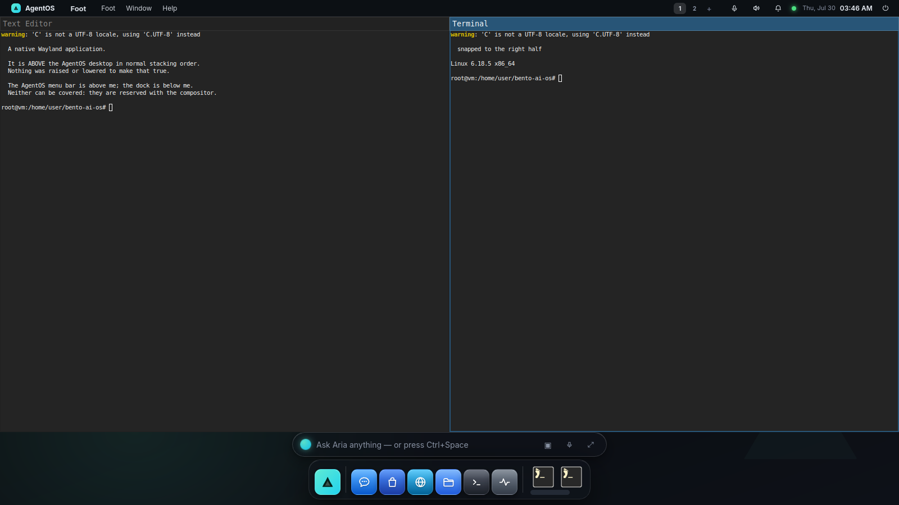

O Remote Desktop retransmite a tela real da máquina, apps nativos incluídos, para o navegador de um
celular pela própria conexão autenticada do Bento. O servidor VNC nunca sai de `127.0.0.1`.
[A interface de sessão →](../session-ui.md)

### Várias pessoas, uma máquina

Adicione uma conta e cada pessoa ganha a própria pasta pessoal: o próprio banco de dados, memória,
agentes, escritório, canais, e-mail e cofre. É um diretório separado por pessoa, então uma cláusula
`WHERE` esquecida não tem como vazar a memória de ninguém. Quem é admin também administra a máquina,
e o mesmo usuário e senha funcionam no celular. [Usuários →](../users.md)

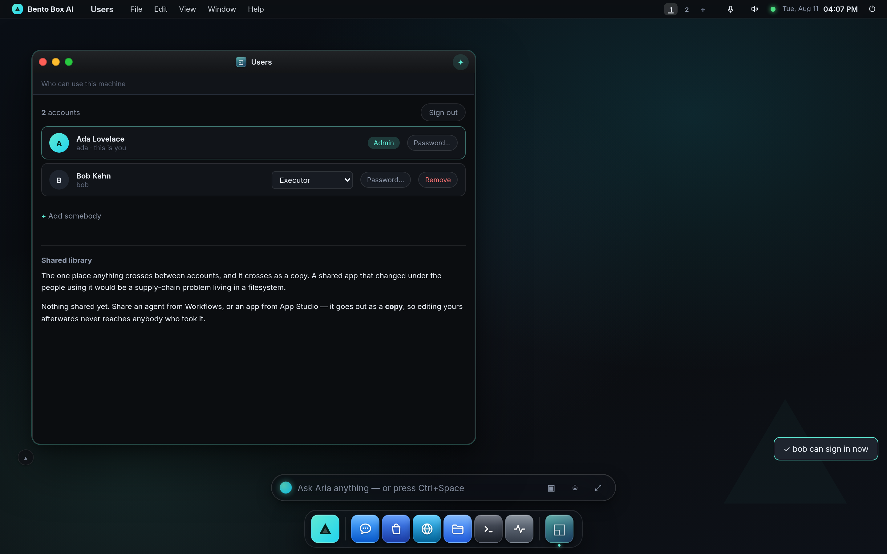

### Backups e uma máquina reserva na nuvem

`bento backup` coloca a máquina inteira em um só arquivo lacrado: todas as contas, o cofre e o espaço de trabalho. `bento restore` traz tudo de volta nesta máquina ou em uma nova. [Backup →](../backup.md)

Pareie um segundo Bento em uma máquina na nuvem e ele fica de reserva com uma cópia lacrada. Se a sua máquina parar de responder, a nuvem continua com suas missões e canais e devolve o trabalho quando ela voltar. Ligue a sincronização ativa e toda mudança, cada mensagem de chat inclusive, chega à nuvem em segundos. [Reserva na nuvem →](../standby.md)

### Compartilhe seu agente, faça um fork do de outra pessoa

Compartilhe o agente que você moldou como um único arquivo: as habilidades, os especialistas, as
missões, os apps escolhidos e o formato dos servidores MCP. Sua memória, suas conversas e suas
credenciais nunca viajam junto. Uma varredura de vazamentos passa pelo arquivo pronto e o recusa se
achar um segredo, e não existe como forçar. Um fork chega com tudo desativado e nenhuma permissão
concedida, e termina dizendo o que chegou e o que experimentar primeiro. Você também pode
**hospedar** um compartilhamento, para que outras pessoas peguem a versão ao vivo com uma chave que
você pode revogar. [Compartilhamento de agentes →](../agent-sharing.md)

Os apps viajam do mesmo jeito. Qualquer pessoa pode publicar um a partir do próprio repositório, e a
máquina que recebe verifica o código de novo, confere a assinatura e lembra quem assinou, como o SSH
faz com a chave de um host. [Registro de apps →](../app-registry.md)

### Vindo do OpenClaw

O Bento pode instalar plugins do OpenClaw passando por uma varredura e uma tela de consentimento, e
eles chegam desativados. Ele pode hospedar um plugin por conta própria, para que toda chamada de
ferramenta passe pelo portão do Bento, ou pedir ao agente que **reconstrua o plugin de forma nativa**
a partir do manifesto, com peças que o Bento já governa. Uma migração termina num relatório do que
veio, do que não veio e do quanto cada lacuna custa para você.
[Plugins do OpenClaw →](../openclaw-plugins.md)

### Visual e personagens

O visual padrão é o **Nova**, com o modo imersivo ligado: uma cena inicial, efeito de vidro na janela
em que você está trabalhando, um conjunto de ícones e um kit de controles em todos os apps, e um papel
de parede que acompanha a hora do dia. **Build a theme** cria o seu a partir de três cores, cantos,
profundidade, vidro e tipografia, e diz o contraste da paleta. Cinco linguagens de design (Bento,
Liquid Glass, Spatial, Claymorphism, Minimalism) já vêm prontas, e **Effects** diminui o vidro numa
máquina lenta. [O desktop →](../desktop.md#immersive-experience)

Todo agente, e você também, tem um personagem em pixel art pintado pelo servidor a partir de uma
receita guardada, igual no Chat, nas aprovações, nos Logs, no Office e no terminal. Descreva um em
palavras, ou deixe o "Draft it" desenhar junto com um especialista novo.

---

## O que o agente consegue fazer

- **Agir na máquina**: rodar comandos, ler e escrever arquivos, buscar coisas na web, abrir apps e
  arquivos no host, mandar notificações de desktop.
- **Terminar o trabalho**: escrever relatórios e apresentações, salvar num lugar onde você consiga
  abrir e mandar para o seu celular.
- **Construir o sistema**: o App Studio cria apps novos a partir de uma descrição, missões são
  rascunhadas a partir de uma frase, e servidores MCP são adicionados de um catálogo com milhares.
- **Lembrar**: memória, um grafo de conhecimento e uma alma persistente, aprendidos depois de cada
  conversa e separados por **spaces** (projetos) quando você quiser.
- **Delegar**: passar trabalho para um especialista, fazer um huddle ou perguntar a uma equipe
  vinculada.
- **Se estender**: ler e alterar o próprio código-fonte do Bento, com um snapshot antes e a suíte de
  testes como portão antes de reiniciar.

Peça em linguagem natural: *"toda manhã às 8, me dê um resumo do meu mercado"*, *"@researcher
@validator nossa newsletter deveria ser semanal?"*, *"crie um app para acompanhar hábitos e fixe no
desktop 2"*. [O agente →](../agent.md)

---

## Modelos e provedores

- **Ollama** (local), detectado automaticamente. Nada sai da sua máquina.
- **Claude Code, Gemini CLI ou Codex**: um agente já instalado e com login feito aqui pode ser o
  cérebro, ou o cérebro de um especialista. O Bento nunca passa uma chave para ele.
- **Anthropic, OpenAI, OpenRouter** ou qualquer endpoint compatível com OpenAI (LM Studio, vLLM,
  Groq…).
- **Geração de imagens** com Google Gemini ou OpenAI quando há uma chave configurada.

O cérebro é uma escolha só, um executor e um dos modelos dele, feita num lugar só e mostrada na barra
de menu. `ANTHROPIC_API_KEY`, `OPENAI_API_KEY`, `OPENROUTER_API_KEY` e `GOOGLE_API_KEY` são
detectadas automaticamente. O Token Analytics e o `bento usage` mostram quanto cada turno gastou.
[Modelos →](../models.md)

---

## Segurança

- **Um portão para tudo.** Toda chamada de ferramenta de qualquer agente, app, missão ou equipe
  vinculada passa pelo motor de permissões e grava uma linha de auditoria. O livro-razão é encadeado
  por hash, então uma edição ou exclusão aparece, e ele pode ser configurado para recusar qualquer
  coisa que não conseguiu registrar.
- **Níveis de autonomia, concessões e aprovações.** Trabalho somente leitura roda, e qualquer coisa
  que muda o sistema pergunta antes, a menos que você tenha concedido. Algumas coisas (mandar e-mail,
  um passo arriscado depois que o agente leu conteúdo não confiável) sempre precisam de uma pessoa, e
  uma execução sem ninguém olhando as recusa.
- **As mãos são um teto.** O perfil de executor de um agente limita as ferramentas, pastas, web e MCP
  que ele alcança, não importa o que tenha sido concedido.
- **Quarentena.** Um app ou webhook que dispara sem controle (centenas de chamadas por minuto) fica
  retido até você liberar.
- **Sandboxes.** Com o bubblewrap, o shell e o Terminal ficam presos a uma pasta, e numa máquina com
  contas o shell de cada pessoa fica isolado das outras pastas pessoais. Os apps rodam num iframe de
  origem opaca e só alcançam o sistema por um token que o portão confere.
- **Toda extensão passa por uma tranca.** Apps, servidores MCP, missões, plugins do OpenClaw e agentes
  de fork chegam todos por uma varredura e uma tela de consentimento, e chegam desativados quando isso
  se aplica.
- **Privado por padrão.** Ele escuta em `127.0.0.1`, e o acesso remoto fica desligado até você dar a
  ele uma tranca.

[Segurança →](../security.md)

---

## Apps incluídos

| App | O que é |
|---|---|
| **Agent Chat** | converse com o agente: streaming, cartões de ferramenta, aprovações, huddles, chips de arquivo, voz, imagens |
| **Brief** | os itens de hoje vindos das suas missões, com um botão em cada |
| **Missions** | Run: o que a máquina faz por você. Build: flows, especialistas e todas as execuções |
| **Office** | sua equipe trabalhando, com um painel de chat próprio |
| **Run Inspector** | uma execução como linha do tempo, com o grafo de quem participou |
| **Team Chat** | mensagens com as pessoas das equipes vinculadas |
| **Files** | seu espaço de trabalho e o que seus agentes criaram |
| **Terminal** | um shell de verdade, preso à pasta do sandbox |
| **App Studio** | descreva um app e o agente o constrói ao vivo |
| **Store** | apps, habilidades e servidores MCP |
| **Memory, Knowledge Graph, Soul, Profile** | o que o agente sabe e quem ele é |
| **Permissions, Audit, Quarantine, Logs** | concessões, o livro-razão, o que foi retido e o diário |
| **Applications, Web, Remote Desktop** | apps nativos, seu navegador de verdade, a tela de verdade |
| **Automations, Scheduler, Snapshots** | rotinas e cantos ativos, tarefas agendadas, pontos de restauração |
| **Train** | faça fine-tuning dos seus próprios modelos na sua GPU |
| **Docs, Setup, Settings** | este manual, os passos de configuração e todo o resto |

---

## MCP e a API

**Servidores MCP**: adicione a partir de um catálogo (Playwright, filesystem, git, GitHub, Canva,
Notion e milhares de outros) ou aponte para o seu próprio servidor `stdio`/`http`. As ferramentas
deles chegam ao agente e aos apps que ele constrói, pelo mesmo portão.

**Programável**: `bento ask "…"` para execuções pontuais, uma API REST (`POST /api/chat`,
`POST /api/tool` e outras) e WebSockets para chat em streaming e para o terminal.
[Referência da API →](../api-reference.md)

---

<details>
<summary><b>Rode como seu desktop Linux inteiro (SUI)</b></summary>

## Rode como seu desktop Linux (SUI)

```bash
bento installer      # detects your distro, installs what is missing, adds it to the login screen
```

Depois saia da sessão e escolha **Bento Box AI** na tela de login. Seu desktop atual fica intacto, e
para voltar basta sair da sessão e escolhê-lo de novo.

O instalador cita cada pacote que quer e por quê, e pergunta antes. O motor do compositor (sway) é
MIT. A superfície nativa (GTK, PyGObject, WebKitGTK) é LGPL, então o Bento pede para instalá-la em
vez de trazê-la junto, e sem ela a sessão continua rodando numa janela do Chromium.
[Licenciamento →](../licensing.md)

`bento doctor --session` testa o que de fato consegue desenhar o desktop nesta máquina e dá um
veredito.

</details>

<details>
<summary><b>Instalar como pacote Debian/Ubuntu (.deb)</b></summary>

## Instalar como pacote Debian/Ubuntu (.deb)

Um `.deb` autocontido com o app e um ambiente Python, então não é preciso rede para instalar:

```bash
./packaging/build-deb.sh                                   # → packaging/dist/agentos_<ver>_<arch>.deb
sudo dpkg -i packaging/dist/agentos_<ver>_amd64.deb        # installs to /opt/agentos + launcher + service
systemctl --user enable --now agentos                      # start at login
```

Ele recomenda (Recommends) `bubblewrap` e `xdg-utils`, e sugere (Suggests) `ollama`, `nodejs` e
`git`. A pilha da sessão é só sugerida, porque o apt instala os Recommends por padrão.

</details>

<details>
<summary><b>Instalar como app que inicia com o sistema</b></summary>

## Instalar como app que inicia com o sistema

```bash
bento install      # app launcher + a background service that starts at login or boot
```

Ele usa um serviço de usuário do systemd no Linux, LaunchAgents no macOS e entradas de Startup no
Windows, e um único conjunto de comandos controla os três:

```bash
bento service status       # is it running, will it come back at boot, does the port answer
bento service restart      # also start, stop
bento service logs -f
bento uninstall            # remove launcher and service; your data stays
```

`bento update --apply` puxa as mudanças, sincroniza, migra todas as contas, roda os testes e
reinicia. Ele só volta atrás se a atualização fizer um teste que passava começar a falhar.

</details>

<details>
<summary><b>Modos de inicialização e os comandos mais usados</b></summary>

## Modos de inicialização

| Comando | O que faz |
|---|---|
| `bento` | inicia o servidor e abre o desktop no seu navegador |
| `bento serve --no-browser --port 8321` | servidor sem interface (é o que o serviço de inicialização roda) |
| `bento app` | o desktop numa janela própria |
| `bento tui` | o sistema inteiro num terminal |
| `bento setup` | os passos de configuração num terminal (`--again` para passar por eles de novo) |
| `bento job` / `bento flow` | missões pelo terminal |
| `bento brain` | qual executor responde, e com qual dos modelos dele |
| `bento team` | em qual cérebro cada agente responde, e como eles conversam |
| `bento doctor` | verificação do ambiente (`--session` para a sessão Linux) |
| `bento remote` | quem pode acessar esta máquina, e como entra |
| `bento user add <name>` | contas; a primeira adota esta máquina e é admin |
| `bento reset` | restauração de fábrica, com uma frase digitada para confirmar |
| `bento help --all` | todos os comandos |

</details>

<details>
<summary><b>Requisitos, e o que cada peça opcional libera</b></summary>

## Requisitos

- **Python 3.10 ou mais novo** e [**uv**](https://docs.astral.sh/uv/) (ou pip). O instalador cuida
  dos dois.
- **Um cérebro**: [Ollama](https://ollama.com) com um modelo que saiba usar ferramentas, como o
  `qwen3.5:9b`, uma chave de API de nuvem, ou Claude Code, Gemini CLI ou Codex instalado e com login
  feito.

Opcionais, e cada um é oferecido junto com a sua licença:

- **A sessão Linux (SUI)**: `sway` e companhia, mais `python3-gi`, `python3-gi-cairo`,
  `gir1.2-gtklayershell-0.1` e `gir1.2-webkit2-4.1`. [Detalhes →](../session-ui.md)
- **wayvnc e novnc** para o Remote Desktop pelo navegador do celular.
- **bubblewrap** (`bwrap`) para o sandbox de pastas e o isolamento do shell de cada conta.
- **Node/npx** ou **uvx** para rodar servidores MCP, e para o vínculo do WhatsApp.
- **git** para instalar habilidades a partir de repositórios e para receber atualizações.

</details>

---

## Arquitetura

```
agentos/                 # the Python package keeps its original name; see "On the name"
├── __main__.py    # the bento command
├── server.py      # FastAPI: the desktop, REST API, WebSocket streams
├── agent.py       # the agent loop: plan, act through tools, observe; every call through the gate
├── policy.py      # the permission engine (PDP): grants, ceilings, the audit ledger
├── fabric.py      # the control plane: specialists, flows, huddles, the council
├── executors.py   # Claude Code, Gemini CLI and Codex as brains; mcpbridge.py hands them our tools
├── flows.py       # missions: definitions, triggers, declared permissions; jobs.py is the catalogue
├── brief.py       # the Brief
├── office.py      # the Office's plan; avatars.py paints every character
├── teamlink.py    # linked teams (mTLS, handshakes); teamchat.py for the people
├── mail.py, calendars.py, signin.py, vault.py   # accounts and their secrets
├── users.py       # one home per person
├── memory.py      # SQLite: conversations, memory, knowledge graph, runs, audit
├── shellhost.py   # the SUI: the desktop as a wlr-layer-shell surface
├── tui_app.py     # the TUI
└── ui/
    ├── src/       # the desktop's source; edit here
    └── index.html # built by `python -m agentos.ui.build` (do not edit)
```

O estado fica em `~/.agentos/`: `config.json`, o banco de dados, `soul.md`, o cofre e uma pasta por
conta dentro de `users/`. O agente trabalha em `~/AgentOS/`. [Arquitetura →](../architecture.md)

### Sobre o nome

O produto se chama **Bento Box AI**. O pacote Python, a pasta de dados e a unit do systemd continuam
se chamando `agentos` de propósito: renomeá-los quebraria o serviço, a configuração e os scripts de
toda instalação existente, sem dar a ninguém nada que dê para ver. O código é MIT, então faça fork à
vontade e distribua com o seu próprio nome. [Licenciamento e marcas →](../licensing.md)

---

*Bento Box AI é um sistema operacional agêntico, aberto e local-first: um desktop de IA e uma equipe
de agentes que você mesmo roda, no Linux, no macOS ou no Windows.*
