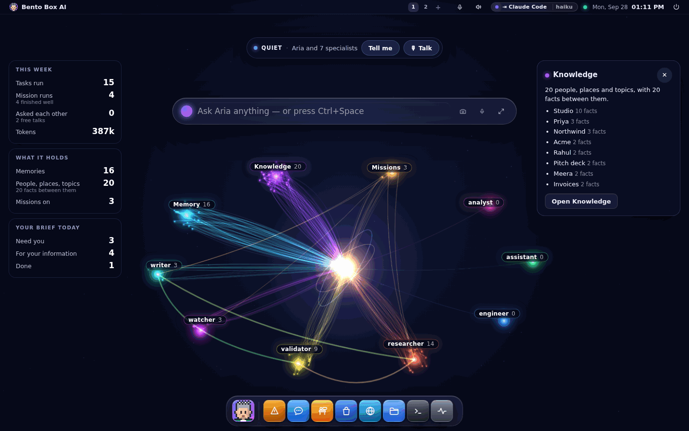
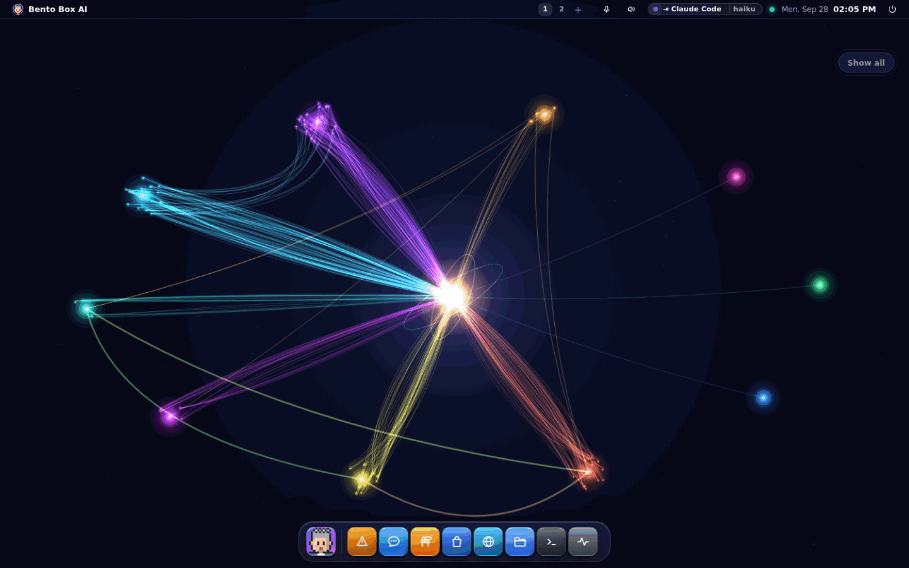
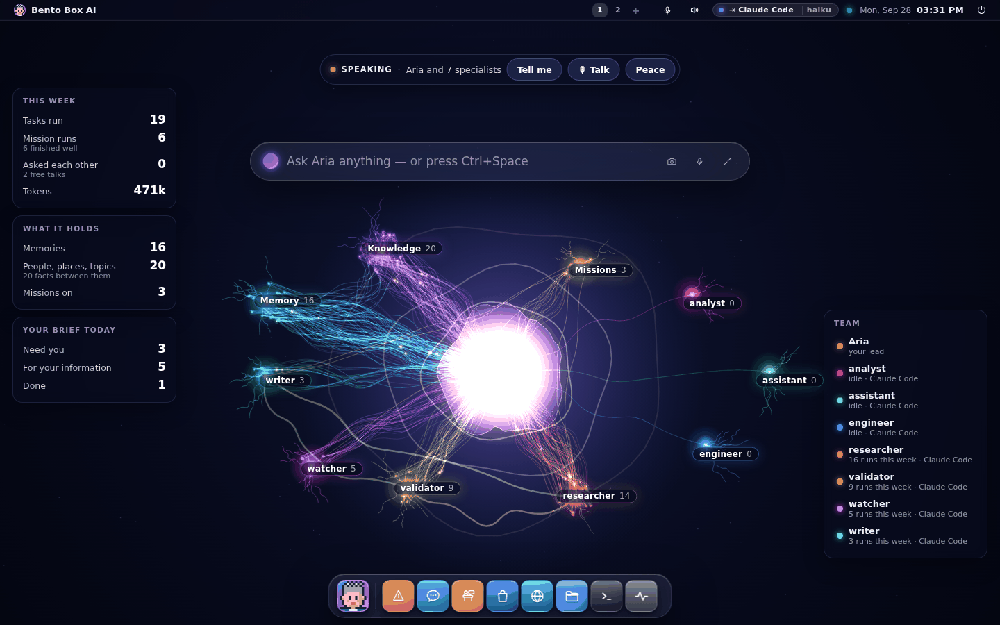
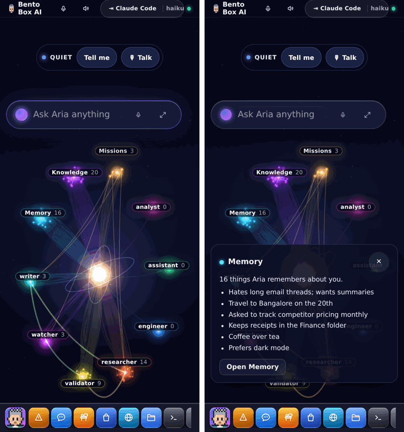

# The Mind

**Settings → Appearance → Scene → Mind.** Your agents, what they know and how it all
connects, drawn as one living picture behind your windows.


It was asked for with a video of a glowing brain on a wall screen: thousands of coloured
filaments around a bright core, numbers on the sides, and a voice answering questions.
This is that, built from what your machine actually holds.

## What you are looking at

- **The core is your lead.** It glows brighter while a turn runs, spins its rings while it
  is thinking, opens them while it is listening, and swells in syllables while it speaks.
- **Each cluster is one part of its mind.**
  - **Memory**: one point for every thing it remembers about you. A pinned memory is
    brighter.
  - **Knowledge**: the people, places and topics in the knowledge graph, and a faint line
    for every fact that connects two of them.
  - **Missions**: one point per mission, dimmed when it is switched off, with a gold strand
    to each specialist on its roster.
  - **One cluster per specialist**: its skills and its runs this week. A run that failed is
    red.
- **Every strand is a real connection.** One thing the core holds, drawn as a small bundle
  so the picture reads at a glance.
- **Lines between the clusters.** A memory or a run that names a person, place or topic in
  the knowledge graph is joined to it, so you can see what it remembers about the things it
  knows, and which work touched them. Names are matched as whole words, and names under
  three letters are left out because they would match everything.
- **A bright arc between two specialists** means they talked this week (one asked the
  other, a huddle or a free talk). It is thicker the more they did.
- **A spark only means something ran.** When your lead remembers something, a bright
  spark in the cluster's colour runs out to Memory and lights it. When a specialist starts
  a step, or one asks another, it runs to them.
- **Resting activity.** Small pale glints travel the fibres all the time, a few a second,
  more while your lead thinks or speaks, and a node flickers where one lands. That is the
  mind at rest, like the slow drift of the fibres. It never lights up a cluster, so you can
  still tell news from rest.
- **The core talks.** While your lead speaks, the core's edge moves with the sound of the
  voice and a ripple goes out on each syllable, with warm signals running down the fibres.
  While it listens, ripples come in. With your browser's own voice there is no sound to
  follow, so it keeps a speaking rhythm instead.

## The panels

- **This week**: tasks run (hand-overs, questions between agents, huddles and mission runs),
  mission runs and how many finished well, how often they asked each other, free talks,
  and tokens.
- **What it holds**: memories, people, places and topics, the facts between them, and
  missions switched on.
- **Your Brief today**: what needs you, what is for your information and what is done. Tap
  it to open the Brief.
- **Team**: your lead and every specialist, with what it runs on and whether it is working
  right now.

Tap a cluster's name, or a name in Team, for a card: the latest memories, the most
connected entities, the missions and whether each is on, or a specialist's skills, the
colleagues it talked with and its recent runs, with a button into the app that holds them.



## Peace

**Peace** in the pill takes everything else away: the panels, the names, the card and the
prompt bar, leaving only the mind and one quiet **Show all** button in the corner. Ctrl+Space
still brings up the prompt bar. The browser remembers it.



## Talking to it

- **Tell me** has your lead read the panels out loud, in its own voice, from the same
  numbers: "This week your team ran 15 tasks, including 4 mission runs. They talked freely
  2 times. 3 things in your Brief need you. I remember 16 things about you and know 20
  people, places and topics." It never says a number the panels do not show.
- **Talk** starts Jarvis. In this scene the core is the orb: your words and the answer
  appear in a panel at the top, and the core listens, thinks and speaks with you.



Which voice it uses is Settings → Voice → Voice engine ([Voice](desktop.md#voice)).

## On a phone

The core, the clusters and the pill with Tell me and Talk. The panels step aside, a
cluster's card slides up from the bottom, and names that would land on each other step
apart so each stays a whole target for a finger.



## What it costs

Measured in Chromium at 1440x900 with 70 things drawn: 1.2 to 1.4 ms a frame. It draws at
most 30 frames a second while the core is awake or a spark is travelling, 20 at rest, none
while a window is maximised or the page is hidden, and one still frame under reduced
motion (with no resting glints). A cluster's strands are two strokes, every glow is a cached image, and nothing
uses a filter. The picture is fetched once when the scene starts, again a second or two
after something finishes, and once a minute.

## In a terminal

```
$ bento mind
Aria's mind
  This week your team ran 15 tasks, including 4 mission runs. They talked freely 2 times. …

  Memory        16
  Knowledge     20  20 facts between them
  Missions       3  3 on
  researcher    14  16 runs this week · Claude Code
  …
  talked this week:
    researcher ↔ validator  ×2
```

`bento mind --json` prints the whole snapshot the scene draws. It reads the database
directly, so it works with the server down. The drawing itself has no terminal form.

## What the video has that this does not, yet

- **Business numbers.** The video's panels show new clients, monthly revenue and leads.
  The Mind shows what this OS knows about itself. Numbers from your CRM or billing would
  come from a mission that reads them and files them in your Brief, and a panel for them
  is the natural next step.
- **A wake word.** Talking starts with the Talk button or the mic, not by saying a name.
- **A wall display.** The scene works full screen on any browser, including a TV's, but
  there is no kiosk mode that opens straight into it.
