# The Office

The **Office** app is a playground where you watch your agents work. It is drawn as a
comic-strip office:

- your agent sits in the corner office, behind the mission board;
- each specialist has a desk in a department;
- huddles happen in the meeting room;
- there is a lounge with a sofa, a coffee machine and an office cat.

The chat is the column on the right, so you ask for something there and see it happen
on the left.

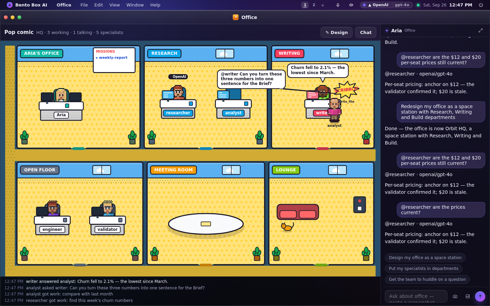

Open it from the dock, the app deck (Essentials), or ask your agent to "open the office".

## What moves, and why

Everything in the office moves because something really happened on this machine.

| You see | Because |
|---|---|
| A **paper flies** from the mission board to a desk, and a **!** pops over the specialist | A mission handed that specialist work, or your agent delegated to it |
| The **monitor lights** in the department's colour and the specialist **types** | Its run started; a tag above its head names the AI provider it is answering on |
| A **comic burst** ("FETCH!", "SCRIBBLE!") with the real tool name under it | It called that tool |
| One agent **gets up and walks** across the office to another's desk, asks in a speech balloon, waits for the answer, says thanks and walks back | It asked that colleague something (the team's permission matrix let it) |
| Agents **gather round the meeting table**, the one talking in a balloon | A huddle started |
| A **"? needs you"** shout and a raised hand | It is waiting for you to allow a step |
| **"done ✓"**, and the paper flies back to the board | Its run finished |

When nothing is happening, everyone sits at their desk, breathing and blinking. **They do
not wander about for show.** An office where everybody strolls around would look busy
when nothing is running, and this OS never shows activity that is not real. The pet
wanders. It is decoration, and it is clearly not an agent.

Under the picture, a four-line log says the same things in words ("analyst asked writer:
…"). A screen reader reads that log. It is also the quickest way to catch up after
looking away.

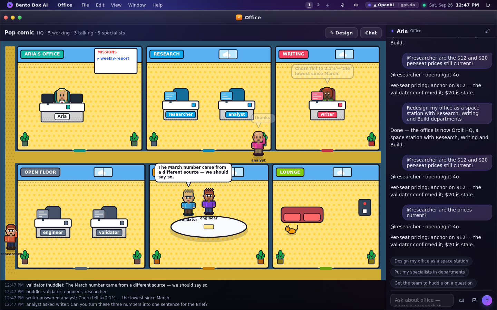

This is a real run, not a replay. You type into the chat, "redesign my office as a
space station". The agent calls `set_office` and the office repaints. Then you ask
`@researcher` about prices. It walks to the validator's desk in Build, asks, and gets
the answer.

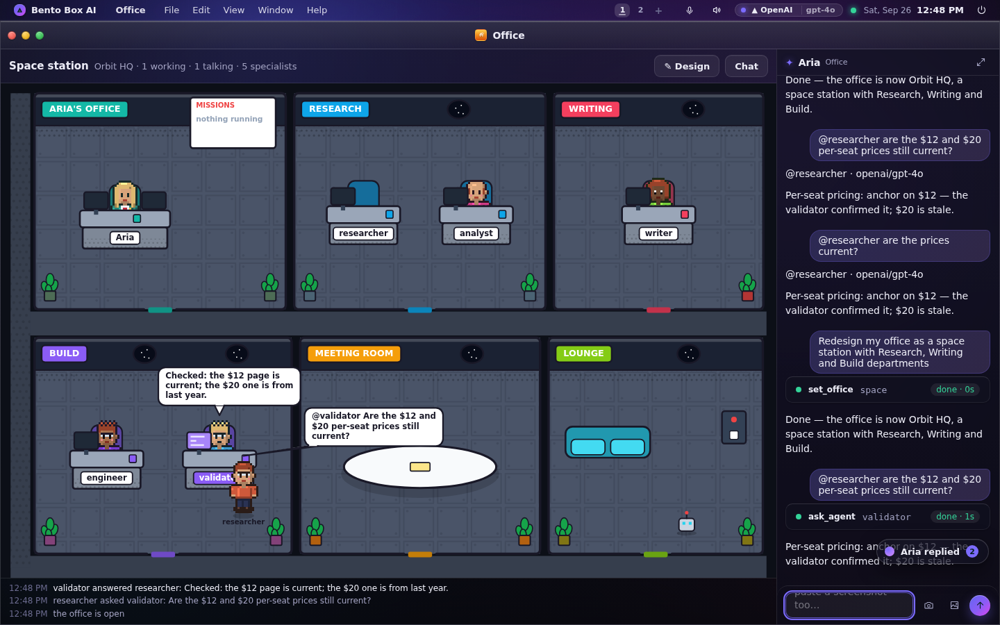

## In setup: your crew and your office

The setup arc has a step for it, right after "Build a specialist": **Meet your crew and
set up the office**. It gives everyone a stored character: you, your agent and every
specialist, each with a tap for a new look. You pick the office's style and the name on
its door, and see a preview of it with your crew inside before anything is saved. The
preview is the same picture your phone gets from `/office`. The step is ticked by
evidence: an office somebody created, from here, the Office's Design, the agent or
`bento office`.

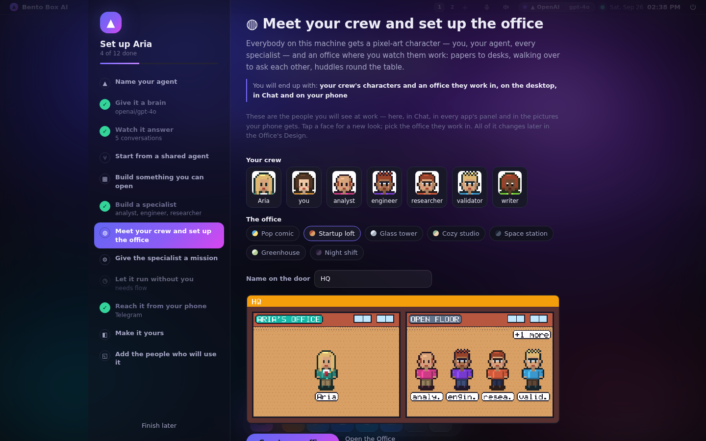

`bento setup` walks the same step in a terminal. It shows the faces in half blocks (or
describes them without colour), lists the seven styles, asks for the name, and runs the
same code as the wizard.

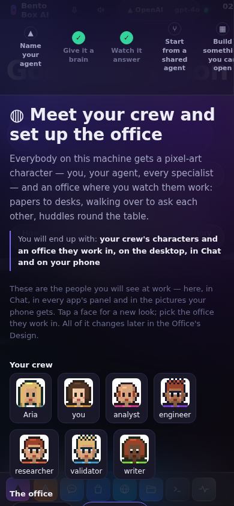

## Everywhere else: the play strip

A turn happens in more places than the Office. **Chat, the agent panel in every app, and
the prompt bar's card** each get the playground at the size of a line, which we call the
play strip. It shows:
- the faces of whoever is working on that turn;
- a **!** when work lands on somebody;
- a comic burst for each tool call, with the real tool name beside it;
- a short balloon when one agent asks another.

When the turn ends, the strip stays as a still record of who took part and how many steps
each took. A plain reply with no tools and no colleagues gets no strip at all.

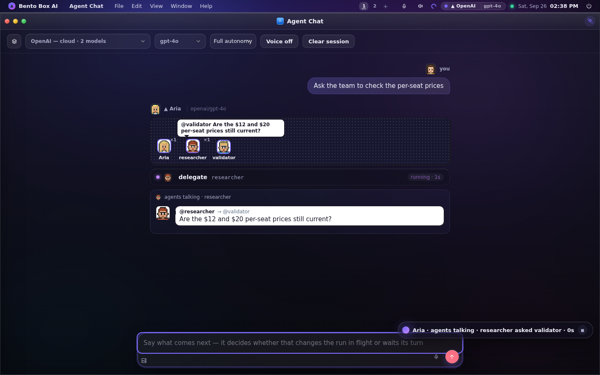

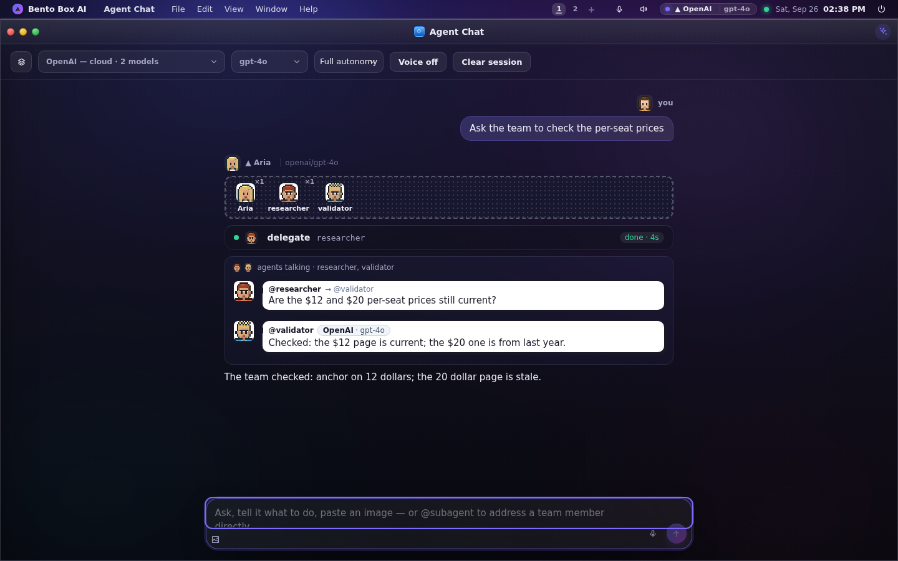

It follows the same rules as the Office: every mark is an event, fed by the same seam, with
the same faces and the same words. Agents talking to each other in Chat are now comic
balloons beside their faces. When the agent's hands touch an app window, the window gets
the same burst in its corner.

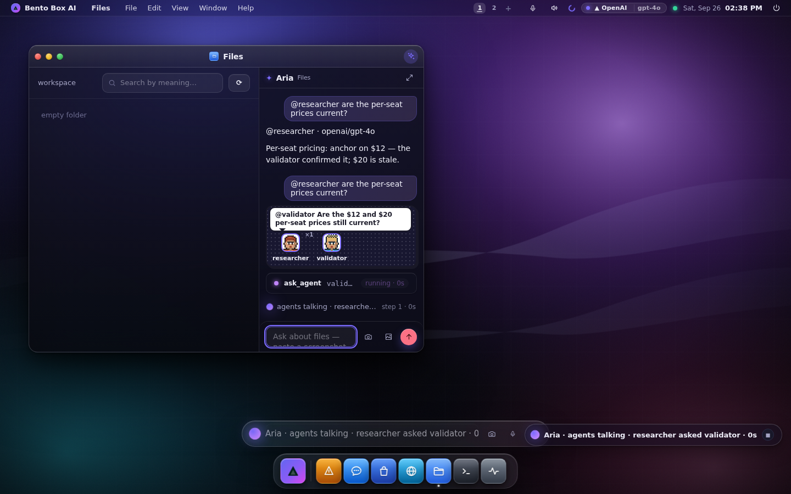

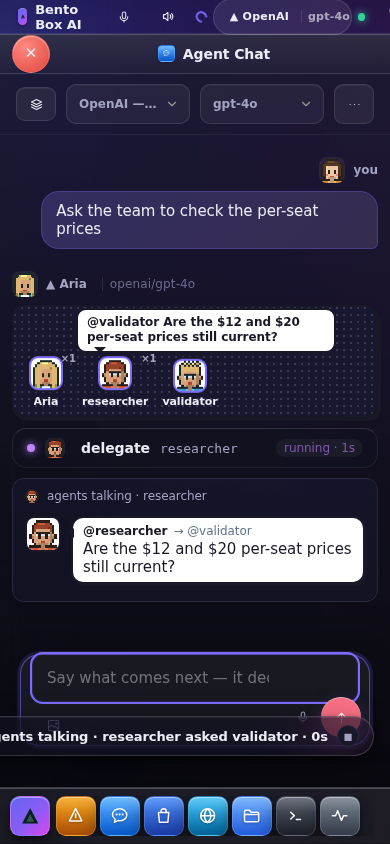

## On your phone: Telegram

Telegram can't run the Office, so it gets the Office as **pictures**, drawn on this machine
in your office's style with the same characters:

- **When agents talk during a turn you started from Telegram**, the reply is followed by a
  comic strip of that exchange: one panel per line, in order. Every word is also in the
  photo's caption. The picture's lettering is a small pixel font, so a line in another
  script, or mostly emoji, shows "(below)" in its balloon and you read it in the caption.
  A turn in which nobody talked sends nothing extra. `telegram.comics: false` in the
  config switches the strips off.
- **`/office`** sends the office right now: each room, its people, a BUSY tag over whoever
  has a run open, and what that run is doing. The caption is the same roll call in words.

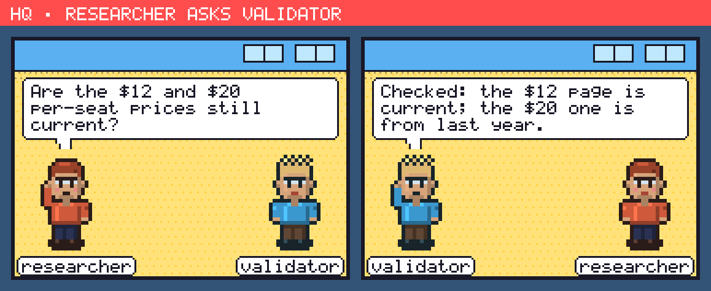

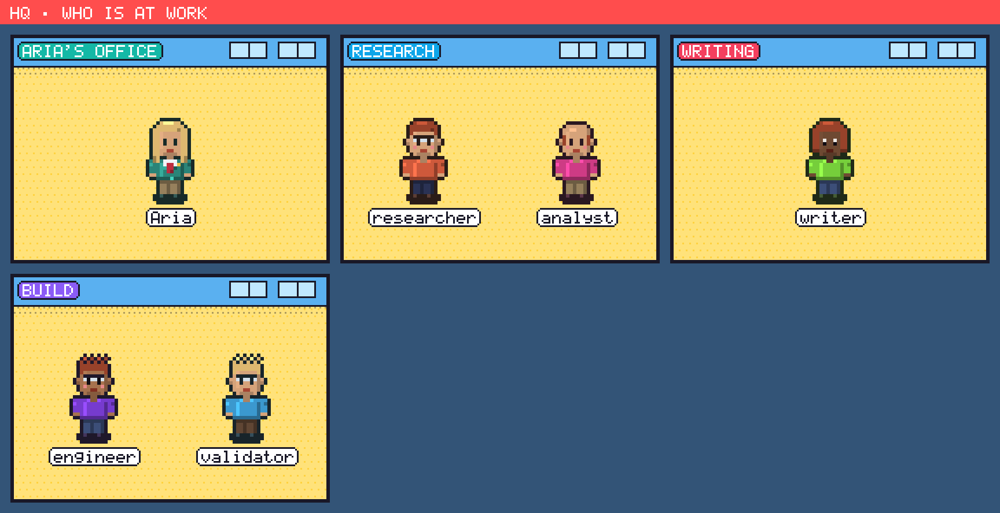

"Busy" is only ever a run that is open right now. A run left open by a crash more than an
hour ago doesn't count, and an agent with nothing open is shown as free. `bento office`
prints the same roll call. A terminal can't see a chat turn running inside the server,
so it says that about your agent instead of calling it free.

The pictures need nothing extra installed. They are drawn with the Python standard
library, like the characters themselves.

## Make it your office

Press **✎ Design**:

- **Describe it** in words. The text goes to your agent in the chat, and it designs the
  office with `set_office`.
- **Style**: *Pop comic* (the default), *Startup loft*, *Glass tower*, *Cozy studio*,
  *Space station*, *Greenhouse* or *Night shift*.
- **Name on the door.**
- **Departments**: up to six, each with a name and one of eight colours.
- **Who sits where**: pick a department for each specialist. A specialist you do not
  place sits on the **Open floor**.
- **Shared rooms**: the meeting room (where huddles gather) and the lounge, each on or
  off.
- **Decor**: plants, coffee, a whiteboard (the mission board), a bookshelf, an arcade
  cabinet, posters.
- **Office pet**: a cat, a dog, a robot, or none.

Changes show at once. The office is yours alone: on a machine with accounts, every
person has their own office. Every change you make is a row in the Audit log
(`office.write`).

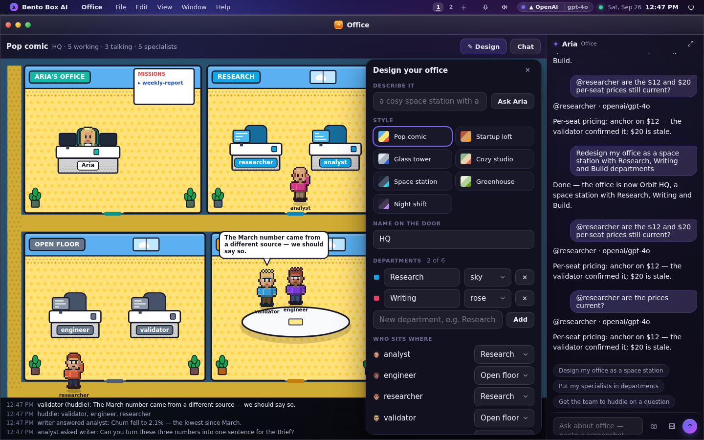

Only real specialists can be seated. Put in a name that nobody on this machine has and
it is left out, and the office tells you which names it dropped. A specialist that is
deleted leaves its department. Its empty chair has no name on it.

## Your agent can redesign it

"Make the office a cosy greenhouse and put the researcher and analyst in a Research wing"
is enough. The agent's `set_office` tool picks from the same fixed set of styles,
colours, decor and pets as the designer. If you ask for something outside that set, it
is refused with the list of choices.

`set_office` has its own permission (`office.write`), separate from the permissions for
real work. You can allow your agent to redecorate and still refuse it everything else,
or the other way round.

## From a terminal

There is nothing to animate in a terminal, but the office is a plan too, and
`bento office` shows it, says who is at work right now, and edits it:

```
$ bento office
HQ — Pop comic (bright halftone floors, bold ink, primary colours)

  Aria's office            your agent
  Research                 researcher, analyst  [sky]
  Writing                  writer  [rose]
  Open floor               engineer, validator

  also: meeting room, lounge · decor: plants, coffee, whiteboard · pet: cat

$ bento office styles
$ bento office style space
$ bento office move analyst Research
$ bento office move analyst            # back to the open floor
$ bento office dept-rm Writing
$ bento office meeting off
$ bento office decor plants arcade
$ bento office pet robot
```

It works with the server stopped. The desktop shows the change the next time it loads
the office. To follow live work in a terminal, use `bento flow runs` and the chat TUI.

## On a phone

The rooms stack one per row and the office scrolls. The chat is a sheet behind the
**Chat** button. Tap a person to start a message to them (`@name`) in that sheet.
Every control in the designer meets the touch-size floor.

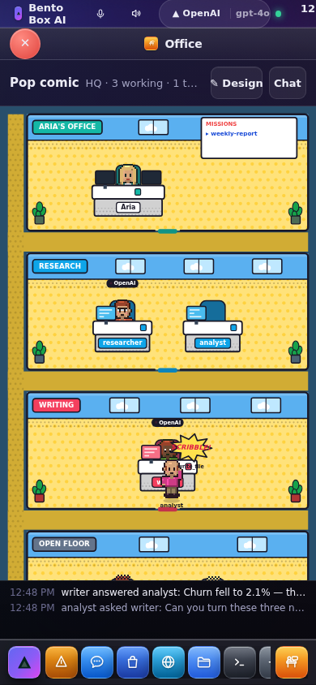

## What it costs

The Office draws on one canvas. The rooms are painted once into a hidden layer and
copied each frame, so a frame costs about a millisecond. Measured in Chromium with six
agents:

| State | Frames per second | Time per frame |
|---|---|---|
| At rest | about 5 | 1.1 ms |
| Five agents working, one walking | 15 (at most 30) | 1.35 ms |
| Window minimised, on another desktop, or covered | 0 | — |

With reduced motion turned on, the office draws one still frame per event: people appear
where they are going instead of walking there.
