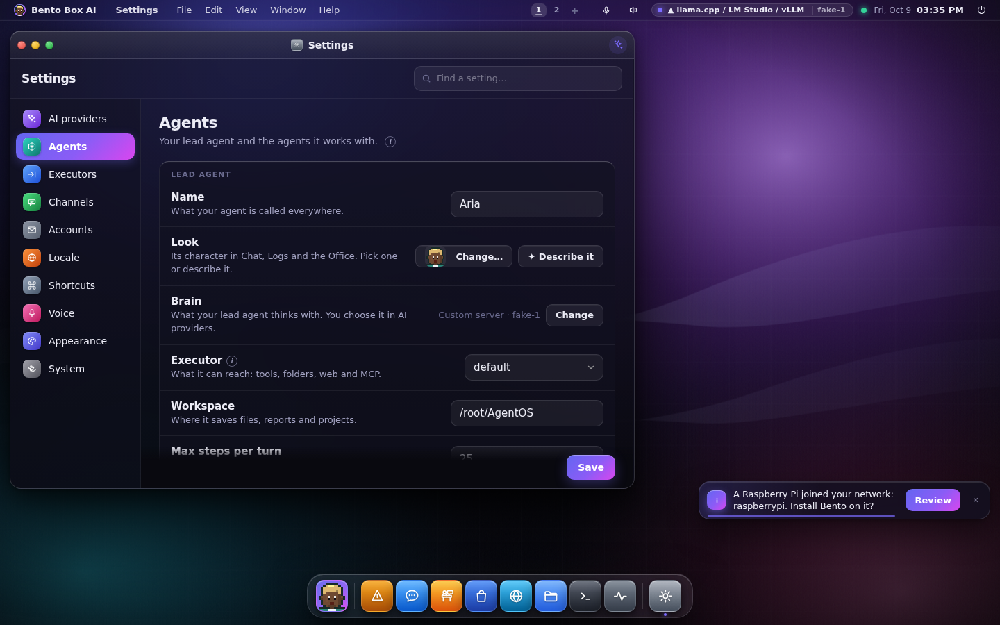
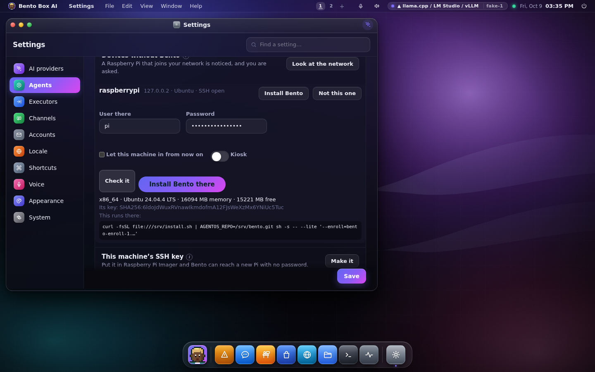
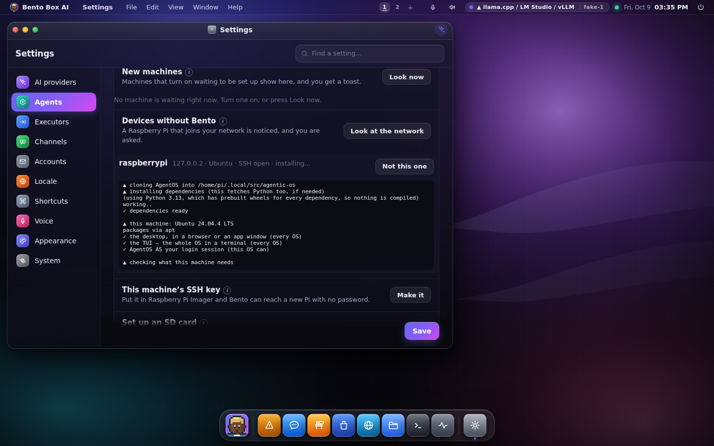

# A new machine on the network, with no Bento on it

You plug in a Raspberry Pi, it gets an address from your router, and the machine that leads
your community notices and asks: *would you like to install Bento on it and give it an agent?*
That is the idea behind POAP (power on, auto-provision). This guide covers how a Pi sets itself
up when it first boots, which parts of that Bento can use, and the three ways to get from a
bare Pi to a member of your community.

If the Pi already runs Bento, read [A community of machines](pool.md) instead. A Pi with Bento
waiting to be set up announces itself, and you enable it with a code or a key.

---

## How a Raspberry Pi sets itself up from boot

A Raspberry Pi has no BIOS menu and no installer. Everything it does on first boot comes from
the SD card (or USB drive), which has two partitions:

- **The boot partition** (`bootfs`). It is small and FAT32, so Windows and macOS can open it
  when you plug the card in. On the running Pi it is mounted at `/boot/firmware`. It holds the
  firmware's `config.txt`, the kernel command line in `cmdline.txt`, and the first-boot
  settings described below.
- **The root partition** (`rootfs`, ext4). This is the operating system itself.

What reads the first-boot settings depends on the image:

| Image | What runs on first boot | Files on the boot partition |
|---|---|---|
| Raspberry Pi OS based on Debian 13 **trixie** (images from 24 November 2025 on) | **cloud-init** | `user-data`, `network-config`, `meta-data` |
| Raspberry Pi OS based on Debian 12 **bookworm** | `firstrun.sh`, started from `cmdline.txt`, deletes itself afterwards | `firstrun.sh` |

On trixie, Raspberry Pi Imager 2 writes three files from its *OS customisation* screen. You can
also edit them yourself:

- **`user-data`** is a cloud-config document (YAML that starts with `#cloud-config`). It sets the
  user and its password or SSH keys, the host name, the time zone, `enable_ssh: true` (a
  Raspberry Pi OS option that switches the SSH server on) and an `rpi:` block for interfaces
  such as SPI and I2C. It can also list commands to run once (`runcmd`).
- **`network-config`** describes Wi-Fi in netplan's version 2 format, rendered by NetworkManager:
  the network name, its password and the country (`regulatory-domain`).
- **`meta-data`** names this instance for cloud-init.

Then the network takes over. NetworkManager brings up Ethernet or Wi-Fi and asks for an address
by **DHCP**. Your router hands one out, say `192.168.1.40`. **avahi** starts on boot and announces
the Pi's name on the local network over mDNS: *raspberrypi.local is 192.168.1.40*. That's why
`ssh pi@raspberrypi.local` works without anyone looking up an address. There has been no default
`pi` user since 2022. The user is whoever Imager set up.

## Which of that Bento can use

The DHCP exchange itself is between the Pi and your router. Watching it needs a privileged port
and the router's cooperation, so Bento doesn't try. What it does use:

- **The mDNS announcement.** The leader listens on the mDNS group, passively, and hears a
  machine say its name the moment it has an address. It sends nothing to do this.
- **The MAC address.** Raspberry Pi Ltd registers its own address prefixes (for example
  `d8:3a:dd` and `2c:cf:67`). Once the leader has knocked on a machine, the kernel's neighbour
  table holds that machine's MAC, so a Pi is recognised by its hardware and not only by its name.
- **SSH.** If the card switched SSH on, the leader can log in, with your yes, and run the
  installer.
- **`user-data` itself.** A trixie card can carry the installer as a first-boot command, so the
  Pi installs Bento before anyone sees it.

## The three roads

### 1. Bento on the card: nothing to press (trixie)

Write the card with Raspberry Pi Imager as usual, setting a user, Wi-Fi and SSH. Keep the card
plugged into the machine that leads your community, then go to *Settings → Team & Communications → Community →
Set up an SD card*, press **Add Bento to a card** and give the path of the boot partition.
From a terminal:

```sh
bento pool sdcard /media/$USER/bootfs                  # Linux
bento pool sdcard /Volumes/bootfs --hostname pi-kitchen --kiosk
bento pool sdcard /media/$USER/bootfs --wifi "Home" --wifi-country GB   # asks for the password
```

This adds to what Imager wrote and changes nothing else:

- the leader's SSH public key on the card's user, so the leader can always reach this Pi;
- `enable_ssh: true`;
- one first-boot command, which waits for the network, then runs the real installer as that
  user with an **enrolment key made for this card**, and logs to `/var/log/bento-firstboot.log`;
- Wi-Fi in `network-config`, only if you ask for it;
- `bento-enroll.txt`, the same key, as a fallback.

Put the card in the Pi and switch it on. It gets an address, installs Bento (most of the time
goes on building Bento's Python environment), comes up waiting with the
key, and the leader sets it up as a member with an agent. You get a toast when it is done.

A bookworm card is refused, with a sentence saying so. Use road 2 for it.

### 2. Found on the network, installed over SSH

A Pi written by Imager with SSH switched on, or any Linux machine with SSH, can be found and
installed from the leader:



1. When a Pi says its name on the network, the leader knocks on SSH and shows a toast:
   *raspberrypi joined the network without Bento*. Or press **Look at the network** to knock
   on every address of this machine's own network.
2. Every machine that answers is listed with its name, its maker (from the MAC), its SSH banner
   and an OS hint. Pis are marked.
3. Press **Install Bento** on one, under *Settings → Team & Communications → Devices without Bento*. Type the user and password that Imager set, or leave the
   password empty if the card already carries the leader's key. **Check it** logs in, reads what
   the machine is (processor, board, free space, memory) and changes nothing. It shows the exact
   command that will run there and the fingerprint of that machine's SSH key.


4. Press **Install Bento there**. The installer's lines stream in. With *Let this machine in from now on*
   ticked, the leader's own key is added to that user, so later visits need no password.


5. Bento starts on the new machine with a key made for it alone, the leader hears it, and it is
   set up as a member with an agent, with no code. The key is spent once it has been used.

From a terminal:

```sh
bento pool devices                          # look at the network
bento pool install 192.168.1.40 --user ada --authorize     # asks for the password
bento pool install 192.168.1.40 --user ada --key-only      # the card carries the leader's key
bento pool sshkey                           # the leader's public key, for Imager's SSH box
```

### 3. Bento already on it

If you installed Bento on the Pi yourself (`install.sh`, or a card you prepared another way),
it waits to be set up and you enable it with its code or a key. See
[New machines on the network](pool.md#new-machines-on-the-network).

## What keeps it safe

- **It is your act, every time.** Looking at the network, installing and writing a card are
  admin only. There is no agent tool for any of them, and every step is a ledger row
  (`device.scan`, `device.seen`, `device.installed`, `device.failed`).
- **Only your own network.** The scan knocks only on private and link-local addresses on this
  machine's own interfaces, at most 1,024 of them. It never scans by itself. The mDNS ear only
  listens, and a name with a public address is ignored.
- **The password is never kept.** It goes to the system's own `ssh` through `SSH_ASKPASS` in
  that one process's environment, and is dropped afterwards. It is never written to a file, a
  log or the ledger.
- **The other machine's key is pinned.** Bento keeps its own `known_hosts`. The first visit
  records the machine's SSH key, and a later visit to a machine whose key changed is refused.
- **What will run is shown before it runs**, and the install runs the same `install.sh` you
  would run yourself, from this machine's own update source.
- **A card's key is on the card in clear.** Anyone holding the card holds that key. It is made
  for one machine and spent when that machine is set up. Revoke an unused one in *Settings → Team &
  Communications → Community*.
- **The system's `ssh`.** Bento uses OpenSSH, which every Pi and nearly every Linux and Mac
  already has, because the Python SSH libraries are not permissively licensed.

## What was tested, and what wasn't

Tested in this repository:
- `tests/test_device_install.py` covers the mDNS parser against crafted and malformed packets,
  the ear over real UDP, MAC prefixes, the neighbour table, a scan against a stand-in SSH
  server, the SSH install against a stand-in `ssh` (password through askpass, the key on the
  next visit, what was shown is what ran), and the SD-card kit merged into an Imager-shaped
  `user-data`.
- `packaging/dev/provision-e2e/install_over_ssh.py` runs the whole road on one box: a stand-in
  Pi with a real OpenSSH server and no Bento, a crafted mDNS announcement, the scan, the check,
  the real `install.sh` run over SSH, Bento starting on it, and the leader setting it up as a
  member with an agent.

Not tested, because there was no Raspberry Pi hardware or Pi OS image to hand:
- the first-boot command running under cloud-init on a real trixie card. The `user-data` it
  writes follows Raspberry Pi's documented format, and `runcmd` is standard cloud-init;
- avahi announcing the name on a real Pi. Raspberry Pi OS enables avahi by default, according to
  every source we found, but Raspberry Pi doesn't state it in one place.

## Sources

- [Cloud-init on Raspberry Pi OS](https://www.raspberrypi.com/news/cloud-init-on-raspberry-pi-os/), Raspberry Pi
- [trixie-feedback issue 26](https://github.com/raspberrypi/trixie-feedback/issues/26), on cloud-init in trixie images
- [Raspberry Pi Imager 2 and cloud-init](https://forums.raspberrypi.com/viewtopic.php?t=395107), Raspberry Pi forums
- [network-config on trixie](https://forums.raspberrypi.com/viewtopic.php?t=396200), Raspberry Pi forums
- [Raspberry Pi MAC address prefixes](https://maclookup.app/vendors/raspberry-pi-trading-ltd)
