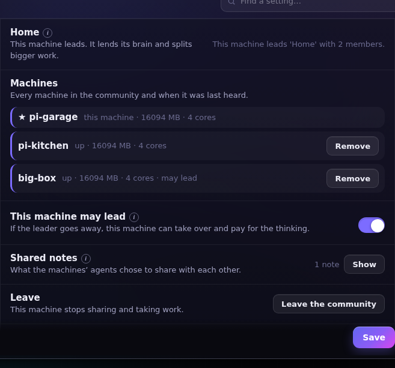
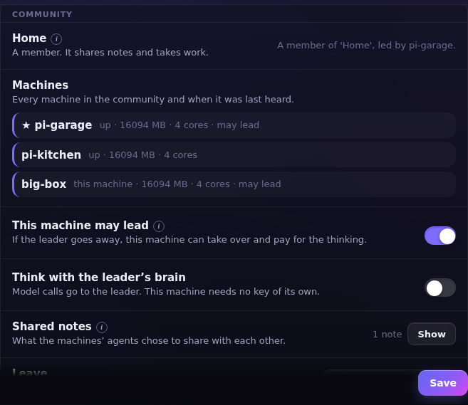
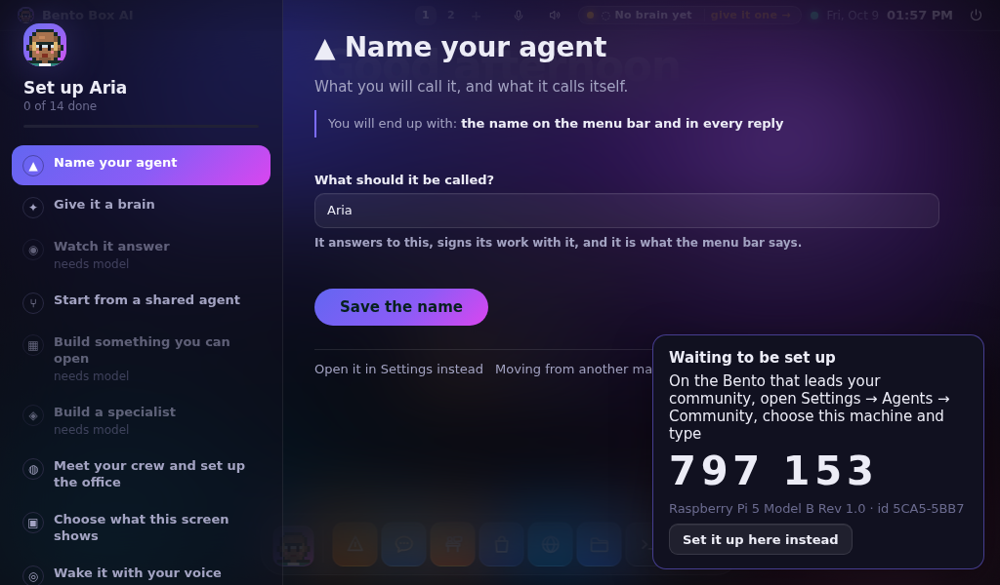
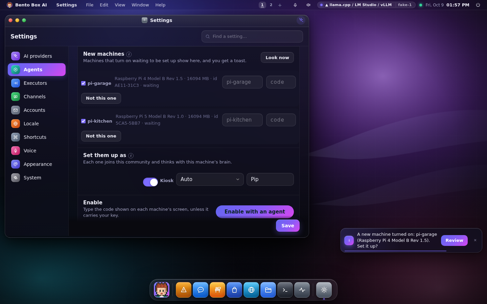
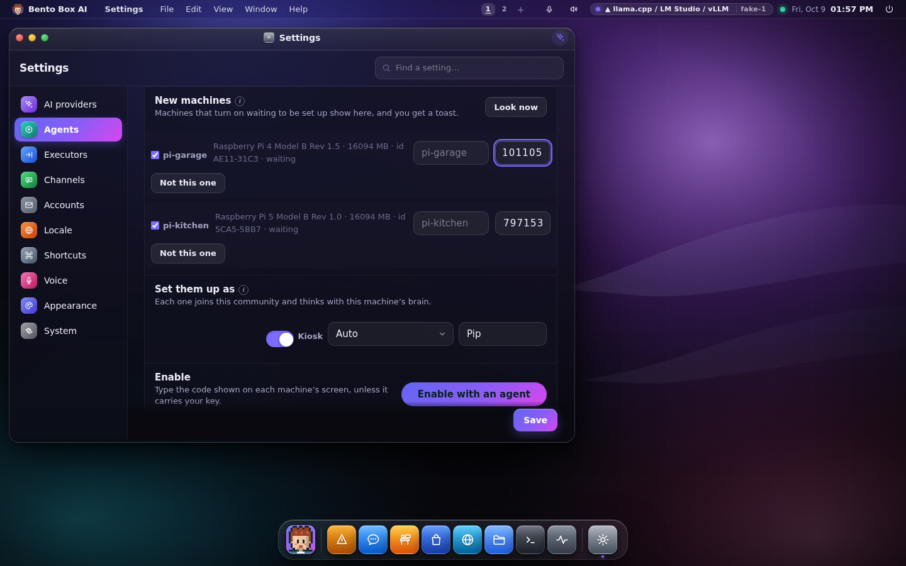

# A community of machines

A few small computers can work as one. One machine **leads**: it holds the keys, lends its
brain and splits bigger jobs. The others **join**: a Raspberry Pi in the kitchen, another in
the garage. They share what they learn, each takes a piece of a bigger task, and a Pi with no
key of its own thinks with the leader's brain. Every machine knows who else is in the
community.



## Start one

1. **Link the machines.** A community is built on [linked teams](team.md#linked-teams): on the
   Pi, *Settings → Agents → Working together → Linked teams*, type the leader's address and
   press **Ask**. Approve it on the leader; both screens show the same six digits. Both
   machines need *Accept linked teams* on.
2. **Start the community** on the leader: *Settings → Agents → Community → Start*. The leader
   needs a brain of its own (a model with a key, or a local model).
3. **Ask to join** on each Pi: pick the leader in *Join a community*. A Pi with no brain of its
   own thinks with the leader's brain from then on.
4. **Let them in** on the leader: each one shows up as *asking to join*, with **Let in** and
   **Turn away**.

From a terminal, the same steps:

```sh
bento link request big-box.local        # on the Pi; approve it on the leader
bento pool create Home                  # on the leader
bento pool join big-box --brain         # on the Pi
bento pool approve pi-kitchen           # on the leader
bento pool                              # anywhere: who is in, who leads, when each was heard
bento pool lead on                      # on a machine that may take over if the leader goes
bento pool pin pi-garage                # on the leader: who takes over first
```

A member sees the same list, with its own part: whether it may lead, and whether it thinks with
the leader's brain.



## New machines on the network

You don't have to link each Pi by hand. A fresh Raspberry Pi with Bento **waits to be set
up**: it tells the network it is there when it starts, and its own screen shows a six-digit
code and its machine id.



The machine that leads your community hears it and asks you. A machine that could lead (it
has a brain of its own) listens too, so the first Pi you plug in is noticed before there is a
community at all.



Press **Review**, or open *Settings → Agents → Community → New machines*. Every machine heard
is listed with its board, its memory and its id. Tick the ones to set up, type the code shown
on each one's screen, choose what they become, and press **Enable with an agent**.



Each one then:
- links to this machine, the same kind of link the six digits make between two teams,
- takes the profile you chose: its name, its agent's name, kiosk or desktop, one agent on
  screen, Light mode,
- finishes its setup, joins the community straight away (you already said yes), and thinks
  with the leader's brain.

If there was no community yet, enabling the first machine starts one on this machine.

### Without typing codes: enrolment keys

For Pis nobody will stand in front of, make an **enrolment key** (*Make a key* in the same
place, or `bento pool key "kitchen Pis"`). Put the key on the new Pi before its first boot:

- save it as `bento-enroll.txt` on the SD card's boot partition, or
- install with `install.sh --enroll=KEY`, or run `bento pool enroll KEY` on it.

A Pi carrying your key needs no code. Mark the key **automatic** and the Pi is set up the
moment it is heard, with the profile you gave the key. You still get a toast saying so.

### From a terminal

```sh
bento pool discover                          # on the leader: who is waiting
bento pool enable pi-kitchen --code 482913   # set one up (add --kiosk, --agent-name Pip)
bento pool key "kitchen Pis" --auto          # make an enrolment key
bento pool wait                              # on the new machine: its code and id
bento pool wait on                           # make any machine wait, not only a fresh Pi
bento pool enroll bento-enroll-1.…           # carry a key
```

### What keeps it safe

- **Only a waiting machine listens for a claim.** A machine that was set up, joined a
  community or was told `bento pool wait off` answers nothing. A claim closes it for good.
- **A claim is proven.** The code or the key is never sent; each side proves it with a
  keyed hash over both machines' certificates and a fresh number, so it can't be replayed.
  Five wrong codes change the code, and after three changes the machine takes no claim for ten
  minutes. A machine claiming to carry your key must prove it too, so an automatic key never
  enables a device that only copied a key's name out of the air.
- **Check the id.** The code is read off the new machine's screen by you. Compare the machine
  id it shows with the one in the leader's list: if somebody on your network were in the
  middle, the two would differ. On a network you don't trust, use an enrolment key, whose
  secret never travels.
- **Enabling is a person's act.** There is no agent tool for it, because each machine you
  enable spends the leader's model budget. Every step is a ledger row on both machines.
- Waiting and listening use UDP and TCP port 8620 on the local network. A network that drops
  broadcasts between its parts can be told where to look with `AGENTOS_DISCOVER_TARGETS`.

Measured with a leader and three stand-in Pis on one box (`packaging/dev/provision-e2e/run.py`):
the leader heard all three within 4.5 seconds of them starting, set up the one carrying its
automatic key with nobody pressing anything, enabled the other two together in 0.02 seconds,
and all three were members a second later, at about 97 MB each.

## What a community does

**The leader thinks for the members.** A member on `pool/default` (shown as *Your community's
leader* in the brain picker) sends each model call to the leader, which runs it on its own
provider. The member's keys, if it has any, never leave it. On the leader, each call is
checked by its own permission gate, metered by its rate ceiling, and recorded in its ledger
and its Usage, so the bill shows which machine asked.

**Notes are shared.** An agent shares a fact with every machine through
`remember(community=true)` and reads the community's notes with `community_recall`. A
member's note waits on that machine until the leader takes it on the next heartbeat (every
15 seconds), then reaches every other member on theirs. Forgetting a note travels the same
way. *Settings → Community → Shared notes* lists them, with **Forget** on each.

**Bigger jobs are split.** On the leader, the agent has `pool_task`: it hands each piece of a
job to a member that is up, all at once, and gets the answers back together. Each piece runs
on that machine's `worker` agent, with that machine's own tools and files, under that
machine's own permissions.


## Who leads

The leader is chosen by rank, and only among machines whose own admin said they may lead
(*This machine may lead*, or `bento pool lead on`). Leading spends that machine's model
budget on every member's calls, so it is never assumed. A machine also needs a brain of its
own to lead.

The leader stays while it answers. When it stops answering for a minute, every member works
out the same successor from the last list it got: the machine the leader pinned first, then
the one with the most memory and cores. They ask that machine to take over, and it does only
after failing to reach the old leader itself, so one member with a broken cable can't start
an election. Each change of leader raises the community's *term*. A leader that comes back
asks around once, hears a newer term, and steps down.

Measured on one box with three real servers (`packaging/dev/pool-e2e/run.py`): the garage Pi
took over 60 seconds after the leader was killed, the kitchen Pi followed it at once and
thought with its brain on the next question, and the old leader stepped down 16 seconds
after it was started again.

## What it can and can't reach

- **Joining grants one thing on each side.** Letting a machine in writes one permission on the
  leader: `pool:<machine>` may use the leader's models. Joining writes one on the member: the
  community may hand it work. Revoke either in *Permissions* and that stops at the gate.
  Removing a member, or leaving, revokes them too.
- **A machine of the community is refused everything else.** It can't run tools here, read
  files, message your agents or change anything. Nobody is asked on its behalf: a call from
  the network has nobody waiting at the other end.
- **Work from the community runs as outside content.** A member's worker treats the task as
  coming from another machine: a step that needs a person waits for one at that machine's
  screen, and with nobody there it is refused at once.
- **Notes are other machines' words.** `community_recall` is marked as outside content, like a
  web page, so a risky step after reading one asks first. Notes are never put into an agent's
  instructions on their own.
- **Community links carry community requests only.** For a failover, members can reach each
  other directly. Those links are written from the list the leader sends, are pinned to each
  machine's certificate like any link, are hidden from *Linked teams*, and answer nothing but
  community requests.

## When something is off

- *"Waiting for 'Home' to let this machine in"*: the leader's admin hasn't pressed **Let in**.
- *"the community's leader could not think for this machine"*: the leader refused or couldn't
  answer. The reason follows: its permission was revoked, it was calling too fast, or it is
  away.
- *"the leader is away and no machine that may lead answered"*: nobody else agreed to lead.
  Switch on *This machine may lead* on a machine with a brain.
- `bento pool` prints the last problem a machine had reaching its leader.

The community is the machine's, not an account's: on a machine with accounts, only an admin
starts, joins, approves or leaves one.
