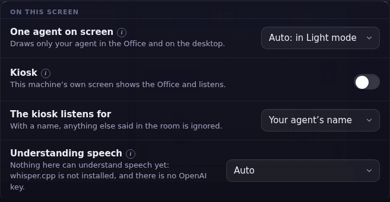
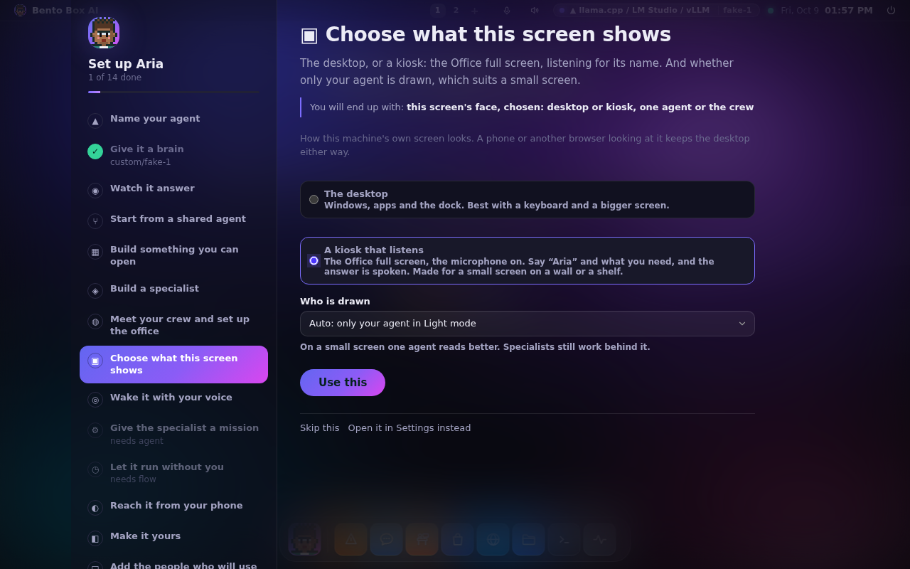
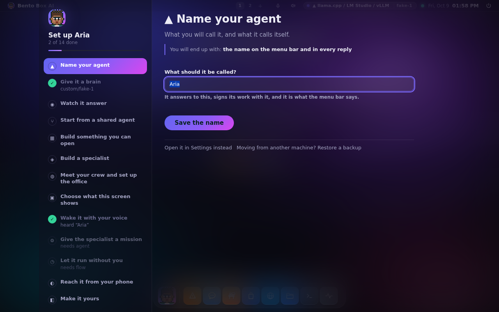
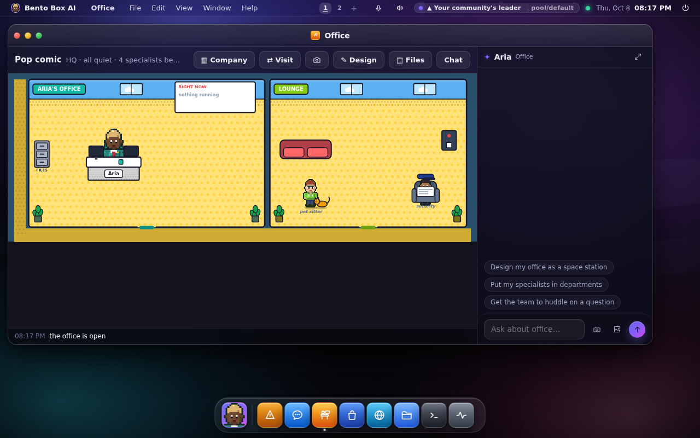
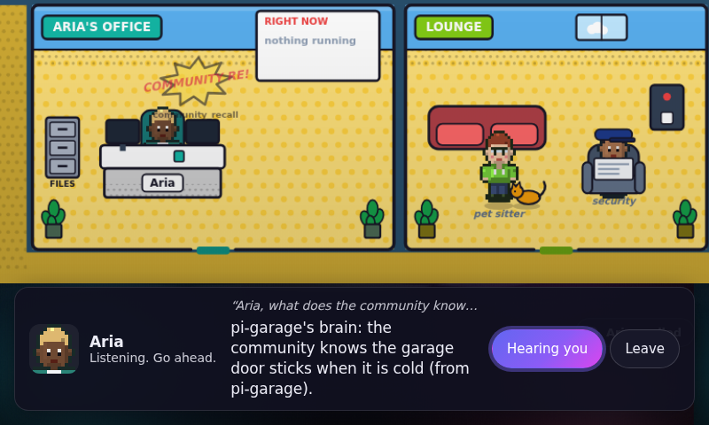
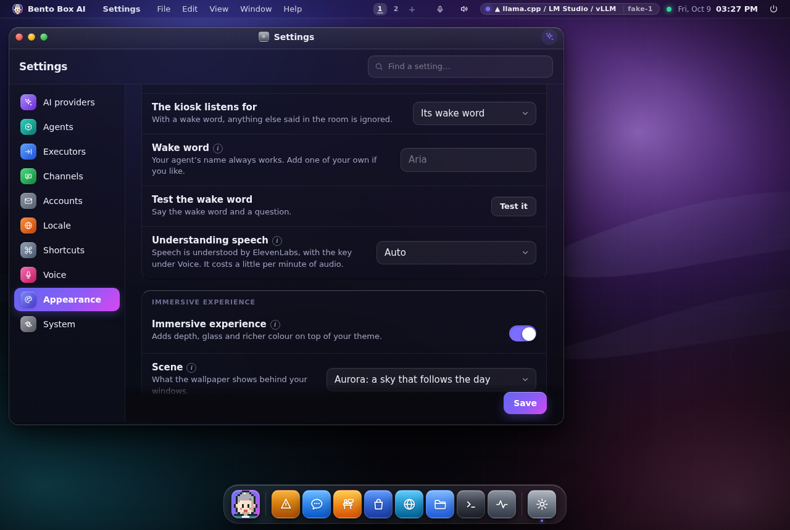
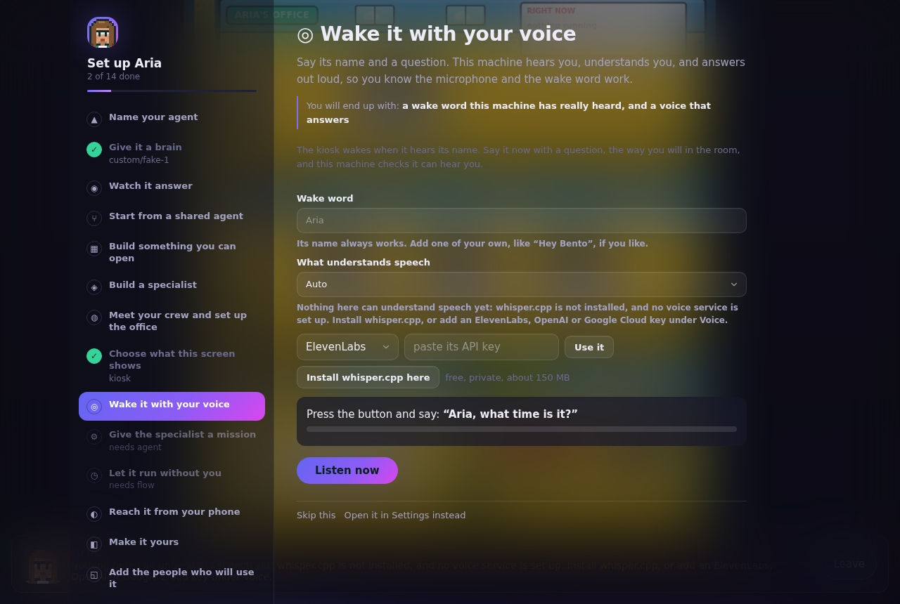
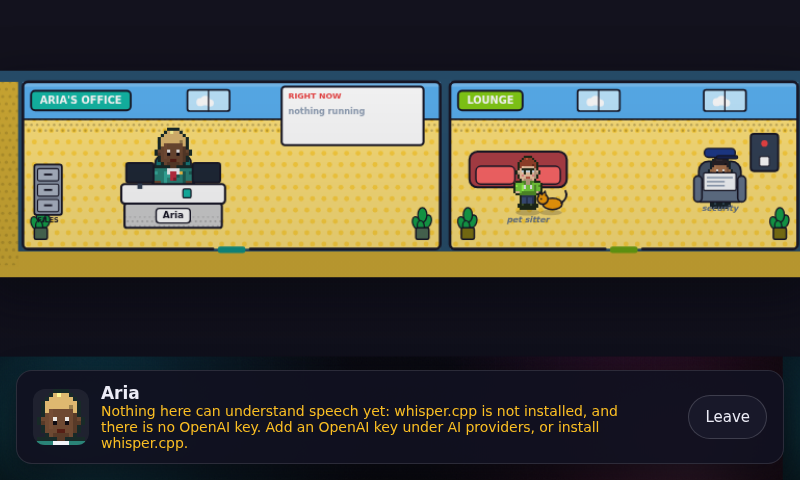

# One agent on screen, and the kiosk

Two ways to make a small machine's own screen, like a Raspberry Pi with a 7-inch display,
easy to read and easy to talk to. Both are in *Settings → Appearance → On this screen*, or
`bento face` in a terminal.



## Chosen during setup

Setup asks both questions, right after the office, so a Pi with a 7-inch screen is set up
once and never needs Settings:

- **Choose what this screen shows:** the desktop, or a kiosk that listens; and who is drawn.



- **Wake it with your voice:** choose a wake word if you like, press **Listen now** and say
  *"Aria, what time is it?"*. The meter moves while it hears you, this machine turns what it
  heard into text, checks that it starts with a wake word, and answers out loud. The step is
  ticked only when that really happened, so a kiosk nobody could wake never looks finished.



On a Pi over SSH, `bento setup` asks the same two things, and `bento face test` records five
seconds from the microphone (with `arecord`, which Raspberry Pi OS has) and checks the same way.
A Pi that was set up from your community's leader (see [New machines](pool.md#new-machines-on-the-network))
gets its screen chosen there and skips these.

## One agent on screen

The Office and the desktop's Crew scene draw only your agent. Your specialists still exist
and still work. When one of them is busy, your agent's desk lights up instead, and the
Office's header says how many work behind it.



It is **Auto** by default, which turns it on in Light mode. A Raspberry Pi gets Light mode by
itself, so it gets one agent on screen without being told. Choose **On** or **Off** to decide
for yourself.

## The kiosk

The machine's own screen becomes the Office, full screen, with the microphone on. Say your
agent's name, or a wake word of your own, and what you need: *"Aria, what's on today?"*. The agents work in the Office
while the answer is shown and spoken. For twenty seconds after an answer you can follow up
without the name. Anything else said in the room is ignored and nothing is kept. If you'd
rather it listened to everything, choose *Everything it hears*.



- **Only the screen plugged into the machine** shows the kiosk. A phone or another browser
  looking at the same machine keeps its desktop. To try it anywhere, open the address with
  `#kiosk` on the end.
- **Leave** returns to the desktop until the browser is restarted. Turning the kiosk off for good is
  the switch in Settings, or `bento face kiosk off`.
- **A request from the kiosk is an ordinary chat**, in a thread called *At the screen*, with
  the same permissions as any other. An approval card still appears over the kiosk.
- A browser needs a tap before it may start the microphone and the voice. If it hasn't had
  one, the kiosk says *Tap anywhere to start listening*.

### Understanding speech

A browser's own speech recogniser sends the audio to Google, and the Chromium on a Raspberry
Pi has no key for that, so it fails on the first word. The kiosk records what you say itself
and this machine turns it into text, with one of:

- **whisper.cpp**, on this machine. Nothing leaves it, and it needs no key. Setup offers to
  install it (*Install whisper.cpp here*): on a Mac through Homebrew, elsewhere built from source
  in your home folder, plus its base model of about 150 MB. Bento also finds one you installed
  yourself in `~/.cache/whisper`, `~/whisper.cpp/models` or `/usr/share/whisper.cpp/models`, or the
  model named in `speech.hear.whisper_model`.
- **The voice service under Settings → Voice.** The key that gives your agents their voices also
  hears you: ElevenLabs (Scribe), OpenAI (or the key under AI providers) or Google Cloud (its project
  needs the Speech-to-Text API turned on). Each costs a little per minute of audio.
- **This browser**, where its own recogniser works.

**Auto** uses whisper.cpp when it is here, then the service you chose for speaking, then any other
key that can hear. With none of them, Settings and the setup step offer both fixes side by side:
*Add a voice key* and *Install whisper.cpp here*. The kiosk shows the sentence that says what to
add, and no microphone.







### When AgentOS is the whole session

In the session mode, the screen is drawn by WebKitGTK. It used to refuse every microphone
request, because nothing answered WebKit's permission question, so voice input never
worked there. The session host now grants the microphone, and only the microphone, to this
machine's own page.

## In a terminal

```sh
bento face                      # what is on, and what can understand speech
bento face buddy on|off|auto
bento face kiosk on|off
bento face wake name|always
bento face word Hey Bento             # a wake word of your own; the name still works
bento face test                       # record, understand, check the wake word
bento face hear auto|whisper.cpp|elevenlabs|openai|google|browser
```

A terminal has no office to draw, so here you only set it.
