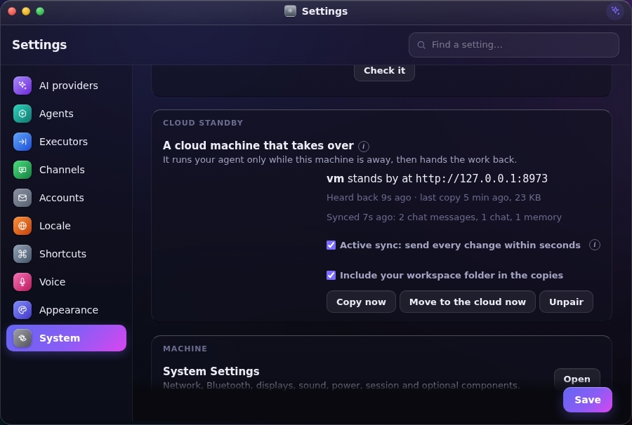
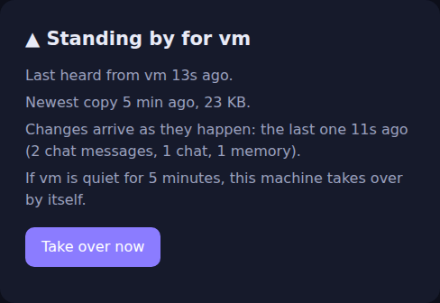

# Cloud standby

Your agent runs on your own machine. A second Bento on a cloud machine stands by with a
sealed copy of everything, and takes over only while yours can't be reached: the laptop
lid is closed, the power is out, the Wi-Fi is down. When your machine is back, it takes
the work back before it starts anything, and the cloud goes quiet again.

You can also move on purpose: **Move to the cloud now** hands over, and **Bring it back
here** takes it back.

## Setting it up

You need Bento running on a cloud machine that your machine can reach. The
[Docker image](../Dockerfile) is the quickest way, with a passphrase so it can listen on
a port. Put it behind HTTPS, or reach it over Tailscale or your LAN.

1. **On the cloud machine**, open Settings → System → Cloud standby and press
   **Show a code**. Or in a terminal there: `bento standby wait`.
2. **On your machine**, open the same pane, type the cloud's address and the code, and
   press **Pair**. Or: `bento standby pair https://your-cloud 7KQM-4XPD`.

The code works once, for ten minutes, and five wrong tries use it up. From then on the
cloud shows a page that says who it is standing by for, and does nothing else.





## What happens

| When | What your machine does | What the cloud does |
|---|---|---|
| Every 30 seconds | Says it is here | Notes the time |
| Something changed, at most every 10 minutes | Sends a sealed copy of its whole home | Checks the copy in full and keeps it, plus the one before |
| Quiet for 5 minutes (you can choose 2, 5, 15 or 60) | | Takes over: swaps the newest copy in and restarts as you |
| Back on | Before it starts anything, asks for the work | Seals what it did, hands it over, goes quiet |

While the cloud is working, it runs your missions, schedules, Telegram and WhatsApp, and
you sign in to it at its own address. Only one of the two ever acts at a time.

## If both worked while they were apart

If the two machines lost each other but both kept running (a network split, not a
closed lid), neither copy is merged into the other. Your machine keeps its own work, the
cloud's copy is saved beside it, and your Brief says so. In Settings → System → Cloud
standby you choose **Use the cloud's copy** or **Keep mine**. In a terminal:
`bento standby adopt` or `bento standby keep`.

A laptop that wakes from sleep is not a split. Its scheduler waits for one heartbeat
before firing anything, so it finds the cloud working and takes the work back first.

## What does not come along

- **Claude Code, Gemini CLI and Codex** sign in on each machine separately. Install and
  sign in on the cloud machine once if you want it to answer the same way. Otherwise it
  answers with an AI provider key from your settings.
- **Local models** (Ollama and similar) run on your machine. Choose a cloud model for
  when the cloud is working.
- **Your workspace folder** comes along unless it is over 1 GB, or you untick it.
- **Remote access** stays each machine's own. The cloud keeps the lock that made it
  reachable, and your machine keeps its own.

The standby pane lists these for your setup, from what the newest copy holds.

## Keep them on the same version

A copy made by a newer Bento may not open on an older one. The pane says when the two
differ. Update the cloud when you update your machine.

## Safety

- Copies are sealed with a secret only the two machines hold (the same AES-256-GCM format
  as a [backup](backup.md)). The transport is not what protects them.
- Pairing wants `https://` for a machine on the internet, because the machine's token
  travels in these requests. Plain `http://` is accepted for private addresses (LAN,
  Tailscale's 100.64/10 and `.ts.net`, `.local`, loopback).
- The machine-to-machine routes live under `/api/standby/peer/`. Each checks the pairing
  token in constant time, and twenty wrong tokens from one address in ten minutes lock
  that address out for a while.
- The secret sits in a 0600 file under `~/.agentos/.standby/` on each machine. On a
  server with no keyring that is file permissions and nothing more.
- A swap moves what was there aside and never deletes it. On each machine, the asides
  from the two newest standby swaps are kept and older ones are removed, since the other
  machine holds the same work.

## Reaching it from your phone

While the cloud is working, your agent lives at the cloud's address, not your machine's.
Telegram and WhatsApp follow it without you doing anything. A browser or the phone app
needs the cloud's address, so keep both saved. One address that always finds whichever is
working (Tailscale, or a DNS name you move) is not something Bento sets up for you yet.

## How it was tested

`packaging/dev/standby-e2e/run.sh` pairs a laptop (a process with its own home) with the
real Docker image, and uses a fake AI provider and a fake Telegram so every answer has a
record of which machine gave it. After each hand-over it compares every table of every
database. The last full run:

| What happened | Result |
|---|---|
| Pairing | 0.2 s; the first copy (27 KB) arrived 4.7 s later |
| Cloud before takeover, from the network | Login page only; API refused; no Telegram polling |
| Laptop switched off | Cloud working 85 s later (90 s setting). Every table the same, vault secret readable, workspace in place, the mission's folder rewritten for the cloud |
| On the cloud | Chat answered, Telegram answered by the cloud only, the one-minute schedule fired, the cloud's own passphrase still the lock |
| Laptop back on | Started in 2.6 s with the cloud's chats and files; the cloud went quiet |
| Move to the cloud, and back | 0.8 s to press, about 5 s until the other side is working |
| Lid closed past the grace | Cloud took over at 95 s; 5.2 s after waking the laptop had its work, with no false split |
| Network split, both worked | Laptop kept its own, cloud's copy saved, Brief item filed, "use the cloud's copy" took 4.4 s |
| Container restarted while working | Back in 3.5 s, still working, same data |
| Laptop started with the cloud off | 2.5 s (refused) or 7.2 s (no answer at all) |
| Two accounts | Both sign in on the cloud with their own passwords and see only their own chats; only an admin can pair, move or bring it back |

## From a terminal

```
bento standby                 # status
bento standby wait            # on the cloud: show a pairing code
bento standby pair URL CODE   # on your machine
bento standby copy            # send a copy now
bento standby move            # hand over to the cloud on purpose
bento standby back            # bring it back
bento standby takeover        # on the cloud: take over now
bento standby adopt | keep    # after a split
bento standby set --grace 15 --manual --no-workspace
bento standby off             # unpair
```

`takeover`, `move` and `back` finish when Bento restarts. The desktop buttons restart it
for you.

## Faces

- **GUI**: Settings → System → Cloud standby. The side that is not working shows a
  standing-by page in place of the desktop, with Take over now or Bring it back.
- **TUI**: `bento standby`, which pairs and reads with the server down.
- **SUI**: the same page. A machine that handed over shows the standing-by page as its
  desktop until you bring the work back.
