# The team: agents on different AI providers, talking to each other

Your agent is not alone. Every specialist in **Missions → Build → Agents** (the researcher,
the validator, the writer, and any you or your agent make) is its own agent with its own
character, its own tools and **its own brain**. This page covers two things: choosing which AI
provider each one answers on, and getting them to talk a question through with each other.


## Each agent on its own provider

Any agent can be pinned to a model on any provider this machine has: Anthropic, OpenAI, Google
Gemini, OpenRouter, a local Ollama model, or a custom OpenAI-compatible server. A researcher on a
free local model, a validator on Claude and a writer on GPT is a normal setup: the cheap agent
does the reading, and the expensive one gets the judgement calls.

- **Settings → Agents → Working together** lists every agent with a model picker. A change applies
  immediately.
- **Missions → Build → Agents** shows each agent's provider on its card, and so does the Crew
  stage. Under each figure is the provider it answers on, and while it works the light above its
  head becomes a tag naming the provider.
- **Ask your agent**, e.g. "put the validator on Claude". Its `set_agent_brain` tool can only
  choose models on providers that exist here, and it asks first, because the move changes who is
  billed.
- **From a terminal**, `bento team` lists everyone, `bento team set writer openai/gpt-4o` pins
  one, and `bento team own on|off` is the switch below. It works with the server down.


**The badge always shows what is actually answering, not what the agent was pinned to.** Those
can differ. If an agent is pinned to a provider that is switched off, or has no key yet, the pin
is kept, the agent uses this machine's brain until the provider is on, and the row says so in
words. The **Agents answer on their own providers** switch turns all of this off (one bill, one
provider). Every agent then uses the brain chosen at the top of the page.

This holds when your agent runs on another installed agent too. With Claude Code as the
machine's brain, a specialist pinned to OpenAI still answers on OpenAI, through AgentOS's own
loop and permission gate. Unpinned specialists run where the machine's brain runs.


## Huddles: agents talking to each other

A **huddle** is two to four agents talking a question through in turns. Each one reads what the
others said, answers them by name, and speaks on its own model. That is how an OpenAI agent and a
Claude agent can disagree with each other, and how you can get a second or third opinion.

Start one from any chat surface (the desktop, the TUI) by naming two or more agents at the
start of a message:

```
@researcher @validator @writer should we price the new plan per seat?
```

Or ask your agent to do it ("get the researcher and the validator to argue this out"). It has a
`huddle` tool, summarises the conversation for you afterwards, and can create a specialist first
if nobody on the team fits (`create_subagent`). The new agent gets its own character and walks
onto the Crew stage.

What you see:

- **In Chat**, each turn arrives as it lands, with the speaker's face, name and the provider it
  answered on. A reloaded conversation shows the same card.
- **On the Crew stage**, the one talking lights up with the start of what it said over its head.
  One speaker at a time, the way a conversation goes.
- **In the TUI**, one line per turn: `@validator (OpenAI)  Two of those pages are a year old.`


### What keeps it honest

- **Agents never call each other.** A specialist may not start another agent (that is what keeps
  the tree of agents two deep), and a huddle does not need it to. AgentOS moderates: every turn
  is an ordinary run of that agent, with the transcript so far in its task. Each turn appears
  in Observability, gets its own budget and model, and every tool call passes the same gate and
  lands in the same ledger as any other.
- **It is its own permission.** Convening a huddle is the `agent.huddle` action, apart from
  "may delegate to the researcher". Below full autonomy your agent asks first. The approval card
  names who is in the room and what each one runs on, because a huddle costs several models at
  once. Only your own agent can convene one: specialists, flows, apps and peers are refused.
  Typing the names yourself is your consent, the same as addressing one agent directly.
- **It is bounded.** At most four agents, three rounds and about 120 words a turn. A round in
  which everybody passes ends the huddle early.

## Agents messaging each other: the matrix, and swarm

A huddle is you (or your agent) putting agents in a room. A **message** is one specialist
deciding, mid-task, to ask another: the researcher checking a figure with the validator before
it reports back. Each specialist has an `ask_agent` tool. The colleague answers as itself, on
its own model and with its own permissions, and the answer comes back to the one who asked.

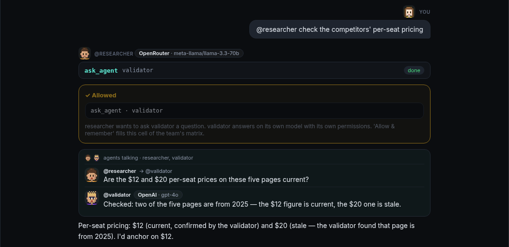

**Who may ask whom is a permission matrix.** Every pair of agents is a cell: rows ask, columns
answer. You set it in **Settings → Agents → Working together → Who may ask whom** (tap a cell to cycle
*ask → allow → block*), with `bento team allow|block|ask ASKER ANSWERER`, or by answering the
card the first time a pair talks:

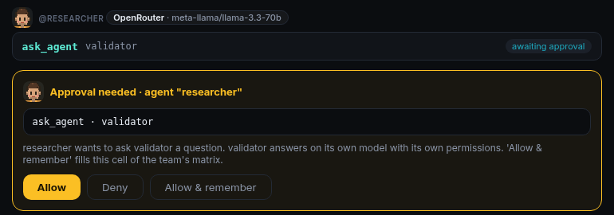

**Allow & remember** fills that cell, so the matrix builds itself from your answers. Cells are
ordinary permissions, so the **Permissions** app lists and revokes the same rows.

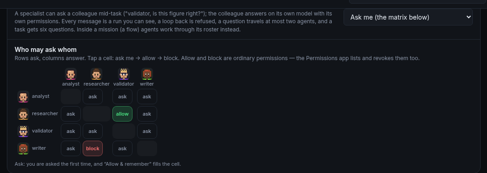

**The mode switch** (Settings, or `bento team talk`) has three settings:

| | An empty cell | A cell you allowed | A cell you blocked |
|---|---|---|---|
| **Ask me** (the default) | asks you; nobody there = no | talks | refused |
| **Swarm** | talks, without asking | talks | refused |
| **Off** | refused | refused | refused |

Swarm is the matrix switched wide open. It is not a second system: every limit below still
holds, every message is still a run and a ledger row, and a cell you blocked stays blocked.

### The shape of a conversation, and the limits you set

- **Asking back is a clarification, not a loop.** The validator, asked by the researcher, may
  ask the researcher back ("which plan, Pro or Team?"). The question goes *up* to the
  researcher that asked, which still holds everything it knew, and it asks again with the
  answer. No fresh copy of the researcher is started, because a copy would know nothing. How
  many times a colleague may ask back is a limit (default 2, 0 turns it off).
- **A real cycle is refused.** In A → B → C, if C asks A, A is not C's asker; it is waiting on B.
  AgentOS records who is in the conversation, and the model cannot edit that record.
- **Limits are settings.** Settings → Agents → Working together → Limits, or `bento team limits
  hops=3 budget=20`:

| Limit | Default | Range | What it bounds |
|---|---|---|---|
| `hops` | 2 | 1–6 | how far one question may travel (A → B → C is 2) |
| `budget` | 6 | 1–100 | questions one task may send in total |
| `clarify` | 2 | 0–5 | times a colleague may ask its asker back |
| `huddle_agents` | 4 | 2–8 | agents in one huddle |
| `huddle_rounds` | 3 | 1–6 | rounds in one huddle |

  The budget is **per task**, so several swarms running at once each get their own. The
  ceilings are fixed because every one of these multiplies model calls, and a typo of 600
  should not become a bill. Every change to a limit is an audit row.

### What holds in every mode

- **Untrusted content stays marked.** If the validator read a web page to answer, its reply
  arrives marked, and the researcher's turn is held to the same care as if it had read the page
  itself. The asker's own untrusted content travels with the question.
- **In a mission, when the mission says so.** A mission's editor has **Specialists may
  consult each other**. Turned on, every agent on its roster may ask every other one *inside
  that mission*, and its consent screen says so before you enable it. Turned off (the
  default), they work through the orchestrator only. The two worlds don't leak into each
  other: a cell you allowed at the desk does not open a mission, swarm does not reach into
  one, and a mission's consent does not open the desk.
- **Only specialists.** Apps, a flow's master and peers cannot message an agent. Your own agent
  has `delegate` and `huddle` instead.

### Does full autonomy open the matrix? No.

Autonomy (*balanced*, *full*) is how much an agent may **do** without asking: run a command,
write a file. Who may **recruit whom** is a different question, and only the matrix answers it.
An empty cell asks at every autonomy level, including full. On a run nobody is watching (a
schedule, a webhook), an empty cell is refused rather than answered on nobody's behalf. Only
**Swarm** opens empty cells. A huddle is different: your own agent convening one follows
autonomy, because you asked your agent, not a specialist.

### Everything is in the audit ledger

The hash-chained audit ledger (the Audit app, `audit_verify`) records:

- **every decision**: each message asked, allowed, refused or blocked (`agent.message`), each
  huddle (`agent.huddle`), each model pin by the agent (`agent.write`);
- **every change to a permission, from any door**: a cell set in Settings or with the CLI,
  "Allow & remember", the Permissions app, a flow's own permissions, a revoke, and a deleted app
  taking its permissions with it (`grant.write`, `grant.change`, `grant.revoke`). A change you
  made is recorded as yours; one the system made (a flow reconciling its permissions) is
  recorded as the system's, with the flow named;
- **every team switch**: the talk mode, the own-providers switch and a model pinned from
  Settings or the CLI (`team.write`, `agent.write`).

## Linked teams: your agents and somebody else's

Your researcher can ask an analyst that lives on **another Bento**: a colleague's laptop,
the office server, a Pi in another room. It can also ask one that belongs to **another
account on this machine**. That is a *linked team*. It is the same `ask_agent` with the
same matrix, and the name carries the link: `analyst@office`.

Both kinds are authenticated. Neither one is a shared password.

### Linking two machines: ask, approve, compare six digits

It works like signing a TV into a streaming account, or pairing a phone over Bluetooth
(the OAuth *device flow*). Nothing is copied from one screen to the other.

1. **Home** types the other machine's name or address and presses **Ask to link**
   (Settings → Agents → Working together → Linked teams, or `bento link request office.local`).
   Home shows six digits: *Waiting for office to approve. Make sure it shows 506 883.*
2. **Office** gets a card on every screen that is open (a toast with **Review**, the
   Settings card, a line in the TUI): *home asks to link its team with yours. Check that
   home shows 506 883.* **Approve** or **Deny**, or `bento link approve <id>`.
3. Home hears the answer within two seconds. On a yes both sides are linked at the same
   moment. If home has gone away by then, neither side is linked.

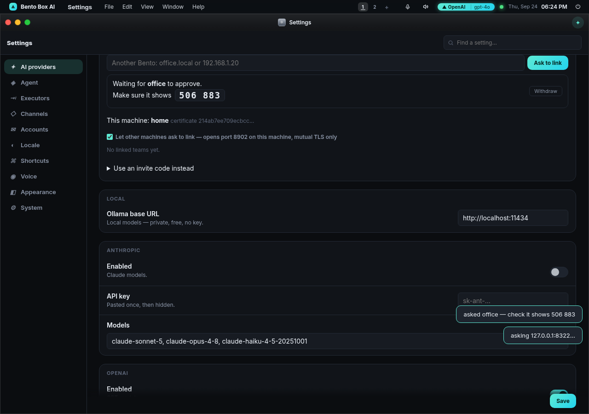

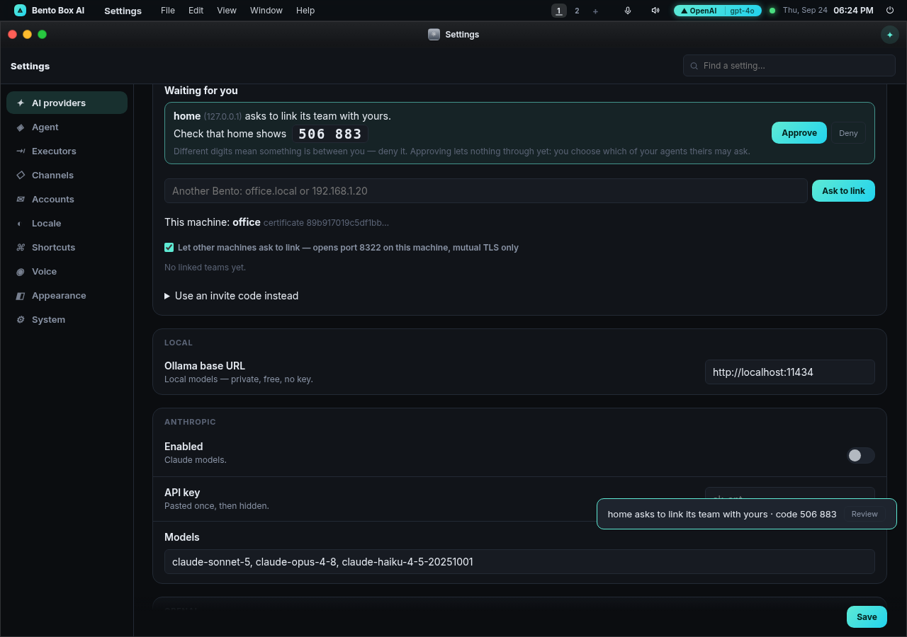

**The six digits are the security check.** Each side computes them on its own from the
two certificates it actually saw, and they are never sent over the network. A machine in
the middle would have to show each side its own certificate, because it does not hold
the real one's key, so the two screens would show different digits. That is why the card
says to deny when they differ. It is Bluetooth's *numeric comparison* for the same
reason: two machines that have never met share nothing else to check each other with.
`tests/test_teamlink_request.py` puts a real relay in the middle and checks that the
digits disagree.

Other rules the request follows:

- **Approving lets nothing through yet.** The next step is ticking which of your agents
  theirs may ask (below).
- **One card per machine.** Asking again replaces the card, **Withdraw** removes it, and a
  request nobody answers expires after ten minutes. Five requests per address per ten
  minutes is the ceiling, because each request puts a card on somebody's screen.
- **Who it reaches.** On a machine without accounts, the one person there. On a machine
  with accounts, you can address the request to a person: `ada@office.local`. Only Ada sees
  that card and only Ada can approve it, and the link lands in her account with her agents.
  A request addressed to nobody goes to the admins, since it is their machine. (Before this
  rule, every account saw every card, and whoever tapped Approve first won a link meant for
  somebody else.)

On a phone the card stacks, and Approve and Deny are full-size buttons:

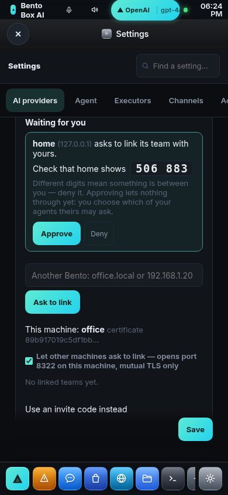

### Underneath: each install is its own certificate authority

Each install has its own small certificate authority (`~/.agentos/pki`). It is made the
first time it is needed and its key never leaves the machine. Approving trades the two
CAs. From then on every connection is **mutual TLS**, and each side checks two things:
the certificate must be issued by the CA it linked with, and it must be the exact
certificate recorded when linking. Nothing else gets past the handshake, and no public
authority is involved.

Other machines can ask only while this one is listening (**Let other machines ask to
link**, or `bento link listen on`). The listener uses its own port: the server's port + 1
(8322), or `team.link_port`. Turning it on is admin-only on a machine with accounts,
because it opens a port. Asking another machine needs nothing turned on here.

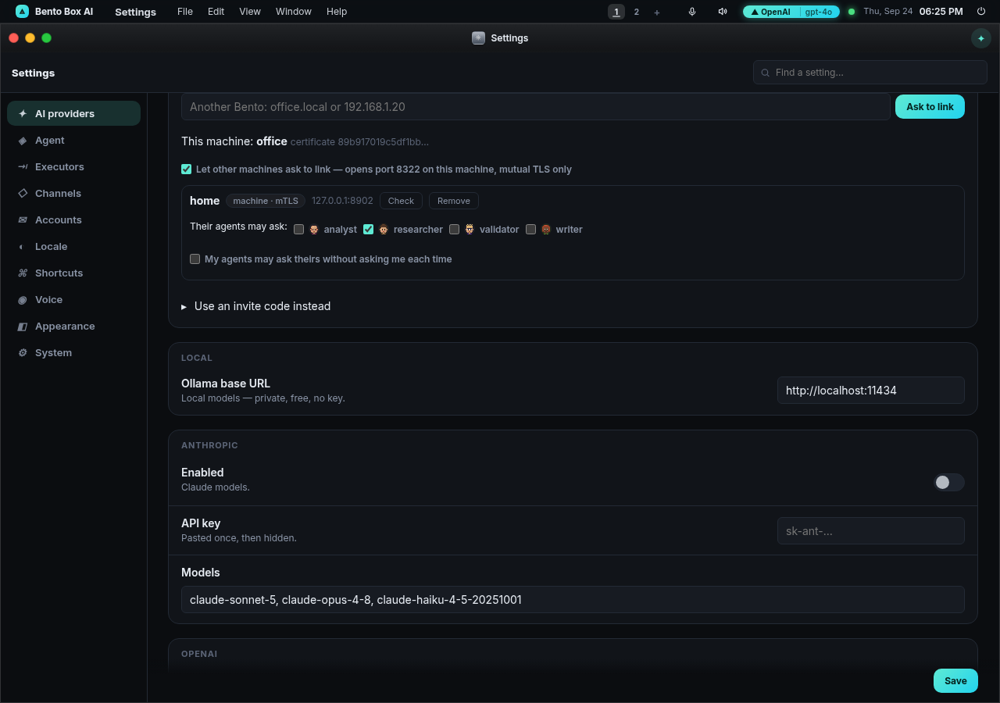

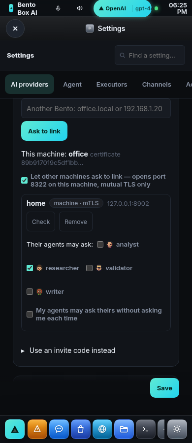

**For a machine nobody can approve on** (a headless box set up over SSH), the older invite
is folded away under *Use an invite code instead*. `bento link invite machine` prints a
`bento://link/HOST:PORT/CODE#FINGERPRINT` line and `bento link join '<line>'` redeems it
on the other machine. The code works once, lives ten minutes and is stored only as a
hash. The joiner checks the fingerprint before sending the code, and an address that
keeps guessing is shut out.

### Between accounts on one machine: pick the person, they approve

Two people with accounts on the same Bento need no network, no certificates and no
digits, because the server already knows who each of them is. Pick the other account and
press **Ask this account to link** (`bento link request account bob`). Bob sees the
request when signed in as himself and approves it (`bento link approve <id> --user bob`).
Only Bob can say yes, and nobody can link on another person's behalf. A question crosses
in-process, and it is answered **in the other person's own directory, under their own
gate**, exactly as if it had come over the network. (A code redeemed while signed in,
`bento link invite account` / `redeem`, still works too.)

### Talking to the people on a linked team

A link connects the **people** as well as the agents. **Team Chat** (in the dock, or **Message**
on a link's card) has one conversation per linked team: another Bento over the same mutual-TLS
link, or another account on this machine. It is live both ways: a message arrives as a toast
with **Open** on every screen that person has open, and in the thread if it is already open.

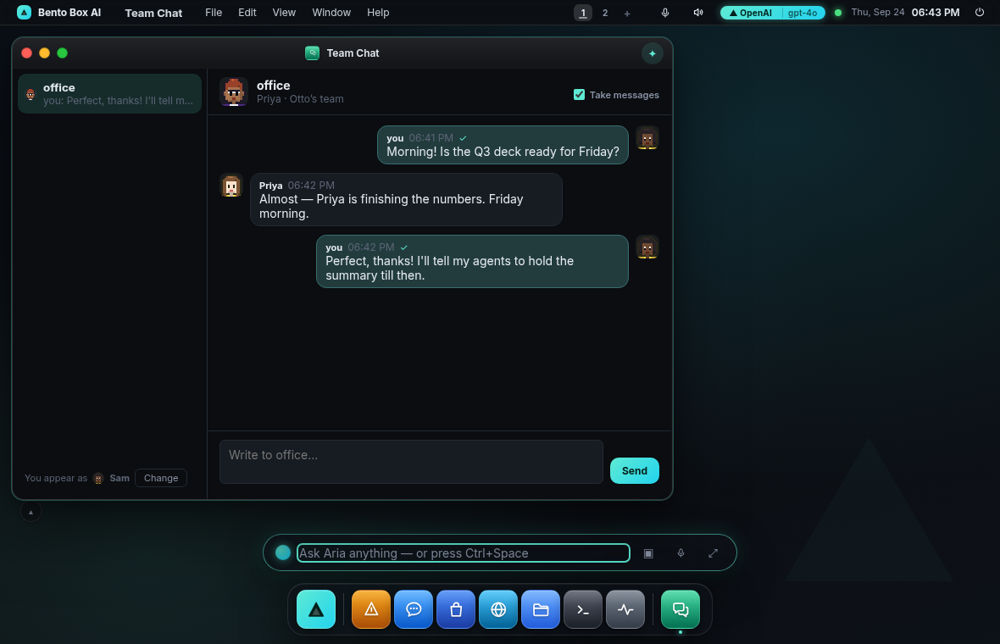

- **You see who you are talking to.** Each message carries the sender's name and face. The top of
  the thread shows the other team's agent, its name and its look. That is the team's identity,
  and it travels with the link. On a machine with accounts you are your account's name. On one
  without, you pick the name you go by (**Change** in Team Chat, or `team.my_name`).
- **Honest about delivery.** ✓ means the other side has it. *kept* means this machine cannot hand
  it over right now: the other one is off, or cannot be reached from here. It then goes with the
  next exchange in either direction: their next message, a retry every 30 seconds, or opening
  the thread. *refused* means they said no, and the reason is shown. A message is never
  delivered twice, because the id is the same on both sides.
- **Each side can close the door.** Untick **Take messages** in a thread and that team's
  messages are refused. The sender is told so in words, and refused messages are not retried.
  The switch is audited (`link.chat`).
- **No agent reads it.** Messages between people are kept in each person's own database, and no
  tool or prompt can reach them. Somebody else's words are the untrusted content the taint rules
  exist for, and the simplest safe answer is that they never reach a model. A message runs
  nothing and spends nothing, so it is not a permission decision each time. What is audited is
  the link that opened the door and the switch that closes it.
- **Bounded.** 4,000 characters a message, 30 a minute from one link.

On a phone, Team Chat shows one pane at a time: the list of teams, then the thread with a back
button.

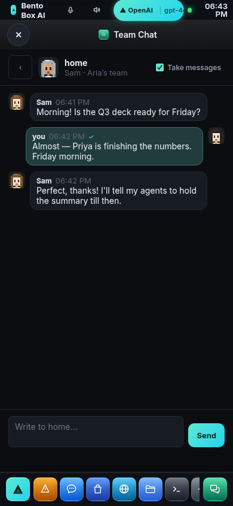

**From a terminal**, `bento link say office "Is the Q3 deck ready?"` sends and `bento link chat
office` shows the conversation, pulling anything waiting. Both work with this machine's server
down: a machine link goes straight over its own mTLS, and an account link goes into the other
person's home (they see it the next time they open the thread). The chat TUI prints an arriving
message as a line.

### A link grants nothing

A link says who the other side is. What their agents may ask yours is still the matrix,
decided on **your** side:

| | Default | Opened by |
|---|---|---|
| Their agents asking yours | **refused**, never asked | ticking which of your agents they may ask (`bento link allow office analyst`) |
| Your agents asking theirs | asks you, every time | **My agents may ask without asking me** (`bento link mine office on`) |

- **Not even names.** Before a cell allows anything, a linked team sees none of your agents:
  **Check** on their side shows only the agents you let them ask. A refusal reads the same
  whether the agent they named exists or not, so they cannot list your team by guessing.
- **Never asked, on the answering side.** A question arriving from a linked team has
  nobody at the other end of the call to wait for, so an empty cell is a no.
- **Swarm never reaches across.** Swarm opens empty cells between *your own* agents. A
  linked team is somebody else's, and every cell to or from one is explicit.
- **A link principal can do nothing else.** Their agents appear here as `team:<link>/<agent>`,
  which may be granted `agent.message` and nothing more. Delegating, convening a huddle,
  writing permissions and defining flows are refused outright.
- **Every answer from another team is untrusted, refusals included.** It was not written on
  this machine, so the asker's turn is held to the same care as after reading a web page.
  That covers a refusal's wording too, which they chose. The question is untrusted where it
  is answered, too.
- **The limits cross with the question.** The hops, the per-task budget, clarify-back and
  loop detection hold across the link. The chain records `researcher@home`, so office's
  analyst asking home's researcher back is a clarification, while a cycle is refused.
- **Ending a link revokes every cell that named it**, on both sides for an account link.
  Every step is an audit row, on the side where it happened: a request (`link.request`),
  an approval or refusal (`link.approve`, `link.deny`), an invite (`link.invite`), the
  link itself (`link.write`), each cell (`grant.write`, `grant.revoke`) and the end
  (`link.revoke`).

Where the answer is shown, the asker's side sees it as an ordinary message, with a face and
the provider it answered on. On the answering side the question shows on the Crew stage
(the agent being asked lights up) and as a toast saying who asked, so a person at either end
knows their agents are being consulted. It is never written into a chat you have open: it
belongs to no conversation here.

### What a link lets either machine do on the other

A link is **between equals**. Neither machine is the other's master, and the link reaches no
file, command, tool or model on the far side. The wire carries ten requests: pair,
request, poll, cancel, hello, roster, ask, mission, chat and pull. None of them reads, writes
or runs anything by itself. (`mission` only *records* one of your missions on their side;
see below.)

- **Your agents can only *ask a question* of the agents they let you ask.** Their agent
  answers with *its* tools, under *their* permissions, on *their* model and their bill, and
  you get text back. You cannot reach their files, their shell, their memory or their keys.
  If you want their machine to do something for you, their agent decides whether to, within
  what their side allowed it.
- **The same holds the other way.** Nothing of yours is reachable until you tick an agent
  for them. What an agent you ticked can *read*, their question can ask it to *repeat*. So
  tick agents whose reach you are happy to share. A "front desk" specialist with no file or
  memory tools is the safe shape.
- **A question from another team cannot make your agent *change* anything unless you said
  so.** It arrives marked untrusted, so every step that would change something needs a
  person. If one of your screens is open, you get the card: it says which team asked which
  of your agents to do what. If none is open, the answer is no, straight away. That holds
  **at full autonomy too** (see [security](security.md), the taint ceiling). The one way to
  say yes ahead of time is a *standing permission* (next section). Reading stays possible.
  That is the honest limit above: what the answering agent can read, it can put in its
  answer.
- **Their model calls cost you nothing, and yours cost them.** Asking is bounded by the
  hop, budget and rate ceilings below, on both sides.

### Standing permissions: saying yes ahead of time

Sometimes you *want* another team's questions to change something here. For example, their
Monday mission asks your analyst to file the weekly report into a folder you both read. The
default above would put a card on your screen every Monday, or refuse when nobody is there.
A standing permission is that yes, given once and narrowly:

> **home** may have **analyst** **write files in** `~/shared/reports`, until 25 October.

It is one team, one of your agents, one action and one folder or tool. You give it in two
places:

- **On the card.** When their question needs a person, the card's third button reads
  **Always let home have analyst do this**. For a file, it covers the file's *folder*, because
  a weekly report gets a new name every week.
- **In Settings → Agents → Working together → Linked teams → the link → Without asking me.** Pick the agent, the
  action and the folder or tool, and optionally a number of days. From a terminal:
  `bento link let home analyst fs.write ~/shared/reports --days 30`. List them with
  `bento link standing home`; remove one with `bento link unlet home <id>`.

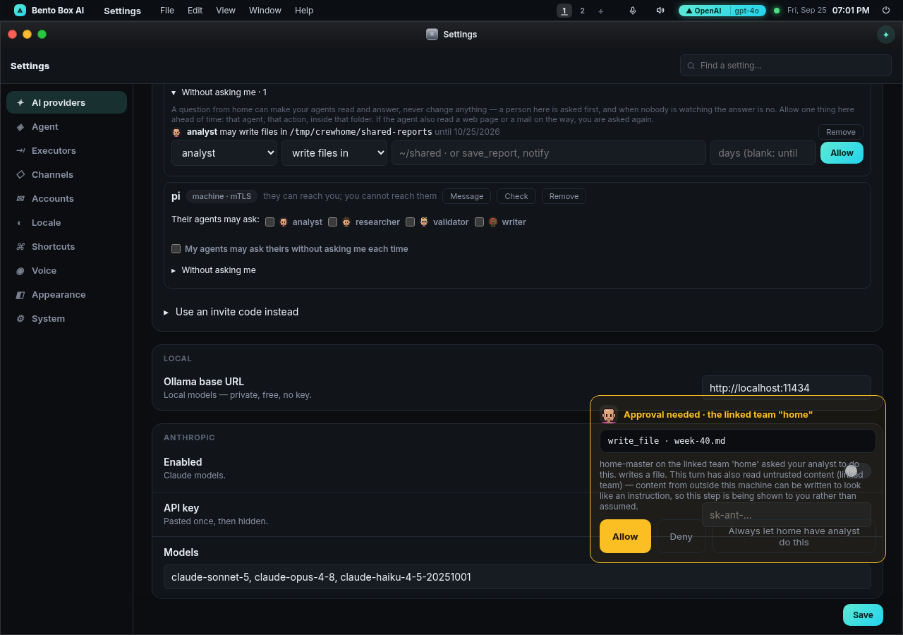

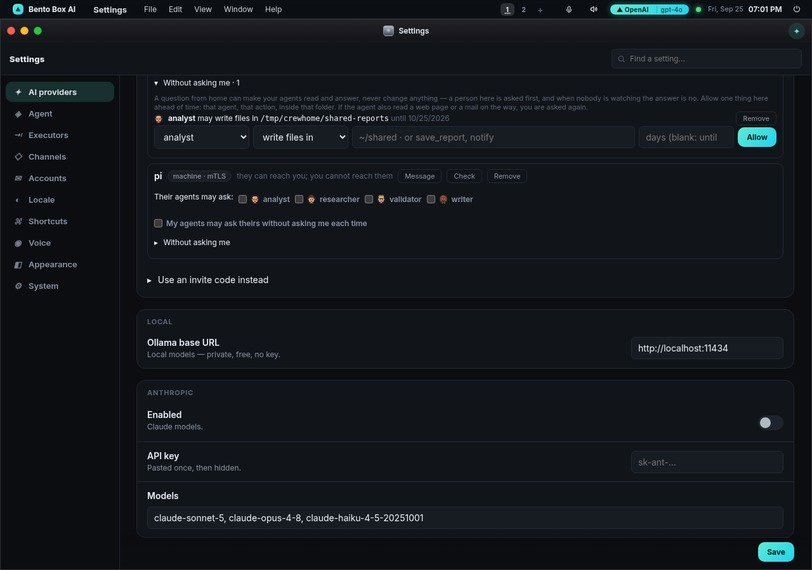

On a phone the same section stacks, and every control keeps the tap floor:

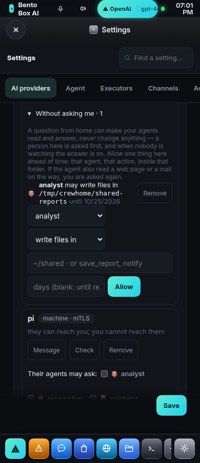

What it can never be, whoever asks:

| Refused | Why |
|---|---|
| A shell (`run_command`, `run_python`), sending anything out, anything confirmed every time, anything that changes this OS | `tool.use` is an allow-list, currently `save_report` and `notify`. A deny-list is correct only until the next tool is added. |
| Delegating, huddles, defining agents or missions, fetching the web | only `fs.write`, `memory.write`, `kg.write`, `media.generate`, `media.write` and those tools can be standing |
| Everything (`*`), `/`, a system folder, `/tmp`, **any home folder itself** | name a folder *inside* your home, never the home |
| A hidden file or folder anywhere in the path (`.bashrc`, `.ssh`, `.git/hooks`, `.config/autostart`) | where a written file becomes code that runs |

What still holds while one is in place:

- **It is matched against where the write really lands.** `~` is expanded, a relative path is
  taken from the workspace (as the write tool does), and `..` and symlinks are resolved. A
  glob is not a path: `shared/*` also matches `shared/../../.bashrc` as text, so the text
  the model wrote is never what is checked.
- **It applies only when everything untrusted in the run came from that one team.** If your
  analyst also read a web page or a mail on the way, or a second team's answer, the card is
  back.
- **It sits inside the ceiling, never above it.** Hard blocks, built-in denies, the channel
  and rate ceilings still apply, an explicit **deny** row for that agent still wins, and
  **strict** in *Content from outside* still refuses. Settings says so when that is why
  yours are not in use.
- **It is a grants row** (`team:<link>/*`, action `team.act`). So it is in Permissions,
  every change is an audit row (`grant.write`, `grant.revoke`), it can expire, and
  **ending the link revokes it** with every cell that named it.

### A mission with an agent on a linked team

A mission's roster can name an agent on another team: `analyst@office`. In the Missions
editor, type their agent's name next to the link (**Who?** asks them live which agents you
may ask) and **Add**. From anywhere else, the roster entry is just that string. A mission on
a schedule is still a mission, so this is how "every Monday at 9, have the office analyst
file the report" is built.

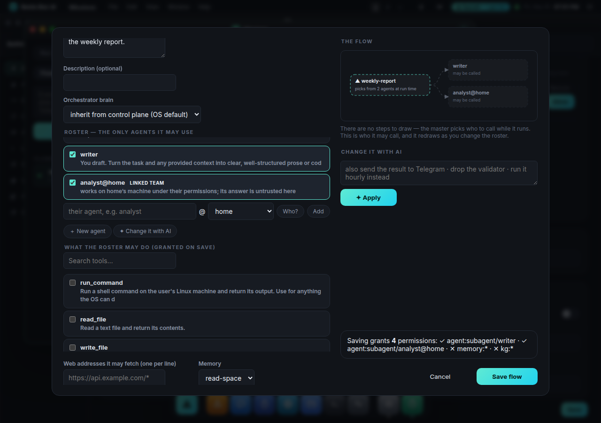

- **Saved only when the link exists here.** Otherwise the save says there is no linked team
  of that name.
- **The consent screen says what it means.** The mission grants itself `agent.invoke` on
  `analyst@office`, with the sentence "sends tasks, and the handles passed with them, to
  analyst on the linked team 'office'; what it does there is office's decision, and its
  answers are untrusted here". It gets **no envelope here**: that agent runs on their
  machine, under their gate.
- **The task crosses as a question.** It goes as a question from `<mission>-master` with up
  to 600 characters of each handle passed along, 2,000 in all. It is answered by their agent
  with their tools. Anything it would *change* there needs their person or their standing
  permission (above). Their cell for your team still has to allow that agent at all.
- **The answer lands on the board untrusted.** The handle is marked tainted, so anything the
  mission builds from it is held to the care of content from outside.

### The other side keeps its own record, and can stop it

Putting `analyst@office` on your roster is *your* decision, and it lives in *your* grants. But
office's analyst does the work, so office keeps its own record too. That record is what lets
office's person see it, audit it and stop it without asking you.

- **Told when it changes.** Saving, enabling, disabling or deleting the mission tells every
  linked team it names (a `mission` request over the link, or in-process for an account). A
  team it no longer names is told as well, so it can forget it. If they cannot be reached,
  it is recorded on the mission's **first question** instead. Nothing that uses their agents
  goes unrecorded there.
- **What they hold.** One grants row per agent, on their side: `team:<you>/<mission>-master`,
  action `team.mission`, resource `agent:subagent/analyst`. The note says what it is for and
  when it runs ("home's mission 'weekly-report' (every Monday at 09:00) sends tasks to
  analyst"). It appears in their Permissions app and in Settings → the link → **Their missions
  that use your agents**, with how many times it has asked and when it last did. Both numbers
  are read from their ledger, which already has an `agent.message` row for every question.
  `bento link missions home` shows the same.
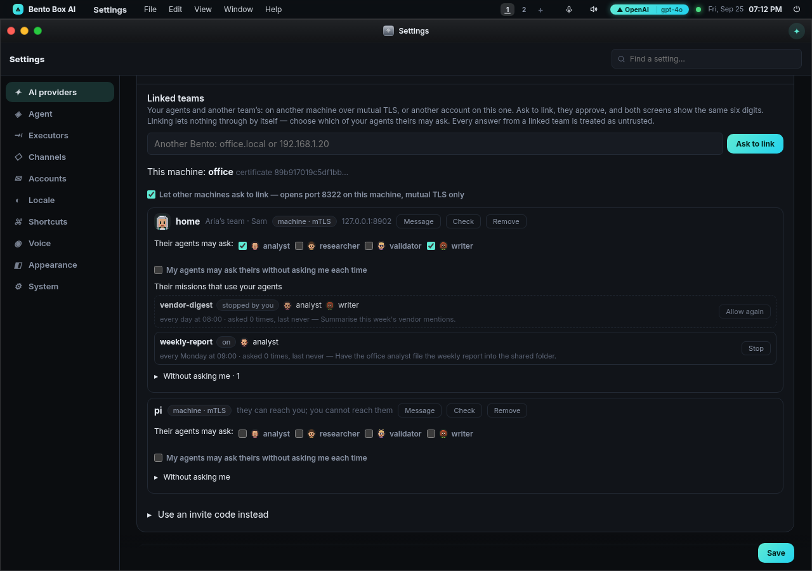

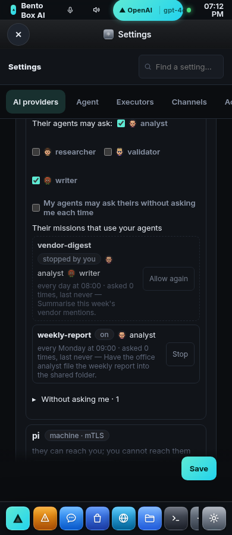

- **Stop.** Their **Stop** (`bento link stop home weekly-report`) writes a deny row
  (`agent.message` on `agent:subagent/*` for that mission's principal). Deny wins at the gate,
  so its next question is refused before any agent runs. Your run is told so in words: "this
  team stopped your mission 'weekly-report' from asking its agents". **Allow again**
  (`bento link resume …`) removes the row. Re-saving your mission never undoes a stop, and your
  editor says it is stopped when you save.
- **Audited on both sides.** Theirs: `link.mission` (announced, first question, deleted), and
  `grant.write` / `grant.revoke` for the record and for a stop. Yours: `link.mission` for each
  announcement, delivered or not. Each question is the usual `agent.message` row on theirs.
- **The record grants nothing.** `team.mission` is not an action anything is allowed *by*.
  Unticking the analyst in the link's cell still stops every mission at once, record or not.
  Only agents the cell allows are recorded at all, and your editor is told which it has not
  (**office has not let your team ask writer**). There are at most 50 records per link.
- **The honest limit.** The mission's *name* is your machine's claim. The link proves which
  machine asked, not which of its missions. A machine that wanted to dodge a stop could ask
  under another name. Stopping one mission is for a partner you trust to be honest; unticking
  the agent, or ending the link, is what stops a machine. Ending the link revokes the records
  with everything else.

### Security: what was checked, and the ceilings

Linked teams and Team Chat were reviewed as an attacker would read them: a hostile linked
machine, a stranger on the network, and another account on the same machine. Every finding
below was fixed and has a test in `tests/test_team_security.py`, most against real TLS
listeners.

**Who they are.** Between machines: mutual TLS, pinned to one certificate that chains to one
CA exchanged at linking; the six digits catch a machine in the middle at that first
contact. Between accounts: the signed cookie, and only the person asked can approve.

**What a link reveals.** Nothing until you allow it: not your agents' names, not their
providers. A refusal is worded the same whether an agent exists or not.

**What crosses as text.** Everything another team writes (a message, a name, a question, an
answer, a refusal) is cleaned where it arrives. Control codes, terminal escape sequences and
bidi overrides are removed, so it cannot retitle your terminal, write your clipboard, or make
a line display as something it is not. Pages escape HTML, and the chat TUI prints markup as
text (a `[link=…]` from someone else is not a link). Answers and refusals from another team
are marked untrusted for your agents. Nothing a person writes in Team Chat reaches any agent.

**Who a request reaches.** The person it names, or the admins (see above). A conversation
belongs to one link: removing "office" and later linking a different machine called
"office" does not show the old thread as if it were with the new one.

**The ceilings:**

| What | Ceiling | Why |
|---|---|---|
| Wrong pairing codes from one address | 10 per 10 min | guessing |
| Link requests from one address | 5 per 10 min, one card per machine, 8 waiting at most | each one puts a card on a screen |
| Calls from one linked machine, of every kind | 240 a minute | hello, roster and pulls never reach the permission gate's own ceiling |
| Connections the listener handles at once | 64; a connection must say what it wants within 10 s | a pile of half-open connections is what a flood builds |
| Link attempts one person makes (Ask, Join) | 10 per 10 min | asking makes this machine dial an address someone typed; unbounded, that is a way to probe a network |
| Messages from one link | 30 a minute, 4,000 characters each | a runaway sender |
| Unread messages from one link | 500, then the sender is told to wait | messages are yours and never pruned, so only a reader can make room |
| A question from another team | 2,000 characters; an answer 6,000 | cost on the answering side, flooding on the asking side |

**What is not claimed.** The listener is TLS on an open port, so a determined flood can still
cost handshakes. The ceilings bound what each connection can do, not how many arrive at the
network card. On a machine with accounts, an admin can read every account's files, as
`docs/users.md` says. The name a linked machine gives its person is what that machine says;
the link's own name, which you chose, is what is verified.

## Where it lives

| | |
|---|---|
| Which brain an agent answers on | `fabric.agent_brain` — one answer for the run, the badge, Settings and the CLI |
| Pinning a model | `fabric.set_agent_model` — `PUT /api/subagents/{name}/brain`, `set_agent_brain`, `bento team set` |
| The switch | `team.own_brains` in config (a machine setting: it decides spend) |
| A huddle | `ControlPlane.huddle` — the `huddle` tool, a `@a @b …` chat message, `agent_say` events |
| A message | `ask_agent` → `agent.message` (the gate) → `ControlPlane.message` (loops, hops, budget, taint) — `agent_msg` events |
| The matrix | `fabric.matrix` / `fabric.set_cell` (grant rows) — `GET/PUT /api/team/matrix`, `bento team matrix/allow/block/ask` |
| The mode | `team.talk` = `matrix` \| `swarm` \| `off` — `policy.team_talk`, Settings, `bento team talk` |
| The limits | `team.limits` — `fabric.LIMITS` / `team_limits` / `set_limits`, `GET /api/team/limits`, `bento team limits` |
| In a mission | `permissions.talk` — `flows.declared_grants` writes the roster's pairs; the gate counts only that mission's rows |
| People on linked teams | `agentos/teamchat.py` (message shape, delivery, the mute and the ceiling) — the `team_messages` table; `/api/team/chat*`, Team Chat (`24c-teamchat.js`), `bento link say/chat` |
| Standing permissions | `policy.STANDING_ACTIONS` / `STANDING_TOOLS` / `standing_refusal` / `PDP._standing` (at the taint ceiling) / `_standing_offer` (the card) — `fabric.standing` / `add_standing`; `/api/team/links/{label}/standing`, `bento link let/standing/unlet` |
| A linked agent on a mission | `flows.validate` / `declared_grants` (`agent@link`), `ControlPlane._master_tools.delegate_linked` |
| The other side's record of it | `ControlPlane.announce_mission` (on save/enable/delete, `server._announce_linked`, the `create_flow`/`enable_flow` tools) → op `mission` → `fabric.record_mission`; first question → the same; `fabric.linked_missions` / `stop_mission`; `/api/team/links/{label}/missions*`, `bento link missions/stop/resume` |
| Linked teams | `agentos/teamlink.py` (PKI, requests and the six digits, identity, invites, the mTLS listener, `call`) — `fabric.link_access` / `set_link_access`, `ControlPlane.answer_linked`; `/api/team/links*`, `bento link` |
| Tests | `tests/test_team.py`, `tests/test_agent_messages.py`, `tests/test_teamlink.py`, `tests/test_teamlink_request.py`, `tests/test_teamchat.py`, `tests/test_team_security.py`, `tests/test_team_standing.py`, `tests/test_team_missions.py` |
