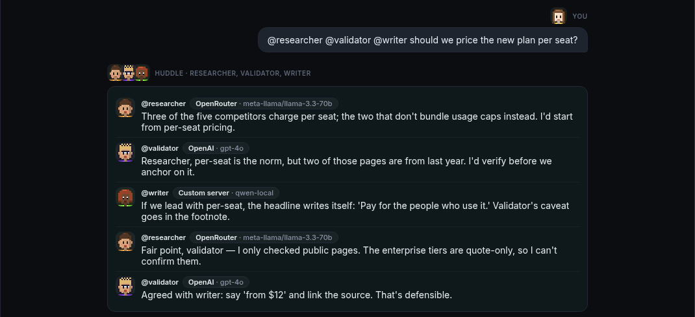
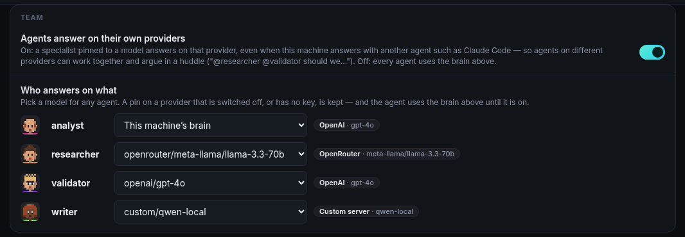
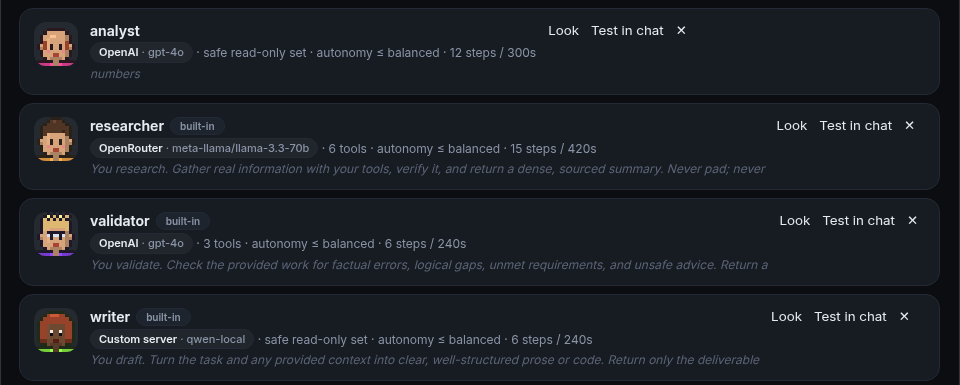
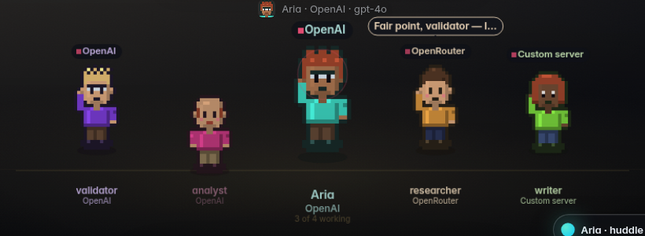

# The team: agents on different AI providers, talking to each other

Your agent is not alone. Every specialist in **Missions → Build → Agents** (the researcher,
the validator, the writer, and any you or your agent make) is its own agent with its own
character, its own tools and **its own brain**. This page covers two things: choosing which AI
provider each one answers on, and getting them to talk a question through with each other.



## Each agent on its own provider

Any agent can be pinned to a model on any provider this machine has: Anthropic, OpenAI, Google
Gemini, OpenRouter, a local Ollama model, or a custom OpenAI-compatible server. A researcher on a
free local model, a validator on Claude and a writer on GPT is a normal setup: the cheap agent
does the reading, and the expensive one gets the judgement calls.

- **Settings → AI providers → Team** lists every agent with a model picker. A change applies
  immediately.
- **Missions → Build → Agents** shows each agent's provider on its card, and so does the Crew
  stage. Under each figure is the provider it answers on, and while it works the light above its
  head becomes a tag naming the provider.
- **Ask your agent**, e.g. "put the validator on Claude". Its `set_agent_brain` tool can only
  choose models on providers that exist here, and it asks first, because the move changes who is
  billed.
- **From a terminal**, `bento team` lists everyone, `bento team set writer openai/gpt-4o` pins
  one, and `bento team own on|off` is the switch below. It works with the server down.



**The badge always shows what is actually answering, not what the agent was pinned to.** Those
can differ. If an agent is pinned to a provider that is switched off, or has no key yet, the pin
is kept, the agent uses this machine's brain until the provider is on, and the row says so in
words. The **Agents answer on their own providers** switch turns all of this off (one bill, one
provider). Every agent then uses the brain chosen at the top of the page.

This holds when your agent runs on another installed agent too. With Claude Code as the
machine's brain, a specialist pinned to OpenAI still answers on OpenAI, through AgentOS's own
loop and permission gate. Unpinned specialists run where the machine's brain runs.



## Huddles: agents talking to each other

A **huddle** is two to four agents talking a question through in turns. Each one reads what the
others said, answers them by name, and speaks on its own model. That is how an OpenAI agent and a
Claude agent can disagree with each other, and how you can get a second or third opinion.

Start one from any chat surface (the desktop, the TUI) by naming two or more agents at the
start of a message:

```
@researcher @validator @writer should we price the new plan per seat?
```

Or ask your agent to do it ("get the researcher and the validator to argue this out"). It has a
`huddle` tool, summarises the conversation for you afterwards, and can create a specialist first
if nobody on the team fits (`create_subagent`). The new agent gets its own character and walks
onto the Crew stage.

What you see:

- **In Chat**, each turn arrives as it lands, with the speaker's face, name and the provider it
  answered on. A reloaded conversation shows the same card.
- **On the Crew stage**, the one talking lights up with the start of what it said over its head.
  One speaker at a time, the way a conversation goes.
- **In the TUI**, one line per turn: `@validator (OpenAI)  Two of those pages are a year old.`



### What keeps it honest

- **Agents never call each other.** A specialist may not start another agent (that is what keeps
  the tree of agents two deep), and a huddle does not need it to. AgentOS moderates: every turn
  is an ordinary run of that agent, with the transcript so far in its task. Each turn appears
  in Observability, gets its own budget and model, and every tool call passes the same gate and
  lands in the same ledger as any other.
- **It is its own permission.** Convening a huddle is the `agent.huddle` action, apart from
  "may delegate to the researcher". Below full autonomy your agent asks first. The approval card
  names who is in the room and what each one runs on, because a huddle costs several models at
  once. Only your own agent can convene one: specialists, flows, apps and peers are refused.
  Typing the names yourself is your consent, the same as addressing one agent directly.
- **It is bounded.** At most four agents, three rounds and about 120 words a turn. A round in
  which everybody passes ends the huddle early.

## Where it lives

| | |
|---|---|
| Which brain an agent answers on | `fabric.agent_brain` — one answer for the run, the badge, Settings and the CLI |
| Pinning a model | `fabric.set_agent_model` — `PUT /api/subagents/{name}/brain`, `set_agent_brain`, `bento team set` |
| The switch | `team.own_brains` in config (a machine setting: it decides spend) |
| A huddle | `ControlPlane.huddle` — the `huddle` tool, a `@a @b …` chat message, `agent_say` events |
| Tests | `tests/test_team.py` |
