# Users

Several people on one machine, isolated by **directory**, not by query.

AgentOS ships single-user and stays that way until somebody adds an account.
Nothing about this document applies to a machine that never does: it keeps using
exactly the files it always used, there is no login screen, and there is nothing
to migrate.

The offer is the last step of setup, and it says what it costs before the button:

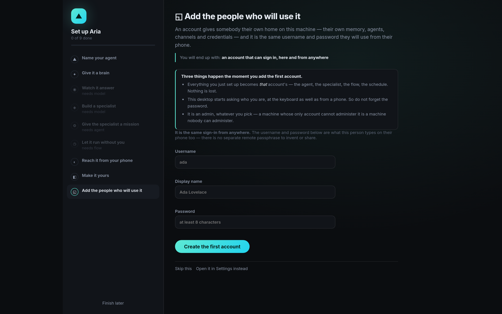

Creating the first one is a decision with a confirmation on it, because it changes
how this machine behaves for everybody at it:

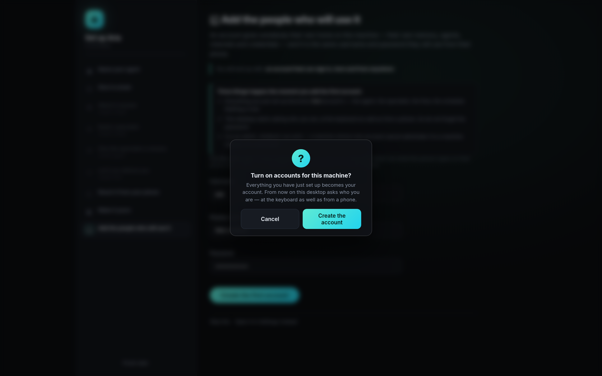

Afterwards you are signed in as that account — bouncing somebody to a sign-in page
they had just created would be theatre:

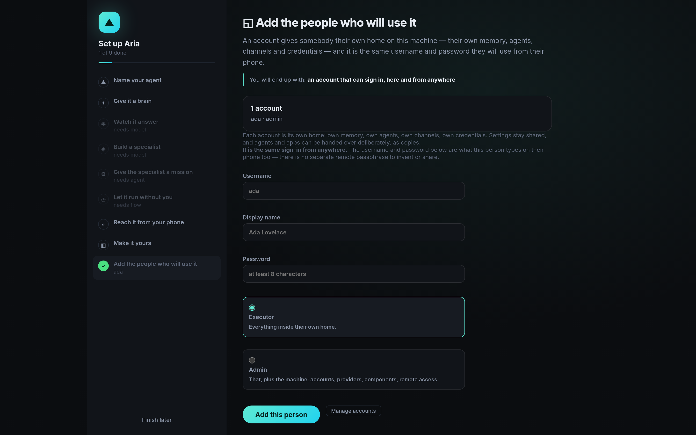

---

## The layout

```
~/.agentos/
  config.json          the machine: providers and their keys, image provider,
                       executors, sandbox, remote access, updates, components
  users.json           the registry: id, name, display, role, password hash (0600)
  session.key          the cookie signing key (0600)
  shared/              the one place anything crosses between accounts
  users/<id>/          0700 — somebody's whole private world
    agentos.db         memory, KG, conversations, grants, flows, tasks, apps, audit
    config.json        their channels, MCP, credentials, look, spaces (0600)
    workspace/         their files
    assets/            their gallery
    soul.md            their agent's identity
```

## Why directories, and not a `user_id` column

`space_id` is already a column, and its rule is deliberately leaky —
`space_id IN ('', :active)`, so a space sees its own rows *and* the global ones.
A space is a project you are working on, not a wall.

Users are the opposite claim. One forgotten `WHERE` clause among ~250 query sites
is somebody reading a colleague's memory, and no amount of review makes that
failure mode acceptable. Two files cannot leak into each other. That is the whole
argument.

## The seam

`state["store"]` and `state["cfg"]` are read in about 250 places, and not one of
them was changed. Instead the **lookup** resolves:

- `users.current()` is a contextvar, set by the request middleware from the
  **signed session cookie only** — never a header or a query parameter, because
  those are things a caller chooses and this decides which private directory is
  opened.
- `server._State` is a `dict` subclass whose `__getitem__` routes `store` and
  `cfg` (and the three per-user services) through that contextvar.
- `users.Scoped` is a two-descriptor mixin that does the same for the long-lived
  services built once at startup — the scheduler, the toolbox, the PDP, the
  control plane, the bridges. `self.cfg = cfg` in their existing `__init__`
  keeps working unchanged; it stores the machine's copy as the fallback.
- Background work enters `users.as_user(uid)`. A scheduled job belongs to whoever
  created it, and `asyncio.create_task` copies the current context — so a run
  launched at 08:00 still reads the right person's memory. That inheritance is
  why the seam is a contextvar and not a parameter.

Three services genuinely cannot be shared and get one instance per person: a
**Telegram** bridge polls with one bot token, a **WhatsApp** bridge holds one
linked device, an **MCP manager** owns live subprocesses started with somebody's
own credentials. They are built the first time anything reaches for them, not at
startup — most accounts have configured none of it, and an idle bridge nobody
asked for is a poll loop for nothing.

## Two roles

| | can |
|---|---|
| **executor** | everything inside their own home: agents, flows, jobs, apps, channels, MCP, credentials, their own permissions |
| **admin** | all of that, plus the machine: accounts, providers and models, components, remote access |


Two roles, and the form says what each one means rather than offering a grid of
checkboxes:

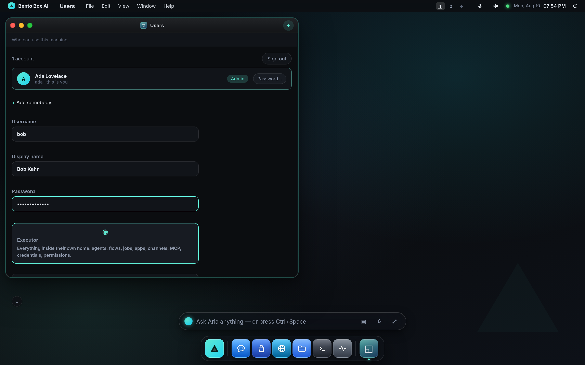

There is deliberately no per-user grid of capabilities. **Grants** already answer
*what may this principal do* in far more detail than a role could, and they are
per user because the `grants` table is per user. The role answers only the one
question grants cannot: *may you change things that affect everybody?*

`is_admin('')` is **True** — a machine with no accounts has nobody to refuse.
Getting that backwards would lock somebody out of their own laptop.

## What is shared, and what is not

**Shared:** the machine settings. One set of provider keys for the machine, not
one per person who would each have to go and get their own. `users.USER_KEYS` is
the whole list of what is personal, in one place, so *"what is mine"* is
answerable without reading whichever route happened to write it. The line is
drawn at cost and blast radius: anything that spends money or reconfigures the
machine is the machine's. `default_model` is personal — which model you talk to
is a preference; which providers exist and what their keys are is not.

**Not shared:** everything else. Memory, conversations, the knowledge graph,
grants, flows, jobs, tasks, apps, the gallery, the soul, channels, MCP servers,
credentials, the audit ledger.

**Crossing over:** `shared/`, and only agents and apps, and only as a **copy**. A
shared app that changed under the people using it would be a supply-chain problem
living in a filesystem — and the publisher would not know they had shipped a
change. Taking a copy renames on collision, so installing one never overwrites
something of yours with the same name.

Share from where the thing lives — an agent in Workflows, an app in App Studio:

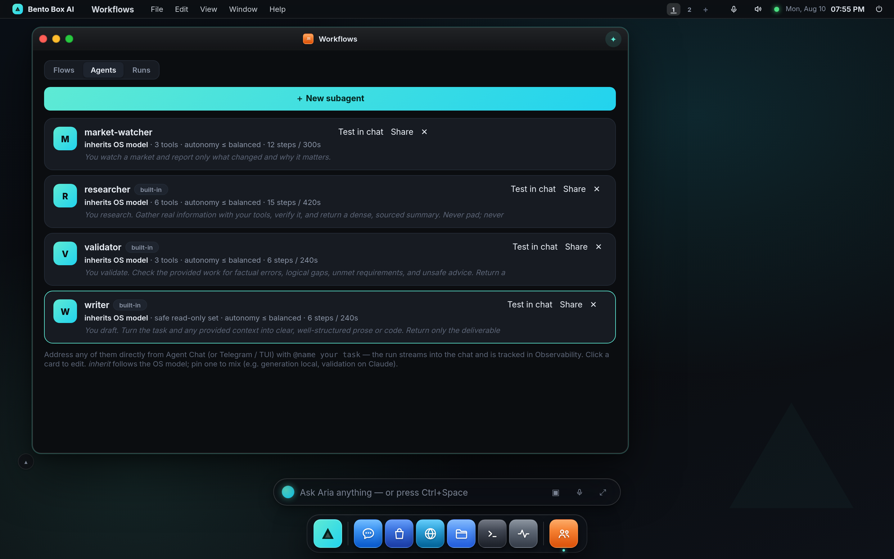

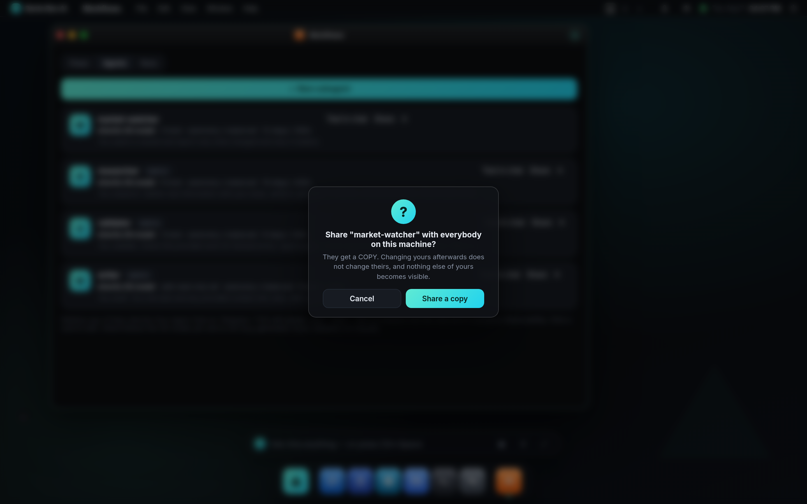

It lands in the shared library at the bottom of the Users app, where anybody can
install a copy:

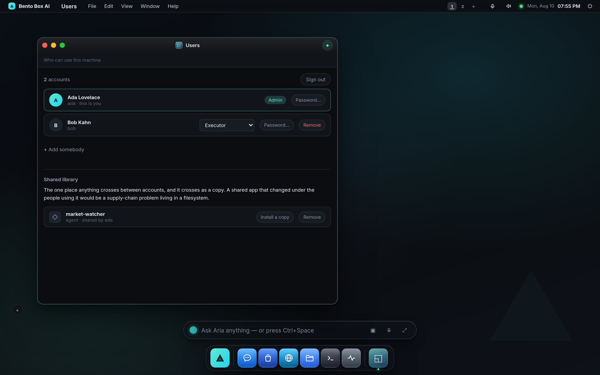

## Adding the first account

This is the consequential moment, and the UI says so before the button:

1. **Everything already on the machine becomes that account's** — the database,
   the soul, the assets, the linked phone, and the personal half of the config.
   The machine config is then stripped of those keys, because everything left in
   it becomes the starting point for the next person created.
2. **Loopback trust ends.** "Whoever is sitting here" has to stop being an
   identity once there is more than one identity, so the desktop starts asking —
   at the keyboard as well as from a phone.
3. **The first account is an admin**, whatever was asked for. A machine whose only
   account cannot administer it is a machine nobody can administer, and there is
   no second account to fix it from.

The person who creates the first account is signed in by the same request. They
proved they were the machine's owner by being able to make it; bouncing them to a
sign-in page they had just created would be theatre.

From then on the power menu names who is signed in, and offers a way out. Neither
appears on a machine without accounts — a "sign out" there would lock somebody out
of their own laptop with nothing to sign back in as.

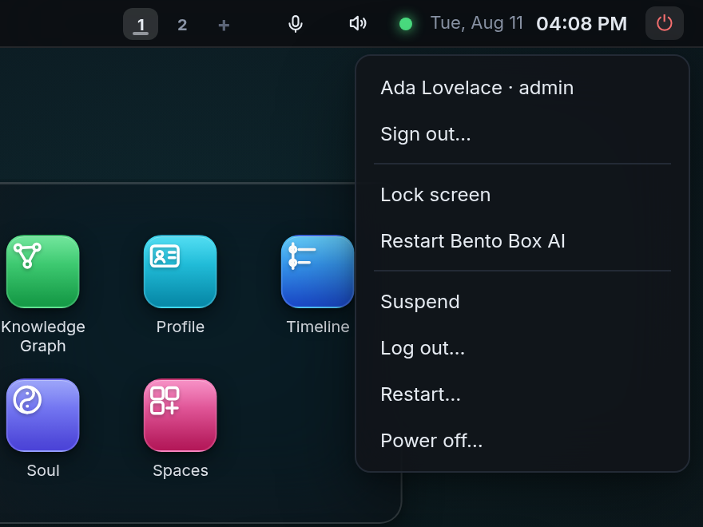

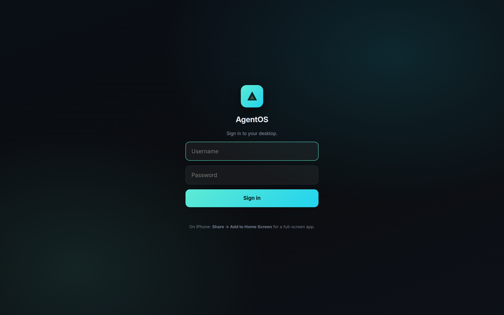

A new account gets its own arc on a machine somebody else already set up, rather
than landing in a stranger's finished desktop:

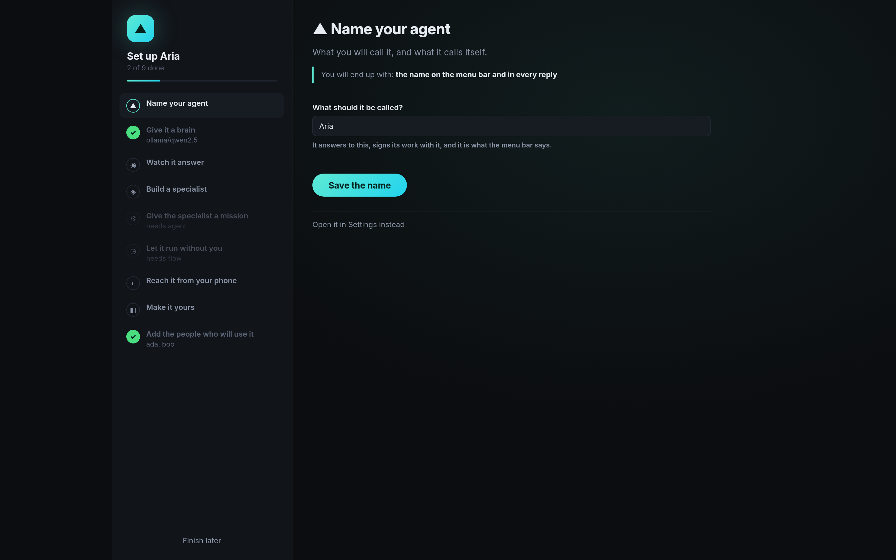

An executor sees their own account and the shared library, and is told plainly what
is and is not theirs:

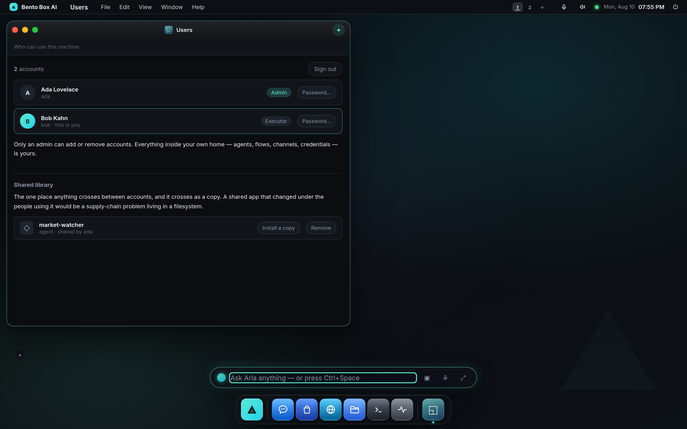

And the isolation is visible: Ada's `market-watcher` is not in Bob's Workflows.

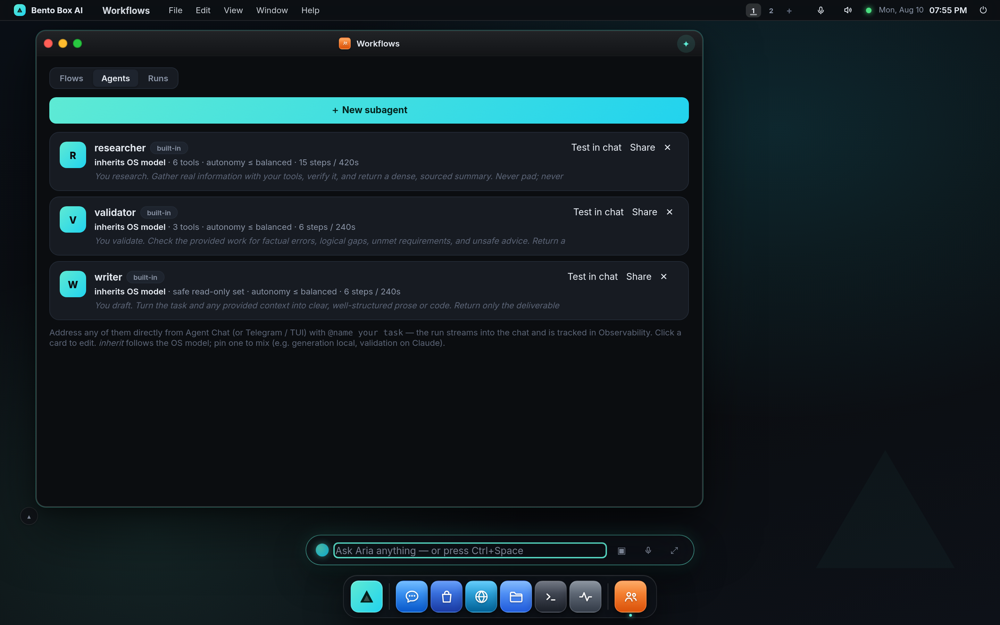

## One sign-in, here and from anywhere

Remote access needs a lock on the door. On a single-user machine that is a shared
passphrase. **On a machine with accounts it is the accounts** — the phone in
somebody's pocket signs in with the same username and password as the desktop, and
lands in their own home.


A second shared passphrase in front of per-person credentials would be worse than
none: one more secret, held in common by people who are otherwise isolated from
each other, and "sign in" would mean two different things depending on where you
were standing. `/api/remote/login` accepts the account password too, because a
phone that added AgentOS to its home screen months ago has that URL cached and a
404 there reads as "remote access broke".

What signing in does **not** do is sandbox somebody from the machine. An executor
has their own data, and still has the Terminal and the agent's shell — which means
they can read another account's files on disk directly. So be precise about the
boundary today: **accounts isolate co-workers who trust each other, not mutually
distrusting tenants.** They keep each person's memory, channels and credentials
their own, and keep honest people out of each other's data through the app; they
do not contain a hostile insider who opens a shell. Making accounts a boundary
against a hostile user is per-user OS isolation (a real uid, or a per-user
sandbox) — the plan is `docs/design/tenant-isolation.md`, not a claim this feature
makes yet.

## From a terminal

A headless machine has no desktop to add the first account from, and the
alternative would be editing `users.json` by hand — which is also the only way
back from a machine with no admin, so it must not be the normal way in.

```
bento user                          # who can use this machine
bento user add ada --role admin     # prompts for a password
bento user role bob --role admin
bento user passwd bob
bento user remove bob               # their home is KEPT
bento user remove bob --wipe        # and this destroys it — a separate decision

bento --user ada job list           # every data verb needs to know whose
AGENTOS_USER=ada bento flow list    # or say it once, for a cron line or a unit
```

A verb that reads data refuses rather than guessing when the machine has accounts
and none was named: a `bento job add` that silently landed in the wrong person's
database would be discovered weeks later by whoever did not get their briefing.

## Things that were nearly bugs

- **The PDP's caches are keyed on the user as well as the name.** A version
  counter is per-database, so two people can both be at `grants_version` 3 —
  without the prefix the second is decided against the first one's grants. The
  rate meter and the declared-skills cache collide the same way: two users may
  each own a subagent called `researcher` or an app called `notes`. Releasing a
  quarantine hold goes through `PDP.forget_rate()` for the same reason — a key
  built by hand at a call site is a key that gets built without the user, and the
  release then silently does nothing.
- **Session cookies used to be signed with a constant** when remote access had
  never been turned on. A multi-user machine on a private LAN may never turn it
  on, and a cookie signed with a public string is a forgeable `uid`.
  `~/.agentos/session.key` is now underneath every signature.
- **Deleting an account keeps their home.** Removing somebody's access and
  destroying what they made are two decisions, and one mis-click must not make
  them the same one. `--wipe` is the second decision, asked separately.
- **A factory reset removes the accounts too.** "Back to day one" that left three
  private databases on the machine — and left it demanding a sign-in nobody has
  the password for — would be the most misleading button in the OS.

## The three faces

- **GUI** — the Users app: the offer, the roster, roles, passwords, the shared
  library. The power menu names who is signed in and offers Sign out, and shows
  neither on a machine without accounts.
- **TUI** — `bento user`, plus `--user` / `AGENTOS_USER` on every data verb.
- **SUI** — the same page, so the same app. One thing is genuinely different and
  is stated rather than hidden: signing out returns this **AgentOS session** to
  the sign-in page; it is not a Linux logout, and the compositor, the native
  windows and anything already running are unaffected. Two people cannot use one
  physical screen at once, so the session-shell case is one account at a time —
  the others reach the machine from their own browsers.
