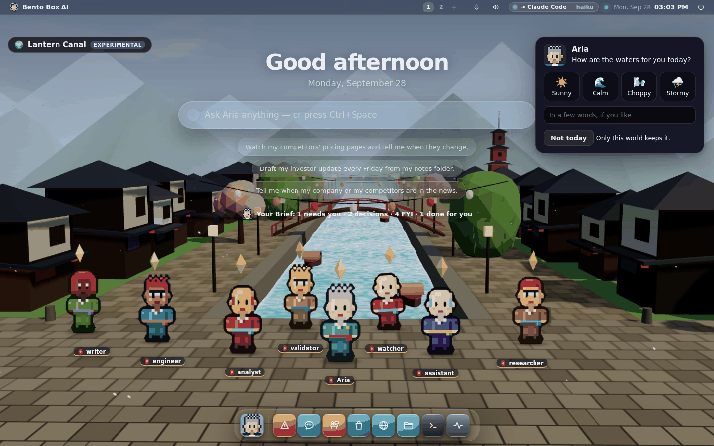

# The World (experimental)

The World is a desktop scene where your agents live in a small 3D place with feelings,
friendships and growth, and where your lead asks how *you* are once a day. It's an
experiment, and it lives only in its scene: pick another scene and all of it goes to
sleep until you come back.

Turn it on in **Settings → Appearance → Scene → World**.

---

## Feelings come from what really happened

Nothing in the World is invented. Every feeling is caused by something your agents
actually did, and tapping an agent's name tag shows the causes, with how long ago.

| What happens | What it can feel like (in Lantern Canal) |
|---|---|
| A step is refused by the rules | Flustered: a tantrum, steam and papers flying |
| A step or a run fails | Gloomy: slumped under a rain cloud |
| It waits for your yes | Restless: pacing, a bead of sweat |
| It reads mail or a web page it can't fully trust | Wary: a nervous shiver |
| Its AI provider asks it to slow down | Breathless: dozing, Zs rising |
| It finishes a task | Proud: a hop and a burst of stars |
| It asks a colleague, or helps one | Neighbourly: a wave and a heart |
| The team adopts its idea in a vote | Proud |
| It votes the other way and loses | Sulky: turned away, a scribble overhead |
| You give it a pat on the back | Tender or merry |
| Nothing at all | Serene, the world's resting mood |

Over each head floats a mood crystal. Its colour says how the feeling sits, from green
(happy) through yellow to red (upset), so you can read the whole team at a glance.

Feelings fade: each one halves every fifteen minutes. A run that finished after a
refusal isn't a proud one, so its pride is muted.

**Your lead is not proud of every reply.** It used to be: every chat answer counted as
a finished task, and a lead you talk to all day sat in Proud, hopping. Now a plain answer
is just conversation. A reply that actually did something (searched, read, ran a tool)
is a small success that can lift pride only part way, and the same everyday thing
(starting work, finishing, helping) counts for less each time it happens again within
half an hour. A specialist's real task, a vote won and your pat on the back still count
in full, and growth still counts every piece of work.

While an agent works, it goes to work in the world: out on a boat in the canal, off in a
shuttle over the moon base, or into the flower beds in the garden.

## Your "no" never makes anyone sad

When you refuse a step, or tell your lead you're having a hard day, your agents only get
gentler. No world, built-in or one you design, can map those two onto a sad or upset
feeling. The check is in the code that loads every world, so a designed world that tries
has that feeling left out, and the menu says so.

## Worlds are different places

Four are built in, and they're unlike each other on purpose:

| World | Setting | Some of its feelings | How agents grow |
|---|---|---|---|
| **Lantern Canal** | a canal town with lanterns | Serene, Flustered, Restless, Neighbourly | Deckhand → Boatman → Canal pilot → Harbour master → River sage |
| **Kestrel Station** | a moon base under a blue planet | Nominal, Overheating, Holding pattern, Low oxygen | Cadet → Specialist → Flight officer → Commander → Station legend |
| **The Wild Garden** | a garden that grows | Rooted, Thorny, Thirsty, Wilting | Seed → Sprout → Sapling → Tall tree → Old oak |
| **The Night Kitchen** | a small Japanese restaurant after dark | Simmering, Order up, Burnt, Sniffing the fish | Dishwasher → Prep cook → Line cook → Sous-chef → Head chef |

Agents grow by finishing tasks, helping colleagues, winning votes and being thanked. In the
garden the flowers grow with the whole team. In the kitchen, whoever is working goes behind
the counter to the range.

### What they wear

Each setting dresses the team: yukata by the canal, spacesuits on the moon base, overalls
and a straw hat in the garden, chef whites in the kitchen. The face, hair and skin stay
theirs, and your lead keeps the gold pin in any of them. It's only in the World: the chat,
the Office and the terminal show everyone in their own clothes, and nothing is saved to the
character. To choose, say it when you design the scene: "everyone in their own clothes",
"dress them as chefs".

### Smooth characters

The world's menu has **Smooth characters**. It draws the same characters with the stair steps
of the pixels rounded off, so they look less pixelated up close. Eyes, mouths and buttons stay
exactly as painted, because rounding those turned a smile into a frown. It's a setting for
this browser and for the World only.

At rest your team breathes, blinks each at their own pace, and now and then leans towards
the colleague they work best with. Walking over to work has a step to it.

### Build your own

Open the world's menu (the chip at the top left), describe a world in a sentence and press
**Build it**. Your machine's brain designs it from a closed set: which setting it's drawn
in, its feelings (each with an emoji, how it shows and what triggers it), its growth
ladder and how your lead asks after you. Anything outside those sets is left out and
named. With no brain answering, you get the closest built-in world under your name, and it
says so.

Each of your own worlds has a **✕** on its row in the menu to delete it. You don't need to
be in it.

### Design how it looks

Any world can be given a new look, the built-in ones included. Open the menu, say how you
want it to look under **Design this scene** ("a snowy night with a pink sky and blue
lanterns", "no boats", "stormy dusk with gold lights") and press **Design it**. Your
machine's brain picks from a small closed set, and the scene is redrawn:

| | Choices |
|---|---|
| Time | the real hour, dawn, day, dusk or night |
| Weather | clear, clouds, rain, snow, petals or fireflies |
| Sky | natural, rose, violet, teal, gold or storm |
| Water | teal, blue, jade, violet, amber or ink |
| Ground | natural, sand, snow, moss, rust or ash |
| Lights | red, amber, gold, blue, violet, green or white |
| What they wear | the setting's own, their own clothes, yukata, spacesuits, overalls or chef whites |
| Things in it | canal: houses, bridge, pagoda, lanterns, boats, trees. Moon base: domes, tower, dish, solar panels, rover, shuttle. Garden: pond, lanterns, trees, flowers, path. Kitchen: counter, lanterns, noren curtains, shelves, kitchen, window |

A second description changes only what it names, so "make it teal" after a snowy night
keeps the snow. There is no picker to set each one by hand, on purpose: you describe it and
the AI designs it. **Undo** puts back the look it had before, and **Original look** takes a
built-in world back to how it shipped. A built-in world keeps its setting. Your own world
moves when the words name another one ("make it a restaurant"), so a world built as a
kitchen before the restaurant existed can be moved into it. With no brain answering, the words you used are matched against the
choices and the menu says so. The look is yours and stays when you reset the world's
feelings.

## Your lead asks how you are

Once a day in each world, your lead asks in that world's voice. Pick an answer and add a
few words if you like. The lead replies with your machine's brain, or with the world's own
words when no brain answers. Your answer stays in that world only. "Not today" skips it,
and **Ask me again** in the menu forgets today's answer.

## Agents feel it

Off by default. With **Agents feel it** ticked in the world's menu, each agent is told how
it feels and why before its work, and your lead hears how you said you are (your words go
to the lead only, never to the specialists). It changes their tone and approach: a
frustrated agent tries another way or asks a colleague sooner, and on your hard days they
keep it brief.

Feelings never change the rules. The paragraph they get says so in words: never retry a
refused step, never ask for more access because of a feeling, never make you responsible
for their mood. The permission gate is not consulted any differently.

## Leaving puts it to sleep

The scene holds a lease on the server while it's on screen, renewed every 15 seconds.
While the lease is held, events are turned into feelings. When you pick another scene,
close the tab or the lease runs out:

- nothing is felt, even when your agents keep working;
- no agent is told anything about feelings;
- nothing is shown anywhere else: not in the Office, Chat, Telegram or the terminal.

What already happened stays in your own database, asleep, and comes back when you return
to that world. **Reset this world** wipes its feelings, growth and check-ins; a world you
built can also be deleted.

## On a phone, and without 3D

On a phone the team gathers just under the prompt bar with the canal behind them, and the
cards sit below, above the world's chip. A screen with no 3D graphics (some Linux sessions on
software rendering) gets a flat drawing of the same world, and the menu says why.

## What it costs

- The 3D library (three.js, MIT) loads only when the World scene starts.
- It draws at most 30 frames a second while somebody is moving and 12 at rest, and none
  while a window is maximised, the tab is hidden or the phone shows an app.
- A slow machine draws at a lower resolution instead of dropping frames: ten slow frames
  in a row halve the pixel ratio.
- Software rendering and phones get a lighter version: no shadows, simpler water and sky,
  and 5 frames a second at rest.
- Reduced motion gets a still world.
- Each world is 17,000 to 29,000 triangles in 49 to 182 draw calls. The town's fixed parts
  are merged, which is what keeps the canal at 182. The kitchen is 7,068 triangles in 84.
- Smooth characters add no draw calls. Each character's picture is 256 by 104 instead of
  64 by 26, painted once by the server and cached.
- The lead's reply, building a world and designing its look are one brain call each, and
  only when you ask.
- A designed look costs the same as the original, within the noise of the measurement:
  weather is one set of particles, and leaving things out makes a scene a little cheaper.

## Faces

- **GUI and SUI**: the scene, as above. The Linux session draws the same page.
- **TUI**: none, on purpose. The World is an experiment that lives in a scene, and
  `bento office` is the terminal's view of who is working.
