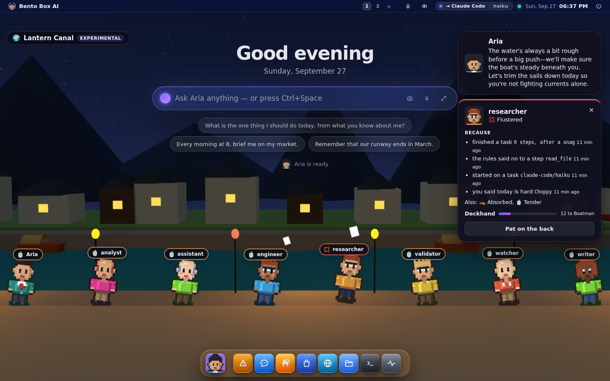
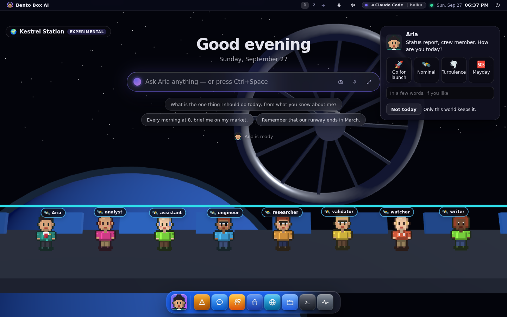
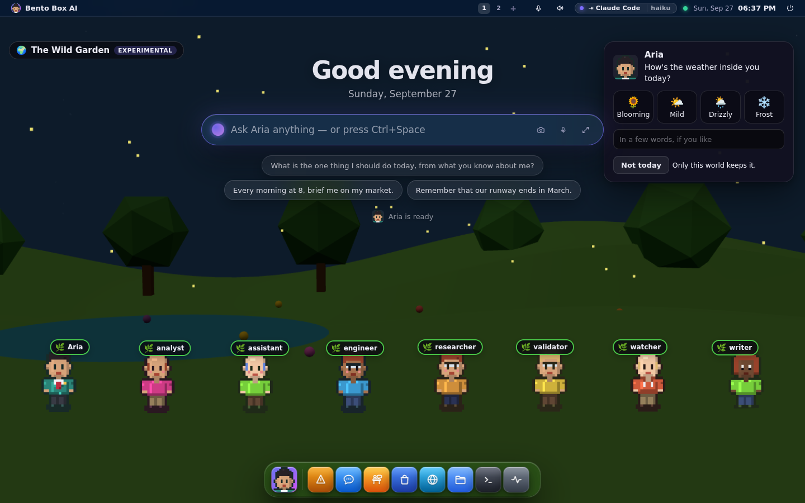
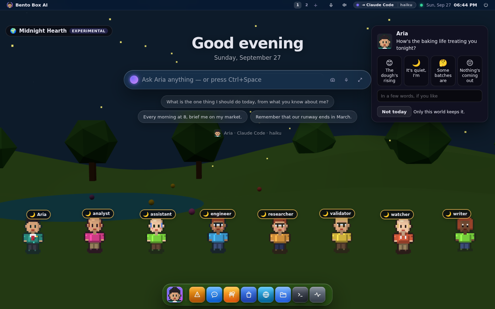
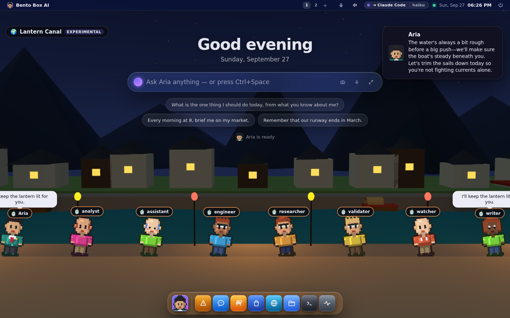
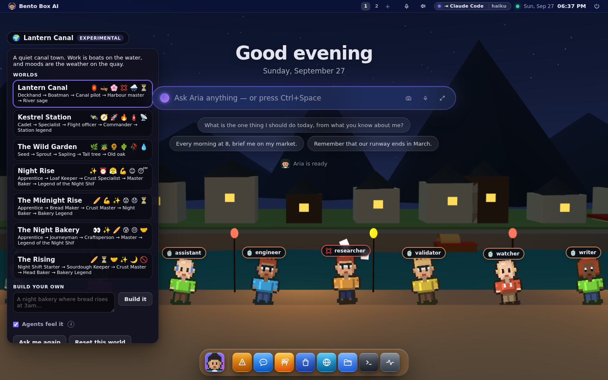
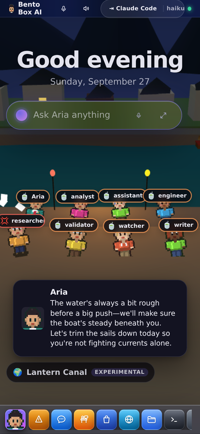

# The World (experimental)

The World is a desktop scene where your agents live in a small 3D place with feelings,
friendships and growth, and where your lead asks how *you* are once a day. It's an
experiment, and it lives only in its scene: pick another scene and all of it goes to
sleep until you come back.

Turn it on in **Settings → Appearance → Scene → World**.

---

## Feelings come from what really happened

Nothing in the World is invented. Every feeling is caused by something your agents
actually did, and tapping an agent's name tag shows the causes, with how long ago.

| What happens | What it can feel like (in Lantern Canal) |
|---|---|
| A step is refused by the rules | Flustered: a tantrum, papers flying |
| A step or a run fails | Gloomy: slumped |
| It waits for your yes | Restless: pacing |
| It reads mail or a web page it can't fully trust | Wary: a nervous shiver |
| Its AI provider asks it to slow down | Breathless: dozing |
| It finishes a task | Proud: a little hop |
| It asks a colleague, or helps one | Neighbourly: a wave |
| The team adopts its idea in a vote | Proud |
| It votes the other way and loses | Sulky: turned away |
| You give it a pat on the back | Tender or merry |
| Nothing at all | Serene, the world's resting mood |

Feelings fade: each one halves every fifteen minutes. A run that finished after a
refusal isn't a proud one, so its pride is muted.

While an agent works, it goes to work in the world: out on a boat in the canal, off in a
pod around the station, or into the flower beds in the garden.

## Your "no" never makes anyone sad

When you refuse a step, or tell your lead you're having a hard day, your agents only get
gentler. No world, built-in or one you design, can map those two onto a sad or upset
feeling. The check is in the code that loads every world, so a designed world that tries
has that feeling left out, and the menu says so.

## Worlds are different places

Three are built in, and they're unlike each other on purpose:

| World | Setting | Some of its feelings | How agents grow |
|---|---|---|---|
| **Lantern Canal** | a canal town with lanterns | Serene, Flustered, Restless, Neighbourly | Deckhand → Boatman → Canal pilot → Harbour master → River sage |
| **Kestrel Station** | a ring station over a planet | Nominal, Overheating, Holding pattern, Low oxygen | Cadet → Specialist → Flight officer → Commander → Station legend |
| **The Wild Garden** | a garden that grows | Rooted, Thorny, Thirsty, Wilting | Seed → Sprout → Sapling → Tall tree → Old oak |

Agents grow by finishing tasks, helping colleagues, winning votes and being thanked. In the
garden the flowers grow with the whole team.

### Build your own

Open the world's menu (the chip at the top left), describe a world in a sentence and press
**Build it**. Your machine's brain designs it from a closed set: which setting it's drawn
in, its feelings (each with an emoji, how it shows and what triggers it), its growth
ladder and how your lead asks after you. Anything outside those sets is left out and
named. With no brain answering, you get the closest built-in world under your name, and it
says so.

## Your lead asks how you are

Once a day in each world, your lead asks in that world's voice. Pick an answer and add a
few words if you like. The lead replies with your machine's brain, or with the world's own
words when no brain answers. Your answer stays in that world only. "Not today" skips it,
and **Ask me again** in the menu forgets today's answer.

## Agents feel it

Off by default. With **Agents feel it** ticked in the world's menu, each agent is told how
it feels and why before its work, and your lead hears how you said you are (your words go
to the lead only, never to the specialists). It changes their tone and approach: a
frustrated agent tries another way or asks a colleague sooner, and on your hard days they
keep it brief.

Feelings never change the rules. The paragraph they get says so in words: never retry a
refused step, never ask for more access because of a feeling, never make you responsible
for their mood. The permission gate is not consulted any differently.

## Leaving puts it to sleep

The scene holds a lease on the server while it's on screen, renewed every 15 seconds.
While the lease is held, events are turned into feelings. When you pick another scene,
close the tab or the lease runs out:

- nothing is felt, even when your agents keep working;
- no agent is told anything about feelings;
- nothing is shown anywhere else: not in the Office, Chat, Telegram or the terminal.

What already happened stays in your own database, asleep, and comes back when you return
to that world. **Reset this world** wipes its feelings, growth and check-ins; a world you
built can also be deleted.

## On a phone, and without 3D

On a phone the team stands in rows on the quay and the cards sit above the dock. A screen
with no 3D graphics (some Linux sessions on software rendering) gets a flat drawing of the
same world, and the menu says why.

## What it costs

- The 3D library (three.js, MIT) loads only when the World scene starts.
- It draws at most 30 frames a second while somebody is moving and 12 at rest, and none
  while a window is maximised, the tab is hidden or the phone shows an app.
- A slow machine draws at a lower resolution instead of dropping frames: ten slow frames
  in a row halve the pixel ratio.
- Reduced motion gets a still world.
- Each world is about 5,500 to 7,800 triangles.
- The lead's reply and building a world are one brain call each, and only when you ask.

## Faces

- **GUI and SUI**: the scene, as above. The Linux session draws the same page.
- **TUI**: none, on purpose. The World is an experiment that lives in a scene, and
  `bento office` is the terminal's view of who is working.
